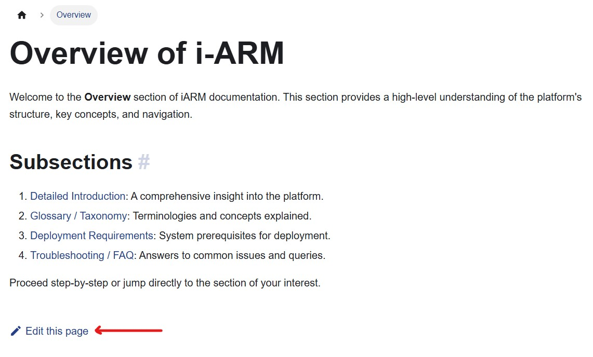
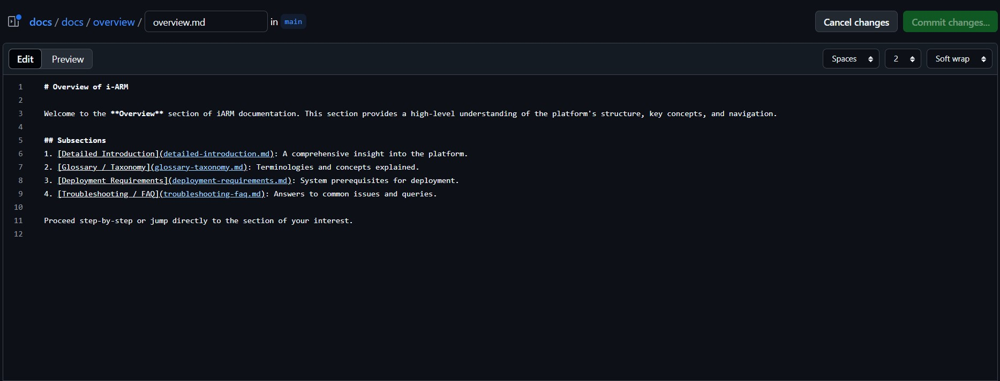
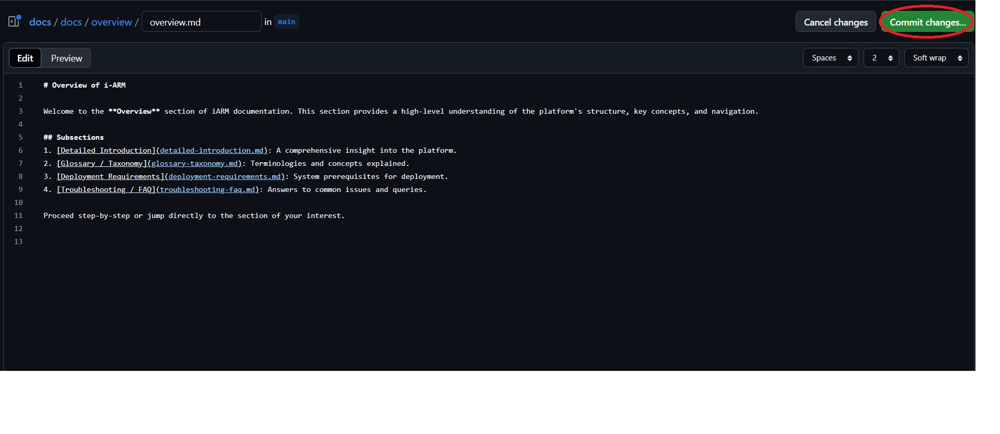
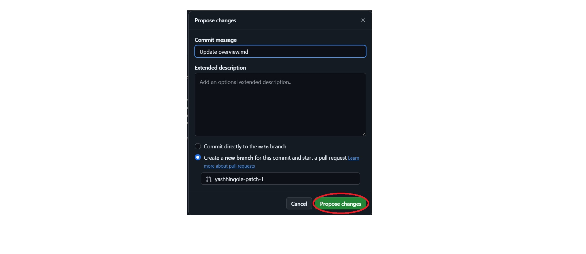

# **iARM Docs**

Welcome to **iARM Documentation**, a centralized platform for seamlessly accessing, managing, and exploring documentation.

---

### Editing Documentation

You can easily modify the documentation by editing .md files in the app.

1. Locating .md Files
All documentation files are located in the docs folder.

2. Follow steps to edit docs directly from documentation website

  * Open any docs you want to edit and go to the botton of that doc

   

  * Click on edit this page and you will redirect to below page

   

  * Now Edit the content you want to and click on the "Commit Changes"

   

  * Add title and description to your changes and click on propose changes

   

  * Your changes will be rewieved and pushed

3. Editing an .md File
Navigate to the docs directory.
Find the .md file you want to edit.

Make the required changes using Markdown syntax. 

# Markdown Syntax

## Table of Contents
1. Headings  
2. Paragraphs  
3. Bold, Italics, Strikethrough, and Highlight  
4. Lists  
5. Links  
6. Images  
7. Tables  
8. Code Blocks  
9. Blockquotes  
10. Horizontal Rules  
11. Inline HTML  
12. Escaping Characters  
13. Task Lists  
14. Footnotes  
15. Definition Lists  
16. Emojis  
17. Custom IDs for Headings  
18. Embedding Videos


## Headings
Use `#` for headings, up to six levels.

```markdown
# Heading 1
## Heading 2
### Heading 3
#### Heading 4
##### Heading 5
###### Heading 6
```

## Paragraphs
Separate paragraphs with a blank line.

```
This is a paragraph.

This is another paragraph.
```

## Bold, Italics, Strikethrough, and Highlight

### Bold
```
**Bold** or __Bold__
```
### Italic
```
*Italic* or _Italic_
```
### Bold and Italic
```
***Bold and Italic*** or ___Bold and Italic___

```
### Strikethrough

```
~~Strikethrough~~
```

### Highglights

```
==Highlight== (requires HTML like `<mark>Highlighted text</mark>`)

```

## List

### Unordered List

```
- Item 1
- Item 2
  - Sub-item 1
  - Sub-item 2
```

### Ordered List

```
1. Item 1
2. Item 2
   1. Sub-item 1
   2. Sub-item 2

```

## Links

```
[YouTube](https://www.youtube.com/)
[Link with title](https://www.example.com "Title Text")

```

## Images

```


```
## Tables

```
| Header 1 | Header 2 | Header 3 |
|----------|----------|----------|
| Row 1    | Data     | Data     |
| Row 2    | Data     | Data     |

```

## Code Blocks

```
Use `inline code` for small snippets.

```

## Blockquotes

```
> Blockquote example.
>> Nested blockquote.

```

## Horizontal Rules

```
---
***
___

```

## Inline HTML
You can use HTML directly in the markdown
```
<p>This is an HTML paragraph.</p>

```

## Escaping Character
Use a backslash (\) to escape Markdown characters

```
\*This text is not italicized\*

```

## Task List
Use - [ ] for incomplete and - [x] for completed tasks

```
- [x] Task 1
- [ ] Task 2

```

## Footnotes

```
Here is a sentence with a footnote.[^1]

[^1]: This is the footnote text.

```

## Definition List

```
Term 1
: Definition 1

Term 2
: Definition 2

```
## Emojis
Use emoji codes inside :.

```
I :heart: Markdown!

```

## Embedding Videos

Change the VIDEO_ID from the below iframe and replace it with the actual VIDEO_ID of your YouTube video

For Example:

Consider the YouTube URL

https://www.youtube.com/watch?v=4LcY1JdVwuM

the VIDEO_ID for this YouTube video will be 4LcY1JdVwuM

VIDEO_ID = 4LcY1JdVwuM

You can insert this VIDEO_ID into below iframe in the place of VIDEO_ID and don't need to change anything

```
<iframe width="560" height="315" 
src="https://www.youtube.com/embed/VIDEO_ID" 
title="YouTube video player" frameborder="0" 
allow="accelerometer; autoplay; clipboard-write; encrypted-media; gyroscope; picture-in-picture" 
allowfullscreen></iframe>

```
## Link to a Video

The same goes for this Link to a Video

Find and paste the VIDEO_ID of your YouTube video in the position of VIDEO_ID in below URL

```
[Watch the video](https://www.youtube.com/watch?v=VIDEO_ID)

```

---

### Installation

```
$ yarn
```

### Local Development

```
$ yarn start
```

This command starts a local development server and opens up a browser window. Most changes are reflected live without having to restart the server.

### Build

```
$ yarn build
```

This command generates static content into the `build` directory and can be served using any static contents hosting service.

### Deployment

Using SSH:

```
$ USE_SSH=true yarn deploy
```

Not using SSH:

```
$ GIT_USER=<Your GitHub username> yarn deploy
```

If you are using GitHub pages for hosting, this command is a convenient way to build the website and push to the `gh-pages` branch.
