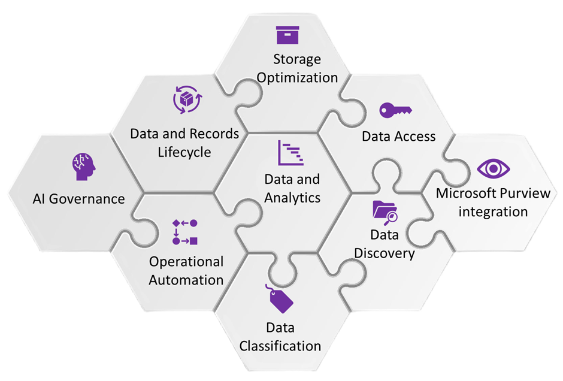

<h1>Product Overview</h1>

At the core of data governance, security and compliance are business, IT Security and Compliance stakeholders, who are primarily responsible for business decisions and have a keen interest in value – the degree to which it helps drive purpose of the enterprise. When it comes to Data Governance, many regulated organisations have the responsibility to establish well defined, demonstrable processes, controls and technology which supports the defensible and informed decisions made with regards to enterprise data. 

i-ARM provides an integrated platform for data governance to meet an organisations legal and regulatory compliance requirement, providing a high quality of data as an input to business decision making processes.

## Key Features of i-ARM  

| **i-ARM Solution**               | **Key Features** |
|----------------------------------|------------------|
| **Data Discovery and Security**  | - Connectors to discover data across Cloud, 3rd party, and hosted data sources.  - Extensible data classification rules integrated with Microsoft Purview information protection to inspect sensitive information and enforce data protection policies.  - AI models to contextualize the data classification outcomes and filter out false positives.  - Data and Analytics interface focused on Data Stewards / Owners for operational process orchestration. |
| **Digital Workspace Governance** | - A self-service process to enable controlled provisioning of collaborative workspaces in Microsoft365, Azure cloud leveraging pre-built templates.  - Manage the entire lifecycle of workspaces, including creation, updates, attestation, and decommissioning integrated with data compliance policies.  - Workspace and Data access governance supported by Entra ID governance integration to automate Guest access management, inactive workspace lifecycle, and workspace ownership attestation.  - Automated provisioning of Microsoft Purview Data protection and Records management policies to workspaces. |
| **Data & Records Lifecycle**     | - File plan management integrated with Data Sources with physical and Digital records.  - Storage optimization by policy-based review and archival of data and records.  - End of retention disposition reviews of data classified as records.  - Intelligent Redundant-Obsolete-Trivial analysis and automated cleanup.  - Long-term audit retention of records supported by business intelligent reports. |
| **AI Governance**                | - Data overexposure analysis and remediation for use in AI applications.  - AI adoption tracking and reporting.  - Audit of AI interactions with users and data.  - Unified integration with Microsoft Purview to enable compliance and risk management of data accessible to AI. |
