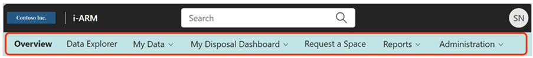

<h1>Overview</h1>

**Infotechtion's Advanced Records Management (iARM)** software solution
is a secure, intelligent, and scalable records management solution
designed to enhance Microsoft Purview's capabilities. It seamlessly
integrates with Data Sources (like: M365, Cloud storages, hosted
storages etc.) and Microsoft Purview to provide end-to-end governance,
ensuring organizations meet stringent regulatory, legal, and business
compliance requirements throughout the records lifecycle---from creation
to final disposition. 

With automated classification, defensible disposition workflows, and
robust audit trails, iARM enables efficient records management while
mitigating compliance risks. It supports industry regulations such as
GDPR, SEC 17a-4, and ISO 15489 by integrating retention policies, legal
holds, and archival processes. Advanced search, reporting, and bulk
processing features streamline oversight for compliance officers,
records managers, and legal teams. 

By leveraging iARM, organizations can enhance transparency, strengthen
their compliance posture, and simplify records management in an
increasingly complex regulatory environment.

<h1>Capabilities</h1>

The solution offers a streamlined approach to managing records
disposition, with a user-friendly interface and powerful tools designed
to optimize records management processes. The following table describes
the requirements and capabilities of the module.

| Infomation Governance Req'ts | Infotechtion Advanced Records Management (iARM) |
|------------------|-------------|
| **Manage record terms centrally with a file plan** | Infotechtion's iARM product integrates with external retention providers (Virgo, IM Policy Center) to synchronize their retention schedules and file plan details with Microsoft Purview. We believe that these tools are the best way to manage retention schedules in large organizations. |
| **Allow for multistage disposition review** | Infotechtion extends the Microsoft Purview disposition process to enable many user-friendly disposition and reporting capabilities. |
| **Disposition Management for Microsoft 365 records** | Infotechtion aggregates records and presents them to users on predefined schedules for disposition decisions. This is supported via email and dashboards and can involve thousands of records to be disposed of or have their retention lives extended simultaneously. |
| **Provide dashboards, analytics, and reporting** | Infotechtion provides extensive analytics and reporting capabilities through dashboards and reports that combine information from across the data sources managed by i-ARM. Additional reports are easy to define using the extended audit log and Power BI reporting tools. |
| **Persistent audit log details matching record lifespan** | Infotechtion extends the storage of record activities audit for the life of the record. Additional and custom metadata is captured for dashboards, analytics, and as part of disposition evidence. |

---

## Components  

This section offers a **high-level overview of all iARM features**, structured around its top horizontal navigation. Starting with the top navigation, this overview will describe the various components of iARM.

  
  

| #  | Component | Description |
|----|----------|-------------|
| 1  | **Overview** | The **Overview** component contains reports for key activities and data tracking in iARM. |
| 2  | **Data Explorer** | The **Data Explorer** component leads to the explorer summary dashboard which contains several visuals categorizing enterprise data based on i-ARM classifications into Redundant-Obsolete-Trivial, Sensitive Data, Records, and Unclassified Data. Organizations can use the explorer to review and make informed decisions, such as archiving and optimizing storage in M365 by moving inactive data to cheaper archival storage managed by i-ARM. |
| 3  | **My Data** | The **My Data** component displays record files, including file metadata, retention and sensitivity labels, and the ability to open convenience copies of the file which have been archived into i-ARM. These files are organized across two types of repositories: the Records Repository (non-regulatory) and the Regulatory Compliant Records Repository. |
| 4  | **My Disposal Dashboard** | The **My Disposal Dashboard** is a disposition management dashboard to select, review, and approve disposition activities for physical and digital records across various data sources managed by i-ARM. |
| 5  | **Request a Space** | **Request a Space** shows the request page to set up a new compliant storage location for SharePoint, Network Drives, and Teams. Note: This feature is not available with the Records Lifecycle solution; you will need a 'Workspace Governance' add-on license to use this feature. |
| 6  | **Reports** | The **Reports** component contains reports for activities audited by i-ARM across managed data sources. Key features include: Disposition Summary, Records Management Dashboard, and many more reports based on records management KPIs. |
| 7  | **Administration** | - **Disposal Settings**: This is where the Information Disposal Assessment feature is configured, including (1) Frequency of Checks (Days), and (2) Notification Email (Days). - **Add/Edit Reviewers**: Used to add/remove business reviewers and archive reviewers from a particular site in My Disposal Dashboard. - **Source Instance Configuration**: Request page to set up new compliant storage locations for various data sources like SharePoint Online, Azure Files, Azure Blobs, Network File Share, AWS, M-Files, Transactional systems, and others. - **Container Settings**: Configuration of the Container Disposal Assessment feature, specifically (1) Frequency of Checks (Days), and (2) Period While Empty (Days). - **Data Type Configuration**: Specifies any data types to be excluded from the Retention Policy. Data types should be provided in a comma-separated format. Example data types: dll, msi, mdf, ldf, ps1, css, js, sass, ts, 7z, exe, mdl. |

---

## High-Level Item-Level Workflow  

The following diagram shows the overall workflow of labeling to disposition with i-ARM, to help identify the likely sequence of events related to a record throughout its lifecycle.  

  
  

