# Introduction

## Summary

i-ARM extends Microsoft Purview with comprehensive information
protection, records management, and regulatory compliance tools,
extending its capabilities to meet the needs of organizations for robust
data governance. By integrating with other elements of the data
governance lifecycle, i-ARM simplifies the management of retention
schedules, ensuring compliance with legal, regulatory, and business
requirements.

## Key Features and Capabilities:

**Repository Inventory**

- Facilitates the analysis and application of sensitivity and retention
labels across various platforms. This helps ensure that all data is
classified and managed according to organizational policies.

**Source Configurations**

- Offers flexible options to scan, ingest, and classify data from multiple
sources, providing organizations with a unified view of their data
assets.

**Activity Dashboards**

- Provides comprehensive insights into label synchronization and
publishing within Microsoft Purview, allowing administrators to monitor
and manage classification activity.

**Explorers for Data Classification and Protection**

- Help organizations discover, classify, and take action on files,
applying appropriate protection and retention policies to ensure
compliance across platforms.

**Disposition Review Aggregation**

- Enables aggregation and streamlined review of items eligible for
disposition, ensuring compliance with retention and disposal policies.

**Workspace Governance**

- Empowers authorized administrators to create storage locations that
support classification, retention, disposition, and compliance. These
storage locations integrate with Purview functionality for seamless
management.

**Retention Schedule Synchronization**

- Facilitates synchronization of retention schedules from third-party
solutions like Access Virgo and Iron Mountain Policy Center into
Microsoft Purview, ensuring a consistent and compliant retention policy
framework.

**Reports**

- Delivers detailed reports on various activities, including label usage,
classification results, and data governance actions, enabling
organizations to stay informed about their compliance and records
management status.

## Purpose

This user guide provides comprehensive information to help you get
started with and effectively use the i-ARM product. It is designed to
guide you through the main features, functions, and troubleshooting tips
to ensure you can maximize the value of i-ARM for your organization\'s
records management and regulatory compliance needs.

**Topics Covered in this Guide:**

1. **Using the Main Features and Functions**

- Learn how to efficiently navigate and utilize i-ARM\'s core features,
including the Regulatory Compliant Records Repository and other key
tools that enhance Microsoft Purview\'s capabilities.

2.  **Setting up a New Source Instance**

- Detailed instructions on configuring new source instances

3.  **Exploring i-ARM\'s Full Feature Set**

- An overview of i-ARM\'s additional capabilities, as outlined in the
appendix, to give users a complete understanding of its functionality.

4.  **Contacting Support for Assistance**

- How to get in touch with our support team for further help, ensuring you
have access to expert assistance whenever needed.

We recommend reading this guide in detail before using the product for
the first time. It will provide you with all the necessary information
to ensure you are fully prepared to use i-ARM efficiently. You can also
refer to the guide whenever you need help or guidance. We hope you enjoy
using i-ARM and find it both valuable and reliable for your records
management and compliance needs.

## Definitions

Below table defines the terms present in i-ARM application.

| #  | Term             | Description                                                                 |
|----|-----------------|---------------------------------------------------------------------------|
| 1  | **Source**       | Cloud-hosted storage space that needs to be scanned and managed in i-ARM. |
| 2  | **Source Instance / Location** | A subset of source data to be scanned and managed in i-ARM at a given instance. |
| 3  | **Disposition**  | The type of action that occurs to a file when the retention period expires. Generally, disposition means deletion, but it can include other actions. |
| 4  | **Label**        | Labels contain policies for file/data, including file plan details (retention duration, etc.) and actions (e.g., dispose). |
| 5  | **Policy**       | A set of rules that determine how long items are kept and what happens to them when they expire. |
| 6  | **Retention**    | Number of days the data will be kept before it is marked for disposition. |
| 7  | **Manifest File** | An XML file consisting of source location name, metadata fields, cloud storage solution links, primary owner, secondary owner, and more. It is used when setting up a new file/data source connection to i-ARM. |

## User Roles

 | #  | Role                   | Description                                                                 |
|----|------------------------|---------------------------------------------------------------------------|
| 1  | **End User**           | Can only access the source instance where they are added as a member.     |
| 2  | **Records Administrator** | Can access all the source instances.                                      |
| 3  | **iARM Administrator** | Can access and create new Source Instance configurations, add/edit reviewers. |
| 4  | **eDiscovery Administrator** | Can access all the source instances.                                    |
| 5  | **Business Reviewer**  | Can take actions on records where they have been designated as Business Reviewers in "My Disposal" dashboard. |
| 6  | **Archive Reviewer**   | Can take actions on records where they have been designated as Archive Reviewers in "My Disposal" dashboard. |
| 7  | **Primary Owners**     | Can access the source instance and its configuration where they are added as the primary owner. |
| 8  | **Secondary Owners**   | Can access the source instance and its configuration where they are added as the secondary owner. |
| 9  | **Members**            | Can access the data for the source instances they are a member of.        |

## Components 

This section offers a **high-level overview of all iARM features**,
structured around its top horizontal navigation. Starting with the top
navigation, this overview will describe the various components of iARM.

  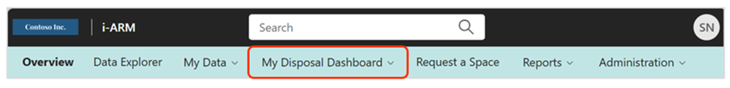
  

| #  | Component              | Description                                                                 |
|----|------------------------|-----------------------------------------------------------------------------|
| 1  | **Overview**           | The **Overview** component contains reports for key activities and data tracking in iARM. |
| 2  | **Data Explorer**      | The **Data Explorer** component leads to the explorer summary dashboard, which includes: |
|    |                        | - **ROT Explorer**: Shows files in industry ROT (Redundant, Obsolete, and Trivial) categories. |
|    |                        | - **Duplicate Explorer**: Identifies duplicate and near-duplicate files for deletion. |
|    |                        | - **Empty Explorer**: Displays files with zero bytes for deletion. |
|    |                        | - **Sensitive Explorer**: Categorizes files by sensitive information classification for protection. |
|    |                        | - **Records Explorer**: Lists files by record label classification. |
|    |                        | - **Unclassified Files Explorer**: Displays all other files. |
| 3  | **My Data**            | The **My Data** component displays record files, including file metadata, retention labels, and sensitivity labels. Users can open convenience copies of files. These are organized in: |
|    |                        | - **Records Repository** (Non-regulatory) |
|    |                        | - **Regulatory Compliant Records Repository** |
| 4  | **My Disposal Dashboard** | A disposition management dashboard to select, review, and approve disposition activities. |
| 5  | **Request a Space**    | **Request Space** - Shows the request page to set up a new compliant storage location for SharePoint and Teams. |
| 6  | **Reports**            | The **Reports** component contains reports for activities across iARM. |
| 7  | **Administration**     | **Disposal Settings**: Configures the Information Disposal Assessment feature, including: |
|    |                        |   -- **Frequency of Checks (Days)** |
|    |                        |   -- **Notification Email (Days)** |
|    |                        | **Add/Edit Reviewers**: Adds or removes business and archive reviewers from a site in the disposal dashboard. |
|    |                        | **Source Instance Configuration**: A request page to set up new compliant storage locations for data sources such as SharePoint Online, Azure Files, Azure Blobs, Network File Share, AWS, M-Files, and transactional systems. |
|    |                        | **Container Settings**: Configures the Container Disposal Assessment feature, including: |
|    |                        |   -- **Frequency of Checks (Days)** |
|    |                        |   -- **Period While Empty (Days)** |

 

# Features and Functionality

## Overview 

The **Overview** component provides summary views for a rolled-up is a
reporting dashboard with drill down capabilities to key activities, data
tracked, and files managed by iARM. 

There are 3 top-level dashboards, each with 4 to 6 interactive graphs
and charts. 

  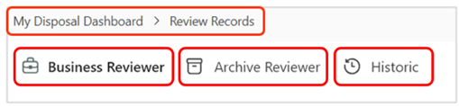
  

  
  

  | #  | Feature          | Description |
|----|-----------------|----------------------------------------------------------------|
| 1  | **Policy Summary** | Shows the volumes, success, and errors related to the synchronization of labels from third-party retention schedule management tools. |
| 2  | **Usage Summary**  | Shows the progress, types, and details of the label publishing capabilities of Purview. |
| 3  | **Case Summary**   | Displays litigation cases in Purview eDiscovery and the number and names of files those cases cover. |

**Snapshots of the top-level and drill-down dashboards:** 

  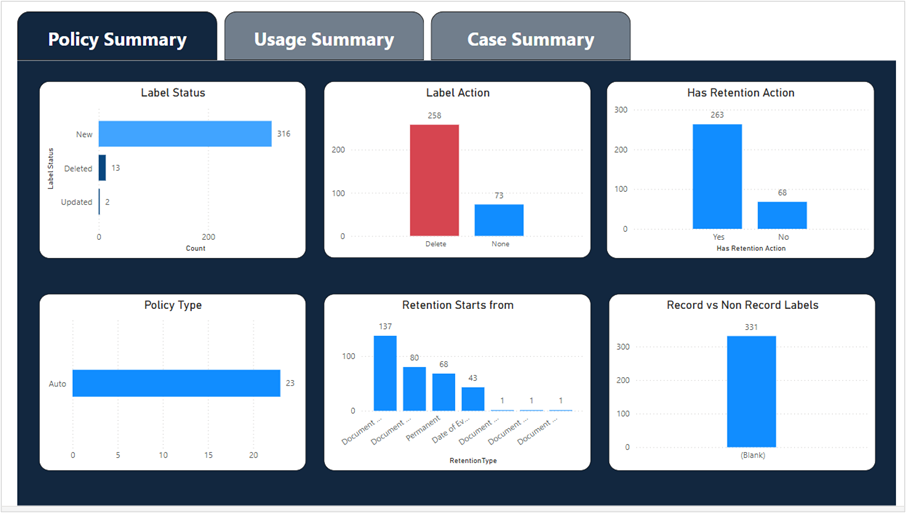
  

  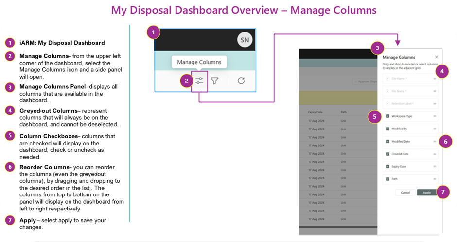
  

  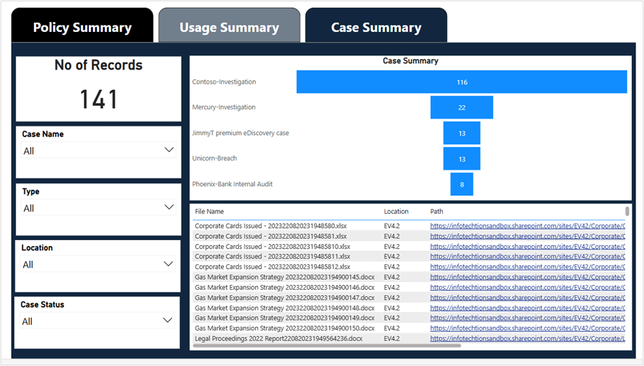
  

## My Disposal Dashboard

### My Disposal Dashboard: Introduction

**Infotechtion's iARM My Disposal Dashboard** provides an intuitive
interface for managing and tracking the disposal and archival of
information assets. It offers a comprehensive overview of scheduled
disposals, ensuring full visibility and control over asset lifecycles.
Users can easily review asset details such as serial numbers, status,
and disposal schedules, streamlining decision-making and compliance
processes.

The dashboard helps organizations meet environmental and data security
regulations by incorporating audit trails, disposal certifications, and
reporting tools. It ensures proper tracking of hardware disposal and
secure data wiping before assets are recycled or resold, reducing risks
associated with data breaches.

By simplifying the decommissioning process, iARM's My Disposal Dashboard
enhances efficiency, transparency, and compliance. Organizations can
confidently manage asset disposal while minimizing legal and security
risks.

#### Overview

**iARM's My Disposal Dashboard** is a powerful tool designed to
streamline and automate records disposition reviews within Microsoft
365. By integrating with SharePoint and Microsoft Purview, it ensures
that organizations manage records efficiently, securely, and in
compliance with regulatory, legal, and business requirements.

**This guide** will help users navigate the My Disposal Dashboard, where
they can:

-   Review and act on records pending disposition, including deletion,
    retention extension, reclassification, or archival.

-   Leverage automated disposition workflows, bulk action capabilities,
    and seamless integration with Microsoft Purview using Microsoft
    Graph APIs and Power BI.

-   Ensure compliance with retention policies, legal holds, and business
    regulations such as GDPR, SEC 17a4, and ISO 15489.

-   Monitor and track actions through interactive dashboards, bulk
    processing, and audit logs for transparency and governance.

-   Simplify records oversight with advanced search, reporting, and bulk
    processing tools tailored for records managers, compliance officers,
    and legal teams.

iARM's My Disposal Dashboard simplifies decision-making for business and
archive reviewers, helping organizations efficiently manage records
while ensuring compliance and reducing unnecessary data retention risks.
This guide will provide step-by-step instructions to help achieve the
most out of the My Disposal Dashboard.

#### User Roles and Permissions

 | **#** | **Role**              | **Description**                                                        |
|------|----------------------|------------------------------------------------------------------------|
| 1    | **End User**         | End Users will only have access to the source instance in which the user is added as a member. |
| 2    | **Business Reviewer** | Can take actions on records where they have been designated as a Business Reviewer in My Disposal Dashboard. |
| 3    | **Archive Reviewer**  | Can take actions on records where they have been designated as an Archive Reviewer in My Disposal Dashboard. |
| 4    | **iARM Administrator** | Admins can edit Disposal Settings, Container Settings, and update Business and Archive Reviewers. |

  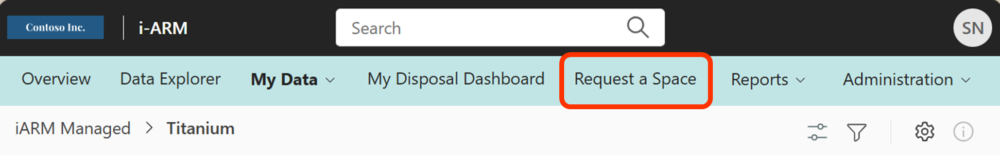
  

#### Key Features and Capabilities

1.  **Centralized Disposition Management** -- Provides a single
    dashboard to review, approve, or extend the retention of records
    across multiple Microsoft 365 locations, ensuring a streamlined
    disposal process.

2.  **Automated Disposition Workflows** -- Automates the collection of
    expired records, aggregates them for review, and enables bulk
    actions to reduce manual effort and ensure consistency.

3.  **Seamless Integration with Microsoft Purview** -- Ensures that all
    disposition decisions and actions are automatically communicated to
    Microsoft Purview using Microsoft Graph APIs for compliance
    tracking.

4.  **Multi-Stage Review Process** -- Supports multiple levels of
    review, allowing Business and Archive Reviewers to assess records
    based on regulatory, legal, and business requirements before final
    disposition.

5.  **Bulk Review and Action Capabilities** -- Enables users to process
    large volumes of records at once, whether for deletion, retention
    extension, or archival, significantly improving efficiency.

6.  **Advanced Filtering and Sorting** -- Provides customizable filters
    and search options to help reviewers triage, prioritize, and
    efficiently navigate records requiring action.

7.  **Automated Notifications & Reminders** -- Sends email alerts and
    dashboard notifications to keep reviewers informed of pending
    disposition tasks and deadlines.

8.  **Comprehensive Audit Trails** -- Logs all disposition decisions and
    actions, providing a defensible audit trail for compliance with
    regulatory and legal requirements.

9.  **Interactive Dashboards and Reporting** -- Leverages Power BI to
    deliver real-time insights into disposition metrics, compliance
    status, and pending actions across the organization.

10. **Integration with External Retention Schedules** -- Synchronizes
    with external retention management tools (such as Iron Mountain
    Policy Center) to align retention schedules with Microsoft Purview
    for seamless governance, facilitating a single source of truth for
    records managers.

11. **Historical Record Tracking** -- Maintains a historical log of
    disposed and archived items, allowing users to reference past
    decisions and ensure compliance over time.

12. **Custom Metadata Retention** -- Preserves key metadata associated
    with records even after disposition, ensuring continuity for
    compliance and reporting needs.

13. **Long-Term Digital Preservation** -- Archives digital records in
    Azure Storage or other preservation solutions after disposition to
    optimize storage and maintain compliance.

#### Definitions

14. The table below defines the terms present in iARM's My Disposal
    Dashboard.

15. 

  ----------------------------------------------------------------------------
   \#  Term              Description
  ---- ----------------- -----------------------------------------------------
   1   **Source**        Cloud hosted storage space which is required to be
                         scanned and managed in iARM.

   2   **Source          A subset of source data to be scanned and managed in
       Instance**        iARM at a given interval.

   3   **Disposition**   The type of action that occurs to a file when the
                         retention period expires, generally disposition is
                         deletion, but it can be other actions.

   4   **Label**         Labels contain policies for file/data that include
                         file plan details (retention duration, etc.) and
                         actions (dispose, etc.).

   6   **Retention**     Number of days the data will be kept before it is
                         marked for disposition.
  ----------------------------------------------------------------------------

16. 

### My Disposal Dashboard: Common Functionality (All User Roles)

**My Disposal Dashboard** serves as a centralized hub for selecting,
reviewing, and approving disposition and archiving activities,
streamlining the records management process.

The dashboard provides an aggregated view of all expired items from
their source locations, along with all SharePoint sites where the users
hold a **Business Reviewer** or **Archive Reviewer** role, ensuring
comprehensive oversight of pending actions.

My Disposal Dashboard -- Common Experience

Regardless of the role a user represents in the disposition process,
there will some screens that are universal. To review records, there are
three views that are relevant and selectable.

{width="6.378958880139982in"
height="0.7756069553805774in"}

> {width="3.535207786526684in"
> height="0.825in"}

  -----------------------------------------------------------------------
   \#  Tab              Description
  ---- ---------------- -------------------------------------------------
   1   **Business       This tab provides the list of all of files
       Reviewer**       awaiting review and approval by the Business
                        Reviewer to be dispositioned.

   2   **Archive        This tab provides the list of all of files
       Reviewer**       awaiting review and approval by the Archive
                        Reviewer to be dispositioned.

   3   **Historic**     This tab provides a historical account of actions
                        completed by Business Reviewers and Archive
                        Reviewers.
  -----------------------------------------------------------------------

User Interface: Business Reviewer -- My Disposal Dashboard Overview

The following diagram shows the available buttons and actions that can
be accessed by the business reviewer when accessing the My Disposal
Dashboard.

{width="7.493055555555555in" height="3.6375in"}

My Disposal Dashboard -- Manage Columns

Columns can be turned on and off or reconfigured to meet the user's
preferences.

{width="7.377083333333333in"
height="3.2465277777777777in"}

The following diagram shows the available buttons and actions that can
be accessed by the business reviewer when managing or changing columns.

{width="7.353472222222222in"
height="3.9027777777777777in"}

My Disposal Dashboard -- Filtering

**Several filtering options can be used to scope the search results**
designed to group available dispositions into categories that make sense
for bulk decisions or more granular reviews.

Selecting the funnel icon brings up the following screens for filtering.

  -------------------------------------------------------------------------------------------------------------------------
  **Filtering files can be accessed by clicking on the icon   {width="0.42810476815398074in"
                                                              height="0.360087489063867in"}
  ----------------------------------------------------------- -------------------------------------------------------------

  -------------------------------------------------------------------------------------------------------------------------

Once filters are selected and highlighted, click the Apply button to run
that filter, or click Reset to start over.

**The filter panel allows users to find files by:**

+---+--------------+---------------------------------------------------+
| \ | Filter       | Description                                       |
| # |              |                                                   |
+:=:+==============+===================================================+
| 1 | **Expiry     | It is used to filter out files according to       |
|   | Date**       | expiry date of files.\                            |
|   |              | It is not applicable on folders as folder do not  |
|   |              | have expiry date.                                 |
+---+--------------+---------------------------------------------------+
| 2 | **Modified   | It is used to filter items according to date at   |
|   | Date**       | which file was last modified.                     |
+---+--------------+---------------------------------------------------+
| 3 | **File       | It is used to filter according to file name. It   |
|   | Name**       | can be used in two ways:                          |
|   |              |                                                   |
|   |              | -   **Contains** **-** selecting this will filter |
|   |              |     out items which contains input given by user  |
|   |              |     in name input field.                          |
|   |              |                                                   |
|   |              | -   **Exact** **-** selecting this will filter    |
|   |              |     out items which has exact string input given  |
|   |              |     by user in name input field.                  |
+---+--------------+---------------------------------------------------+
| 4 | **Retention  | It is used to filter items according to retention |
|   | Label**      | labels applied to them.                           |
+---+--------------+---------------------------------------------------+
| 5 | **Modified   | It is used to filter items according to user who  |
|   | By**         | has modified the items.                           |
+---+--------------+---------------------------------------------------+
| 6 | **Workspace  | It is used to filer items according to the        |
|   | Type**       | workspace                                         |
+---+--------------+---------------------------------------------------+
| 7 | **Site       | It is used to filter items based on location      |
|   | Name**       |                                                   |
+---+--------------+---------------------------------------------------+

The following picture shows the filtering selection panel.

{width="3.167361111111111in"
height="3.888888888888889in"}

My Disposal Dashboard -- Sorting, Refresh and Load More

*\<insert information, instructions, QRG slides\>*

My Disposal Dashboard -- Path (Link)

The path (link) item in the table allows displaying the file in it's
current location if that item is still available (has not been deleted).
If required, the user will be presented with a dialogue box to request
access to the item. Otherwise, the item will be presented.

#### Historic View/Log

To see and review all past actions, the Historic View table provides the
critical names, dates and actions.

{width="6.768055555555556in"
height="2.8875in"}

The Historic View table presents the following column details.

  ------------------------------------------------------------------------
   \#  Column             Description
  ---- ------------------ ------------------------------------------------
   1   **Site Name**      The name of the site where the actioned file
                          came from

   2   **File Name**      The name of the file actioned

   3   **Retention        The Label that was applies to that document
       Label**            causing the retention and disposition to occur

   4   **Workspace Type** The type of workspace from where the file came.
                          This could be any workspace that has been
                          connected to through iARM.

   5   **Modified By**    The user name of the person who last modified
                          the file. This can be useful for identifying the
                          person most knowledgeable about the type of
                          content or to resolve any issues.

   6   **Modified Date**  The date the file was last modified, which is a
                          common trigger for the retention period. Whether
                          the retention is based on Modified or Created
                          date will depend on the policy.

   7   **Created Date**   The date the file was created, another field
                          that helps identify when a retention period
                          should begin. Whether the retention is based on
                          Modified or Created date will depend on the
                          policy.

   8   **Expiry Date**    A date calculated from adding the retention
                          period to the Create or Modified, or event-based
                          trigger. This is the date the disposition action
                          will occur.

   9   **Path (Link)**    A link the file in its current location if
                          available (not disposed). Appropriate access is
                          required to see the file.

   10  **Status**         Shows the status of the file to indicate if it
                          has been disposed of, if it is in progress of
                          disposition, or if it has been relabeled.

   11  **Actioned Date**  Shows the date on which the status was applied

   12  **Actioned By**    The name of the reviewer logged in when the
                          action was taken
  ------------------------------------------------------------------------

Historic View/Log: Filtering

The table can become quite large, and it is useful to apply filters to
narrow down the search for information. The filters work by selecting
the appropriate value in the selection box or drop-down menu.

{width="3.21875in"
height="4.1506944444444445in"}

#### High-Level Item-Level Workflow

The following diagram show the overall all workflow of labelling and
disposition to help identify the likely sequence of events or where a
document may be in the process.

#### List of Item-Level Statuses

The following list provides the definitions for each status **an item
can have** in the My Disposal Dashboard:

+---+----------------+------------------------------------------------+
| \ | Status         | Description                                    |
| # |                |                                                |
+:=:+================+================================================+
| 1 | **Ready for    | The item has been approved for disposal, by    |
|   | Disposal**     | either a Business or Archive Approver.         |
+---+----------------+------------------------------------------------+
| 2 | **Disposal     | iARM has sent a disposal request to Microsoft  |
|   | In-Progress**  | Purview, triggering the SharePoint disposal    |
|   |                | workflow. The item is now actively being       |
|   |                | disposed of.                                   |
+---+----------------+------------------------------------------------+
| 3 | **Disposed**   | iARM has confirmed that the item has been      |
|   |                | disposed, based on the following scenarios:    |
|   |                |                                                |
|   |                | -   Non-records are moved to the SharePoint    |
|   |                |     Site Library's 1^st^ stage recycle bin.    |
|   |                |                                                |
|   |                | -   Declared records are moved from the 1^st^  |
|   |                |     stage to the 2^nd^ stage recycle bin.      |
+---+----------------+------------------------------------------------+
| 4 | **Pending      | The item is awaiting review by an Archive      |
|   | Archive        | Reviewer.                                      |
|   | Review**       |                                                |
+---+----------------+------------------------------------------------+
| 5 | **Ready for    | The item has been approved for archival, by an |
|   | Archival**     | Archive Approver.                              |
+---+----------------+------------------------------------------------+
| 6 | **Archived**   | iARM has imported the item into the iARM       |
|   |                | Records Repository, where it can be found in   |
|   |                | the 'My Data' component of iARM.               |
+---+----------------+------------------------------------------------+
| 7 | **Ready for    | A Business Approver has selected a different   |
|   | Relabel**      | retention label for the item, by a Business    |
|   |                | Reviewer.                                      |
+---+----------------+------------------------------------------------+
| 8 | **Relabel      | iARM has sent a relabel request to Microsoft   |
|   | In-Progress**  | Purview. The item is now undergoing            |
|   |                | relabeling, a process that can take up to 14   |
|   |                | days.                                          |
+---+----------------+------------------------------------------------+
| 9 | **Relabeled**  | The relabeling process has been completed.     |
+---+----------------+------------------------------------------------+
| 1 | **Extended**   | The item's retention expiration date has been  |
| 0 |                | changed to a date in the future, by a Business |
|   |                | Approver.                                      |
+---+----------------+------------------------------------------------+
| 1 | **Error        | The item could not be found at the source      |
| 1 | Occurred**     | location.                                      |
+---+----------------+------------------------------------------------+

#### Email Notifications

See \[Note: if the email notifications for Business and Archive Reviewer
are exactly the same except the name of the role, combined the 2 email
sections in this doc into 1 and move to the common UI section\]

##### Email Notification

+---+-------------+----------------------------------------------------+
| \ | Item        | Description                                        |
| # |             |                                                    |
+:=:+=============+====================================================+
| 1 | **Trigger** | For Business and Archive Reviewers that have       |
|   |             | records to review, a separate email is sent to     |
|   |             | each Business and Archive Reviewer each day.       |
+---+-------------+----------------------------------------------------+
| 2 | **          | Once per day.                                      |
|   | Frequency** |                                                    |
+---+-------------+----------------------------------------------------+
| 3 | **Sender**  | Differs per organization.                          |
+---+-------------+----------------------------------------------------+
| 4 | **          | To: \[Business Reviewer\] or \[Archive Reviewer\]  |
|   | Recipient** |                                                    |
|   |             | Cc: n/a                                            |
+---+-------------+----------------------------------------------------+
| 5 | **Subject** | Review records for Disposal                        |
+---+-------------+----------------------------------------------------+

##### Email Content

*\[Organization Logo\]*

### My Disposal Dashboard: Business Review (BR)

#### BR: Intent of the Role

The **Business Reviewer** role is responsible for evaluating and
reviewing items for compliance, retention, and disposal in line with
business, legal, and regulatory policies. The Business Reviewer
understands the business requirements for content and has the
appropriate authority to make approval decisions for their business
area.

They ensure that records and documents are managed according to
organizational policies and regulatory standards, assessing the legality
and necessity of retaining or archiving specific items.

Business Reviewers make critical decisions on whether an item should be
**deleted, its expiration extended, recategorized, or kept for further
review**, ensuring compliance with regulations and minimizing the risk
of non-compliance or excessive data retention.

#### BR: User Role Capabilities

The following table shows the actions available in each tool that the
Business Reviewer is able to make.

  ----------------------------------------------------------------------------
   **\#**  **iARM Component**       **Action**
  -------- ------------------------ ------------------------------------------
   **1**   **My Disposal            Approve disposal of single or multiple
           Dashboard**              files

   **2**   **My Disposal            Relabel retention label for single or
           Dashboard**              multiple files

   **3**   **My Disposal            Extend retention of single or multiple
           Dashboard**              files

   **4**   **My Disposal            Can see actions performed in historic tab
           Dashboard**              

   **5**   **My Disposal            Use all filters, seeing data only for
           Dashboard**              sites they are set up for

   **6**   **My Disposal            Manage columns of my disposal dashboard
           Dashboard**              

   **7**   **Overview**             Access overview section and can see data
                                    for all users

   **8**   **Reports**              Access all sub-parts of reports section
                                    and can see data for all users

   **9**   **Request a space**      User can access Request a Space

   **10**  **Data explorer**        User can access Data Explorer
  ----------------------------------------------------------------------------

#### BR: Workflows (Dispose, Extend, Relabel)

The following diagram shows the workflow of possible decisions and
status of files that the Business Reviewer has available within the
application.

{width="6.111940069991251in"
height="4.093115704286964in"}

#### BR: Dashboard

As above, the Business Review table shows the items accessible by the
business reviewer. The business reviewer is someone designated as having
sufficient knowledge of documents related to their business function
that they can make decisions about disposition activities. They do not
need to be the owner of the files.

{width="6.578163823272091in"
height="3.4833333333333334in"}

The following diagram shows the available buttons and actions that can
be accessed by the business reviewer when performing a review

{width="7.139535214348206in"
height="3.233581583552056in"}

##### BR: How to Approve File Records for Disposal

The following steps should be taken to filter, sort and select records
for review or disposition.

{width="7.29982283464567in"
height="3.2791568241469817in"}

###### BR: Workflow and Status after Approving File Records for Disposal

The diagram below illustrates the workflow of decisions and file
statuses available to the Business Reviewer within the application after
approval.

##### BR: How to Extend File Records

The following diagram shows the available buttons and actions that can
be accessed by the business reviewer when extending file retention

{width="6.868055555555555in"
height="3.2417749343832023in"}

###### BR: Workflow and Status [after Extending]{.underline} File Record(s)

The following diagram shows the workflow of possible decisions and
status of files that the Business Reviewer has available within the
application after extending the retention period on files.

##### BR: How to Relabel File Records

The following diagram shows the available buttons and actions that can
be accessed by the business reviewer when relabeling file records

{width="7.021977252843395in"
height="3.1357228783902014in"}

###### BR: Workflow and Status [after Relabeling]{.underline} File Record(s)

The following diagram shows the workflow of possible decisions and
status of files that the Business Reviewer has available within the
application after Relabeling files.

### My Disposal Dashboard: Archive Review (AR)

\[Organization Logo\]

#### AR: Intent of the Role

The **Archive Reviewer** role in Infotechtion\'s iARM My Disposal
Dashboard is responsible for evaluating and reviewing items for
archiving in compliance with business, legal, and regulatory policies.

They ensure that records and documents are appropriately archived
according to organizational policies and regulatory requirements,
assessing whether they need to be retained or archived for long-term
storage.

Archive Reviewers make critical decisions on whether an item should be
archived, deleted, or retained for further review, ensuring compliance
with regulations and minimizing the risk of non-compliance or excessive
data retention.

**The Archiver Reviewer role/workflow can be enabled or disabled
according to the business need.**

#### AR: User Role Capabilities

  -----------------------------------------------------------------------------
  **\#**   **iARM            **Action**
           Component**       
  -------- ----------------- --------------------------------------------------
  **1**    **My Disposal     Approve disposal of single or multiple files
           Dashboard**       

  **2**    **My Disposal     Approve archival of single or multiple files
           Dashboard**       

  **3**    **My Disposal     View actions performed in historic tab
           Dashboard**       

  **4**    **My Disposal     Use all dashboard filters and see data only for
           Dashboard**       sites which they are configured

  **5**    **My Disposal     Manage columns of my disposal dashboard
           Dashboard**       

  **6**    **Overview**      Access overview section and can see data for all
                             users

  **7**    **Reports**       Access all sub-parts of reports section and can
                             see data for all users

  **8**    **Request a       User can access Request a Space
           space**           

  **9**    **Data explorer** User can access Data Explorer
  -----------------------------------------------------------------------------

#### AR: Workflows (Archive, Dispose)

The following diagram shows the workflow of possible decisions and
status of files that the Archive Reviewer has available within the
application for archival and disposition.

{width="3.149253062117235in"
height="3.938604549431321in"}

#### AR: Dashboard

The Archive Reviewer is presented with a similar table of items
available for archive.

{width="6.768055555555556in"
height="2.995138888888889in"}

The table can become quite large, and it is useful to apply filters to
narrow down the search for information. The filters work by selecting
the appropriate value in the selection box or drop-down menu.

{width="6.768055555555556in"
height="3.0in"}

##### AR: How to Approve File Records for Archival

{width="7.1in"
height="3.286111111111111in"}

AR: Workflow and Status [after Approving File Records for
Archival]{.underline}

The following diagram shows the workflow of possible decisions and
status of files that the Archive Reviewer has available within the
application after approving the archival or records.

##### AR: How to Approve File Records for Disposal

{width="7.1in" height="3.1625in"}

AR: Workflow and Status after Approving File Records for Disposal

The following diagram shows the workflow of possible decisions and
status of files that the Archive Reviewer has available within the
application after record disposal review.

### My Disposal Dashboard: Administration

**The following administrator settings are specific to the My Disposal
Dashboard.**

{width="7.1in" height="0.7680555555555556in"}

  ------------------------------------------------------------------------
   \#  Component           Description
  ---- ------------------- -----------------------------------------------
   1   **Disposal          This is where the Information Disposal
       Settings**          Assessment feature is configured; specifically,
                           the (1) Frequency of Checks (Days), and (2)
                           Notification Email (Days).

   2   **Update            It is used to add/remove business reviewer and
       Reviewers**         archive reviewer from a particular site in my
                           disposal dashboard.

   3   **Container         This is where the Container Disposal Assessment
       Settings**:         feature is configured; specifically, the (1)
                           Frequency of Checks (Days), and (2) Period
                           While Empty (Days).

   4   **Data Type         This is where to specify any Data Types that
       Configuration**     are to be excluded from the Retention Policy.
                           Data Types are to be provided in
                           comma-separated format. Example data types are:
                           dll, msi, mdf, ldf, ps1, css, js, sass, ts,
                           7z,exe, mdl
  ------------------------------------------------------------------------

#### Admin: Disposal Settings

The following configurations can be made to the time the disposition
review activities occur.

{width="5.512504374453194in"
height="2.886910542432196in"}

  -----------------------------------------------------------------------
   \#  Configuration        Description
  ---- -------------------- ---------------------------------------------
   1   **Frequency of       The number of days between times that the
       Checks (days)**      tool will check for disposition activities to
                            occur. The time can be extended so that
                            reviews are only required when there are
                            significant actions to take.

   2   **Notification Email The number of days between email
       (days)**             notifications that are sent to users
                            regardless of the number of items to be
                            reviewed.
  -----------------------------------------------------------------------

#### Admin: Update Reviewers

When business and archive reviewers are added or deleted, the assignment
of their review activities can be adjusted through this configuration
screen. Add a name by typing in the text box. Reviewers can be removed
by clicking on the x next to their name.

{width="6.768055555555556in"
height="2.1180555555555554in"}

{width="5.312391732283465in"
height="2.2157677165354333in"}

in

#### Admin: Container Settings

This is where the Container Disposal Assessment feature is configured;
specifically, the (1) Frequency of Checks (Days), and (2) Period While
Empty (Days).

{width="6.101714785651794in"
height="2.9963888888888888in"}

  ------------------------------------------------------------------------
   \#  Configuration         Description
  ---- --------------------- ---------------------------------------------
   1   **Frequency of checks Sets the number of days between when iARM
       (days)**              checks M365 for item level updates (e.g.
                             confirmation that an item has been disposed,
                             archived, or relabeled).

   2   **Period while empty  Sets the number of days between when iARM
       (days)**              checks M365 for item level updates in the
                             event the last update produced zero results.
  ------------------------------------------------------------------------

#### Admin: Data Type Configuration

This is where to specify any Data Types that are to be excluded from the
Retention Policy. Data Types are to be provided in comma-separated
format. Example data types are: dll, msi, mdf, ldf, ps1, css, js, sass,
ts, 7, exe, mdl.

{width="6.346260936132984in"
height="2.7231069553805773in"}

## My Data

The **My Data** component provides access to the folders and files that
have been copied from the source location. It also provides the ability
to view enriched metadata extracted from the data source.

  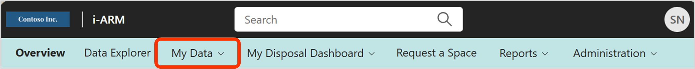
  

### My Data: Regulatory Compliant File Records Repository

iARM offers the capability to connect to SharePoint Sites, enabling the
secure storage of regulatory file records in compliance with SEC Rule
17a-4.

This rule mandates stringent requirements for the preservation and
accessibility of electronic records, ensuring they are maintained in a
non-rewriteable, non-erasable format.

By leveraging SharePoint, iARM ensures that all regulatory file records
are securely stored and easily retrievable, meeting the necessary
compliance standards set forth by the SEC.

#### View Regulatory Records from SharePoint Source Sites

To **view the folders and files stored in the regulatory records 
repository** from SharePoint Source Sites, select the data type, source,
and source instance from the dropdown menus.

**Step-by-Step:**

1.  **Select the Data Type**

  
  

  | #  | Feature         | Description |
|----|---------------|--------------------------------------------------------------------------------------------------|
| 1  | **iARM Managed**  | The iARM Managed UI will display the data that is managed by the iARM portal. This includes files that are managed on immutable storage as regulated compliant repositories. |
| 2  | **Source Managed** | The Source Managed UI will display the data that is managed by the iARM portal as well as data that is managed in the source location. The iARM portal supports data managed on various sources like Azure Files, Network File Share, SharePoint Online, etc. |

2.  **Select the Source and Source Instance**

  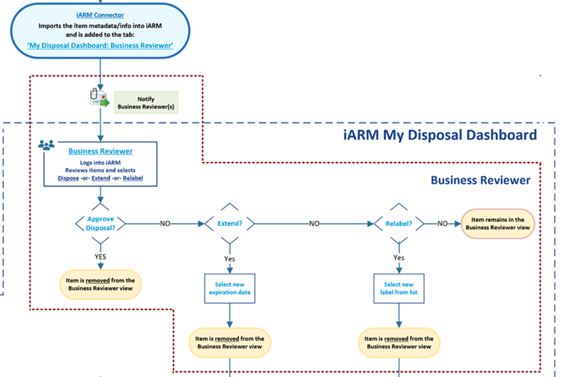  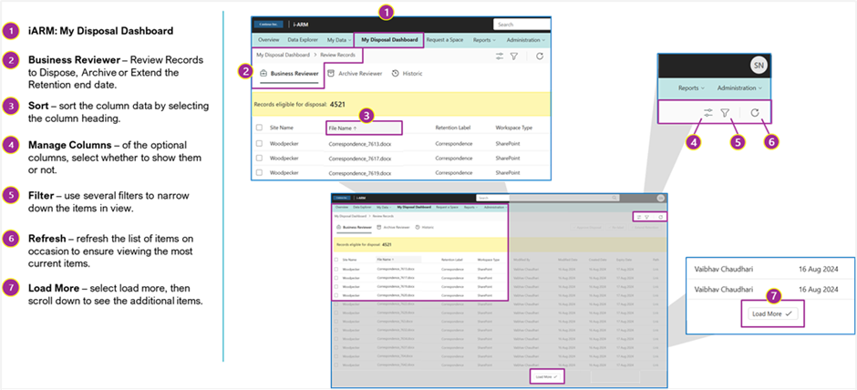 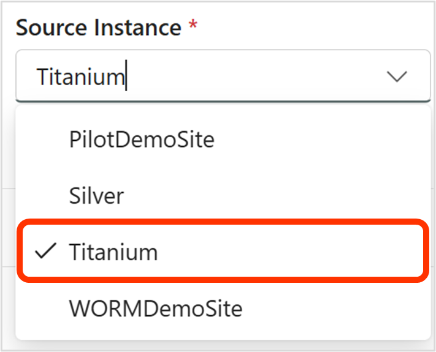
  

3.  **View folders, files, and metadata in the iARM Repository**

  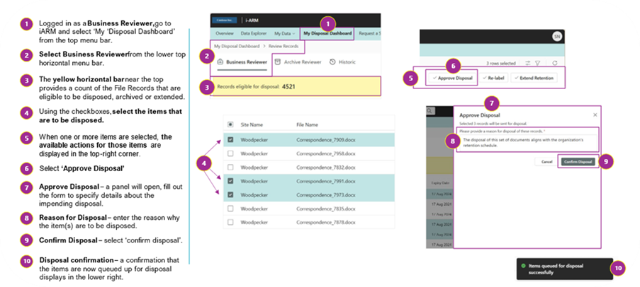
  
  

  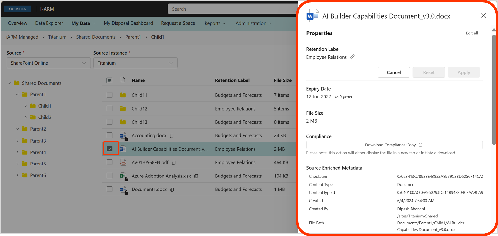 

4.  **View the File/Folder Information Panel**

The information pane consists of source enriched metadata, history,compliance copy and file size of the files and folders present in the compliant storage location and enables user to apply a retention label to files and folders.

|         |     |
|------------|-------------|
| View the Details Pane by selecting a file or folder, then select the information icon in the upper right corner.| 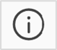 |

  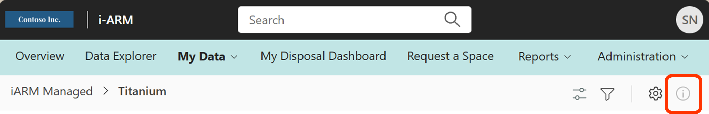
  

| Description | Image |
|------------|-------------|
| **Properties**   **Retention Label** – Displays the retention label, which can be changed by selecting a label from the retention label dropdown.   **Expiry Date** – Displays the expiry date (files only).   **File Size** – Displays the size of the selected file and the number of items present in the selected folder.   **Compliance** – User will be able to either open or download the compliance copy of the selected file.  | 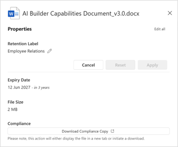 |
| **Source Enriched Metadata**   Displays the metadata available for the selected folder or file.   **Example custom metadata:**   - Business Function   - Information Type   - Information Status   - Jurisdiction   **Metadata from SharePoint:**   - Content Type   - Content Type ID   - Created   - Created By   - File Path   - List Item ID   - Modified   - Modified By   - Retention Label   - Retention Label Applied   - Sensitivity | 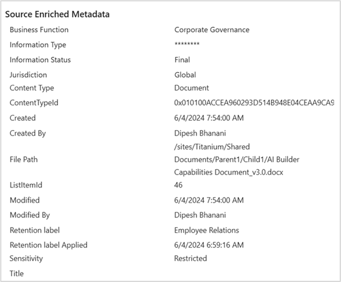 |
| **History**   Displays actions performed by iARM for the folder or file. | 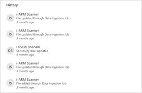 |

5. **Manage Columns**

    The **folders/files view can be customized**.

    For the available columns in iARM, they can be selected to show or not (checkbox) and can be ordered (drag and drop) from top to bottom, to  view from left to right.

|         |     |
|------------|-------------|
|To manage the columns, select this icon in the upper right corner.| 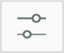 |

  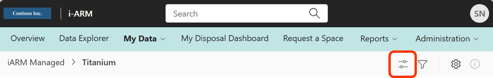
  

  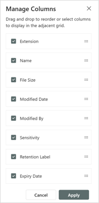
  

6.  **Filter Files**

    Several filtering options can be used to **scope the search results**
    down to locate specific items in the storage repository.

|         |     |
|------------|-------------|
|Filtering files can be accessed by clicking on the icon in the upper right corner.|  |

  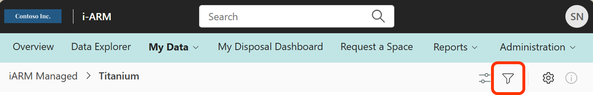
  

  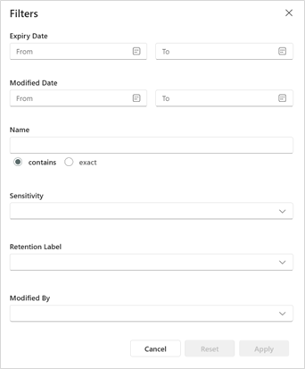
  

| #  | Filter        | Description |
|----|-------------|-------------------------------------------------------------------------------------|
| 1  | **Expiry Date** | It is used to filter out files according to their expiry date. It is not applicable to folders as folders do not have an expiry date. |
| 2  | **Modified Date** | It is used to filter items according to the date when the file was last modified. |
| 3  | **Name** | It is used to filter items by name in two ways:  |
|    |           | - **Contains** – Filters items that contain the input given by the user in the name input field. |
|    |           | - **Exact** – Filters items that exactly match the string input given by the user in the name input field. |
| 4  | **Retention Label** | It is used to filter items according to the retention labels applied to them. |
| 5  | **Modified By** | It is used to filter items according to the user who modified them. |

#### View/Modify Source Instance Configuration

Source Instance Configuration enables the primary owner and secondary
owner to manage compliant storage location.

|         |     |
|------------|-------------|
|To view the Source Instance Configuration, select this icon in the right upper corner.|  |

  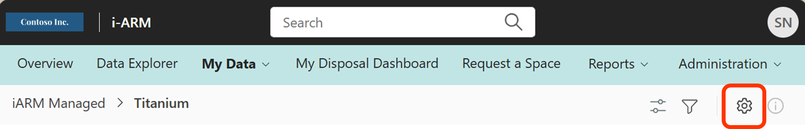
  

  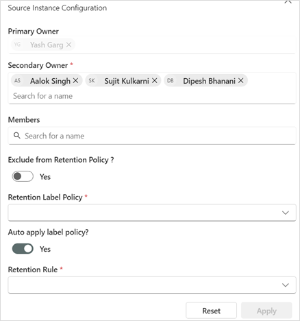
  

  | #  | Data Field                 | Description |
|----|----------------------------|--------------------------------------------------------------------------------------|
| 1  | **Primary owner**           | Has access to add or remove secondary owners and members to the compliant storage location. |
| 2  | **Secondary owner**         | Has access to add or remove secondary owners and members to the compliant storage location. |
| 3  | **Members**                 | Members added by the primary or secondary owner(s) can access the source instance folders/files but won't have access to the Administration features. |
| 4  | **Retention Label Policy**  | Primary and secondary owner(s) can choose a retention label policy from the dropdown to be applied to all files copied from the source instance. |
| 5  | **Exclude From Retention Policy** | Enables excluding the source site from the retention policy. Toggling this option will exclude files of that compliant storage location from the retention label policy. |
| 6  | **Auto Apply Label Policy?** | If toggled 'yes', it will auto-apply a retention policy when no retention policy is selected. |
| 7  | **Retention Rule**          | The retention rule selected from the dropdown will be auto-applied when no retention policy is selected. |

## Reports

The **Reports** tab contains a centralized list of all reports. In
addition to the current activity dashboards, there are several reports
that show the overall state of the records management program within the
organization.

  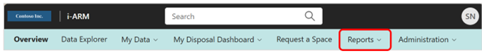
  

  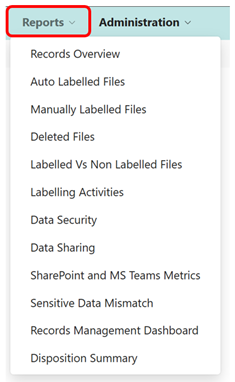
  

| #  | Feature                | Description |
|----|------------------------|-----------------------------------------------------------------------------------------------|
| 1  | **Records Overview**   | This report shows an overview of the actions performed in the source instances present. |
| 2  | **Auto Labelled Files** | This report provides a list of all source instances where labels are auto-applied. It shows the volumes of files and their categories that have had labels applied through auto-labeling policies, by workspace, type, and location. |
| 3  | **Manually Labelled Files** | Combined report for all source instances where labels are manually applied. It includes details on files labelled by staff manually. |
| 4  | **Deleted Files**       | Report on all deleted items. This includes deletion activities from the file explorer as well as records disposition activities, providing insights into storage cost reduction and security improvements. |
| 5  | **Labelled vs. Non-labelled Files** | Report on labelled and unlabelled items. It offers a holistic view of content categorized as records versus non-records, providing insights over time. |
| 6  | **Labelling Activities** | Report on the timeline of labelling activities, showing various stages of labelling as an end-to-end process with relative success over time. |
| 7  | **Record Management Dashboard** | Report on all labelled items. |
| 8  | **Disposition Summary** | Report on items that are disposed of or ready for disposal. |
| 9  | **Regulatory Records**  | Detailed report on key aspects and metrics regarding Copying SharePoint File Records to iARM. |

## Administration

The **Administration** component shows all the configuration options to
configure the iARM product and perform admin activities. It is only
accessible to **Administrators**.

  
  

  
  

### Disposal Settings

This is where the **Information Disposal Assessment** feature is
configured; specifically, the (1) Frequency of Checks (Days)\*, and (2)
Notification Email (Days)\*.

  
  

  
  

### Add Edit Reviewers

It is used to **Add/Edit Reviewers** and archive reviewer from a
particular site in my disposal dashboard.

### Source Instance Configuration

Source Instance Configuration provides the ability to **set up new
source instance storage location** for one of the many data source
types, for example: SharePoint Online, Azure Files, Azure Blobs, Network
File Share, AWS, M-Files, etc.

#### New Regulated Records Repository for SharePoint Source Site File Records

This section provides **a detailed set of step-by-step instructions, key
considerations, and guidance** for establishing a new SharePoint Source
Site.

**Step-by-Step:**

1.  **Gather SharePoint Source Site Information**

    a.  Collaborate with the SharePoint Source Site Owner (suggested) to
        gather the following:

    b.  If there are custom metadata fields that need to be brought with
        the file into iARM

    c.  What the Retention Duration needs to be (one value for each
        Source Site).

    d.  Identify the Retention Duration

        i.  For Regulated Storage - specify \# of days, no less than
            2190 days (=6 years), as specified in regulation SEC17a-4.

        ii. For non-Regulated Storage -- specify in \# of days,
            according to the organization's Retention Schedule.

    e.  Identify the Ingestion Frequency (in days).

2.  **Provide the Source Site Configuration Details**

    a.  Open iARM, with the role of Administrator.

    b.  **Select 'Administration'** from the top horizontal menu.

    

  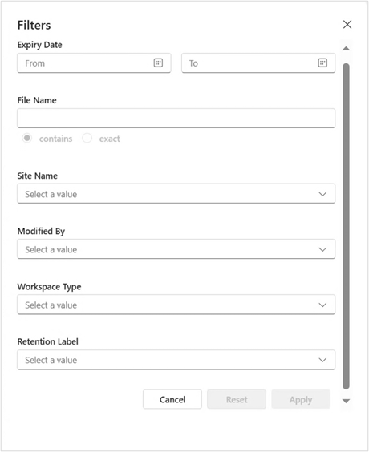
  

  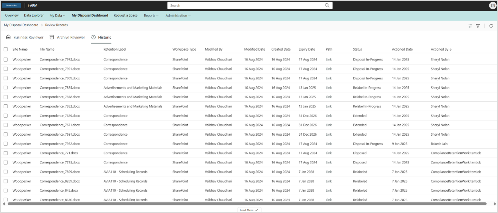
  

    c.  **Select Source Instance Config.**

    

  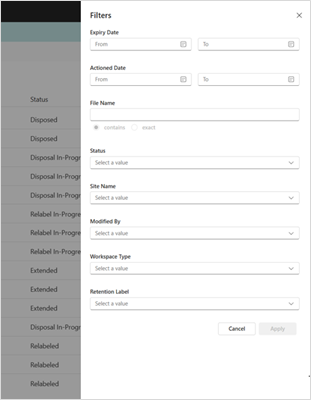
  

  
  

    d.  On the Source Instance configuration form, **select a Source
        from the drop-down list**, in this case 'SharePoint Online'.

  

  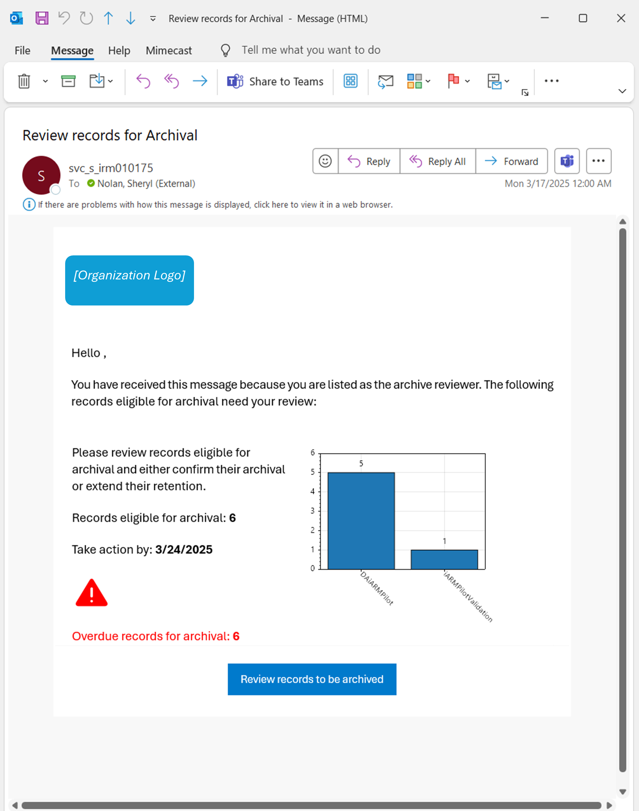
  

    e.  **Select the Source Instance Type.**

  

  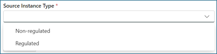
  

| #  | Type            | Description |
|----|---------------|--------------------------------------------------------------------------------------------|
| 1  | **Non-Regulated** | Select this if the files managed in the iARM repository are **not** required to be stored in WORM (Write Once Read Many) format. |
| 2  | **Regulated**     | Select this if the files managed in the iARM repository **must** be stored in WORM format. |

f.  **Select 'Download a template'** - this will download a template
    Manifest File, into the local machine's downloads folder.

  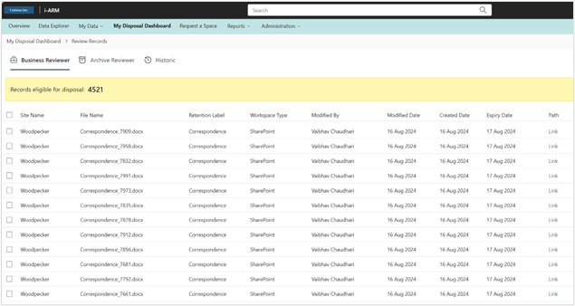
  

g.  **Create the Manifest File for the New Source Site**

    i.  Locate the downloaded file and rename it.

    ii. Open the renamed file in an XML editor (e.g. Notepad, Azure,
        ...).

    iii. Modify the content of the Manifest File according to the
         information gathered in Step 1.

 **Primary Owner**

 For the primaryOwner field, only one Person or one Security Group is
 allowed to be provided for this field.

 Provide the full email address for the Person/Security Group. For
 example:
 [[primary.owner@organization.com]{.underline}](mailto:primary.owner@organization.com)

In the event more than one person is specified in the Manifest File,
the source site configuration process in iARM will fail.

  -------------------------------------------------------------------------
 > Example XML -         primaryOwner=\"<primary.owner@organization.com>\"
  --------------------- ---------------------------------------------------

  -------------------------------------------------------------------------

 **Secondary Owners**

 For secondary owners, there can be multiple People (or Security
 Groups?) specified, each separated by a comma.

  --------------------------------------------------------------------------
>  Example XML -         secondaryOwner=\"secondary.owner1@oganization.com,
                        secondary.owner2@oganization.com,
                        secondary.owner3@oganization.com\"
  --------------------- ----------------------------------------------------

  --------------------------------------------------------------------------

 **URL**

 Enter the full URL of the new Source Site.

  ------------------------------------------------------------------------------
>  Example XML-        "https://organizationname.sharepoint.com/sites/sitename"
  ------------------- ----------------------------------------------------------

  ------------------------------------------------------------------------------

 **SourceInstanceName**

 Provide the exact same Site Name, which is in the site's URL.

  -----------------------------------------------------------------------
 > Example XML -         "Site Name"
  --------------------- -------------------------------------------------

  -----------------------------------------------------------------------

 **Is Pilot**

 During the pilot phase, setting 'IsPilot' to \`true\` allows the
 \`immutableStorageRetentionDuration\` to be **set to a short
 duration - 1 day, to enable end-to-end testing to be efficient.**

 This setting also provides the ability for **files created during the
 testing phase to be deleted once the pilot testing is complete**, thus
 reducing Azure storage costs and ensuring the repository only contains
 regulatory records.

 An **IT administrator can delete the test files** from Azure storage
 after the (short) retention period has passed, provided the IT
 administrator has the required permissions and no policy exists on the
 organization's customer tenant blocking the action.

  -----------------------------------------------------------------------
>  Example XML -         isPilot="true"
  --------------------- -------------------------------------------------

  -----------------------------------------------------------------------

 **Immutable Storage Retention Duration**

 **In production, the minimum retention duration is six years (2,190
 days) per regulation,** and any changes to the
 \`ImmutableStorageRetentionDuration\` must be longer than the current
 setting once the initial iARM scan is complete.

 The **minimum immutable storage retention duration in iARM is six
 years** (2,190 days), **as specified in regulation SEC17A-4**. The
 Manifest File must contain a value for immutable storage retention
 duration that is 2,190 days or higher to be valid.

 Once a Source Site is configured in iARM and the initial scan is
 complete, any modification to the
 \`ImmutableStorageRetentionDuration\` must be set at a higher number
 than the current setting. The \`ImmutableStorageRetentionDuration\`
 must be specified as a numerical integer value representing the number
 of days.

  -----------------------------------------------------------------------
>  Example XML  -        immutableStorageRetentionDuration="2190"
  --------------------- -------------------------------------------------

  -----------------------------------------------------------------------

 **Incremental Scan Duration**

 During the Pilot phase, we recommend setting a low
 incrementalScanDuration, such as 1 day, which will make the testing
 phase more efficient.

 For production, the organization can determine the incremental scan
 duration. For SEC17a-4 compliance, **a common frequency for the
 banking industry is every 7 years.**

 The incremental scan copies files from the source site to the iARM
 regulatory compliant repository (SEC17a-4) at the frequency specified.

 The \`incrementalScanDuration\` must be specified as a numerical value
 representing the number of days.

 The iARM copy scan is typically set to run at midnight UTC, however it
 can be scheduled for other times and time zones, based on the
 organization\'s needs.

  -----------------------------------------------------------------------
>  Example XML  -        incrementalScanDuration="7"
  --------------------- -------------------------------------------------

  -----------------------------------------------------------------------

 **Metadata**

 Include metadata fields in the Manifest File that are pertinent and
 valuable to your business, legal, or regulatory requirements. For
 guidance on including additional metadata fields in the Manifest file,
 reference this section: [Metadata Fields to include in the Manifest
 File](#metadata-fields-to-include-in-the-manifest-file)

> Example XML  -     \<field\> Metadata Field Name 1 \</field\>     
>              -    \<field\> Metadata Field Name **2** \</field\> 

 **Is Sensitive**

 For files that have sensitive information in their metadata, the
 IsSensitive="true" setting can be included in the Manifest File.

 When IsSensitive is specified for a metadata field, iARM will mask the
 metadata in the iARM UI.

 In place of the sensitive metadata, the End User will see a string of
 asterisks (e.g. \*\*\*\*\*\*\*\*\*).

  -----------------------------------------------------------------------
>  Example XML   -       \<field IsSensitive="true"\>Metadata Field
                        Name\</field\>
  --------------------- -------------------------------------------------

  -----------------------------------------------------------------------

> Example Manifest File
>
 Update source instance name, primaryOwner, secondaryOwner.
 Keep immutableStorageRetentionDuration less than or equals to 7 for pilot mode.

><recordsource
>primaryOwner="alias1@organization.com"
>secondaryOwner="alias2@organization.com"
>sourceInstanceName="Site Name"
>url="https://organization.sharepoint.com/sites/SiteName"
>isPilot="false"
>immutableStorageRetentionDuration="5"
>incrementalScanDuration="7"

  Add/remove metadata as required.
 Specify which field(s) contain sensitive information by using the >IsSensitive attribute.

><metadata>

><field>Title</field>
><field>Business Function</field>
><field IsSensitive="true">Information Type</field>
><field>Information Status</field>
><field>Jurisdiction</field>

></metadata>

></recordsource>

h.  **Save and close the Manifest File**.

i.  **Upload Manifest File** -- Manifest.xml file can be browsed and
    uploaded consisting of source instance name, metadata fields, cloud
    storage solutions link, primary owner, secondary owner etc. Manifest
    file can only be uploaded when source and source instance type are
    selected.

j.  **Return to iARM \> Administration \> Source Instance Config.**

    i.  **Browse for the Manifest file** - Click on 'choose file' and
        select the manifest file to be uploaded.

    ii. Upload file - After selecting the file, click open
  

  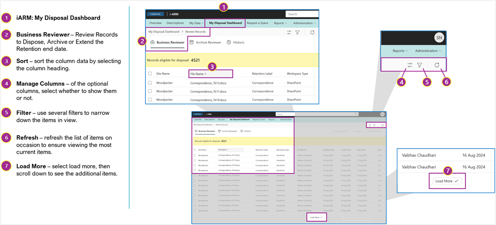
  

    iii. **Manifest File Validation** -- At upload, iARM will validate
         the manifest file.
    If the source instance is successfully created, a confirmation message will display in the lower right corner.

  
  

 If the source instance is unsuccessful, an error message will display
 in the lower right corner. If this is the case, review the steps above
 to troubleshoot how to resolve.

  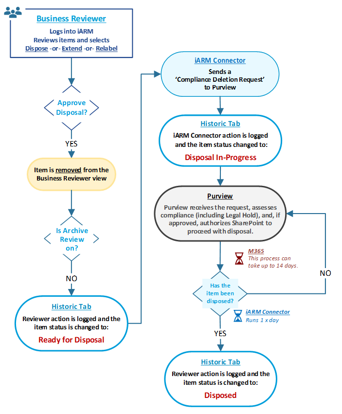
  

 When the XML file is uploaded, the data from the XML file for Primary
 and Secondary Owners will display as shown below and can be edited
 before final submission.

 The Primary and Secondary Owners of new compliant storage location
 will have access to the source instance configuration panel in the
 Administration component of iARM.

  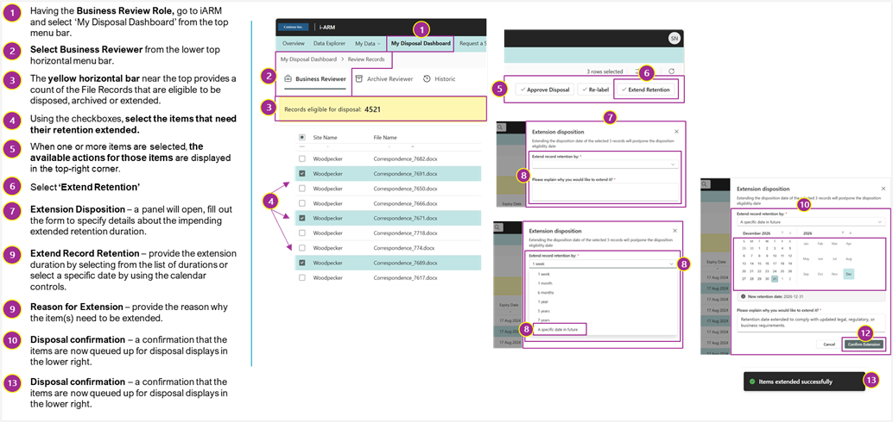
  

3.  **Select 'Submit' to finalize the setup of the new the SharePoint
    Source Site**

##### Certain SharePoint metadata is automatically transferred with the file into iARM.

The table below lists the **SharePoint metadata fields that will
automatically be copied into iARM**; these fields do not need to be
entered into the Manifest File during the Source Site configuration.

| **Metadata Field Name** | **Example Data**                                 | **OOB SP or Custom or iARM** | **Automatically Copied with File to iARM** |
|-------------------------|-------------------------------------------------|-----------------------------|-------------------------------------------|
| **Title**               | Accounting.docx                                 | OOB SP                      | Yes                                       |
| **Content Type**        | Document                                        | OOB SP                      | Yes                                       |
|                         | Content types in SharePoint define attributes of a list item, document, or folder. | | |
| **ContentTypeId**       | 0x0101 00D2BD302D89DA68429F5DC90ED9FF80DD 007B372201B1928D4DB833B636FEAFE50B | OOB SP | Yes |
|                         | ContentTypeId is a unique identifier for a content type in SharePoint. | | |
| **ListItemId**          | 15                                              | OOB SP                      | Yes                                       |
| **File Path**           | /sites/SiteName/LibraryName/FolderName/Accounting.docx | OOB SP | Yes |
| **Created**             | 6/11/2024 5:32:00 AM                            | OOB SP                      | Yes                                       |
| **Created By**          | [Person Name]                                   | OOB SP                      | Yes                                       |
| **Modified**            | 6/11/2024 5:35:00 AM                            | OOB SP                      | Yes                                       |
| **Modified By**         | [Person Name]                                   | OOB SP                      | Yes                                       |
| **Sensitivity**         | Restricted                                      | OOB SP                      | Yes                                       |

<h2>Metadata Fields to include in the Manifest File </h2>

Ensuring necessary metadata is available and connected to the file
record in the regulatory compliant repository is crucial. **Include
pertinent metadata fields in the Manifest File to meet business, legal,
or regulatory requirements.**

**Identify metadata** from the SharePoint source site **that isn't
automatically transferred** and needs to be included in iARM. From the
listing **validate which metadata needs to accompany the file** and
include them in the Manifest File as needed for compliance.

**The metadata** specified in the Manifest File **can be viewed in the
file information panel in iARM**, by selecting a file and clicking the
'i' icon which will open the file's information panel on the right. This
panel provides access to SharePoint file metadata, the latest file
revision, and any custom metadata, as specified in the Manifest File.

<h2> When Source Site File Records don't meet regulatory criteria </h2>

**There are times when File Records fail to be copied** into the
Regulatory Compliance Records Repository. The root cause of these errors
could be due to something about the file in SharePoint itself or due to
a system/process error spanning the network, system hardware, data
connections, and software.

When File Records copy errors do occur, **there is a notification
process** in place that communicates the specific error that occurred
and provides instruction for how to resolve the error.

The following diagram depicts **the process and data flow for File
Records copy errors** from a SharePoint Site source to the regulatory
records repository in iARM:

  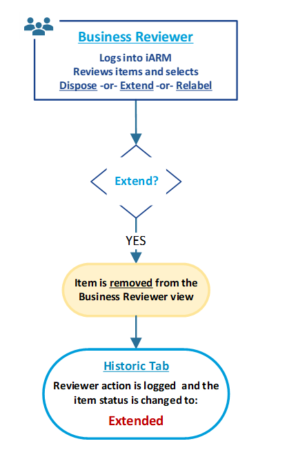
  

**File Records Copy Error process and workflow:**

1.  When the iARM copy scan occurs, all errors are captured during the
    process.

2.  iARM captures the type of error for each file.

3.  For all errors of a single SharePoint Source Site, iARM creates a
    CSV file, inserts a row for each file, and creates columns for the
    key metadata of the file. For example: site URL, site name, file
    name, error type, description and instructions for how to resolve.

4.  iARM creates an email notification, with the CSV file attached.

5.  The body of the email contains information regarding why the email
    was sent, what happened and what actions are needed to resolve the
    error(s) and by when.

6.  The email notification is sent to the Primary Owner and Secondary
    Owner(s).

7.  Recipients review the notification and take any action deemed
    necessary.

8.  Upon the next iARM copy scan:

    a.  If the error(s) are resolved, the file is copied into the iARM
        repository.

    b.  If the error(s) have not been resolved, steps 1-7 will occur
        again and continue until all errors are resolved.

> Example
>
> Email Notification

The message and configuration of the **email notification is intended to
be customized** as needed by the organization using iARM.

  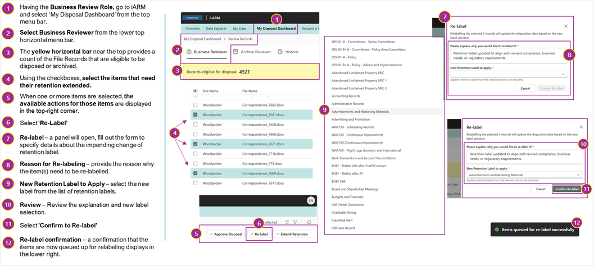
  

> Example
>
> CSV file attached to the Email Notification

  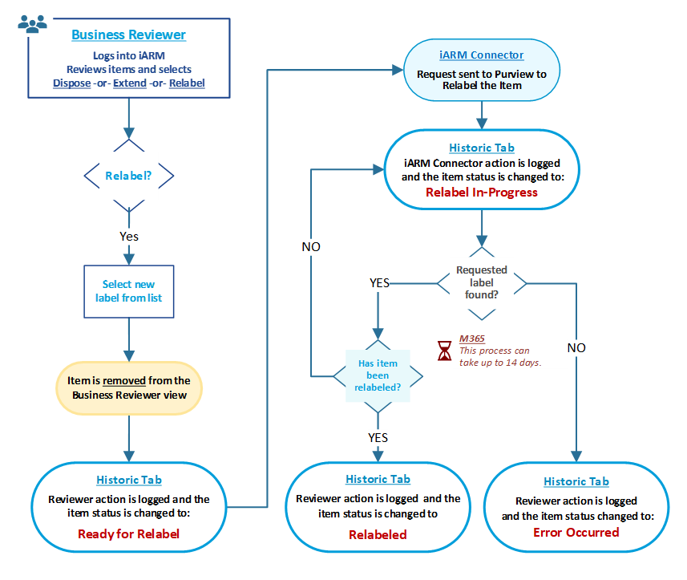
  

##### Columns and Data provided in the CSV File

| **Record ID** | **File Name**  | **File Path**                             | **Error Message**                                                  |
|--------------|---------------|-------------------------------------------|-------------------------------------------------------------------|
| f83bd2e1-ea14-4b27-b16c-a1c373126c4a | Accounting.docx | /sites/SiteName/LibraryName/FolderName/Accounting.docx | An error occurred while processing the record 'f83bd2e1-ea14-4b27-b16c-a1c373126c4a'. Error: The file is checked out by **[Name]** and will be skipped for the current ingestion process. Please ensure to check it in before the next incremental scan schedule. |
| 5ea53f24-1521-4f77-b556-077fa772847c | SAP-Form-1154.docx | /sites/SiteName/LibraryName/FolderName/SAP-Form-1154.docx | An error occurred while processing the record '5ea53f24-1521-4f77-b556-077fa772847c'. Error: The file is checked out by **[Name]** and will be skipped for the current ingestion process. Please check it in before the next incremental scan schedule. |

> Example
>
> Resolving copy errors due to the file being Checked-out

**Resolving copy errors due to the file being Checked-out**

The error message in the CSV file for when a file is checked-out
describes that to resolve the issue, the file needs to be check-in.

Another way to solve this is to have a member of the source site with
the necessary permissions discard the check-out. Visuals for both
resolution paths are shown below:

Error Message: File Checked-Out\*\*

To resolve this issue, you can:

1.  **Check-In the File**: Ensure the file is checked back in.

2.  **Discard Check-Out**: A member with the necessary permissions from
    the source site can discard the check-out.

**Visuals for both resolution paths are shown below:**

  
  

### Container Settings

This is where the **Container Disposal Assessment** feature is
configured; specifically, the (1) Frequency of Checks (Days), and (2)
Period While Empty (Days).

  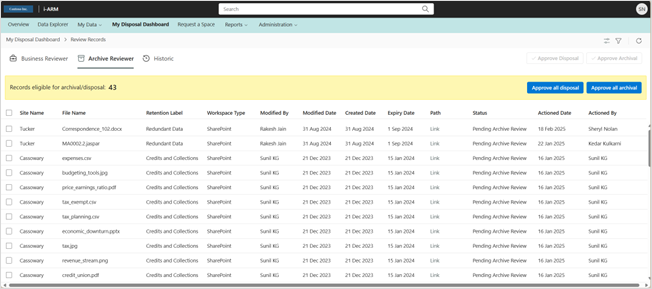
  

Data Type Configuration

  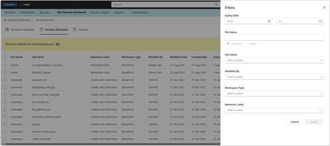
  

 

# iARM Support

**SUBMITTING SUPPORT REQUESTS AND ACCESS**

-   The Customer may request Support Services by way of a Support
    Request sent in email to: <support@infotechtion.com>

-   Each Support Request shall include a description of the Operational
    Fault \[or Vulnerability\] and, where relevant, the start time of
    the incident.

-   The Customer shall provide the Supplier with:

    -   Prompt notice of any Faults which it becomes aware of; and

    -   Such output and other data, documents, information, assistance
        and (subject to compliance with all Customer's security and
        encryption requirements notified to the Supplier in writing)
        remote access to the Customer System, as are reasonably
        necessary to assist the Supplier to reproduce operating
        conditions similar to those present when the Customer detected
        the relevant Operational Fault and to respond to the relevant
        Support Request.

-   Save for where the Supplier reasonably determines that it requires
    access to the Customer Site to provide the relevant Support Service,
    all Support Services shall be provided on an off-site basis (such as
    over the telephone or by e-mail) from the Supplier's office.

-   The Customer acknowledges that, to properly assess and resolve
    Support Requests, it may be necessary to permit the Supplier direct
    access at the Customer Site to the Customer System and the
    Customer's files, equipment and personnel.

-   The Customer shall provide such access promptly (provided that the
    Supplier complies with all the Customer's reasonable security
    requirements and other policies and procedures relating to
    contractors entering and working on the Customer Site) notified to
    the Supplier in writing reasonably in advance.

For additional details, see the **Service Level Agreement**
