#  Document Purpose

This document provides the High-Level design (HLD) which builds on the
initial architecture defined within the Solution Blueprint and the
Proposition document to finalise the architecture for the solution and
by which Domains can produce Domain specific Low-Level designs (LLD) and
build the proposed solution. The HLD specifies the architecture building
blocks that make up the solution and highlights functional and
non-functional requirements alignment & final delivery scope for
traceability as well as all necessary information to drive accurate
delivery costs.

# Architecture Overview

The Bank’s physical
records and electronic records in FileSite are currently managed by
Autonomy Records Manager (ARM). This system provides the capability to
classify our records in line with the Bank’s Records Classification
Scheme (RCS) and to manage the retention and defensible disposition of
those records based on the retention policies specified in the RCS. It
also provides the location management of physical records. The
capabilities of ARM are being replaced by utilising the records
management capabilities of Microsoft Purview supplemented by i-ARM.
Electronic records (in CLOSED FileSite Folders) will be migrated to
SharePoint Online.

The document contains the details of the i-ARM offerings, which is a
comprehensive data and records management product. It provides the
high-level details of what will be required to implement i-ARM component
on the Banks Microsoft Azure production tenant.

The use of i-ARM is designed to enhance the Bank’s data governance and
compliance processes while ensuring seamless integration with M365
workloads and Purview. This solution leverages advanced capabilities to
provide organizations with complete visibility and control over their
data assets.

This high level design covers the necessary design for the
implementation for the i-ARM component and covers the following aspects
for the design:

- Th implementation of the i-ARM component on the Banks Tenant IaaS and
  PaaS infrastructure

- The connectivity of the i-ARM component through to the Banks M365
  Tenant – SPO and Purview

- The DevOps pipeline for updates for the i-ARM components from
  Infotechtion environment

- The implementation of the Online Reporting Platform for i-ARM.

- It does not cover other aspects which will be required for the
  completion of the project, such as:

- The connectivity back to on-premise required for the migration of
  documents

- The on-going movement of documents from on-premise ARM and FileSite to
  i-ARM and SPO as records close on ARM

- I Information Architecture for the structure of the target solution
  within SharePoint Online

- The actual migration process

- Integration with the Banks implementation of Preservuica for the
  digital preservation of documents.

As such it is a platform design, further high-level designs will need to
be produced to inform on these aspects above at a later date. The
production of these designs will need to be scheduled and planned.

Note that the Architecture Brief for this ARM Replacement project deals
with the on-premise infrastructure which is required for the migration
tool Proventeq. This is to enable the discovery and the extraction of
the data from Filesite and ARM. We will extend this HLD to include the
design and implementation necessary to enable the migration of documents
to M365.

### Context

i-ARM will be deployed in
BoE’s Azure environment, providing a scalable and secure platform that
aligns with the Bank’s cloud strategy and extends Microsoft Purv’ew's
capabilities, enabling advanced data governance, discovery, and
classification features. This ensures that the B’nk's data is
effectively managed and compliant with regulatory requirements.

The product is designed to be extensible and can be integrated with
other services, like Preserve365, in the future. This enables the
organization to leverage specialized tools for digital preservation,
further enhancing the overall data management strategy.

### Solution Scope

The scope of the product deployment described in this section of the HLD
relates to the target architecture, defining the elements that are
included and excluded from the solution.

Included in Scope for this HLD version:

- Data and Records Management: The i-ARM provides physical records
  management offerings, along with archival and disposal of records
  using disposal dashboard.

- Integration with M365, namely SPO and Microsoft Purview: Integrations
  with Microsoft Purview, extending its capabilities to enhance data
  discovery, classification, and governance.

- Deployment in BoE Azure Environment: i-ARM will be deployed on the BoE
  Azure cloud platform, utilizing Az’re's infrastructure services to
  ensure scalability, security, and high availability.

i-ARM is a pre-packaged solution offered as a dedicated service with its
own API layer for proprietary actions. Additionally, integration with
external systems such as SharePoint and Purview is facilitated using
standard Microsoft Graph APIs.

### As-Is Architecture

The diagram below provides a high-level as-is architecture of the
existing FileSite and ARM solutions within the B’nk's environment.

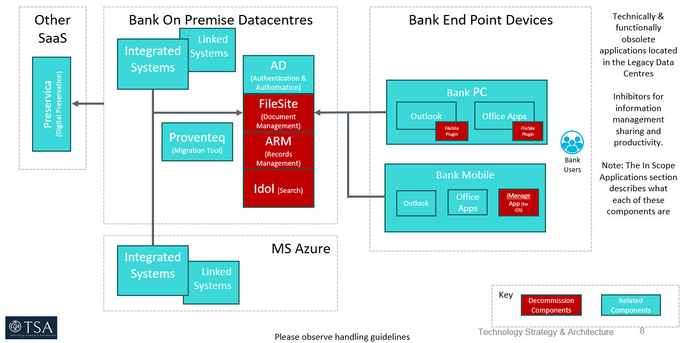

### Target Architecture

The diagram below provides a high-level overview of how the i-ARM
product fits into the broader ecosystem, interacting with multiple
external systems within/out of BoE IT environment to fulfil its role as
a comprehensive data and records management solution.

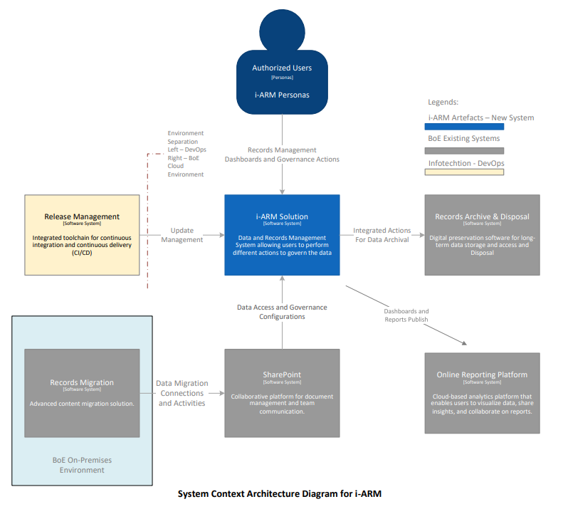

Here is an explanation of each component and its role within the
architecture:

- Users (i-ARM Personas): This represents the end-users who will
  interact with the i-ARM solution. These users perform various actions
  related to records and data management, utilizing the solution’s
  dashboards and different services.

- i-ARM Solution (Software System): The principal component of the
  architecture, the i-ARM solution is designed to enable data and
  records management activities. It provides users with features to
  govern data, manage records, and implement data governance
  configurations.

- Release Management (Software System): This component represents the
  integrated toolchain for continuous integration and continuous
  delivery (CI/CD). It is responsible for managing updates and deploying
  new features to the i-ARM solution to ensure it remains current and
  functional.

- Records Archival (Software System): This system provides digital
  preservation capabilities for long-term storage and access to data.
  The i-ARM solution integrates with this component to ensure that data
  is archived according to governance policies.

- SharePoint (Software System): SharePoint provides a collaborative
  platform that supports document management and team communication. The
  i-ARM solution integrates with SharePoint for data access and
  governance configurations, ensuring that data is appropriately managed
  and accessible.

- Records Migration (Software System): This component represents a
  content migration solution that facilitates the migration of records
  into the i-ARM solution and runs within the On-premises infrastructure
  of BoE. It ensures data migration connections and activities are
  seamless and efficient.

Online Reporting Platform \[Software System\]: A cloud-based analytics
platform that allows users to visualize data, share insights, and
collaborate on reports. It receives dashboards and reports created using
the i-ARM data stores

<!-- - . -->

### Transition Architecture diagram 

This diagram provides a high-level overview of how the legacy systems of
ARM and FileSite will be replaced. The focus for this iteration of the
High-Level design is on the implementation of the i-ARM component and
the integration with the Banks M365 tenant and the SPO and Purview
components. This is implementation is highlighted below in the diagram.

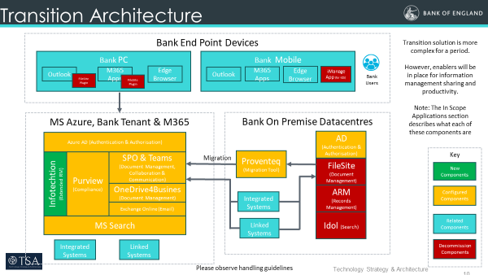

<!-- ##Previous Input -->

| **Source** | **Type** | **Architecture Comment** |
|----|----|----|
| Filesite & ARM Replacement Solution Blueprint | Decision: KD01: M365 is our target solution utilising SharePoint Online (SPO), Purview, OneDrive4Business (OD4B), MS Search and Teams (including E5 Information Compliance). | Foundational to this design |
| Filesite & ARM Replacement Solution Blueprint | Decision: KD02: Infotechtion ARM (i-ARM) has been chosen as an extension onto SPO and Purview for the purposes of paper Records Management and improved support of mass disposition reviews | Foundational to this design |

The Above table include the main decisions form the Solution Blueprint
which are pertinent to the design contained within this HLD at tis
stage.

All design decisions concerning the target architecture are documented
in section 10.1. Details regarding the current state architecture, such
as RAID, should be maintained by the bank

# Application Architecture 

The Application Architecture section below focuses on the design and
structure of the application that provides the functional capabilities
required for the i-ARM product. This description explains how various
architectural building blocks forms the complete product and its
functional framework.

### Logical Application Diagram

The diagram below represents the logical component architecture design
of the i-ARM and provides the overall view of the components involved to
provide i-ARM functionality along with integrations with external
systems.

The primary logical components of the system are shown as below

- User Interface Layer:

  - Provides a unified dashboard for users (i-ARM Personas) to interact
    with the system.

  - Offers tools for records management, governance actions, and data
    insights.

  - Designed for ease of use to promote user adoption.

- Business Service Layer:

  - Contains the core business logic for data and records management.

  - Implements the governance policies for data classification,
    retention, and access.

  - Implements automated and triggered workflows e.g. using Power
    Automate.

- Application Integration Layer:

  - Facilitates communication between the i-ARM user interface and other
    system components e.g. APIs or endpoints.

  - Manages the integration with external systems for archival.

  - Implements secure APIs.

- Data Storage Layer:

  - Ensures data integrity, security using relational database system.

- External Systems:

  - Release Management: Manages deployment pipelines for continuous
    integration and delivery of the i-ARM solution.

  - Records Archival: Provides digital preservation capabilities for
    long-term data storage.

  - SharePoint: Supports document management and collaboration.

  - Records Migration: Handles data migration into the i-ARM system from
    legacy systems.

  - Reporting System: Provides the cloud-based analytics platform to
    publish reports.

<!-- **  
** -->

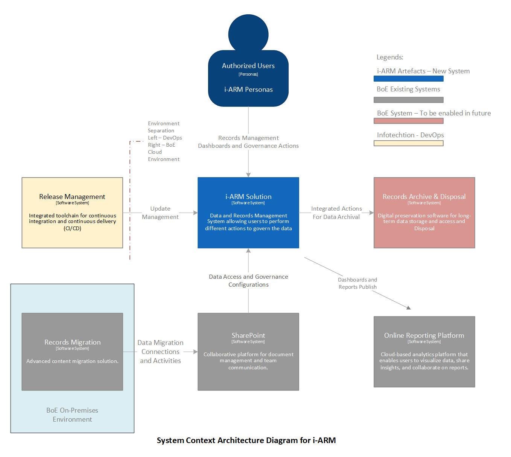

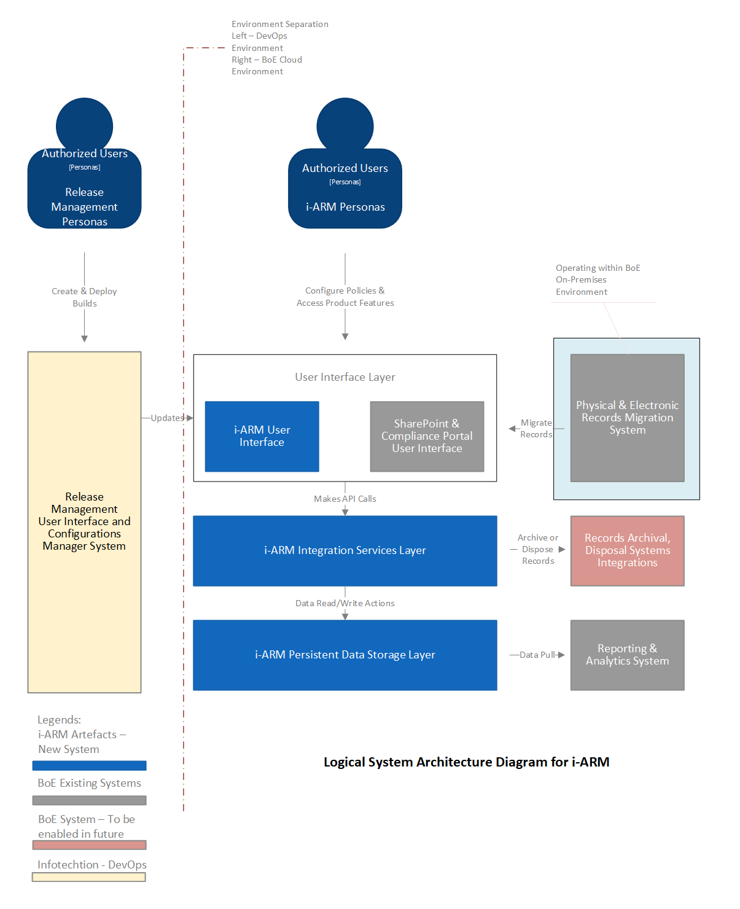

### Application Building Blocks

The i-ARM solution is designed with a modular and integrated
architecture to provide data and records management capabilities.

The architecture diagram presented below illustrates the high-level
structure of the system, highlighting the core containers and their
interactions with external systems. This architecture ensures seamless
integration for data governance, archival, and reporting functionalities
while maintaining flexibility for future enhancements.

Each container is carefully designed to interact with others in a manner
that supports efficient data flow, secure management, and comprehensive
reporting.

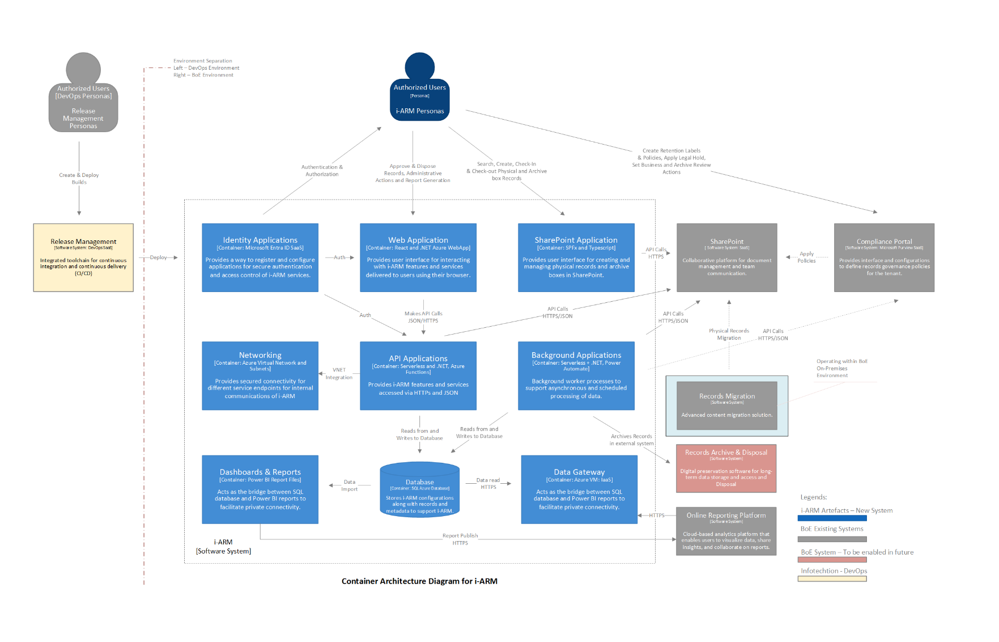

The diagram serves as a visual guide to understanding how the i-ARM solution orchestrates these interactions, ensuring a cohesive and effective system for managing data and records.

**i-ARM Software System Containers Description:**

1.  Identity Applications

    - Purpose: Manages authentication and access control for i-ARM
      services.

    - Technology: Microsoft Entra ID (SaaS).

    - Responsibilities:

      - Register and configure applications for secured access.

      - Perform Authentication.

      - Access control management.

    - Interactions:

      - Users: Authenticates and authorizes users.

      - Web Application, SharePoint Application, API Applications:
        Provides authentication services to these containers ensuring
        secure access.

2.  Web Application

    - Purpose: Provides a user interface for interacting with i-ARM
      features and services.

    - Technology: React and .NET Azure WebApp.

    - Responsibilities:

      - i-ARM User interface for record interaction and management.

      - Delivery of services through a web browser.

    - Interactions:

      - Users: Interfaces directly with users for record management
        interaction.

      - Identity Applications: Utilizes authentication services to
        verify user access.

      - API Applications: Makes API calls to access backend services and
        data.

3.  SharePoint Application

    - Purpose: Custom built interface for performing actions related to
      physical records to manage them.

    - Technology: SPFx and TypeScript.

    - Responsibilities:

      - Interface for creating and managing records.

      - Interaction with archive boxes.

    - Interactions:

      - Users: Direct user interaction for records management.

      - Identity Applications: Uses authentication services for secure
        access.

      - API Applications: Makes API calls for backend data services.

      - SharePoint: Integrates with the management process for physical
        records.

4.  Networking

    - Purpose: Ensures secure connectivity for internal communications
      within i-ARM.

    - Technology: Azure Virtual Network and Subnets.

    - Responsibilities:

      - Secured communication channels.

      - Integration of service and private endpoints.

    - Interactions:

      - All Containers: Provides secure VNET integration for internal
        communication between different containers.

5.  API Applications

    - Purpose: Provides i-ARM features and services accessed via APIs.

    - Technology: Serverless and .NET, Azure Functions.

    - Responsibilities:

      - Expose functionalities through HTTPs and JSON.

      - Serve as backend for numerous services.

    - Interactions:

      - Web Application, SharePoint Application, Background
        Applications: Provides backend services and data via API calls.

      - Database: Reads from and writes to the database for data storage
        and retrieval.

6.  Background Applications

    - Purpose: Handles background processes and scheduled data
      processing.

    - Technology: Serverless Functions, .NET, Power Automate.

    - Responsibilities:

      - Asynchronous data processing.

      - Scheduled tasks management.

    - Interactions:

      - Database: Archives records and performs scheduled data
        processing tasks.

      - API Applications: Interacts for backend services as needed.

      - Records Archive & Disposal: Manages long-term storage and
        disposal processes.

7.  Dashboards & Reports

    - Purpose: Acts as an interface between SQL database and Power BI
      reports.

    - Technology: Power BI Report Files.

    - Responsibilities:

      - Data visualization and reporting.

    - Interactions:

      - Database: Imports data for analysis and reporting.

      - Users: Provides visual reports and dashboards for data insights.

      - Data Gateway: Facilitates data transfer between SQL database and
        Power BI

8.  Database

    - Purpose: Central data repository for i-ARM.

    - Technology: Azure SQL Database.

    - Responsibilities:

      - Store i-ARM application data and configuration metadata.

      - Support for read/write operations.

    - Interactions:

      - API Applications, Background Applications, Dashboards & Reports:
        Read from and write data to the database for various operations.

9.  Data Gateway

    - Purpose: Facilitates data transfer between SQL databases and Power
      BI.

    - Technology: Azure VM, IaaS.

    - Responsibilities:

      - Data import/export management.

      - Secure data bridge.

    - Interactions:

      - Dashboards & Reports: Enables data connectivity for reporting
        and analytics.

> **Binary Scan** **– For the deployment of i-ARM code (initial and for
> on-going** **updates)**
>
> For Azure resource deployments via code (Infrastructure as code),
> i-ARM implementation follows the Microsoft-recommended, verified
> modules. These modules ensure that configurations align with the
> Well-Architected Framework of Azure, significantly reducing the
> chances of incorrectly configured resources within the environment.
>
> Regarding solution builds, such as function apps and web apps, i-ARM
> follow SecOps principles. In the DevOps pipelines, binaries are
> evaluated using standard tools, and specific activities are performed,
> including checks for memory leaks and assessments of cyclomatic code
> complexities. Additionally, all modules undergo unit testing, and the
> pipelines are designed to push artifacts only after successful
> completion of these tests. This rigorous process ensures that
> deployment artifacts are well-tested, thereby minimizing any margin of
> error or issues arising from unforeseen errors.

# Architecture

# Introduction

This document provides a comprehensive architectural overview of i-ARM, a data and records management solution designed to enhance data governance, compliance, and seamless integration with Microsoft Purview. It outlines the architectural principles, key components, and deployment considerations required for successful implementation in the client's Azure environment.

The i-ARM solution supports both **structured and unstructured data sources**, enabling organizations to manage and govern their data across various cloud platforms including **Azure, AWS, Microsoft 365 and On-Premises environments**. By leveraging advanced purview capabilities, i-ARM provides organizations with complete visibility and control over their data assets, ensuring alignment with regulatory and compliance requirements while integrating seamlessly into existing IT ecosystems.

## Purpose of the document

This document serves as the authoritative reference for the design and implementation of the i-ARM solution. It provides a structured approach to defining the architecture, ensuring consistency, scalability, and security across all components.

**Key objectives of this document include:**

*   Defining the architectural framework, guiding principles, and key design decisions.
*   Establishing a common understanding among stakeholders, including solution architects, cloud infrastructure teams, and governance bodies.
*   Outlining the high-level requirements, technical dependencies, and operational considerations.
*   Acting as a living document, updated throughout the project lifecycle - from initial design approval to final implementation and ongoing maintenance.

## Governance

This document will be reviewed and approved by relevant architecture and governance teams, ensuring alignment with organizational policies and compliance standards. Updates will be incorporated at various project stages, including:

*   **Review & Approval:** Subject to validation by internal Architecture Review Boards (ARBs) or equivalent governance bodies.
*   **Final Implementation:** Documented as an “As-Built” reference after deployment.
*   **Ongoing Maintenance:** Periodically updated to reflect enhancements, security patches, and operational changes.

By maintaining this document as a central reference, stakeholders can ensure that the i-ARM solution remains aligned with evolving business needs and technological advancements.

# Design Guidelines and Considerations

This section outlines the key principles, assumptions, constraints, and security considerations that guide the design and implementation of the i-ARM solution. These guidelines ensure scalability, security, compliance, and seamless integration within the client’s technology landscape.

## General Overview

The design of i-ARM follows a **modular, scalable, and cloud-native approach**, ensuring:

*   **Seamless Integration** – The solution is designed to integrate with **Microsoft 365, Azure, and On-Premises** environments.
*   **Scalability & Performance** – The architecture supports **large-scale data management** with optimized performance for structured and unstructured data.
*   **Resilience & High Availability** – Leveraging **Azure’s global infrastructure**, i-ARM ensures minimal downtime and fault tolerance.
*   **Automation & Efficiency** – Integration of automation tools, workflow automation platforms, and serverless computing, to streamline data classification, governance, and retention processes.
*   **Interoperability** – Supports **industry standards (REST APIs, Graph API, OAuth 2.0, etc.)** for flexible integrations with third-party applications.
*   **Security & Compliance-Driven Design** – Aligns with **Microsoft Purview compliance policies, regulatory requirements, and industry security frameworks**.

## Guidelines, Standards, Best Practices

This section highlights reference to all relevant Guidelines, Standards, Best Practices, Frameworks etc. used for i-ARM

| Name | Version | Location |
| --- | --- | --- |
| Zero trust principles | NA | Zero Trust security in Azure | Microsoft Learn |
| Azure DevOps | NA | Azure DevOps documentation | Microsoft Learn |
| i-ARM Standards & Frameworks | NA | i-ARM Configuration Design | i-ARM Docs |

## Assumptions, Constraints, Dependencies and Risks

### Assumptions

| Reference | Assumption | Resulting Impacts |
| --- | --- | --- |
| Azure Environment | The Client’s Azure environment utilizes the Standard Enterprise Scale Azure Landing Zone as shown below (Refer image below the table), and i-ARM will be deployed within the new Azure subscription under the CORP management group. | Ensures that i-ARM deployment follows the standardized and scalable Azure architecture, aligning with corporate governance and management policies. |
| Network Integration | If i-ARM needs to support any network virtual appliance or firewall integrations, the implementation team will collaborate with the Client’s network architects for configuring network policies or updating/creating firewall rules. | Ensures that the network configurations required for secure communication are properly set up, facilitating uninterrupted i-ARM functionality. |
| Azure Subscription | The Azure subscription provisioned by CORP for hosting i-ARM services permits outbound internet connectivity. | Guarantees that i-ARM services have the necessary internet connectivity to interact with external resources and cloud services. |
| Deployment Environment | i-ARM deployments, including infrastructure components and solutions, will be executed from the Infotechtion Azure DevOps environment using Infotechtion deployment bicep templates. Client will provide the necessary connectivity access and permissions for these deployments for Infotechtion-hosted Azure DevOps pipelines. | Ensures that i-ARM deployments are executed smoothly, leveraging Infotechtion’s Azure DevOps pipelines with the necessary permissions for proper deployment execution. |
| Data Encryption | i-ARM upholds data encryption standards both at rest and in transit by utilizing standard Microsoft practices, such as the TLS protocol and Microsoft-managed keys. | Ensures that all i-ARM data is encrypted according to industry best practices, providing secure storage and transfer of sensitive information. |
| Network Connectivity | Network connectivity and firewall rules allow secure communication between cloud and on-premises resources. | Ensures secure and reliable data transfer between on-premises and cloud resources, preventing unauthorized access and maintaining operational integrity. |
| i-ARM Application Services and Components | The necessary licenses and subscriptions for hosting i-ARM services are available. | Ensures that all required features of i-ARM are functional and fully supported. |
| i-ARM Scanner Services | On-premises scanner services can communicate with the Azure SQL Server, i.e., outbound traffic from the on-premises network is able to resolve the private endpoint addresses of the SQL Server. | Ensures that file-related information is captured in the i-ARM data store and made available to authorized users via the i-ARM portal. |
| Lower Environments | A separate UAT environment will be set up by the client for testing i-ARM. | Facilitates early issue identification, user acceptance testing, avoids deployment service disruptions, supports security assessments, and helps establish performance baselines. |
| i-ARM Portal Access | The subscription for i-ARM deployment already includes the necessary configurations to enable connectivity from on-premises workloads. Any additional configurations, such as updating route tables, network segments, firewall settings, and DNS entries, will be managed by the relevant Client IT teams. | Ensures that the i-ARM web portal is accessible from internal systems, on-premises workstations, and the corporate network. |

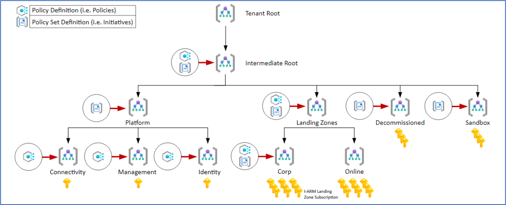

### Constraints

| No | Constraint / Limitation | Description |
| --- | --- | --- |
| 1 | Downtime or Service Disruption Due to Service Outages | i-ARM’s operations are dependent on Microsoft 365 and Azure services. Any outages or disruptions in these services may lead to downtime, impacting the availability of i-ARM functionalities and integrations. |
| 2 | Impact of Network Latency and API Rate Limits | The performance of i-ARM may degrade if there is network latency or if API rate limits are hit during interactions with Microsoft 365 and third-party platforms, leading to slower data synchronization and processing. |
| 3 | Compliance Risks Due to Changes in Regulations | i-ARM is subject to compliance requirements. Changes in regulatory policies or misalignment between internal data governance policies and external standards could lead to compliance issues, affecting the solution’s effectiveness in governance and retention. |
| 4 | Risks from Unauthorized Changes in Production Environment | Unauthorized changes to the production environment could lead to unplanned downtime, data corruption, and security vulnerabilities, undermining the integrity and availability of i-ARM’s services. |
| 5 | Identity Applications rely on Microsoft Entra ID | The system depends on Entra ID for authentication and access control. If the service is unavailable, user access is disrupted. |
| 6 | Web Application relies on API and Identity Applications | The Web Application is dependent on APIs for data and the Identity Application for user authentication. Any failures in these services impact the web experience. |
| 7 | Network performance impacts Web Application | Slow or unstable network connectivity can degrade the user experience, particularly when handling large datasets or making multiple API calls. |
| 8 | On-premises Scanner Services hybrid model | Integrating on-premises scanners with cloud services introduces complexities in secure data transmission and synchronization. |
| 9 | Networking depends on VNet and subnets | The i-ARM solution's internal communication is reliant on Azure Virtual Networks and subnets, making network design and performance crucial for security and communication speed. |
| 10 | Cold start delays in serverless API Applications | Serverless functions (Azure Functions) may experience latency due to cold starts, especially during infrequent API calls. |
| 11 | API Applications performance dependent on database | The API Applications’ performance is tightly coupled with Azure SQL Database performance, making database optimization critical. |
| 12 | Background Applications limited by Azure Function execution time | Azure Functions have time constraints for execution. Long-running processes may need to be broken down into smaller, manageable tasks. |
| 13 | Power BI performance for large datasets | Power BI's report performance can degrade when dealing with very large datasets, which may slow down the generation of insights. |
| 14 | Power BI service limits and licensing | Power BI has service limits related to data refreshes, dataset size, and real-time streaming, which might require higher licensing tiers for extensive reporting. |
| 15 | Azure SQL scaling dependent on budget | The database's ability to scale is limited by the service tier and the available budget, affecting performance for larger datasets and high transaction volumes. |
| 16 | Secure data transmission for Scanner Services | Ensuring secure transmission from on-premises scanners to the cloud requires encryption and secure network configuration to prevent data breaches. |
| 17 | Scalability of on-premises Scanner Services | On-premises scanners may have limited scalability compared to cloud-native services, posing challenges for handling increasing data loads. |

### Dependencies

| Service | Service Description | Impact on Solution |
| --- | --- | --- |
| Infotechtion Azure DevOps | Manages application deployment and updates through automated pipelines. | Delays or failure of application deployments. |
| Microsoft Purview | Enforces data retention, classification, and compliance policies. | Compromises governance and compliance enforcement. |
| SharePoint | Facilitates document storage, management, and collaboration. | Affects data access and governance processes. |
| Power BI | Provides data analytics, visualization, and reporting. | Prevents generation of insights and data visualization. |
| Virgo/Iron Mountain Policy Center | Stores and manages records retention schedules and policies. | Disrupts compliance with data retention policies. |
| On-Premises Data Gateway | Enables secure data transfer between on-premises and cloud environments. | Blocks integration and data transfer from on-premises resources. |
| Serverless Compute and Application Hosting (e.g., Azure Functions, Azure Web App) | Handles serverless compute tasks, APIs, and hosting of web applications. | Prevents execution of APIs, workflows, and web services. |
| Azure Key Vault | Secures sensitive data, such as API keys and certificates | Secure access to sensitive data would be compromised. |
| Azure VNET | Provides secure networking between Azure resources. | Secure communication between resources may be compromised. |
| Power Automate | Automates tasks and workflows across services. | Fails to integrate services and automate processes. |
| Azure SQL | Centralized i-ARM Data Store that provides scalable and secure relational database management. | Affects the solution's ability to store and manage data. |
| Monitoring and Insights (e.g., Application Insights) | Provides performance monitoring, logging, and alerting for the application. | Limits operational visibility and performance management. |
| Entra ID | Manages user authentication and identity access for resources. | Disables access to the solution and related services. |
| Azure Drop Zone | Stores data before it’s moved to long-term secure storage (e.g., WORM). | Prevents the transfer of data to secure, compliant storage. |
| Access to Microsoft 365 Services (e.g., Microsoft Graph) | Facilitates integration with Microsoft 365 services and APIs. | Restricts access to Microsoft Purview and other 365 features. |
| On-Premises Resource Access | Connects on-premises resources to cloud services via a secure gateway. | Disrupts access to on-premises resources and service integration. |
|  |  |  |

### Risks

| Reference | Risk | Mitigation Actions |
| --- | --- | --- |
| Identity Applications | Misconfiguration of application permissions and consent settings leading to unauthorized access. | Implement thorough review and testing of permissions and consent settings before deployment. Regular audits and reviews of permissions.Team: Security and Infotechtion DevOps Team |
| Identity Applications | Application registration credentials (client secrets) leakage or compromise | Use Azure Key Vault to securely store client secrets. Implement strict access controls and regular rotation of secrets.Team: Security and Infotechtion DevOps Team |
| Identity Applications | Users experience degradation due to multi-factor authentication (MFA) enforcement. | Misconfiguration leading to security vulnerabilities (e.g., open ports, weak authentication). Performance issues due to improper scaling configurations or unexpected load. |
| Web Application | Misconfiguration leading to security vulnerabilities (e.g., open ports, weak authentication). Performance issues due to improper scaling configurations or unexpected load. | Implement security best practices, conduct regular security assessments, and use Azure Security Centre recommendationsTeam: Security, Performance, andInfotechtion DevOps Team |
| Web Application | Downtime due to Azure service outages or maintenance activities. | Regularly review Azure Service Health advisories.Team: Operations Team |
| Web Application | Increased costs due to inefficient resource utilization or scaling configurations. | Implement cost monitoring using Azure Cost Management and set up alerts for unusual spending patterns. Optimize resource usage regularly.Team: Infotechtion DevOps Team |
| Web Application | Application vulnerabilities due to outdated libraries or dependencies. | Regularly update application libraries and dependencies. Implement a CI/CD pipeline with automated security scanning tools.Team: Infotechtion DevOps Team |
| Networking | Misconfiguration leading to network security vulnerabilities (e.g., open ports, insecure network security groups).Network performance issues due to improper subnet design or insufficient bandwidth.Compliance issues due to misalignment with regulatory requirements (e.g., data residency, network isolation). | Implement network security best practices, use Azure Firewall and NSGs, and conduct regular security audits.Plan and design the VNET with proper subnetting and bandwidth considerations. Use Azure Network Performance Monitor to monitor and optimize performance.Regularly review and update compliance policies. Use Azure Policy to enforce network compliance standards.Teams; Security, Networking, and Infotechtion DevOps Team Teams |
| API and Background Applications | Misconfiguration leading to security vulnerabilities (e.g., open endpoints, weak authentication).Performance issues due to improper scaling configurations or unexpected load.Downtime due to Azure service outages or maintenance activities. | Implement security best practices, use Entra ID Auth for security and App Insights monitoring, and conduct regular security assessments.Implement auto-scaling and load testing to ensure the functions can handle peak loads. Monitor performance using Azure Monitor and Application Insights.Regularly review and update compliance policies. Use Azure Policy to enforce compliance standards and ensure proper logging and monitoring.Teams; Security, Networking, and Infotechtion DevOps Team Teams |
| Dashboards & Reports / Online Reporting Platform | Misconfiguration or improper sharing leading to unauthorized access to sensitive data.Performance issues due to large datasets or complex calculations.Downtime or service disruption due to Power BI service outages or maintenance. | Implement robust access controls and role-based security. Regularly review sharing settings and access logs. Use Azure AD for authentication and authorization.Optimize data models and use data aggregation techniques. Implement incremental data refresh and monitor performance using Power BI service metrics.Regularly monitor Power BI service health. Have contingency plans in place for critical business operations.Teams; Security, and Infotechtion DevOps Team Teams |
| Database | Misconfiguration leading to security vulnerabilities (e.g., open firewall rules, weak authentication).Performance issues due to improper indexing, query optimization, or insufficient resources.Data loss or corruption due to inadequate backup and recovery processes. | Implement security best practices, use Azure SQL Database security features (e.g., firewall rules, threat detection), and conduct regular security audits.Optimize database schema and queries. Monitor performance using Azure SQL Database Performance Insights and adjust resource allocations as needed.Implement automated backups and regularly test recovery procedures. Use Point-in-Time Restore and Long-term Retention for backups.Teams; Security, and Infotechtion DevOps Team Teams |
| Database | Increased costs due to inefficient use of database resources or over-provisioning.Users experience degradation due to latency or slow query responses.Security vulnerabilities due to outdated or unpatched database components. | Regularly review and update compliance policies. Use Azure Policy and Azure SQL Database Auditing to enforce compliance standards.Optimize database performance through indexing, query optimization, and caching. Use Azure SQL Database Query Performance Insight for monitoring and optimization.Regularly apply updates and patches to the database. Use Azure SQL Database Vulnerability Assessment and Advanced Threat Protection for continuous monitoring.Teams; Security, and Infotechtion DevOps Team Teams |
| Data Gateway | Misconfiguration of the VM or gateway leading to security vulnerabilities (e.g., open ports, weak credentials). Performance issues due to insufficient VM resources or network bandwidth limitations. Downtime due to Azure service outages, maintenance, or VM failures. | Implement security best practices, use Azure Security Centre, and regularly update VM and gateway configurations. Conduct security audits and implement network security groups (NSGs).Right-size the VM based on workload requirements, monitor performance using Azure Monitor, and adjust resources as needed.Implement high availability strategies, such as using Availability Sets or Zones. Regularly review Azure Service Health advisories.Teams: Security, and Infotechtion DevOps |
| Release Management | Misconfiguration or security vulnerabilities in the Azure DevOps environment (e.g., open pipelines, weak permissions). Downtime or service disruption due to Azure DevOps service outages or maintenance. | Implement DevOps security best practices, use Azure DevOps security features (e.g., role-based access control, service connections), and conduct regular security audits.Regularly monitor Azure DevOps Service Health, implement redundancy where possible, and communicate planned maintenance to customers.Teams – Infotechtion DevOps |
| Microsoft Purview Compliance Portal | Misconfiguration leading to incomplete or inaccurate data classification.Downtime or service disruption due to Azure Purview service outages or maintenance. | Implement best practices for data classification and cataloguing. Regularly review and update data classifications. Conduct periodic audits and validations.Regularly monitor Azure Purview Service Health. Have contingency plans in place for critical compliance operations.Teams – Data Governance and Compliance |
| Absence of Lower Environments | The absence of lower environments presents several risks:Early Issue Detection: Issues identified in production are costlier to fix than those found early in lower environments.User Acceptance Testing: Lower environments are essential for validating new features through user acceptance testing, ensuring they meet user needs.Avoiding Downtime: Without lower environments, deploying new features directly to production increases the risk of downtime and service interruptions.Security and Compliance: Lower environments allow for critical security and compliance assessments, ensuring the production environment remains secure and compliant.Performance Expectations: Performance testing in lower environments helps establish baseline expectations and ensures the production environment can handle the expected load. | Establish lower environments (e.g., Development, QA, Staging) to thoroughly test and validate changes before production deployment. |
| Unauthorized Access to APIs | Data breaches, data loss, and potential misuse of sensitive information | Implement strong authentication and authorization mechanisms for all APIs. Regularly audit API access logs and use monitoring tools to detect and respond to unauthorized access attempts.Conduct regular security training for developers and users. |
| Unauthorized Changes to Production Environment (Release Management) | Unplanned downtime, data corruption, and potential security vulnerabilities | Implement strict control processes, including approval workflows and audit trails.Use role-based access control (RBAC) to restrict permissions. Regularly review and update access policies. |
| i-ARM Application Services and Components | Initial setup and configuration may require additional time and resources, any decision delays could impact project timelines. | Develop a comprehensive project plan with detailed timelines for each componentAllocate additional resources if necessary and provide training for team members. Implement a phased rollout if needed.Additionally, having a test or lower environments helps to adopt the fail fast approach.Teams: BoE Architecture |
| i-ARM Application Services and Components | Increased costs due to inefficient use of resources or over-provisioning across different services. | Implement cost monitoring using Azure Cost Management and set up alerts for unusual spending patterns.Optimize resource usage regularlyTeams: Finance and Resource Management Teams. |

# Application Architecture

## Logical Architecture

The diagram below represents the logical component architecture design of the i-ARM and provides the overall view of the components involved to provide i-ARM functionality along with integrations with external systems.

The primary logical components of the system are shown as below

*   **User Interface Layer:**
    *   Provides a unified dashboard for users (i-ARM Personas) to interact with the system.
    *   Offers tools for records management, governance actions, and data insights.
    *   Designed for ease of use to promote user adoption.  
        
*   **Integration and Application Business Layer:**
    *   Contains the core business logic for data and records management.
    *   Facilitates communication between the i-ARM user interface and other system components e.g. APIs or endpoints.
    *   Implements the governance policies for data classification, retention, and access.
    *   Implements automated and triggered workflows e.g. using Power Automate.
    *   Implements secure APIs.
*   **Data Storage Layer:**
    *   Ensures data integrity, security using relational database system.
*   **External Systems:**
    *   Release Management: Manages deployment pipelines for continuous integration and delivery of the i-ARM solution.
    *   Microsoft Purview (Compliance Portal) - Manages governance policies and ensures compliance with data retention and classification standards.

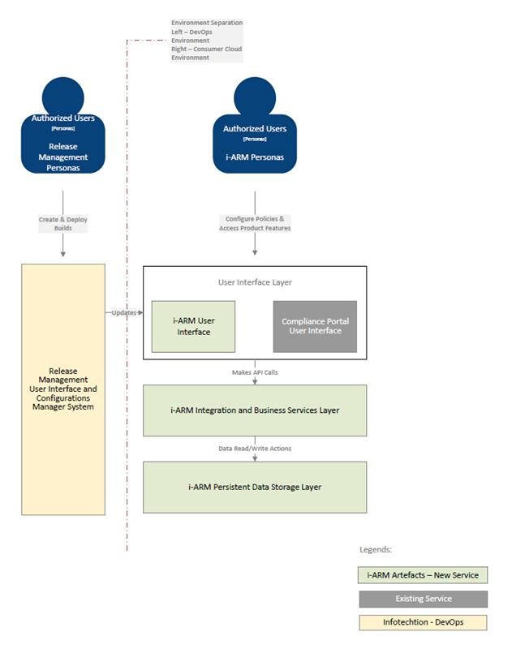

## Application Building Blocks

The i-ARM solution is designed with a modular and integrated architecture to provide data and records management capabilities.

The architecture diagram presented below illustrates the high-level structure of the system, highlighting the core containers and their interactions with external systems. This architecture ensures seamless integration for data governance and reporting functionalities while maintaining flexibility for future enhancements.

Each container is carefully designed to interact with others in a manner that supports efficient data flow, secure management, and comprehensive reporting.

The diagram below serves as a visual guide to understanding how the i-ARM solution orchestrates these interactions, ensuring a cohesive and effective system for managing data and records.

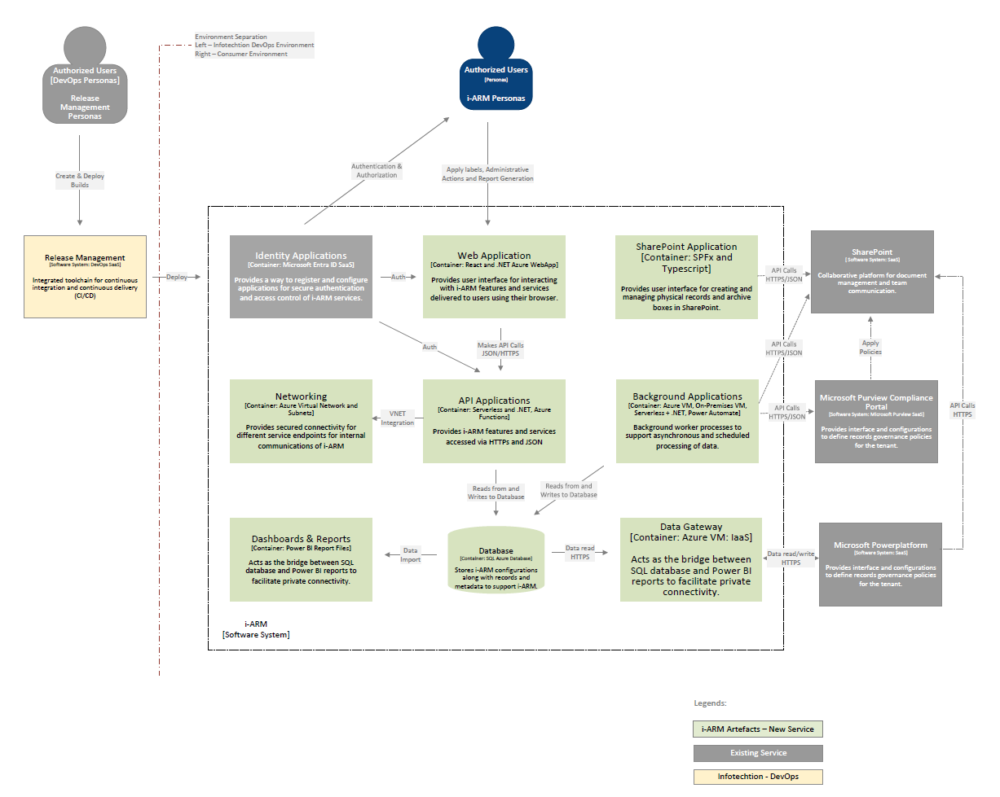

## i-ARM Software System Containers

1.  Identity Applications
    *   Purpose: Manages authentication and access control for i-ARM services.
    *   Technology: Microsoft Entra ID (SaaS).
    *   Responsibilities:
        *   Register and configure applications for secured access.
        *   Perform Authentication.
        *   Access control management.
    *   Interactions:
        *   Users: Authenticates and authorizes users.
        *   Web Application, SharePoint Application, API Applications: Provides authentication services to these containers ensuring secure access.
2.  Web Application
    *   Purpose: Provides a user interface for interacting with i-ARM features and services.
    *   Technology: React and .NET Azure WebApp.
    *   Responsibilities:
        *   i-ARM User interface for record interaction and management.
        *   Delivery of services through a web browser.
    *   Interactions:
        *   Users: Interfaces directly with users for record management interaction.
        *   Identity Applications: Utilizes authentication services to verify user access.
        *   API Applications: Makes API calls to access backend services and data.
3.  Networking
    *   Purpose: Ensures secure connectivity for internal communications within i-ARM.
    *   Technology: Azure Virtual Network and Subnets.
    *   Responsibilities:
        *   Secured communication channels.
        *   Integration of service and private endpoints.
    *   Interactions:
        *   All Containers: Provides secure VNET integration for internal communication between different containers.
4.  API Applications
    *   Purpose: Provides i-ARM features and services accessed via APIs.
    *   Technology: Serverless and .NET, Azure Functions.
    *   Responsibilities:
        *   Expose functionalities through HTTPs and JSON.
        *   Serve as backend for numerous services.
    *   Interactions:
        *   Web Application, SharePoint Application, Background Applications: Provides backend services and data via API calls.
        *   Database: Reads from and writes to the database for data storage and retrieval.
5.  Background Applications
    *   Purpose: Handles background processes and scheduled data processing.
    *   Technology: Azure VM, On-Premises VM, Serverless Functions, .NET, Power Automate.
    *   Responsibilities:
        *   Asynchronous data processing.
        *   Scheduled tasks management.
    *   Interactions:
        *   Database: Performs data processing tasks.
        *   API Applications: Interacts for backend services as needed.
        *   SharePoint Application: Provides backend services and data via Graph API calls
6.  Dashboards & Reports
    *   Purpose: Acts as an interface between SQL database and Power BI reports.
    *   Technology: Power BI Report Files.
    *   Responsibilities:
        *   Data visualization and reporting.
    *   Interactions:
        *   Database: Imports data for analysis and reporting.
        *   Users: Provides visual reports and dashboards for data insights.
        *   Data Gateway: Facilitates data transfer between SQL database and Power BI
7.  Database
    *   Purpose: Central data repository for i-ARM.
    *   Technology: Azure SQL Database.
    *   Responsibilities:
        *   Store i-ARM application data and configuration metadata.
        *   Support for read/write operations.
    *   Interactions:
        *   API Applications, Background Applications, Dashboards & Reports: Read from and write data to the database for various operations.
8.  Data Gateway
    *   Purpose: Facilitates data transfer between SQL databases and Power BI.
    *   Technology: Azure VM, IaaS.
    *   Responsibilities:
        *   Data import/export management.
        *   Secure data bridge.
    *   Interactions:
        *   Dashboards & Reports: Enables data connectivity for reporting and analytics.

**External Systems and Dependencies of i-ARM**

1.  Release Management

    1.  Purpose: Manages the CI/CD pipeline for application deployment.

    2.  Technology: Azure DevOps.

    3.  Interactions:

        1.  DevOps Users: DevOps users create and deploy builds using
            this system.

        2.  Identity Applications: Deploys new builds and manages
            integration for continuous delivery.

2.  Compliance Portal

    1.  Purpose: Manages records governance policies.

    2.  Technology: Microsoft Purview (SaaS).

    3.  Interactions:

        1.  SharePoint Application: Applies compliance policies to
            records.

        2.  Records Archive & Disposal: Ensures compliance with
            long-term storage and disposal policies.

3.  SharePoint

    1.  Purpose: Collaborative platform for document management and team
        communication.

    2.  Technology: SharePoint (SaaS).

    3.  Interactions:

        1.  SharePoint Application: Uses SharePoint for document and
            records management.

        2.  Compliance Portal: Applies policies and manages document
            retention.

4.  Records Migration (for information only at this stage, <u>not</u>
    part of this version of the design)

    1.  Purpose: Content migration solution running within the
        on-premises environment of BoE

    2.  Technology: Software System.

    3.  Interactions:

        1.  SharePoint Application: Facilitates the migration of
            physical records into the system.

        2.  Records Archive & Disposal: Assists in migrating records for
            long-term archiving.

5.  Records Archive & Disposal (for information only at this stage,
    <u>not</u> part of this version of the design)

    1.  Purpose: Long-term data storage and disposal.

    2.  Technology: Software System.

    3.  Interactions:

        1.  Background Applications: Archives records and manages
            disposal processes.

        2.  Compliance Portal: Ensures records are archived and disposed
            of according to compliance policies.

6.  Online Reporting Platform

    1.  Purpose: Data analytics and visualization platform.

    2.  Technology: Software System.

    3.  Interactions:

        1.  Dashboards and Reports: Enables data visualisation and
            analysis.

**Scalability and Resilience of i-ARM Containers**

Table below provides the clear and concise overview of the scalability
and resilience features of each container, along with the rationale for
technology selection.

<table>
<colgroup>
<col style="width: 18%" />
<col style="width: 21%" />
<col style="width: 22%" />
<col style="width: 37%" />
</colgroup>
<thead>
<tr>
<th>i-ARM Container</th>
<th>Scalability</th>
<th>Resilience</th>
<th>Technology Choice</th>
</tr>
</thead>
<tbody>
<tr>
<th>Identity Applications</th>
<td>
Automatically scales to handle more users.
</td>

Supports multi-tenant environments.
</td>
<td>
High availability with SLA guarantees.

Built-in redundancy.
</td>
<td>
Microsoft Entra ID

Reason: Preferred for its seamless integration with other Microsoft
services and enterprise-level identity management capabilities.
</td>
</tr>
<tr>
<th>Web Application</th>
<td>
Scales out automatically using Azure App Service.

Can handle increased traffic with minimal configuration.
</td>
<td>
SLA-backed high availability.

Automatic backups and disaster recovery options.
</td>
<td>
Azure Web App

Reason: Chosen for its simplicity and powerful features for web app
hosting, offering better ease of use and deployment
flexibility.
</td>
</tr>
<tr>
<th>SharePoint Application</th>
<td>
Leverages SharePoint On l’ne's ability to scale with
organizational needs.

Supports large volumes of data and users.
</td>
<td>
Built-in data redundancy and high availability like SharePoint
services.

Be-spoke automated routines for backing up data from SharePoint to
Azure storage accounts.
</td>
<td>
SPFx and TypeScript

Reason: SPFx offers a development framework tailored for SharePoint,
providing deeper integration and customization options.
</td>
</tr>
<tr>
<th>Networking</th>
<td>
VNet scales to accommodate growing services and endpoints.

Flexible configuration to optimize traffic flow.
</td>
<td>
High availability and redundancy within Azure regions.

Supports VPN and ExpressRoute for secure, resilient
connections.
</td>
<td>
Azure Virtual Network

Reason: Offers superior integration with Azure services and enhanced
security features.
</td>
</tr>
<tr>
<th>API Applications</th>
<td>
Automatically scales with demand using Azure Functions.

Handles spikes in traffic efficiently.
</td>
<td>
Built-in fault tolerance and redundancy.

Durable Functions for stateful workflows ensure resilience.
</td>
<td>
Azure Functions

Reason: Chosen for its serverless architecture, reducing overhead and
cost compared to Azure App Services, which are better for full-fledged
applications rather than lightweight, event-driven tasks.
</td>
</tr>
<tr>
<th>Background Applications</th>
<td>
Serverless scaling with Azure Functions.

Scales according to the workload with no pre-provisioning
needed.
</td>
<td>
Durable Functions ensure reliability of long-running
processes.

High availability and disaster recovery options.
</td>
<td>
Azure Functions, Power Automate

Reason: These serverless offerings provides a more flexible and
scalable solution for background tasks.
</td>
</tr>
<tr>
<th>Dashboards &amp; Reports</th>
<td>Can handle large datasets and concurrent report access.</td>
<td>SLA-backed service reliability.</td>
<td>
Power BI Report Files

Reason: Power BI offers advanced analytics and visualization
capabilities that integrate seamlessly with Azure services, providing
more robust features.
</td>
</tr>
<tr>
<th>Database</th>
<td>Azure SQL Database can scale to accommodate larger datasets and
higher query volumes.</td>
<td>
High availability with geo-replication can be configured.

Automated backups and point-in-time restore.
</td>
<td>
Azure SQL Database

Reason: Selected for its fully managed service with strong
integration options and built-in intelligence, offering better overall
performance and manageability.
</td>
</tr>
<tr>
<th>Data Gateway</th>
<td>
Can be configured to scale to manage increasing data loads
between on-premises data sources and cloud services.

Optimized for large data transfers.
</td>
<td>Infrastructure services managed by Azure for reliability.</td>
<td>
Azure VM (IaaS)

Reason: Using Azure VM provides more control and customization for
data transfer processes.
</td>
</tr>
</tbody>
</table>

### Dynamic Design

| N/A |
|-----|

# Data Architecture

This section describes the data aspects of the i-ARM product that
employs a central relational database for its operations and offerings.

The database used is the PaaS offering from Azure i.e. Azure SQL
database that provides numerous advantages e.g. freedom to scale when
required, ability to cope up with increasing load and hassle-free
management and maintenance reducing the overhead of operations and IT
teams.

The table below shows the different architectural criteria considered
before finalizing the SQL Azure database as a backend for i-ARM.

<table>
<colgroup>
<col style="width: 17%" />
<col style="width: 82%" />
</colgroup>
<thead>
<tr>
<th>Criteria</th>
<th>Justification</th>
</tr>
</thead>
<tbody>
<tr>
<th>Reliability</th>
<td>
- Built-in high availability with automatic failover
configurations ensures minimal downtime.

- Active geo-replication configuration possibilities enable creating
readable secondary databases in different regions for disaster
recovery.

- Automatic backups with point-in-time restore ensure data can be
restored from any point within the retention period.
</td>
</tr>
<tr>
<th>Scalability</th>
<td>
- Easily scale the database up or down to accommodate varying
loads without application downtime.

- Read replicas configuration possibilities allow scaling read
workloads without affecting primary database performance.
</td>
</tr>
<tr>
<th>Maintainability</th>
<td>
- Regular maintenance and updates are automatically applied by
the Azure platform, reducing manual effort.

- Integrated tools like Azure Monitor and SQL Analytics provide
insights into performance and health, aiding in proactive
maintenance.

- Intelligent features like automatic tuning and recommendations help
optimize performance automatically.
</td>
</tr>
</tbody>
</table>

### Main Analytical Use Cases

The following table outlines various personas and actors engaging with
the i-ARM database through the i-ARM portal, along with a brief
description of the nature of their interactions.

| Capability | Description |
|----|----|
| i-ARM Authenticated User Personas | Application users interacting with the i-ARM services with their roles e.g. Administrators, archive reviewers etc. |
| i-ARM application process and backend workers | Service to service connectors to perform data read and write actions to the i-ARM tables in the database. |

| Explorer | Build an ML pipeline |
|----|----|
| Constructor | Automating pipelines with A&V tools that connect to the data source |
| Influencer | Consuming data via a gateway (Tableau Server, etc.) |

### Data Access and utilisation 

i-ARM leverages Azure SQL Database as its central data repository. The
table provided above identifies the various actors interacting with the
database, while the data flow diagram illustrates the nature of these
interactions and the movement of data into and out of the database.

Please refer to the logical data model below for a general understanding
of i-’RM's backend, which highlights the primary components of the data
store and their significance.

Additionally, the table provides an overview of how different personas
and services securely access and utilize the Azure SQL Database by
leveraging Azure AD authentication, role-based access control, and
network security features.

<table>
<colgroup>
<col style="width: 19%" />
<col style="width: 21%" />
<col style="width: 29%" />
<col style="width: 29%" />
</colgroup>
<thead>
<tr>
<th>Persona/Service</th>
<th>Access Type</th>
<th>Description of Data Access</th>
<th>Security Measures</th>
</tr>
</thead>
<tbody>
<tr>
<th>i-ARM Web Application</th>
<td>
Read/Write
</td>
<td>
Accesses the database to perform CRUD (Create, Read, Update, Delete)
operations for the application logic.
</td>
<td>
- Azure AD authentication for service principal credentials
 

- SQL Firewall rules to restrict access by IP
 

- Managed identities for authentication 
</td>
</tr>
<tr>
<th>Database Admin</th>
<td>
Read/Write
</td>
<td>
Responsible for database setup, maintenance, and monitoring, with
access to all data and schema modifications.
</td>
<td>
- Azure AD authentication with MFA (on approval)
 

- Role-based access control (RBAC)
 

- Activity logging and auditing 
</td>
</tr>
<tr>
<th>I-ARM Reporting Layer</th>
<td>Read</td>
<td>
Queries the database for reporting and analytics purposes, without
modifying data.
</td>
<td>
- Azure AD authentication with MFA
 

- Read-only database roles
</td>
</tr>
<tr>
<th>i-ARM Backend Services</th>
<td>Read/Write</td>
<td>
Accesses the database to perform CRUD (Create, Read, Update, Delete)
operations for the backend logic.
</td>
<td>
- Managed identities for authentication

- IP firewall rules for allowed services 
- Role-based access control (RBAC)
</td>
</tr>
</tbody>
</table>

### Conceptual Data Mode

<table>
<colgroup>
<col style="width: 12%" />
<col style="width: 32%" />
<col style="width: 9%" />
<col style="width: 9%" />
<col style="width: 10%" />
<col style="width: 9%" />
<col style="width: 8%" />
<col style="width: 8%" />
</colgroup>
<thead>
<tr>
<th><strong>Entity Name</strong> </th>
<th><strong>Definition</strong> </th>
<th><strong>Data Owner</strong> </th>
<th><strong>Data sensitivity</strong> </th>
<th><strong>Records Classification</strong> </th>
<th><strong>Records Retention &amp; Disposal</strong> </th>
<th>
<strong>Mastered </strong> 

<strong>by</strong> 
</th>
<th><strong>Used by</strong> </th>
</tr>
</thead>
<tbody>
<tr>
<th>Source </th>
<td>The entity captures the data about various data sources like Azure
Files, Network Files, M365<del>,</del> <del>AWS, M-Files, Sybase
etc.</del> </td>
<td>i-ARM Admin </td>
<td> </td>
<td> </td>
<td> </td>
<td> </td>
<td> </td>
</tr>
<tr>
<th>Source Instance </th>
<td>The entity captures information about a subset of data from the
specific source. </td>
<td>Primary Owner </td>
<td> </td>
<td> </td>
<td> </td>
<td> </td>
<td> </td>
</tr>
<tr>
<th>Retention Labels </th>
<td>The entity captures all the labels synchronized from M365 Purview to
achieve records management functionality. </td>
<td>Record Manager </td>
<td> </td>
<td> </td>
<td> </td>
<td> </td>
<td> </td>
</tr>
<tr>
<th>Disposal Details </th>
<td>The entity captures details of all the records/files which are ready
for disposition or archival. </td>
<td>Disposition Reviewer, Archival Reviewer </td>
<td> </td>
<td> </td>
<td> </td>
<td> </td>
<td> </td>
</tr>
<tr>
<th>Audit Logs </th>
<td>The entity captures all the audit data from various events that
occur in various i-ARM processes. </td>
<td>i-ARM Admin </td>
<td> </td>
<td> </td>
<td> </td>
<td> </td>
<td> </td>
</tr>
</tbody>
</table>

### Logical Data Model

> The section below shows the generalised data model of i-ARM system
> that primarily makes use of the SQL Azure database for storing its
> configurations and operational data.
>
> The design shows the schema of underlying key tables used by i-ARM and
> their relationship with different tables in the system. The database
> is normalized with third normal form standard to achieve data
> integrity, efficient storage, flexibility as well as the query
> performance for the reporting.
>
> The design shows the schema of underlying key tables used by i-ARM and
> their relationship with different tables in the system. The database
> is normalized with third normal form standard to achieve data
> integrity, efficient storage, flexibility as well as the query
> performance for the reporting.

Data security and compliance:

- Due to the use of Azure SQL database offering as the backend of i-ARM,
  the Data at rest is encrypted using Transparent Data Encryption (TDE).

- Role-based access control (RBAC) ensures that users have access only
  to the data they need.

<table>
<colgroup>
<col style="width: 100%" />
</colgroup>
<thead>
<tr>
<th>
The purpose of this section is to provide information about key
attribute level data that is part of and included in the i-ARM.

i-ARM data model uses indexes to ensure queries are executed in
efficient manner. Following are some of the indexes defined on the
various entities:

<table>
<colgroup>
<col style="width: 30%" />
<col style="width: 27%" />
<col style="width: 41%" />
</colgroup>
<thead>
<tr>
<th><strong>Entity Name</strong></th>
<th><strong>Attribute Name</strong></th>
<th><strong>Index Types</strong></th>
</tr>
</thead>
<tbody>
<tr>
<th>Sources</th>
<td>SourceName</td>
<td>Unique non-clustered index</td>
</tr>
<tr>
<th>SourceInstances</th>
<td>SourceInstanceName</td>
<td>Unique non-clustered index</td>
</tr>
<tr>
<th>SourceInstances</th>
<td>SourceId</td>
<td>Non-unique non-clustered index</td>
</tr>
<tr>
<th>RetentionLabels</th>
<td>RetentionLabelId</td>
<td>Unique non-clustered index</td>
</tr>
<tr>
<th>RetentionLabels</th>
<td>RetentionLabelName</td>
<td>Unique non-clustered index</td>
</tr>
<tr>
<th>DisposalDetails</th>
<td>FileUniqueId</td>
<td>Non-unique non-clustered index</td>
</tr>
<tr>
<th>DisposalDetails</th>
<td>RetentionLabelId</td>
<td>Non-unique non-clustered index</td>
</tr>
<tr>
<th>AuditLogs</th>
<td>ObjectId</td>
<td>Non-unique non-clustered index</td>
</tr>
</tbody>
</table>

Following are the attributes which is sensitive with respect to
person or organization:

<table>
<colgroup>
<col style="width: 19%" />
<col style="width: 20%" />
<col style="width: 39%" />
<col style="width: 20%" />
</colgroup>
<thead>
<tr>
<th><strong>Entity Name</strong></th>
<th><strong>Attribute Name</strong></th>
<th><strong>Definition</strong></th>
<th><strong>Data sensitivity</strong></th>
</tr>
</thead>
<tbody>
<tr>
<th>DisposalDetails</th>
<td>FileName</td>
<td>Name of the File</td>
<td>Internal</td>
</tr>
<tr>
<th>DisposalDetails</th>
<td>DispositionReviewer</td>
<td>Disposition Reviewer</td>
<td>Internal</td>
</tr>
<tr>
<th>DisposalDetails</th>
<td>ArchiveReviewer</td>
<td>Archive Reviewer</td>
<td>Internal</td>
</tr>
<tr>
<th>DisposalDetails</th>
<td>SiteTitle</td>
<td>Title of the Site</td>
<td>Internal</td>
</tr>
<tr>
<th>RentetionLabels</th>
<td>RetentionLabelName</td>
<td>Name of the Retention Label applied to File</td>
<td>Internal</td>
</tr>
</tbody>
</table></th>
</tr>
</thead>
<tbody>
</tbody>
</table>

### Data Flow Diagram

The logical data flow diagram shows how data moves through the i-ARM
system.

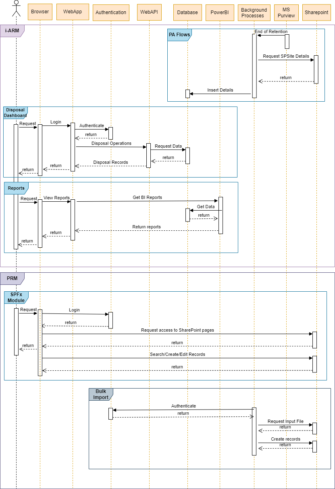

The section below explains the general flow of the data within i-ARM

1.  User requests for login

    - Action: The user opens the i-ARM portal in their browser and
      inputs their login credentials issued by Microsoft 365 Tenant.

    - System Response: The credentials are sent to the WebApp, which
      forwards them to the Authentication service for verification.

2.  User Successfully Authenticates and Logs into i-ARM Portal

    - Action: The Authentication service (Azure AD) verifies the u’er's
      credentials.

    - System Response: If the credentials are valid, the user is granted
      access to the i-ARM portal, and the WebApp redirects the user to
      the home page.

3.  Disposal Dashboard Page Requests Web API to Get Disposable Items

    - Action: The user navigates to the Disposal Dashboard page within
      the i-ARM portal.

    - System Response: The WebApp sends a request to the Web API to
      retrieve a list of disposable items from the Database.

4.  Disposable Items are Visible in Grid View

    - Action: The Web API retrieves the list of disposable items from
      the Database.

    - System Response: The Web API returns the data to the WebApp, which
      displays the items in a grid view on the Disposal Dashboard page.

5.  User Performs Various Disposal Operations on Listed Items

    - Action: The user interacts with the grid to perform various
      disposal operations. The available operations include:

    - Dispose Items: The user selects one or more items and marks them
      for disposal.

      - Extend Retention Period: The user selects items and changes
        their retention period to a later date.

      - Re-Label/Change Retention Label: The user changes the retention
        label of selected items.

      - Archive Items: The user archives selected items for long-term
        storage.

    - System Response: Each operation sends a request to the Web API,
      which interacts with the Database to update the status of the
      items based on the u’er's actions.

6.  User Requests Reports

    - Action: The user selects the Reports option in the i-ARM portal
      and specifies the type of report they need.

    - System Response: The WebApp sends a request to Power BI to
      generate the required report. Power BI retrieves the necessary
      data from the Database and processes it to generate the report,
      which is then returned to the WebApp and displayed to the user.

7.  PA Flow: The section below describes the Power Automate Flows
    deployed as a part of the i-ARM system deployment within BoE Power
    Automate Environment.

    - Disposal Actions Flow: This flow gets triggered daily, it picks
      items disposed or relabelled from i-ARM portal. Fetched item(s)
      details are sent to MS Purview for disposition/ re-labelling and
      Database is updated with proper status to keep track.

    - Business Reviewers Disposition: This is triggered when an item
      reaches the end of its retention period. It retrieves to be
      disposed item details by making request to respective SharePoint
      site. Retrieved data or items details are inserted into database.
      Once it is inserted in database its available for disposition from
      i-ARM portal.

    - Business and Archive Reviewers: Flow is same as Business Reviewers
      Disposition, with the only difference being that an item requires
      an Archive Reviewer User for disposing an item.

    - Compliance Sync: This is Power Automate flow which will
      synchronise Retention Labels from MS Purview and insert details of
      retention label into database.

8.  Physical Records Management:

- **SPFx Module:** This module is a SharePoint solution which handles
  creation and management of Physical Records.

  - User requests login.

    - Action: User opens the browser and inputs their login credentials
      issued by Microsoft 365 Tenant.

    - System Response: The credentials are authenticated by M365’s
      authentication mechanism and the user are logged in.

  - Login request to SharePoint authentication mechanism.

    - Action: User credentials are passed on to M365 Tenant’s own
      authentication mechanism.

    - System Response: User is authenticated from Microsoft’s end.

  - After successful login user will request access to SharePoint

    - Action: After successful log in users will need to request for
      SharePoint site/pages where our solution is deployed if they do
      not have the access already.

    - System Response: Users will then be able to view all the search
      pages and pages where custom forms are implemented.

  - User interacts with SharePoint via custom search pages and forms
    which are designed.

    - Action: User may try to perform any of operations which are
      search, create, edit, view physical records using our solution.

    - System Response: Solution will respond accordingly based on the
      operations performed.

      - Search operation will return search results.

      - Create operation will return display form with created entry.

      - Edit operation will return display form with edited entries.

      - View operation will return display form with relevant details.

- **Bulk Import:** This module is a background process which creates
  physical records based on the records added in csv format.

  - Timer trigger function runs after every interval to pick input file
    for processing.

    - Action: Request to authenticate using AAD certificate.

    - System Response: On successful response, access token is returned
      to the background process.

  - Requests for input file to process.

    - Action: After getting access token, process checks SharePoint list
      for input file.

    - Response: Returns files whose status is “New.”

  - Start processing the input file.

    - Action: Once the input file is received, system starts processing
      the data and creates records in SharePoint list.

    - Response: Returns the response message of success/fail while
      creating records.

  <!-- -->

  - The i-ARM solution leverages capabilities of the PnP framework i.e.
    specifically the PnP search web part to provide search functionality
    within the physical records management feature.

### Data Quality

> N/A

### Metadata 

> N/A

# Infrastructure Architecture

This section highlights i-ARM product’s PaaS services, the only IaaS
component is the on-premises data gateway VM.

<table>
<colgroup>
<col style="width: 8%" />
<col style="width: 24%" />
<col style="width: 23%" />
<col style="width: 44%" />
</colgroup>
<thead>
<tr>
<th><strong>Status</strong></th>
<th><strong>Name</strong></th>
<th><strong>Functional Description</strong></th>
<th><strong>Design Comment</strong></th>
</tr>
</thead>
<tbody>
<tr>
<th>New</th>
<td>Azure Functions</td>
<td>PaaS Services</td>
<td><ul>
<li>
Built using .NET and integrated with Microsoft Graph
APIs.
</li>
<li>
Used for serverless computing to handle on-demand data processing
and event-driven workflows.
</li>
</ul></td>
</tr>
<tr>
<th>New</th>
<td>Azure Web App</td>
<td>PaaS Services</td>
<td><ul>
<li>
Developed using React and SPA architecture.
</li>
<li>
Hosts the web application, providing scalable and managed web
services for the product.
</li>
</ul></td>
</tr>
<tr>
<th>New</th>
<td>Azure App Service Plan</td>
<td>PaaS Services</td>
<td><ul>
<li>
Manages the pricing and scaling options for web applications and
APIs.
</li>
<li>
Offers different pricing tiers to meet performance and scaling
requirements.
</li>
</ul></td>
</tr>
<tr>
<th>New</th>
<td>Azure Key Vault</td>
<td>PaaS Services</td>
<td><ul>
<li>
Securely stores sensitive data such as API keys, secrets, and
certificates.
</li>
<li>
Ensures secure access to sensitive information for applications
and services.
</li>
</ul></td>
</tr>
<tr>
<th>New</th>
<td>Power Automate Flows</td>
<td>PaaS Services</td>
<td><ul>
<li>
Within the Power Platform environment, used to automate
repetitive tasks and workflows.
</li>
<li>
Facilitates integration with other services and products to
streamline business processes
</li>
</ul></td>
</tr>
<tr>
<th>New</th>
<td>Azure SQL Database</td>
<td>PaaS Services</td>
<td><ul>
<li>
Serves as the central data store for the product.
</li>
<li>
Provides scalable, managed relational database services.
</li>
</ul></td>
</tr>
<tr>
<th>New</th>
<td>Azure Virtual Network</td>
<td>PaaS Services</td>
<td><ul>
<li>
Provides a secure networking environment to connect Azure
resources.
</li>
<li>
Allows for the creation of subnets, network security groups, and
VPN connections for secure communication.
</li>
</ul></td>
</tr>
<tr>
<th>New</th>
<td>On-premises data gateway VM</td>
<td>IaaS Services</td>
<td><ul>
<li>
Acts as a bridge between on-premises data sources and cloud
services.
</li>
<li>
Facilitates secure data transfer between on-premises resources
and azure services.
</li>
</ul></td>
</tr>
</tbody>
</table>

### Logical Infrastructure Diagram

The diagram below is a representation of the infrastructure building
blocks that the i-ARM solution is built upon. (See next page).
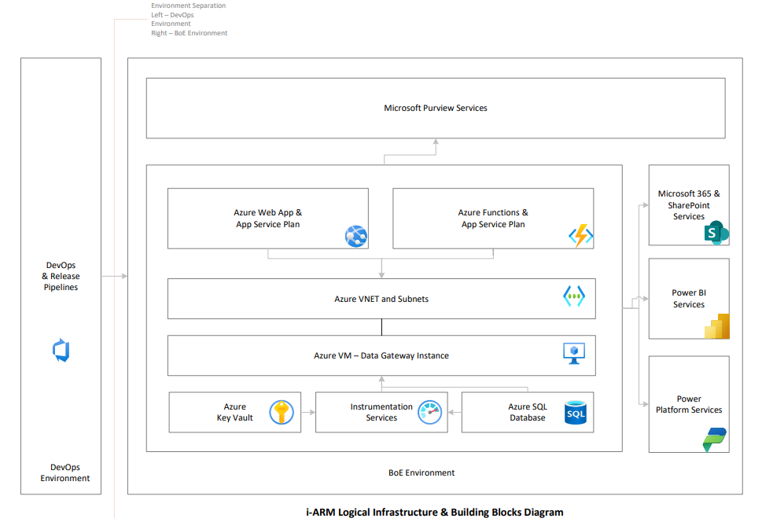
The information flow can be referred in the section above, the
interactions between different infrastructure components remain secured
and controlled using the central identity store on the BoE environment
i.e. Microsoft Entra ID.

### Infrastructure Building Blocks

Refer to the section Infrastructure Architecture for details.

| **Status** | **Name** | **Functional Description** | **Design Comment** |
|----|----|----|----|
| New | Linux Server | Server | Hosting the application web services |
| New (for all) |  |  |  |

# Interfaces

The purpose of this section is to describe the application interfaces
that supports the integration with i-ARM services.

| **ID** | **Category (New, Modified, Unchanged)** | **Service Provider** | **Service Consumer** | **Protocol** | **Authentication Method** | **Latency** | **Comment** |
|----|----|----|----|----|----|----|----|
| 1 | New | Infotechtion through i-ARM hosted on Azure Web App | i-ARM Web Application and Authorized Users | HTTPS | OAUTH 2.0 | Low | Primary interface for accessing i-ARM services. |
| 2 | Existing | Microsoft 365 – SharePoint | Tenant Authorized Users | HTTPS | OAUTH 2.0 | Low | Access M365 SharePoint Services |
| 3 | Existing | Microsoft 3–5 - Purview | Tenant Authorized Users | HTTPS | OAUTH 2.0 | Low | Access M365 and Purview Services |
| 4 | Existing | Microsoft 365 – Power Platform | Tenant Authorized Users | HTTPS | OAUTH 2.0 | Low | Access Power Platform Services |
| 5 | Existing | Microsoft 365 – Power BI | Tenant Authorized Users | HTTPS | OAUTH 2.0 | Low | Access Power BI Services |

# Security by Design

<table>
<colgroup>
<col style="width: 30%" />
<col style="width: 69%" />
</colgroup>
<thead>
<tr>
<th><strong>Information Classification</strong></th>
<th>
The classification of the information processed by the solution
against the Bank’s ISS

Official-AmberNo–e - The data being managed by this add-in may be up
to Official Red, however the data is held within the underlying
SharePoint online solution which has its own SCA. On discussion with
Cyber Security Architecture we have agreed that enhanced Security
control set is sufficient for this application. I have therefore lowered
the confidentiality to Official-Amber.
</th>
</tr>
</thead>
<tbody>
<tr>
<th><strong>Information Security BIA</strong></th>
<td>
Tier 2 Service – Enhanced security

<a
href="http://intranet/Banknav/IML.asp?svr=BOE-DMS&amp;db=Services&amp;id=16176649&amp;v=0">SCA
document link -Services_16176649</a>
</td>
</tr>
</tbody>
</table>

### Security Implications

N/A

### Access Management

| Role | Access Tier | Description |
|----|----|----|
| i-ARM specific application roles and tenancy permissions. | NA | These are specific roles to the i-ARM application and managed from within the source code. The access is governed using the central identity store of BoE Microsoft Tenancy i.e. using Microsoft Entra ID and i-ARM is integrated to use it using Azure Role Based Access Control by following the principle of least privileges. |

### Supply Chain Management

\[Consider the security implications and control requirements for
managing risk of suppliers with weak cyber controls\]

<table>
<colgroup>
<col style="width: 33%" />
<col style="width: 34%" />
<col style="width: 32%" />
</colgroup>
<thead>
<tr>
<th><strong>Supplier Attack Vector</strong></th>
<th><strong>Security Implications</strong></th>
<th><strong>Design to mitigate Security Implications</strong></th>
</tr>
</thead>
<tbody>
<tr>
<th>
Malicious code/patch update from supplier

Unauthorised access to approved remote access to Bank network from
supplier.

Unauthorised access to Bank data when providing support or
consultancy to the Bank.
</th>
<td>[describe the security implications as they relate to the attack
vector and location of development/support. Agreed with Security
Design&gt;</td>
<td>[include the options to mitigate supplier attack vectors such as
additional Bank owned controls, needed supplier assurance requirements
(e.g., ISO 27001, SOC 2 Type II, and Cyber Essentials Plus) etc.]</td>
</tr>
</tbody>
</table>

# Service by Design

\[This section describes the business or technical service delivered by
the solution\]

<table>
<colgroup>
<col style="width: 24%" />
<col style="width: 75%" />
</colgroup>
<thead>
<tr>
<th><strong>Service Ownership</strong></th>
<th>
[Clear definition of the service owners – business owner,
technical owner, service owner]

Technical Owner: i-arm product engineering

Service Owner: i-arm product engineering

Business Owner: i-arm product engineering
</th>
</tr>
</thead>
<tbody>
<tr>
<th><strong>Service Criticality</strong></th>
<td>
The features of i-ARM are classified as ‘non-business critical.’
The rationale for the classification is as follows:

<ul>
<li>
The failure of i-ARM features does not impact a user’s ability to
work with information, records are accessed via M365 user interface.

<ul>
<li>
The solution does not prevent a user from uploading / downloading
or collaborating with the information in M365.
</li>
</ul></li>
<li>
The failure mode still allows the underlying information files
(digital records) and metadata (physical records) to still be accessible
to authorised personnel.
</li>
<li>
On occasion of discontinuing the Infotechtion services, the
underlying information, files, and all audit data stays with the
customer.
</li>
<li>
All workflows and M365 purview Graph API orchestrations are
configured to retry after failure, audit the failure diagnostics for
remediation and restart from the point of failure.
</li>
<li>
Information metadata, retention details and eligibility for
disposal details are mastered in Microsoft Purview. Therefore, in
critical / disaster failure situation the entire data model can be
rebuilt from the master data in M365 and Purview.
</li>
<li>
The only data loss can be the business decisions related
information eligible of disposal. These are mitigated through a backup
management of Infotechtion database managed in customer Azure
subscription.
</li>
</ul></td>
</tr>
</tbody>
</table>

### Service Implications

\[Consider the service implications for any new or modified building
blocks used in the solution\]

| **Status** | **Name** | **Service Implications** | **Design Comment** |
|----|----|----|----|
| Modified | Azure consumption monitoring | Additional service monitoring required to ensure any platform level issues are addressed by the bank’s cloud support team. | The activities will be included in the service introduction documentation. Failover modes will be included in responsibility matrix. |
| New | i-ARM feature release support | Azure administrator is required to approve the release of new features. | A process will be documented to approve and authenticate the cloud release of new features. |

### Business Change Implications

\[Consider the business change implications for any new or modified
building blocks used in the solution\]

| **Status** | **Name** | **B Implications** | **Design Comment** |
|----|----|----|----|
| Modified | Records access control | The access to records is currently managed at a file object level, this will change in the target architecture to align with recommended practices. The change will require education to manage permissions at a container (site / library) level in the target architecture. | Data access governance design will follow the [Sharing & permissions in the SharePoint modern experien–e - SharePoint in Microsoft 365 \| Microsoft Learn](https://learn.microsoft.com/en-us/sharepoint/modern-experience-sharing-permissions) |
| New | Disposal reviews | i-ARM feature ‘My disposal dashboard’ will require new skills for existing records management team to operationally manage the disposal activities related to physical and digital records. | Existing disposal process will be configured in the target architecture. |

### Service Levels

The following table is for request service levels.

| Category | Priority | Response target | Resolution target | Applicable hours\* |
|----|----|----|----|----|
| Standard | Medium | 4 hours | 3 days | Mon-Fri 8:00 am till 5:00 pm excluding public holidays local to customer’s regional time zones |
| Standard | Low | 4 hours | 5 days | Mon-Fri 8:00 am till 5:00 pm excluding public holidays local to customer’s regional time zones |
| Non-Standard | Medium | 4 hours | 7 days\*\* | Mon-Fri 8:00 am till 5:00 pm excluding public holidays local to customer’s regional time zones |
| Non-Standard | Low | 8 hours | As per roadmap timeline, earliest the following quarter. | Mon-Fri 8:00 am till 5:00 pm excluding public holidays local to customer’s regional time zones |

\* Custom hours as per customer requirements to be agreed with
additional costs. These are outlined in the pricing section.

\*\* Subject to the complexity of service request, these could require
additional days. In such cases, the overall delivery can be split in
sprints of 7 days.

### Service Monitoring

<table>
<colgroup>
<col style="width: 25%" />
<col style="width: 74%" />
</colgroup>
<thead>
<tr>
<th>Monitoring Consideration</th>
<th>Design Comment</th>
</tr>
</thead>
<tbody>
<tr>
<th>Operational</th>
<td>
Infotechtion solution primarily leverages a variety of Azure
Platform-as-a-Service (PaaS) offerings, and to ensure operational
excellence the native monitoring tools and services utilized
include:

- Azure Monitor: Azure Monitor is a comprehensive solution for
collecting, analysing, and acting on telemetry from our Azure resources.
It provides:

- Metrics and Logs: Aggregates metrics and logs from Azure services,
enabling us to gain insights into the performance and health of
applications.

- Application Insights: Integrated with Azure Monitor, Application
Insights provides deep diagnostics and performance monitoring for
applications, including dependency tracking, request rates, response
times, and failure rates.

- Dashboards: Customizable dashboards for real-time monitoring and
visualization of key performance indicators (KPIs) and metrics across
azure services.

Additionally, the operations teams would check for inbuilt metrics
and service telemetry dashboards of Azure services that offer:

- Service Health Monitoring: Continuous monitoring of the health and
availability of Azure services we utilize, with real-time updates and
historical data.

- Performance Metrics: Detailed performance metrics such as CPU
usage, memory consumption, disk I/O, and network traffic, which help in
capacity planning and optimization.

- Diagnostic Logs: Access to diagnostic logs that provide granular
insights into service operations, aiding in troubleshooting and root
cause analysis.

For SharePoint servic–s - Administrators still have access to
detailed usage reports, site analytics, and service health information
through the Microsoft 365 admin centre. These tools help ensure that
SharePoint Online operates smoothly and that any issues are promptly
addressed by Micros’ft's support and engineering teams.
</td>
</tr>
<tr>
<th>Performance</th>
<td>
[Describe the performance monitoring of the solution and how
performance will be assessed and maintained from an on-going service
perspective]

Infotechtion solution has built-in logging to monitor the response
times of critical services, including throughput of the Azure SQL
Database, Web App, and functional services.

The performance indicators are used to compare against the product
benchmark for determining Additionally, i-Arm leverages instrumentation
services built into the architecture to monitor application health,
performance, and metrics, and leverage tools like Azure Monitor and
Application Insights to collect telemetry data and gain insights into
application behavior.

Finally, an annual performance testing is conducted to compare
feature performance against the benchmark.
</td>
</tr>
<tr>
<th>Capacity</th>
<td>
[Describe the capacity monitoring of the solution and how
capacity will be assessed and maintained from an on-going service
perspective]

The capacity monitoring will be categorized into:

M365 Capacity: The capacity monitoring shall be achieved through
capacity monitoring tools available in M365 especially SharePoint online
for monitoring storage capacity metrics to stay within Microsoft’s
limits and boundaries.

<ul>
<li>
Azure Capacity: i-ARM will be hosted in Bank’s Azure
subscription. The main component to monitor for capacity is the Azure
SQL database. This will be achieved as per the Microsoft recommendations
based on <a
href="https://learn.microsoft.com/en-us/azure/azure-sql/database/query-performance-insight-use?view=azuresql">Query
Performance Insig–t - Azure SQL Database | Microsoft Learn</a>
</li>
</ul></td>
</tr>
</tbody>
</table>

### Testability

\[Describe at a high level (in a few lines) the approach suggested for
testing considering operability, observability, controllability
decomposability, simplicity, stability and understand ability. This
section should also include suggested types of testing by the
architecture such as function testing, non-functional testing
(resilience, performance, load, security, volume, recovery etc.)\]

modular nature allows for flexibility and agility, enabling rapid
development and deployment.

- Operability:

  - The architecture primarily leverages Az’re's PaaS services, which
    offer high operability due to their managed nature.

  - DevOps & Release Pipelines ensure smooth CI/CD, providing automated
    deployment and version control.

  - The Azure VM Data Gateway allows secure data transfer between Power
    BI and firewall protected services e.g. SQL Azure database,
    enhancing operational flexibility.

- Observability:

  - Instrumentation Services are built into the architecture to monitor
    application health, performance, and metrics.

  - Azure Monitor and Application Insights can be used to collect
    telemetry data from Azure Web App, Function Apps, providing insights
    into application behaviour.

  - Logs and metrics are easily accessible, enabling quick detection and
    diagnosis of issues.

- Controllability:

  - The architecture implements Azure Key Vault and Managed Identities
    for secure authentication and authorization control.

  - The use of Azure Policy and Role-Based Access Control (RBAC) ensures
    fine-grained control over resource access.

  - Azure VNET provides network isolation and security controls at the
    network level.

- Decomposability:

  - The architecture is modular, with distinct services such as Azure
    Functions and Web App, each handling specific workloads.

  - A few services operate independently, enabling isolated development,
    testing, and deployment.

  - Services can be updated or replaced independently without affecting
    the entire system.

- Simplicity:

  - Azure PaaS services abstract much of the underlying infrastructure
    complexity, simplifying the architecture.

  - The logical separation of services (Functions, Web App) makes it
    easy to understand and manage the application.

  - Using managed services like Azure SQL Database and Azure Key Vault
    reduces the need for custom configurations.

- Stability:

  - Az’re's managed services ensure high availability and redundancy
    configuration options, contributing to the stability of the
    architecture.

  - The modular design allows for graceful degradation if a particular
    service experiences issues, minimizing impact on the overall system.

  - Automated pipelines ensure consistent, tested deployments, reducing
    the risk of configuration drift.

- Understandability:

  - The architecture is well-documented and logically laid out, making
    it easy for teams to understand the flow of data and dependencies.

  - Standardized components like Azure Functions, and Web App are
    familiar to most teams, reducing the learning curve.

Additionally, the section below addresses the aspects of function
testing and non-functional testing (resilience, performance, load,
security, volume, recovery, etc.) of the i-ARM. Note that since i-ARM is
a product offering, the functional and non-functional tests specified
below has been performed in the Infotechtion’s internal environment.

- Function Testing:

  - Unit Testing: Each component, such as Azure Functions and Web App,
    have been unit tested to validate their individual functionalities.

  - Integration Testing: i-ARM team has validated interactions between
    components like the Web ’pp's interaction with the Azure SQL
    Database orchestration with Functions.

  - End-to-End Testing: Ensured the entire workflow from data input to
    final output works as expected, including interactions with external
    services like Power BI and Microsoft 365.

- Non-Functional Testing:

  - Resilience Testing:

    - i-ARM team has simulated failures in individual components like
      Azure Functions to ensure the system can handle faults gracefully.

  - Performance Testing:

    - The product team has done the benchmarking the response times of
      critical services like the Web App and Functions to ensure they
      meet performance requirements.

    - Testing the latency and throughput of Azure SQL Database to
      guarantee fast data access has been validated.

  - Load Testing:

    - Stress testing the Web App and Functions under high loads to
      assess their scalability has been performed.

  - Security Testing:

    - Penetration testing the entire architecture to identify potential
      vulnerabilities has been completed by a third-party service
      provider.

  - Volume Testing:

    - Testing the sys’em's capability to handle large volumes of data,
      especially focusing on Azure SQL Database has been completed.

    - Simulating high traffic scenarios to verify the Web ’pp's ability
      to handle large user volumes has been completed.

  - Recovery Testing:

    - Testing backup and restore processes for Azure SQL Database to
      ensure data recovery in case of failure has been verified.

### Solution Environments

<table>
<colgroup>
<col style="width: 25%" />
<col style="width: 74%" />
</colgroup>
<thead>
<tr>
<th>Environment</th>
<th>Design Consideration</th>
</tr>
</thead>
<tbody>
<tr>
<th>Production / Live</th>
<td>
A dedicated Azure subscription within the BoE Azure Tenancy has
been designated as a production environment. The lack of lower
environments poses a risk that should be documented. However, it is
advisable to establish lower operating environments because of following
reasons:

- to enable early issue detection, as fixing issues can be more
costly in prod than lower environments. 
- to facilitate user acceptance testing for new features over the long
term. 
- to avoid any downtimes and service interruptions while deploying new
features. 
- to conduct any security and compliance assessments relating to the
industry or organization. 
- to derive any baseline performance expectations by generating load
equivalent to the prod environment.
</td>
</tr>
</tbody>
</table>

# Architecture Summary

### Decisions

<table>
<colgroup>
<col style="width: 8%" />
<col style="width: 9%" />
<col style="width: 20%" />
<col style="width: 18%" />
<col style="width: 22%" />
<col style="width: 20%" />
</colgroup>
<thead>
<tr>
<th><strong>ID (Container)</strong></th>
<th><strong>Classification</strong></th>
<th><strong>Decision</strong></th>
<th><strong>Rational</strong></th>
<th><strong>Implications</strong></th>
<th>
<strong>Technical Debt ​</strong>

(if the decision classification is tactical)
</th>
</tr>
</thead>
<tbody>
<tr>
<th>
D01

Identity Applications

Azure Entra is existing service, but the applications are
new.
</th>
<td>Strategic</td>
<td>Use Microsoft Entra ID for its robust security and integration
capabilities.</td>
<td>Preferred for its seamless integration with other Microsoft services
and enterprise-level identity management capabilities. It also has
comprehensive identity and access management solution that provides
robust security, single sign-on (SSO), and multi-factor authentication
(MFA).</td>
<td><ul>
<li>
Centralizes identity management, enhances security, and
simplifies user access to applications and services.
</li>
<li>
Implication attributes are not applicable for existing
resources.
</li>
</ul></td>
<td>Low - Requires ongoing management of identities, policies, and
security configurations, but greatly reduces security risks</td>
</tr>
<tr>
<th>
D02

Web Application

-New
</th>
<td>Strategic</td>
<td>Leverage Azure App Service for auto scaling and optimum
performance</td>
<td>Chosen for its simplicity and powerful features for web app hosting,
offering better ease of use and deployment flexibility. It is a fully
managed platform for building, deploying, and scaling web apps. Supports
multiple programming languages and frameworks.</td>
<td><ul>
<li>
Simplifies web application deployment and management, offers
built-in scaling, high availability, and security features.
</li>
<li>
Design, Planning and Deployment: Infotechtion, i-ARM.
</li>
<li>
Management: Operation and i-ARM Release Management Teams
</li>
<li>
Cost: Operational cost for each environment, Pay as you
go
</li>
<li>
Complexity: Operation Teams
</li>
</ul></td>
<td><ul>
<li>
Low - Managed service reduces operational overhead but requires
monitoring and periodic updates to application code.
</li>
<li>
Configuration/Code maintenance: Regular updates and audits for
operations and i-ARM release management teams.
</li>
<li>
Documentation: i-ARM product features documentation.
</li>
</ul></td>
</tr>
<tr>
<th>SharePoint is existing service, but application is new</th>
<td>Strategic</td>
<td>Implement SPFx for seamless SharePoint integration and enhanced
security.</td>
<td>SPFx offers a development framework tailored for SharePoint,
providing deeper integration and customization options.</td>
<td><ul>
<li>
Provides a flexible, client-side development environment that
supports modern web technologies, enabling rich user
experiences.
</li>
<li>
Design, Planning and Deployment: Infotechtion, i-ARM
</li>
<li>
Management: Operation and i-ARM Release Management Teams
</li>
<li>
Cost: N/A
</li>
<li>
Complexity: Operation Teams
</li>
</ul></td>
<td><ul>
<li>
Low - Requires ongoing updates and maintenance of custom code, as
well as adherence to modern development practices.
</li>
<li>
Configuration/Code maintenance: Regular updates and audits for
operations and i-ARM release management teams.
</li>
<li>
Documentation: i-ARM product features documentation.
</li>
</ul></td>
</tr>
<tr>
<th>
Networking

-New
</th>
<td>Strategic</td>
<td>Use Azure Virtual Network for secure, scalable networking.</td>
<td>Offers superior integration with native Azure services and enhanced
security features. Provides a secure, isolated network environment to
run virtual machines, applications, and PaaS services</td>
<td><ul>
<li>
Enables secure and private communication between Azure resources,
supports hybrid cloud scenarios as well in future, and offers robust
networking features like subnets, VPN, NSGs, and route tables.
</li>
<li>
Design, Planning and Deployment: Infotechtion, i-ARM
</li>
<li>
Management: Operation and i-ARM Release Management Teams
</li>
<li>
Cost: Operational cost for each environment, Pay as you
go
</li>
<li>
Complexity: Operation Teams
</li>
</ul></td>
<td><ul>
<li>
Low - Requires proper design, ongoing management, and monitoring
to ensure optimal performance and security, i-ARM build will ensure
deployment of correct VNET ranges required.
</li>
<li>
Configuration/Code maintenance: Regular updates and audits for
operations and i-ARM release management teams.
</li>
<li>
Documentation: i-ARM product features documentation.
</li>
</ul></td>
</tr>
<tr>
<th>
API Applications

-New
</th>
<td>Strategic</td>
<td>Deploy Azure Functions for scalable, serverless API management.</td>
<td>Chosen for its serverless architecture, reducing overhead and cost
compared to Azure App Services, which are better for full-fledged
applications rather than lightweight, event-driven tasks.</td>
<td><ul>
<li>
Provides automatic scaling, high availability, and cost-effective
execution for API workloads. Integrates seamlessly with other Azure
services and supports multiple programming languages.
</li>
<li>
Design, Planning and Deployment: Infotechtion, i-ARM
</li>
<li>
Management: Operation and i-ARM Release Management Teams
</li>
<li>
Cost: Operational cost for each environment, Pay as you
go
</li>
<li>
Complexity: Operation Teams
</li>
</ul></td>
<td><ul>
<li>
Low - Infrastructure management is minimized but requires ongoing
monitoring and maintenance of function code and configurations.
</li>
<li>
Configuration/Code maintenance: Regular updates and audits for
operations and i-ARM release management teams.
</li>
<li>
Documentation: i-ARM product features documentation.
</li>
</ul></td>
</tr>
<tr>
<th>
Background Applications

-New
</th>
<td>Strategic</td>
<td>Utilise Azure Functions, Power Automate for resilient background
processing.</td>
<td>
These serverless offerings provides a more flexible and scalable
solution for background tasks.

Service for automating workflows across applications and services
with a no-code/low-code approach.
</td>
<td><ul>
<li>
Easy to deploy and manage within existing Azure App Service
environments, ideal for continuous or triggered background tasks.
Facilitates rapid automation of repetitive tasks, integrates well with
Microsoft 365 and other services.
</li>
<li>
Design, Planning and Deployment: Infotechtion, i-ARM
</li>
<li>
Management: Operation and i-ARM Release Management Teams
</li>
<li>
Cost: Operational cost for each environment, Pay as you
go
</li>
<li>
Complexity: Operation Teams
</li>
</ul></td>
<td><ul>
<li>
Low - Requires Azure App Service plan for hosting which is
anyways a deployable artefact of i-ARM, and ongoing monitoring and
maintenance of jobs.
</li>
<li>
Configuration/Code maintenance: Regular updates and audits for
operations and i-ARM release management teams.
</li>
<li>
Documentation: i-ARM product features documentation.
</li>
</ul></td>
</tr>
<tr>
<th>
Database

-New
</th>
<td>Strategic</td>
<td>Implement Azure SQL Database for managed, scalable, and secure data
storage.</td>
<td>Selected for its fully managed service with strong integration
options and built-in intelligence, offering better overall performance
and manageability.</td>
<td><ul>
<li>
Simplified database management, automatic updates, and scaling,
along with robust security features.
</li>
<li>
Design, Planning and Deployment: Infotechtion, i-ARM
</li>
<li>
Management: Operation and i-ARM Release Management Teams
</li>
<li>
Cost: Operational cost for each environment, Pay as you
go
</li>
<li>
Complexity: Operation Teams
</li>
</ul></td>
<td><ul>
<li>
Low - Managed service reduces the need for manual updates and
maintenance but requires monitoring and cost management.
</li>
<li>
Configuration/Code maintenance: Regular updates and audits for
operations and i-ARM release management teams.
</li>
<li>
Documentation: i-ARM product features documentation.
</li>
</ul></td>
</tr>
<tr>
<th>
Data Gateway

-New
</th>
<td>Strategic</td>
<td>Deploy Azure VM (IaaS) for customised and controlled data transfer
solutions.</td>
<td>Using Azure VM provides more control and customization for data
transfer processes. Provides secure data transfer between on-premises
data sources and cloud services like Power BI, enabling real-time
reporting on secured data.</td>
<td><ul>
<li>
Ensures data security while enabling advanced reporting
capabilities but requires ongoing maintenance and monitoring by
operation teams.
</li>
<li>
Design, Planning and Deployment: Infotechtion, i-ARM
</li>
<li>
Management: Operation and i-ARM Release Management Teams
</li>
<li>
Cost: Operational cost for each environment, Pay as you
go
</li>
<li>
Complexity: Operation Teams
</li>
</ul></td>
<td><ul>
<li>
Moderate - Requires configuration and updates to ensure security
and performance, but essential for secure data connectivity.
</li>
<li>
Configuration/Code maintenance: Regular updates and audits for
operations and i-ARM release management teams.
</li>
<li>
Documentation: i-ARM product features documentation.
</li>
</ul></td>
</tr>
<tr>
<th>
Release Management

-Existing
</th>
<td>Strategic</td>
<td>Use Azure DevOps for streamlined and automated deployment processes
with release controls.</td>
<td>Comprehensive tool for CI/CD pipelines, integration with various
development tools, and support for multiple languages</td>
<td><ul>
<li>
Streamlined release processes, improved collaboration among
development and operations teams, faster feature release cycles for end
users.
</li>
<li>
Implication attributes are not applicable for existing
resources.
</li>
</ul></td>
<td>Low - Regular updates and strong support from Microsoft and
Infotechtion to ensure continuous improvement and new features.</td>
</tr>
<tr>
<th>
Compliance Portal

-Existing
</th>
<td>Strategic</td>
<td>Implement Microsoft Purview for comprehensive governance and
compliance management.</td>
<td>Comprehensive data governance and compliance tool that helps manage
and protect sensitive data across the enterprise.</td>
<td><ul>
<li>
Enhanced data visibility, improved compliance with regulations,
and better data management practices.
</li>
<li>
Implication attributes are not applicable for existing
resources.
</li>
</ul></td>
<td>Low - Microsoft's ongoing updates and integrations with other
services minimize long-term technical debt.</td>
</tr>
<tr>
<th>
Content Management System

-Existing
</th>
<td>Strategic</td>
<td>Use SharePoint (SaaS) for collaborative document management and
integration.</td>
<td>Robust platform for document management, collaboration, and intranet
portals. Integrates well with Microsoft 365.</td>
<td><ul>
<li>
Enhanced collaboration, improved document management, and
centralized content storage.
</li>
<li>
Implication attributes are not applicable for existing
resources.
</li>
</ul></td>
<td>Low - Requires less ongoing management and updates, but
well-supported by Microsoft with regular enhancements.</td>
</tr>
<tr>
<th>Records Migration</th>
<td></td>
<td><mark>To be filled by Proventeq</mark></td>
<td></td>
<td></td>
<td></td>
</tr>
<tr>
<th>Records Archive &amp; Disposal</th>
<td></td>
<td><mark>To be filled by Proventeq</mark></td>
<td></td>
<td></td>
<td></td>
</tr>
<tr>
<th>
Online Reporting Platform

-Existing
</th>
<td>Strategic</td>
<td>Use Power BI service for secure and efficient data analysis.</td>
<td>Powerful data visualization and business intelligence tool that
integrates seamlessly with various data sources.</td>
<td><ul>
<li>
Enhanced decision-making through interactive dashboards,
real-time data analysis, and user-friendly reporting.
</li>
<li>
Implication attributes are not applicable for existing
resources
</li>
</ul></td>
<td><ul>
<li>
Low - Regular updates from Microsoft and a strong user community
minimize long-term technical debt.
</li>
<li>
Configuration/Code maintenance: Regular updates and audits for
operations and i-ARM release management teams.
</li>
<li>
Documentation: i-ARM product features documentation.
</li>
</ul></td>
</tr>
<tr>
<th>Azure DevOps for Release and Deployment (Infotechtion managed)</th>
<td>Strategic</td>
<td>Infotechtion will be releasing application and service updates to
i-ARM within the bank’s environment.</td>
<td></td>
<td><ul>
<li>
i-ARM services and its components are updated upon successful
deployments.
</li>
</ul></td>
<td></td>
</tr>
<tr>
<th>D***</th>
<td>Strategic</td>
<td>The i-ARM implement for the Bank will be with a single Azure Region.
The IaaS and PaaS configuration within that region will be on te
Standard Tier of service for Azure.</td>
<td>This is a Tier 2 service, specifically for the disposition review
and disposal processes along with paper records management. Access to
documents for the business would remain if this service was not
available.</td>
<td>This is a more straight forwarder and cost effective deployment to
implement and run.</td>
<td>There is a risk that we would need to enhance or extend resilience
further down the line if stability issues are encountered. This Risk is
low in terms of likelihood</td>
</tr>
<tr>
<th>D***</th>
<td>Strategic</td>
<td>We will have a separate deployment of i-ARM onto the Bank Tenant for
the purposes of UAT.</td>
<td>i-ARM deployments can first be tested and roved by the Bank before
release into production.</td>
<td>A separate Azure subscription to be established with the same IaaS
and PaaS elements configured and deployed for the UAT environment to
mirror production.</td>
<td>N/A</td>
</tr>
<tr>
<th>D***</th>
<td>Tactical</td>
<td>The UAT i-ARM environment will connect to a non-production M365
instance controlled by the Bank.</td>
<td>To help remove potential negative, I impact of i-ARM deployments to
the Banks M365 production environment without first teasing the release
in the UAT environment first.</td>
<td>The Bank has the M365 Engineering tenant and the intension is to
reuse / utilise this tenant for this purpose. This Tenant is not
representative of production and so the value of proving will be
limited. We will need to spend some time configuring te Engineering
tenant to make sure it does do a broad set of proving.</td>
<td>We may decide to with to connecting the UAT i-ARM subscription to
the production M365 and some work would need to be redone if that proved
to be the case.</td>
</tr>
<tr>
<th>D***</th>
<td>Strategic</td>
<td>We will implement the Data Gateway to facilitate the transfer of the
data between the i-ARM SQL Azure Database and the Banks Power Platform
to enable the Online Reporting Platform. This choice has been made over
the use of IP Whitelisting.</td>
<td>Enhanced security and control (see section 11.3 in the
Appendix)</td>
<td>Implications: Additional complexity in the implementation as the
only IaaS component provided within the solution</td>
<td>N/A</td>
</tr>
<tr>
<th>D***</th>
<td>Tactical</td>
<td style="text-align: left;">We have taken the approach of developing
the HLD in Phases. This phase of the HLD deals with the implementation
of the i-ARM component as detailed in the Architectural Overview
(Section 3).</td>
<td>We have not yet investigated / agreed the other areas required by
this project as detailed in te Architectural Overview (Section 3)</td>
<td>We will not be able to start the actual migration of documents or
take advantage of the i-ARM capabilities to provide business benefit
until the other areas are investigated / decided upon. There is a risk
that it takes time to complete this and the i-ARM component remains
implemented for a period of time without being used (see RAID
Section).</td>
<td>No technical debt issues in terms of rework required. However, more
work to do to take advantage of the implementation.</td>
</tr>
</tbody>
</table>

##  

## 

### Waivers

N/A - The product is deployed as a packaged solution within the
environment.

### Requirements Compliance

N/A - The product is deployed as a packaged solution within the
environment.

Infotechtion i-ARM has been chosen as an additional component for
Advanced Records Management in te areas of mass disposition reviews and
paper records management in-order to meet the Banks Recurd Management
requirements. All the Banks requirements should be met through the
implementation of i-ARM in those areas.

### Risks, Assumptions, Issues and Dependencies

Due to the packaged solution deployment approach of the i-ARM product,
the details highlighting the risk and impacts are documented in the
context as well as container architecture diagrams above.

<table>
<colgroup>
<col style="width: 14%" />
<col style="width: 24%" />
<col style="width: 9%" />
<col style="width: 8%" />
<col style="width: 0%" />
<col style="width: 8%" />
<col style="width: 33%" />
</colgroup>
<thead>
<tr>
<th style="text-align: center;"><strong>Reference</strong></th>
<th style="text-align: center;"><strong>Risk</strong></th>
<th style="text-align: center;"><strong>Impact L/M/H</strong></th>
<th colspan="3"
style="text-align: center;">
<strong>Likelihood</strong>

<strong>L/M/H (Now and Post-mitigation)</strong>
</th>
<th style="text-align: center;"><strong>Mitigation Actions</strong></th>
</tr>
</thead>
<tbody>
<tr>
<th>Identity Applications</th>
<td>Misconfiguration of application permissions and consent settings
leading to unauthorized access.</td>
<td style="text-align: center;">L</td>
<td colspan="2" style="text-align: center;">M</td>
<td style="text-align: center;">M</td>
<td>
Implement thorough review and testing of permissions and consent
settings before deployment. Regular audits and reviews of
permissions.

<ul>
<li>
Team: Security and Infotechtion DevOps Team
</li>
</ul></td>
</tr>
<tr>
<th>Identity Applications</th>
<td>Application registration credentials (client secrets) leakage or
compromise</td>
<td style="text-align: center;">H</td>
<td colspan="2" style="text-align: center;">L</td>
<td style="text-align: center;">L</td>
<td>
Use Azure Key Vault to securely store client secrets. Implement
strict access controls and regular rotation of secrets.

<ul>
<li>
Team: Security and Infotechtion DevOps Team
</li>
</ul></td>
</tr>
<tr>
<th>Identity Applications</th>
<td>User experience degradation due to multi-factor authentication (MFA)
enforcement.</td>
<td style="text-align: center;">L</td>
<td colspan="2" style="text-align: center;">L</td>
<td style="text-align: center;">L</td>
<td>Misconfiguration leading to security vulnerabilities (e.g., open
ports, weak authentication). Performance issues due to improper scaling
configurations or unexpected load.</td>
</tr>
<tr>
<th>Web Application</th>
<td>Misconfiguration leading to security vulnerabilities (e.g., open
ports, weak authentication). Performance issues due to improper scaling
configurations or unexpected load.</td>
<td style="text-align: center;">H</td>
<td colspan="2" style="text-align: center;">L</td>
<td style="text-align: center;">L</td>
<td>
Implement security best practices, conduct regular security
assessments, and use Azure Security Centre recommendations

<ul>
<li>
Team: Security, Performance, and
</li>
</ul>
<ul>
<li>
Infotechtion DevOps Team
</li>
</ul></td>
</tr>
<tr>
<th>Web Application</th>
<td>Downtime due to Azure service outages or maintenance
activities.</td>
<td style="text-align: center;">H</td>
<td colspan="2" style="text-align: center;">L</td>
<td style="text-align: center;">L</td>
<td>
Regularly review Azure Service Health advisories.

<ul>
<li>
Team: Operations Team
</li>
</ul></td>
</tr>
<tr>
<th>Web Application</th>
<td>Increased costs due to inefficient resource utilization or scaling
configurations.</td>
<td style="text-align: center;">M</td>
<td colspan="2" style="text-align: center;">L</td>
<td style="text-align: center;">L</td>
<td>
Implement cost monitoring using Azure Cost Management and set up
alerts for unusual spending patterns. Optimize resource usage
regularly.

<ul>
<li>
Team: Infotechtion DevOps Team
</li>
</ul></td>
</tr>
<tr>
<th>Web Application</th>
<td>Application vulnerabilities due to outdated libraries or
dependencies.</td>
<td style="text-align: center;">M</td>
<td colspan="2" style="text-align: center;">L</td>
<td style="text-align: center;">L</td>
<td>
Regularly update application libraries and dependencies.
Implement a CI/CD pipeline with automated security scanning tools.

<ul>
<li>
Team: Infotechtion DevOps Team
</li>
</ul></td>
</tr>
<tr>
<th>SharePoint Application / Content Management System</th>
<td>
Data breaches or unauthorized access due to misconfigured
permissions and sharing settings.

Downtime or service disruption due to Microsoft 365 service
outages.

 

Compliance issues due to changes in regulatory requirements or
misalignment with internal policies.
</td>
<td style="text-align: center;">H</td>
<td colspan="2" style="text-align: center;">L</td>
<td style="text-align: center;">L</td>
<td>
Conduct regular audits of permissions and sharing settings.
Implement least privilege access and use Azure AD Conditional Access
policies.

Regularly monitor Microsoft 365 Service Health Dashboard.

Regularly review and update compliance policies. Conduct audits and
use Office 365 Compliance Centre to enforce compliance standards.

<ul>
<li>
Team: Existing Service, IT Ops Teams
</li>
</ul></td>
</tr>
<tr>
<th>Networking</th>
<td>
Misconfiguration leading to network security vulnerabilities
(e.g., open ports, insecure network security groups).

Network performance issues due to improper subnet design or
insufficient bandwidth.

Compliance issues due to misalignment with regulatory requirements
(e.g., data residency, network isolation).
</td>
<td style="text-align: center;">H</td>
<td colspan="2" style="text-align: center;">L</td>
<td style="text-align: center;">L</td>
<td>
Implement network security best practices, use Azure Firewall and
NSGs, and conduct regular security audits.

Plan and design the VNET with proper subnetting and bandwidth
considerations. Use Azure Network Performance Monitor to monitor and
optimize performance.

Regularly review and update compliance policies. Use Azure Policy to
enforce network compliance standards.

<ul>
<li>
Teams; Security, Networking, and Infotechtion DevOps Team
Teams
</li>
</ul></td>
</tr>
<tr>
<th>API and Background Applications</th>
<td>
Misconfiguration leading to security vulnerabilities (e.g., open
endpoints, weak authentication).

Performance issues due to improper scaling configurations or
unexpected load.

Downtime due to Azure service outages or maintenance
activities.
</td>
<td style="text-align: center;">H</td>
<td colspan="2" style="text-align: center;">M</td>
<td style="text-align: center;">M</td>
<td>
Implement security best practices, use Entra ID Auth for security
and App Insights monitoring, and conduct regular security
assessments.

Implement auto-scaling and load testing to ensure the functions can
handle peak loads. Monitor performance using Azure Monitor and
Application Insights.

Regularly review and update compliance policies. Use Azure Policy to
enforce compliance standards and ensure proper logging and
monitoring.

<ul>
<li>
Teams; Security, Networking, and Infotechtion DevOps Team
Teams
</li>
</ul></td>
</tr>
<tr>
<th>Dashboards &amp; Reports / Online Reporting Platform</th>
<td>
Misconfiguration or improper sharing leading to unauthorized
access to sensitive data.

Performance issues due to large datasets or complex calculations.

Downtime or service disruption due to Power BI service outages or
maintenance.
</td>
<td style="text-align: center;">H</td>
<td colspan="2" style="text-align: center;">M</td>
<td style="text-align: center;">M</td>
<td>
Implement robust access controls and role-based security.
Regularly review sharing settings and access logs. Use Azure AD for
authentication and authorization.

Optimize data models and use data aggregation techniques. Implement
incremental data refresh and monitor performance using Power BI service
metrics.

Regularly monitor Power BI service health. Have contingency plans in
place for critical business operations.

<ul>
<li>
Teams; Security, and Infotechtion DevOps Team Teams
</li>
</ul></td>
</tr>
<tr>
<th>Database</th>
<td>
Misconfiguration leading to security vulnerabilities (e.g., open
firewall rules, weak authentication).

Performance issues due to improper indexing, query optimization, or
insufficient resources.

Data loss or corruption due to inadequate backup and recovery
processes.
</td>
<td style="text-align: center;">H</td>
<td colspan="2" style="text-align: center;">M</td>
<td style="text-align: center;">M</td>
<td>
Implement security best practices, use Azure SQL Database
security features (e.g., firewall rules, threat detection), and conduct
regular security audits.

Optimize database schema and queries. Monitor performance using Azure
SQL Database Performance Insights and adjust resource allocations as
needed.

Implement automated backups and regularly test recovery procedures.
Use Point-in-Time Restore and Long-term Retention for backups.

<ul>
<li>
Teams; Security, and Infotechtion DevOps Team Teams
</li>
</ul></td>
</tr>
<tr>
<th>Database</th>
<td>
Increased costs due to inefficient use of database resources or
over-provisioning.

User experience degradation due to latency or slow query
responses.

Security vulnerabilities due to outdated or unpatched database
components.
</td>
<td style="text-align: center;">M</td>
<td colspan="2" style="text-align: center;">L</td>
<td style="text-align: center;">L</td>
<td>
Regularly review and update compliance policies. Use Azure Policy
and Azure SQL Database Auditing to enforce compliance standards.

Optimize database performance through indexing, query optimization,
and caching. Use Azure SQL Database Query Performance Insight for
monitoring and optimization.

Regularly apply updates and patches to the database. Use Azure SQL
Database Vulnerability Assessment and Advanced Threat Protection for
continuous monitoring.

<ul>
<li>
Teams; Security, and Infotechtion DevOps Team Teams
</li>
</ul></td>
</tr>
<tr>
<th>Data Gateway</th>
<td>
Misconfiguration of the VM or gateway leading to security
vulnerabilities (e.g., open ports, weak credentials).

 

Performance issues due to insufficient VM resources or network
bandwidth limitations.

 

Downtime due to Azure service outages, maintenance, or VM
failures.
</td>
<td style="text-align: center;">H</td>
<td colspan="2" style="text-align: center;">M</td>
<td style="text-align: center;">M</td>
<td>
Implement security best practices, use Azure Security Centre, and
regularly update VM and gateway configurations. Conduct security audits
and implement network security groups (NSGs).

Right-size the VM based on workload requirements, monitor performance
using Azure Monitor, and adjust resources as needed.

Implement high availability strategies, such as using Availability
Sets or Zones. Regularly review Azure Service Health advisories.

<ul>
<li>
Teams: Security, and Infotechtion DevOps
</li>
</ul></td>
</tr>
<tr>
<th>Release Management</th>
<td>
Misconfiguration or security vulnerabilities in the Azure DevOps
environment (e.g., open pipelines, weak permissions).

 

Downtime or service disruption due to Azure DevOps service outages or
maintenance.
</td>
<td style="text-align: center;">L</td>
<td colspan="2" style="text-align: center;">L</td>
<td style="text-align: center;">L</td>
<td>
Implement DevOps security best practices, use Azure DevOps
security features (e.g., role-based access control, service
connections), and conduct regular security audits.

Regularly monitor Azure DevOps Service Health, implement redundancy
where possible, and communicate planned maintenance to customers.

<ul>
<li>
Teams – Infotechtion DevOps
</li>
</ul></td>
</tr>
<tr>
<th>Compliance Portal</th>
<td>
Misconfiguration leading to incomplete or inaccurate data
classification.

Downtime or service disruption due to Azure Purview service outages
or maintenance.
</td>
<td style="text-align: center;">L</td>
<td colspan="2" style="text-align: center;">L</td>
<td style="text-align: center;">L</td>
<td>
Implement best practices for data classification and cataloguing.
Regularly review and update data classifications. Conduct periodic
audits and validations.

Regularly monitor Azure Purview Service Health. Have contingency
plans in place for critical compliance operations.

<ul>
<li>
Teams – Data Governance and Compliance
</li>
</ul></td>
</tr>
<tr>
<th></th>
<td></td>
<td style="text-align: center;"></td>
<td colspan="2" style="text-align: center;"></td>
<td style="text-align: center;"></td>
<td></td>
</tr>
<tr>
<th></th>
<td></td>
<td style="text-align: center;"></td>
<td colspan="2" style="text-align: center;"></td>
<td style="text-align: center;"></td>
<td></td>
</tr>
<tr>
<th>Absence of Lower Environments</th>
<td>
The absence of lower environments presents several risks:

Early Issue Detection: Issues identified in production are costlier
to fix than those found early in lower environments.

User Acceptance Testing: Lower environments are essential for
validating new features through user acceptance testing, ensuring they
meet user needs.

Avoiding Downtime: Without lower environments, deploying new features
directly to production increases the risk of downtime and service
interruptions.

Security and Compliance: Lower environments allow for critical
security and compliance assessments, ensuring the production environment
remains secure and compliant.

Performance Expectations: Performance testing in lower environments
helps establish baseline expectations and ensures the production
environment can handle the expected load.
</td>
<td style="text-align: center;">H</td>
<td colspan="2" style="text-align: center;">H</td>
<td style="text-align: center;">H</td>
<td>Establish lower environments (e.g., Development, QA, Staging) to
thoroughly test and validate changes before production deployment.</td>
</tr>
<tr>
<th>Unauthorized Access to APIs</th>
<td>Data breaches, data loss, and potential misuse of sensitive
information</td>
<td style="text-align: center;">H</td>
<td colspan="2" style="text-align: center;">L</td>
<td style="text-align: center;">L</td>
<td>
Implement strong authentication and authorization mechanisms for
all APIs. Regularly audit API access logs and use monitoring tools to
detect and respond to unauthorized access attempts.

Conduct regular security training for developers and users.
</td>
</tr>
<tr>
<th>Unauthorized Changes to Production Environment (Release
Management)</th>
<td>Unplanned downtime, data corruption, and potential security
vulnerabilities</td>
<td style="text-align: center;">H</td>
<td colspan="2" style="text-align: center;">M</td>
<td style="text-align: center;">M</td>
<td>
Implement strict change control processes, including approval
workflows and audit trails.

Use role-based access control (RBAC) to restrict permissions.
Regularly review and update access policies.
</td>
</tr>
<tr>
<th>i-ARM Application Services and Components</th>
<td>Initial setup and configuration may require additional time and
resources, any decision delays could impact project timelines.</td>
<td style="text-align: center;">H</td>
<td colspan="2" style="text-align: center;">H</td>
<td style="text-align: center;">H</td>
<td>
Develop a comprehensive project plan with detailed timelines for
each component

Allocate additional resources if necessary and provide training for
team members. Implement a phased rollout if needed.

Additionally, having a test or lower environments helps to adopt the
fail fast approach.

<ul>
<li>
Teams: BoE Architecture
</li>
</ul></td>
</tr>
<tr>
<th>i-ARM Application Services and Components</th>
<td>Increased costs due to inefficient use of resources or
over-provisioning across different services.</td>
<td style="text-align: center;">L</td>
<td colspan="2" style="text-align: center;">M</td>
<td style="text-align: center;">M</td>
<td>
Implement cost monitoring using Azure Cost Management and set up
alerts for unusual spending patterns.

Optimize resource usage regularly

<ul>
<li>
Teams: Finance and Resource Management Teams.
</li>
</ul></td>
</tr>
<tr>
<th></th>
<td></td>
<td style="text-align: center;"></td>
<td style="text-align: center;"></td>
<td style="text-align: center;"></td>
<td style="text-align: center;"></td>
<td></td>
</tr>
<tr>
<th style="text-align: center;"><strong>Reference</strong></th>
<td style="text-align: center;"><strong>Assumption</strong></td>
<td colspan="4" style="text-align: center;"><strong>Resulting
impacts</strong></td>
<td style="text-align: center;"><strong>Assumption
Validations</strong></td>
</tr>
<tr>
<th>i-ARM Application Services and Components</th>
<td>The BoE has necessary licenses and subscriptions for hosting i-ARM
services.</td>
<td colspan="4" style="text-align: center;">[Ensures that all functional
features required for i-ARM are available.</td>
<td>To be validated post initial deployment cycles.</td>
</tr>
<tr>
<th>Lower Environments</th>
<td>BoE should have a separate UAT environment to test i-ARM and how it
interacts with the wider M365 configuration.</td>
<td colspan="4" style="text-align: center;">Helps catch issues early,
facilitates user acceptance testing, avoids service interruptions during
deployments, supports security assessments, and establishes performance
baselines.</td>
<td>To be verified in the initial deployment cycles.</td>
</tr>
<tr>
<th>Preservica365</th>
<td></td>
<td colspan="4" style="text-align: center;"></td>
<td></td>
</tr>
<tr>
<th></th>
<td></td>
<td style="text-align: center;"></td>
<td style="text-align: center;"></td>
<td style="text-align: center;"></td>
<td style="text-align: center;"></td>
<td></td>
</tr>
<tr>
<th style="text-align: center;"><strong>Reference</strong></th>
<td style="text-align: center;"><strong>Issue</strong></td>
<td colspan="4" style="text-align: center;"><strong>Owner</strong></td>
<td style="text-align: center;"><strong>Resolving plan</strong></td>
</tr>
<tr>
<th>i-ARM Application Services and Components</th>
<td>Potential increase in support requests due to deployment issues or
environment-specific challenges.</td>
<td colspan="4" style="text-align: center;">Support Teams (Post
prod)</td>
<td>
Implement a robust support framework with clear documentation and
training for BoE.

Provide dedicated support channels for deployment issues.
</td>
</tr>
<tr>
<th>i-ARM Application Services and Components</th>
<td>Security vulnerabilities due to outdated or unpatched components
across different services.</td>
<td colspan="4" style="text-align: center;">Security Team (Post
prod)</td>
<td>
Regularly apply updates and patches to all components.

Use Azure Security Centre and other security features for continuous
monitoring. Conduct regular security audits.

<strong><mark>Bank to Review this</mark></strong>
</td>
</tr>
<tr>
<th></th>
<td></td>
<td style="text-align: center;"></td>
<td style="text-align: center;"></td>
<td style="text-align: center;"></td>
<td style="text-align: center;"></td>
<td></td>
</tr>
<tr>
<th style="text-align: center;"><strong>Reference</strong></th>
<td style="text-align: center;"><strong>Dependency</strong></td>
<td colspan="2" style="text-align: center;"><strong>Owner</strong></td>
<td colspan="2"
style="text-align: center;"><strong>Direction</strong></td>
<td style="text-align: center;"><strong>Management Plan</strong></td>
</tr>
<tr>
<th>i-ARM Application Services and Components</th>
<td>Integration with existing data sources, infrastructure, and
governance policies (e.g., Power BI, Purview, SharePoint).</td>
<td colspan="2" style="text-align: center;">Infotechtion and BoE
Operations Teams</td>
<td colspan="2" style="text-align: center;">In</td>
<td>
Conduct a thorough assessment of existing data sources,
infrastructure, and governance policies.

Develop a integration plan with clear communication protocols.

Test integrations in a lower environments before production
deployment.
</td>
</tr>
</tbody>
</table>

# 

# Additional Details

### i-ARM User Personas 

The table below highlights different user personas involved to operate
i-ARM

<table>
<colgroup>
<col style="width: 16%" />
<col style="width: 14%" />
<col style="width: 24%" />
<col style="width: 44%" />
</colgroup>
<thead>
<tr>
<th>Role</th>
<th>Feature</th>
<th>Description</th>
<th>Responsibilities</th>
</tr>
</thead>
<tbody>
<tr>
<th>Business Reviewer</th>
<td>Disposal Dashboard</td>
<td>Can take actions on records where they have been designated as
Business Reviewers.</td>
<td>
Can approve disposal of single or multiple files

Can relabel retention label for single or multiple files

Can extend retention of single or multiple files

Can see action performed in historic tab

User can use all the filters and will see data only for sites which
they are configured

User can manage columns of my disposal dashboard

User can access overview section and can see data for all users

User can access all sub-parts of reports section and can see data for
all users

User can access request a space

User can access data explorer
</td>
</tr>
<tr>
<th>Archive Reviewer</th>
<td>Disposal Dashboard</td>
<td>Can take actions on records where they have been designated as
Archive Reviewers.</td>
<td>
Can approve disposal of single or multiple files

Can approve archival of single or multiple files

Can see action performed in historic tab

User can use all the filters and will see data only for sites which
they are configured

User can manage columns of my disposal dashboard

User can access overview section and can see data for all users

User can access all sub-parts of reports section and can see data for
all users

User can access request a space

User can access data explorer
</td>
</tr>
<tr>
<th>Custodians and SharePoint Group Users for PRM</th>
<td>Physical Records Management</td>
<td>Can create, edit, and check out the physical records.</td>
<td>
Custodians Can access to search pages, create, edit form and can
check-in/check-out records.

Bulk upload users can access to search pages, create, edit form and
can check-in/check-out records. This group is created for bulk
automation feature who would still need access for existing process.

Physical record users can access search pages, create and can
check-in/check-out records.

Associated owners' group can create, edit, and check out the physical
records as well as manage SharePoint site with full control.

Associated Members Groups can create, edit, and check out the
physical records as well as manage SharePoint site with contribute
access.

Location Role Users can add/change location of a record.

Confidential Physical Record Users can access all the records created
by users in this group will be created as confidential records.
</td>
</tr>
<tr>
<th>Administration</th>
<td>Web Portal Administration</td>
<td>Can access only if they have been added to the i-ARM administrator
group.</td>
<td>
Add and edit business and archive reviewers.

Configure container and disposition settings.
</td>
</tr>
<tr>
<th>Reports</th>
<td>All Users, Records (current &amp; Disposed)</td>
<td>All authenticated users can access.</td>
<td>
User can access all sub-parts of reports section and can see data
for all users, records (current and disposed)

Possibly at LLD design further subcategory grouping to be
decided.
</td>
</tr>
</tbody>
</table>

### Cost Optimization 

This section outlines the cost optimization strategies employed in the
design and deployment of i-ARM, which utilizes Azure and SharePoint as
its primary platforms.

The solution components involved include Azure Function Apps, Azure Web
Apps, Azure Virtual Networking, Azure SQL Database, Azure VMs with
on-premises gateway installed, Power Automate Flows, and Azure Storage
Accounts.

The approach ensures that all components are deployed in accordance with
Microsoft's best practices and leverages recommendations from Azure
Advisor to achieve optimal cost efficiency.

**Components and Cost Optimization Techniques:**

- Azure Function Apps

  - Serverless Architecture

  - Scaling: Implement auto-scaling to handle varying loads efficiently
    and avoid over-provisioning.

  - Code Optimization: Optimize code to reduce execution time and
    resource consumption.

- Azure Web Apps

  - App Service Plan: Choose the appropriate App Service Plan based on
    expected traffic and performance requirements.

  - Scaling: Use auto-scaling rules to dynamically adjust resources
    based on demand.

- Azure SQL Database

  - Service Tiers: Select the appropriate service tier based on
    performance requirements.

- Azure VMs with On-Premises Gateway Installed

  - Right-Sizing: Choose the appropriate VM size based on workload
    requirements to avoid over-provisioning.

  - Reserved Instances: Purchase reserved instances for predictable
    workloads to benefit from discounted rates.

  - Shutdown Schedules: Implement automated shutdown schedules for
    non-critical VMs during off-hours.

- Azure Storage Accounts

  - Storage Tiers: Utilize different storage tiers (Hot, Cool, Archive)
    based on access patterns to optimize costs.

  - Lifecycle Management: Implement lifecycle management policies to
    automatically transition data to lower-cost storage tiers.

  - Redundancy Options: Choose the appropriate redundancy option (LRS,
    GRS, RA-GRS) based on data availability requirements and cost
    considerations.

- Power Automate Flows

  - Efficient Design: Design flows to minimize the number of actions and
    reduce execution time.

  - Trigger Optimization: Use appropriate triggers to avoid unnecessary
    flow executions.

  - Licensing: Select the right licensing plan based on usage patterns
    and requirements.

- Azure Advisor: Cloud operations team to regularly review Azure Advisor
  recommendations to identify cost-saving opportunities and implement
  suggested optimizations.

- Monitoring and Alerts: i-ARM will setup up the monitoring and alerts
  to track resource usage and costs, allowing for proactive management
  and adjustments.

- Resource Tagging: i-ARM to implement the resource tagging to
  categorize and track costs by department, project, or environment as
  per the bank’s policies.

- Cost Management Tools: The cloud operations team to utilize Azure Cost
  Management and Billing tools to analyse spending patterns and forecast
  future costs.

### On-Premises Data Gateway vs IP Whitelisting

**Using On-Premises Data Gateway**

- **Pros**:

  - Enhanced Security: The on-premises data gateway ensures a secure
    connection between Power Platform and your SQL Azure database
    without exposing the database to the public internet.

  - Data Encryption: Data is encrypted during transmission, providing an
    additional layer of security.

  - Centralized Management: The gateway provides a centralized point for
    managing data connections and can be used for multiple data sources.

  - Support for Multiple Services: The gateway can be used not only for
    Power Automate but also for Power BI, Power Apps, and other services
    within the Power Platform ecosystem.

  - No IP Whitelisting Required: Since the gateway handles the
    connection, there is no need to manage and update IP whitelisting
    rules on SQL firewall.

- **Cons**:

  - Complex Setup: Setting up and configuring the on-premises data
    gateway may require assistance from IT and Infra teams.

  - Maintenance: The gateway requires ongoing maintenance, including
    updates and monitoring to ensure it remains operational.

  - Resource Consumption: The gateway runs on a local machine or server,
    which consumes local resources and may require additional hardware.

  - Latency: There might be increased latency due to the additional hop
    through the on-premises data gateway.

**Whitelisting IP Address Range - Power Platform Region**

- **Pros**:

  - Simpler Setup: Whitelisting the IP address range of the Power
    Automate region is simpler and quicker to implement compared to
    setting up a gateway.

  - No Additional Hardware: This approach does not require any
    additional hardware or software installation.

  - Direct Connection: The connection is more direct, potentially
    reducing latency compared to using an on-premises data gateway.

  - Less Maintenance: Once the IP addresses are whitelisted, there is
    minimal ongoing maintenance required.

- **Cons**:

  - Security Risks: Whitelisting a range of IP addresses exposes the
    database to potential security risks, as any service within that IP
    range can attempt to connect.

  - IP Address Changes: IP address ranges for cloud services can change,
    requiring regular updates to the whitelist to ensure continued
    connectivity.

  - Limited Control: You have less control over which specific services
    or users can access the database, increasing the risk of
    unauthorized access.

  - Region-Specific: This solution is region-specific, so if your Power
    Automate flows operate across multiple regions, you may need to
    manage multiple sets of IP ranges.

**Conclusion**:

- Infotechtion recommends to deploy on premises data gateway for secure
  connectivity with data sources, example SQL from Power BI Service.

### Auto and Manual Steps

Infotechtion solution deployment process involves a combination of
automated and manual steps to ensure the successful deployment and
configuration of the solution. Below is a detailed breakdown of what is
deployed automatically versus what requires manual intervention.

**Deployment Flow**

- Pre-Infrastructure Deployment

- Infrastructure Deployment

- Key Vault Configuration

- Solution Deployment

- Automation after Solution Deployment

- Creation using the UI

- Automated Deployment

The following components are deployed automatically using Infrastructure
as Code (IaC) templates and deployment pipelines:

- Automated provisioning of all necessary infrastructure components,
  including:

  - Azure App Service

  - Azure Functions

  - Azure SQL Database

  - Key Vault

  - Storage Accounts (V2)

  - Log Analytics

  - Application Insights

  - Private Endpoint

  - Private DNS Zone

  - Network Interface

  - Network Security Group

  - Virtual Network

- Solution Deployment: Automated deployment of the solution components,
  such as:

  - Azure Functions

  - Azure Web App

  - Azure Web Job

**Manual Configurations**

Certain steps require manual intervention by the deployment team to
ensure proper configuration and integration. These include:

- App Registration Creation & Configuration: Registering the application
  in Azure AD and configuring necessary permissions.

- Key Vault Certificate and Secret Configuration: Manually adding
  certificates and secrets to the Key Vault.

- Azure Function Authentication Creation and Configuration: Setting up
  authentication for Azure Functions.

- Add Function Managed Identity to Key Vault: Configuring managed
  identities for Azure Functions to access Key Vault.

- Power Platform Solution Configuration: Manually configuring the Power
  Platform solutions.

- SharePoint specific configurations e.g. list, libraries etc.

### High-Level Components: 

<table>
<colgroup>
<col style="width: 8%" />
<col style="width: 21%" />
<col style="width: 24%" />
<col style="width: 17%" />
<col style="width: 28%" />
</colgroup>
<tbody>
<tr>
<td><strong>Item #</strong></td>
<td><strong>Service Type</strong></td>
<td><strong>Purpose</strong></td>
<td><strong>i-ARM Module</strong></td>
<td><strong>Minimum Configuration</strong></td>
</tr>
<tr>
<td>1</td>
<td>Azure Tenant</td>
<td>Azure Tenant to host the i-ARM Application</td>
<td>All</td>
<td>NA</td>
</tr>
<tr>
<td>2</td>
<td>Azure Subscription</td>
<td>Azure Subscription with the tenant to host the i-ARM
Application</td>
<td>All</td>
<td>NA</td>
</tr>
<tr>
<td>3</td>
<td>Azure Virtual Machine</td>
<td>On-premises data gateway</td>
<td>All</td>
<td></td>
</tr>
<tr>
<td>4</td>
<td>Azure App Service</td>
<td>Azure App Service hosting the i-ARM portal and hosting web jobs</td>
<td>All</td>
<td>Standard Tier; 1 S2 (2 Core(s), 3.5 GB RAM, 50 GB Storage) x 730
Hours; Windows OS; 0 SNI SSL Connections; 0 IP SSL Connections; 1 Custom
Domains; 0 Standard SLL Certificates; 0 Wildcard SSL Certificates</td>
</tr>
<tr>
<td>5</td>
<td>Service Principals</td>
<td>Required to authenticate against the APIs, SQL instead of using
username and passwords</td>
<td>All</td>
<td>NA</td>
</tr>
<tr>
<td>6</td>
<td>Azure Functions</td>
<td>Has the required APIs used by the i-ARM solution</td>
<td>All</td>
<td>Premium tier, pay as you go, EP2: 2 Cores(s), 7 GB RAM, 250 GB
Storage, 1 Pre-warmed instances, 0 Additional scaled out units</td>
</tr>
<tr>
<td>7</td>
<td>Azure Automation</td>
<td>Required for syncing the records label and label policies from the
M365 Compliance Purview Portal</td>
<td>All</td>
<td></td>
</tr>
<tr>
<td>8</td>
<td>Azure SQL</td>
<td>Data Store for i-ARM application</td>
<td>All</td>
<td></td>
</tr>
<tr>
<td>9</td>
<td>Key Vault</td>
<td>Required to securely store and access secrets, certificates, API
keys.</td>
<td>All</td>
<td>Vault: 1,000 operations, 1,000 advanced operations, 10 renewals, 0
protected keys, 0 advanced protected keys; Managed HSM Pools: 0 Standard
B1 HSM Pool(s) x 730 Hours</td>
</tr>
<tr>
<td>10</td>
<td>Storage Accounts V2</td>
<td>Azure storage account contains the azure file storage objects.</td>
<td>All</td>
<td>Block Blob Storage, General Purpose V2, Flat Namespace, LRS
Redundancy, Hot Access Tier, 1,000 GB Capacity - Pay as you go, 10 x
10,000 Write operations, 10 x 10,000 List and Create Container
Operations, 10 x 10,000 Read operations, 1 x 10,000 Other operations.
1,000 GB Data Retrieval, 1,000 GB Data Write</td>
</tr>
<tr>
<td>11</td>
<td>Log Analytics</td>
<td>Logging and Monitoring</td>
<td>All</td>
<td></td>
</tr>
<tr>
<td>12</td>
<td>Application Insights</td>
<td>Logging and Monitoring</td>
<td>All</td>
<td></td>
</tr>
<tr>
<td>13</td>
<td>Power Automate Premium per user license (E5 one per user supporting
premium connector)</td>
<td>Required by the workflows for business logic and notification</td>
<td>
My Disposal

PRM
</td>
<td></td>
</tr>
<tr>
<td>14</td>
<td>Power BI Premium Workspace</td>
<td>Required for hosting the Power BI reports</td>
<td>All</td>
<td></td>
</tr>
<tr>
<td>15</td>
<td>Power BI Pro License</td>
<td>Required for creating and publishing Power BI reports</td>
<td>All</td>
<td></td>
</tr>
</tbody>
</table>

### Information Governance Architecture 
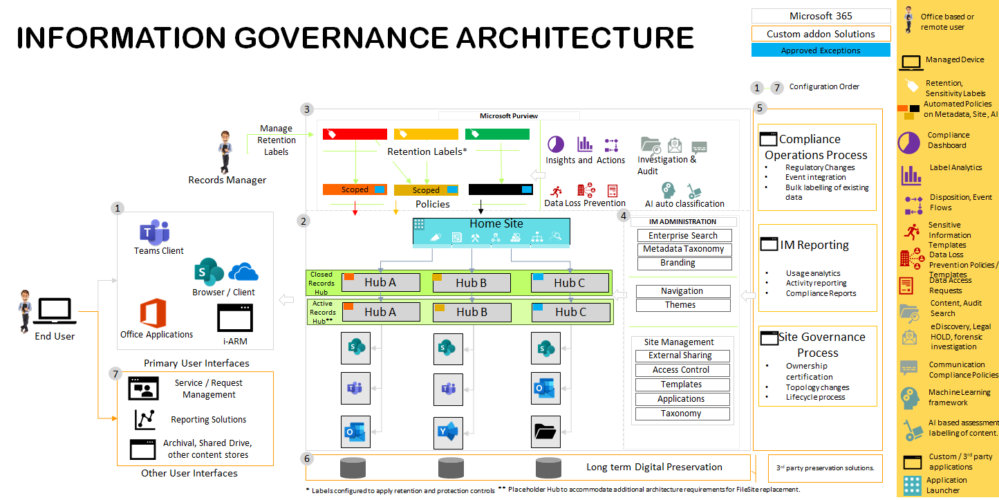

**Information Architecture Sequence**:

| **Sequence** | **Title** | **Description** |
|----|----|----|
| 1 | Collaboration User interface | Microsoft office client, web interfaces providing access to ALL data integrated with access controls. |
|  |  | i-ARM web interface provides access to records management functions |
| 2 | Data Storage | SharePoint Hub sites become the centralised storage for Active and closed records. Libraries / Folders are provisioned to structure records and manage access. |
| 3 | Microsoft Purview Policies | Retention and Sensitivity labels are configured for tagging active / closed records. |
|  |  | Additional automation policies configured to reduce burden on need for user dependent tagging. |
| 4 | Information Architecture Controls | Content Type / metadata providing enrichment and context to records further supporting automation. |
|  |  | Navigation, branding and themes are configured to support findability from various interfaces. |
|  |  | Enterprise search supported by verticals, metadata providing tailored views to Active / Closed   Records together with general purpose search activities. |
| 5 | Operational Governance Processes | Service request management processes to support user-initiated requests, workspace governance and records lifecycle management processes / workflows. |
| 6 | 3*rd* party archival | Integration configured to transfer records from M365 to long term digital preservation solution integrated with the end of lifecycle review workflows. |
| 7 | Operational User interfaces | Existing or new interfaces which may be required for supporting reporting, service management activities and other applications which are used but not in scope of the M365 integrations. |

**Hub Structure:**

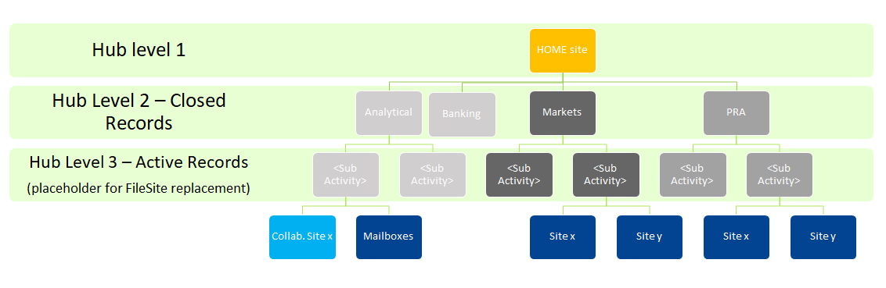

### Estimation

\[For each solution element (i.e. building block, or grouping of
building blocks), identify the affected domains and the effort required
by those domains to make the changes\]

| **Solution Element** | **Type of change** | **Impacted Areas** | **Effort Required** |
|----|----|----|----|
| \[E.g., building block, group of building blocks, service\] | \[E.g., new deployment, configuration. Consider scale, etc.\] | \[List the organisational areas involved in the change, e.g., delivery domains\] | \[estimated effort\] |
|  |  |  |  |
|  |  |  |  |

For each solution, please define alignment with Principles and indicate
Red, Amber and Green for level of alignment:

<table>
<colgroup>
<col style="width: 14%" />
<col style="width: 7%" />
<col style="width: 78%" />
</colgroup>
<thead>
<tr>
<th>Fitness for Purpose</th>
<th></th>
<th>
The Programme's objectives are aligned to the Strategic Plan
(SP7) and the Technology Enablers (TE2, TE3, TE4).

SP7– Modernise the Bank’s ways of working, TE2 - Safe, efficient and
robust operational running of the Bank, TE3 - Effective communications
and stakeholder engagement, TE4 - Bank decision-making informed by the
best available data, analysis and intelligence
</th>
</tr>
</thead>
<tbody>
<tr>
<td>User Experience</td>
<td></td>
<td>This plays a role in the overall FileSite Replacement Programme and
will aid in improving user experience as one of the primary objectives
(Item 3 - Measurably improve user experience on day-to-day information
management tasks, through the provision of intuitive and collaborative
ways of working)</td>
</tr>
<tr>
<td>Simplification</td>
<td></td>
<td>Extending the use of SaaS services the Bank already is licensed for
and uses. Only extend beyond this where necessary e.g. where there is a
capability gap. We will decommission ARM when FileSite Replacement is
complete. Straightforward configuration is a key driver for the
programme.</td>
</tr>
<tr>
<td>Modularity in Design</td>
<td></td>
<td>The solution is SaaS/Infotechtion based and we will be locked into
their roadmap which will evolve over time. Swapping away from the
MS/Infotechtion product base will not be easy, hence the Amber
rating.</td>
</tr>
<tr>
<td>Reuse, Buy, Build</td>
<td></td>
<td>
We will be reusing components we are already licensed for (we will
need E5 for Compliance anyway) reducing double spend. We are extending
use of Proventeq. We do not intend to build anything of any consequence.
We are only buying extensions (e.g. Infotechtion) where there is a
gap.**Scalability and Resilience of i-ARM Containers**

Table below provides the clear and concise overview of the scalability
and resilience features of each container, along with the rationale for
technology selection.

<table>
<colgroup>
<col style="width: 18%" />
<col style="width: 21%" />
<col style="width: 22%" />
<col style="width: 37%" />
</colgroup>
<thead>
<tr>
<th>i-ARM Container</th>
<th>Scalability</th>
<th>Resilience</th>
<th>Technology Choice</th>
</tr>
</thead>
<tbody>
<tr>
<th>Identity Applications</th>
<td>
Automatically scales to handle more users.
</td>

Supports multi-tenant environments.
</td>
<td>
High availability with SLA guarantees.

Built-in redundancy.
</td>
<td>
Microsoft Entra ID

Reason: Preferred for its seamless integration with other Microsoft
services and enterprise-level identity management capabilities.
</td>
</tr>
<tr>
<th>Web Application</th>
<td>
Scales out automatically using Azure App Service.

Can handle increased traffic with minimal configuration.
</td>
<td>
SLA-backed high availability.

Automatic backups and disaster recovery options.
</td>
<td>
Azure Web App

Reason: Chosen for its simplicity and powerful features for web app
hosting, offering better ease of use and deployment
flexibility.
</td>
</tr>
<tr>
<th>SharePoint Application</th>
<td>
Leverages SharePoint On l’ne's ability to scale with
organizational needs.

Supports large volumes of data and users.
</td>
<td>
Built-in data redundancy and high availability like SharePoint
services.

Be-spoke automated routines for backing up data from SharePoint to
Azure storage accounts.
</td>
<td>
SPFx and TypeScript

Reason: SPFx offers a development framework tailored for SharePoint,
providing deeper integration and customization options.
</td>
</tr>
<tr>
<th>Networking</th>
<td>
VNet scales to accommodate growing services and endpoints.

Flexible configuration to optimize traffic flow.
</td>
<td>
High availability and redundancy within Azure regions.

Supports VPN and ExpressRoute for secure, resilient
connections.
</td>
<td>
Azure Virtual Network

Reason: Offers superior integration with Azure services and enhanced
security features.
</td>
</tr>
<tr>
<th>API Applications</th>
<td>
Automatically scales with demand using Azure Functions.

Handles spikes in traffic efficiently.
</td>
<td>
Built-in fault tolerance and redundancy.

Durable Functions for stateful workflows ensure resilience.
</td>
<td>
Azure Functions

Reason: Chosen for its serverless architecture, reducing overhead and
cost compared to Azure App Services, which are better for full-fledged
applications rather than lightweight, event-driven tasks.
</td>
</tr>
<tr>
<th>Background Applications</th>
<td>
Serverless scaling with Azure Functions.

Scales according to the workload with no pre-provisioning
needed.
</td>
<td>
Durable Functions ensure reliability of long-running
processes.

High availability and disaster recovery options.
</td>
<td>
Azure Functions, Power Automate

Reason: These serverless offerings provides a more flexible and
scalable solution for background tasks.
</td>
</tr>
<tr>
<th>Dashboards &amp; Reports</th>
<td>Can handle large datasets and concurrent report access.</td>
<td>SLA-backed service reliability.</td>
<td>
Power BI Report Files

Reason: Power BI offers advanced analytics and visualization
capabilities that integrate seamlessly with Azure services, providing
more robust features.
</td>
</tr>
<tr>
<th>Database</th>
<td>Azure SQL Database can scale to accommodate larger datasets and
higher query volumes.</td>
<td>
High availability with geo-replication can be configured.

Automated backups and point-in-time restore.
</td>
<td>
Azure SQL Database

Reason: Selected for its fully managed service with strong
integration options and built-in intelligence, offering better overall
performance and manageability.
</td>
</tr>
<tr>
<th>Data Gateway</th>
<td>
Can be configured to scale to manage increasing data loads
between on-premises data sources and cloud services.

Optimized for large data transfers.
</td>
<td>Infrastructure services managed by Azure for reliability.</td>
<td>
Azure VM (IaaS)

Reason: Using Azure VM provides more control and customization for
data transfer processes.
</td>
</tr>
</tbody>
</table>

### Dynamic Design

| N/A |
|-----|

# Data Architecture

This section describes the data aspects of the i-ARM product that
employs a central relational database for its operations and offerings.

The database used is the PaaS offering from Azure i.e. Azure SQL
database that provides numerous advantages e.g. freedom to scale when
required, ability to cope up with increasing load and hassle-free
management and maintenance reducing the overhead of operations and IT
teams.

The table below shows the different architectural criteria considered
before finalizing the SQL Azure database as a backend for i-ARM.

<table>
<colgroup>
<col style="width: 17%" />
<col style="width: 82%" />
</colgroup>
<thead>
<tr>
<th>Criteria</th>
<th>Justification</th>
</tr>
</thead>
<tbody>
<tr>
<th>Reliability</th>
<td>
- Built-in high availability with automatic failover
configurations ensures minimal downtime.

- Active geo-replication configuration possibilities enable creating
readable secondary databases in different regions for disaster
recovery.

- Automatic backups with point-in-time restore ensure data can be
restored from any point within the retention period.
</td>
</tr>
<tr>
<th>Scalability</th>
<td>
- Easily scale the database up or down to accommodate varying
loads without application downtime.

- Read replicas configuration possibilities allow scaling read
workloads without affecting primary database performance.
</td>
</tr>
<tr>
<th>Maintainability</th>
<td>
- Regular maintenance and updates are automatically applied by
the Azure platform, reducing manual effort.

- Integrated tools like Azure Monitor and SQL Analytics provide
insights into performance and health, aiding in proactive
maintenance.

- Intelligent features like automatic tuning and recommendations help
optimize performance automatically.
</td>
</tr>
</tbody>
</table>

### Main Analytical Use Cases

The following table outlines various personas and actors engaging with
the i-ARM database through the i-ARM portal, along with a brief
description of the nature of their interactions.

| Capability | Description |
|----|----|
| i-ARM Authenticated User Personas | Application users interacting with the i-ARM services with their roles e.g. Administrators, archive reviewers etc. |
| i-ARM application process and backend workers | Service to service connectors to perform data read and write actions to the i-ARM tables in the database. |

| Explorer | Build an ML pipeline |
|----|----|
| Constructor | Automating pipelines with A&V tools that connect to the data source |
| Influencer | Consuming data via a gateway (Tableau Server, etc.) |

### Data Access and utilisation 

i-ARM leverages Azure SQL Database as its central data repository. The
table provided above identifies the various actors interacting with the
database, while the data flow diagram illustrates the nature of these
interactions and the movement of data into and out of the database.

Please refer to the logical data model below for a general understanding
of i-’RM's backend, which highlights the primary components of the data
store and their significance.

Additionally, the table provides an overview of how different personas
and services securely access and utilize the Azure SQL Database by
leveraging Azure AD authentication, role-based access control, and
network security features.

<table>
<colgroup>
<col style="width: 19%" />
<col style="width: 21%" />
<col style="width: 29%" />
<col style="width: 29%" />
</colgroup>
<thead>
<tr>
<th>Persona/Service</th>
<th>Access Type</th>
<th>Description of Data Access</th>
<th>Security Measures</th>
</tr>
</thead>
<tbody>
<tr>
<th>i-ARM Web Application</th>
<td>
Read/Write
</td>
<td>
Accesses the database to perform CRUD (Create, Read, Update, Delete)
operations for the application logic.
</td>
<td>
- Azure AD authentication for service principal credentials
 

- SQL Firewall rules to restrict access by IP
 

- Managed identities for authentication 
</td>
</tr>
<tr>
<th>Database Admin</th>
<td>
Read/Write
</td>
<td>
Responsible for database setup, maintenance, and monitoring, with
access to all data and schema modifications.
</td>
<td>
- Azure AD authentication with MFA (on approval)
 

- Role-based access control (RBAC)
 

- Activity logging and auditing 
</td>
</tr>
<tr>
<th>I-ARM Reporting Layer</th>
<td>Read</td>
<td>
Queries the database for reporting and analytics purposes, without
modifying data.
</td>
<td>
- Azure AD authentication with MFA
 

- Read-only database roles
</td>
</tr>
<tr>
<th>i-ARM Backend Services</th>
<td>Read/Write</td>
<td>
Accesses the database to perform CRUD (Create, Read, Update, Delete)
operations for the backend logic.
</td>
<td>
- Managed identities for authentication

- IP firewall rules for allowed services 
- Role-based access control (RBAC)
</td>
</tr>
</tbody>
</table>

### Conceptual Data Mode

<table>
<colgroup>
<col style="width: 12%" />
<col style="width: 32%" />
<col style="width: 9%" />
<col style="width: 9%" />
<col style="width: 10%" />
<col style="width: 9%" />
<col style="width: 8%" />
<col style="width: 8%" />
</colgroup>
<thead>
<tr>
<th><strong>Entity Name</strong> </th>
<th><strong>Definition</strong> </th>
<th><strong>Data Owner</strong> </th>
<th><strong>Data sensitivity</strong> </th>
<th><strong>Records Classification</strong> </th>
<th><strong>Records Retention &amp; Disposal</strong> </th>
<th>
<strong>Mastered </strong> 

<strong>by</strong> 
</th>
<th><strong>Used by</strong> </th>
</tr>
</thead>
<tbody>
<tr>
<th>Source </th>
<td>The entity captures the data about various data sources like Azure
Files, Network Files, M365<del>,</del> <del>AWS, M-Files, Sybase
etc.</del> </td>
<td>i-ARM Admin </td>
<td> </td>
<td> </td>
<td> </td>
<td> </td>
<td> </td>
</tr>
<tr>
<th>Source Instance </th>
<td>The entity captures information about a subset of data from the
specific source. </td>
<td>Primary Owner </td>
<td> </td>
<td> </td>
<td> </td>
<td> </td>
<td> </td>
</tr>
<tr>
<th>Retention Labels </th>
<td>The entity captures all the labels synchronized from M365 Purview to
achieve records management functionality. </td>
<td>Record Manager </td>
<td> </td>
<td> </td>
<td> </td>
<td> </td>
<td> </td>
</tr>
<tr>
<th>Disposal Details </th>
<td>The entity captures details of all the records/files which are ready
for disposition or archival. </td>
<td>Disposition Reviewer, Archival Reviewer </td>
<td> </td>
<td> </td>
<td> </td>
<td> </td>
<td> </td>
</tr>
<tr>
<th>Audit Logs </th>
<td>The entity captures all the audit data from various events that
occur in various i-ARM processes. </td>
<td>i-ARM Admin </td>
<td> </td>
<td> </td>
<td> </td>
<td> </td>
<td> </td>
</tr>
</tbody>
</table>

### Logical Data Model

> The section below shows the generalised data model of i-ARM system
> that primarily makes use of the SQL Azure database for storing its
> configurations and operational data.
>
> The design shows the schema of underlying key tables used by i-ARM and
> their relationship with different tables in the system. The database
> is normalized with third normal form standard to achieve data
> integrity, efficient storage, flexibility as well as the query
> performance for the reporting.
>
> The design shows the schema of underlying key tables used by i-ARM and
> their relationship with different tables in the system. The database
> is normalized with third normal form standard to achieve data
> integrity, efficient storage, flexibility as well as the query
> performance for the reporting.

Data security and compliance:

- Due to the use of Azure SQL database offering as the backend of i-ARM,
  the Data at rest is encrypted using Transparent Data Encryption (TDE).

- Role-based access control (RBAC) ensures that users have access only
  to the data they need.

<table>
<colgroup>
<col style="width: 100%" />
</colgroup>
<thead>
<tr>
<th>
The purpose of this section is to provide information about key
attribute level data that is part of and included in the i-ARM.

i-ARM data model uses indexes to ensure queries are executed in
efficient manner. Following are some of the indexes defined on the
various entities:

<table>
<colgroup>
<col style="width: 30%" />
<col style="width: 27%" />
<col style="width: 41%" />
</colgroup>
<thead>
<tr>
<th><strong>Entity Name</strong></th>
<th><strong>Attribute Name</strong></th>
<th><strong>Index Types</strong></th>
</tr>
</thead>
<tbody>
<tr>
<th>Sources</th>
<td>SourceName</td>
<td>Unique non-clustered index</td>
</tr>
<tr>
<th>SourceInstances</th>
<td>SourceInstanceName</td>
<td>Unique non-clustered index</td>
</tr>
<tr>
<th>SourceInstances</th>
<td>SourceId</td>
<td>Non-unique non-clustered index</td>
</tr>
<tr>
<th>RetentionLabels</th>
<td>RetentionLabelId</td>
<td>Unique non-clustered index</td>
</tr>
<tr>
<th>RetentionLabels</th>
<td>RetentionLabelName</td>
<td>Unique non-clustered index</td>
</tr>
<tr>
<th>DisposalDetails</th>
<td>FileUniqueId</td>
<td>Non-unique non-clustered index</td>
</tr>
<tr>
<th>DisposalDetails</th>
<td>RetentionLabelId</td>
<td>Non-unique non-clustered index</td>
</tr>
<tr>
<th>AuditLogs</th>
<td>ObjectId</td>
<td>Non-unique non-clustered index</td>
</tr>
</tbody>
</table>

Following are the attributes which is sensitive with respect to
person or organization:

<table>
<colgroup>
<col style="width: 19%" />
<col style="width: 20%" />
<col style="width: 39%" />
<col style="width: 20%" />
</colgroup>
<thead>
<tr>
<th><strong>Entity Name</strong></th>
<th><strong>Attribute Name</strong></th>
<th><strong>Definition</strong></th>
<th><strong>Data sensitivity</strong></th>
</tr>
</thead>
<tbody>
<tr>
<th>DisposalDetails</th>
<td>FileName</td>
<td>Name of the File</td>
<td>Internal</td>
</tr>
<tr>
<th>DisposalDetails</th>
<td>DispositionReviewer</td>
<td>Disposition Reviewer</td>
<td>Internal</td>
</tr>
<tr>
<th>DisposalDetails</th>
<td>ArchiveReviewer</td>
<td>Archive Reviewer</td>
<td>Internal</td>
</tr>
<tr>
<th>DisposalDetails</th>
<td>SiteTitle</td>
<td>Title of the Site</td>
<td>Internal</td>
</tr>
<tr>
<th>RentetionLabels</th>
<td>RetentionLabelName</td>
<td>Name of the Retention Label applied to File</td>
<td>Internal</td>
</tr>
</tbody>
</table></th>
</tr>
</thead>
<tbody>
</tbody>
</table>

### Data Flow Diagram

The logical data flow diagram shows how data moves through the i-ARM
system.

The section below explains the general flow of the data within i-ARM

1.  User requests for login

    - Action: The user opens the i-ARM portal in their browser and
      inputs their login credentials issued by Microsoft 365 Tenant.

    - System Response: The credentials are sent to the WebApp, which
      forwards them to the Authentication service for verification.

2.  User Successfully Authenticates and Logs into i-ARM Portal

    - Action: The Authentication service (Azure AD) verifies the u’er's
      credentials.

    - System Response: If the credentials are valid, the user is granted
      access to the i-ARM portal, and the WebApp redirects the user to
      the home page.

3.  Disposal Dashboard Page Requests Web API to Get Disposable Items

    - Action: The user navigates to the Disposal Dashboard page within
      the i-ARM portal.

    - System Response: The WebApp sends a request to the Web API to
      retrieve a list of disposable items from the Database.

4.  Disposable Items are Visible in Grid View

    - Action: The Web API retrieves the list of disposable items from
      the Database.

    - System Response: The Web API returns the data to the WebApp, which
      displays the items in a grid view on the Disposal Dashboard page.

5.  User Performs Various Disposal Operations on Listed Items

    - Action: The user interacts with the grid to perform various
      disposal operations. The available operations include:

    - Dispose Items: The user selects one or more items and marks them
      for disposal.

      - Extend Retention Period: The user selects items and changes
        their retention period to a later date.

      - Re-Label/Change Retention Label: The user changes the retention
        label of selected items.

      - Archive Items: The user archives selected items for long-term
        storage.

    - System Response: Each operation sends a request to the Web API,
      which interacts with the Database to update the status of the
      items based on the u’er's actions.

6.  User Requests Reports

    - Action: The user selects the Reports option in the i-ARM portal
      and specifies the type of report they need.

    - System Response: The WebApp sends a request to Power BI to
      generate the required report. Power BI retrieves the necessary
      data from the Database and processes it to generate the report,
      which is then returned to the WebApp and displayed to the user.

7.  PA Flow: The section below describes the Power Automate Flows
    deployed as a part of the i-ARM system deployment within BoE Power
    Automate Environment.

    - Disposal Actions Flow: This flow gets triggered daily, it picks
      items disposed or relabelled from i-ARM portal. Fetched item(s)
      details are sent to MS Purview for disposition/ re-labelling and
      Database is updated with proper status to keep track.

    - Business Reviewers Disposition: This is triggered when an item
      reaches the end of its retention period. It retrieves to be
      disposed item details by making request to respective SharePoint
      site. Retrieved data or items details are inserted into database.
      Once it is inserted in database its available for disposition from
      i-ARM portal.

    - Business and Archive Reviewers: Flow is same as Business Reviewers
      Disposition, with the only difference being that an item requires
      an Archive Reviewer User for disposing an item.

    - Compliance Sync: This is Power Automate flow which will
      synchronise Retention Labels from MS Purview and insert details of
      retention label into database.

8.  Physical Records Management:

- **SPFx Module:** This module is a SharePoint solution which handles
  creation and management of Physical Records.

  - User requests login.

    - Action: User opens the browser and inputs their login credentials
      issued by Microsoft 365 Tenant.

    - System Response: The credentials are authenticated by M365’s
      authentication mechanism and the user are logged in.

  - Login request to SharePoint authentication mechanism.

    - Action: User credentials are passed on to M365 Tenant’s own
      authentication mechanism.

    - System Response: User is authenticated from Microsoft’s end.

  - After successful login user will request access to SharePoint

    - Action: After successful log in users will need to request for
      SharePoint site/pages where our solution is deployed if they do
      not have the access already.

    - System Response: Users will then be able to view all the search
      pages and pages where custom forms are implemented.

  - User interacts with SharePoint via custom search pages and forms
    which are designed.

    - Action: User may try to perform any of operations which are
      search, create, edit, view physical records using our solution.

    - System Response: Solution will respond accordingly based on the
      operations performed.

      - Search operation will return search results.

      - Create operation will return display form with created entry.

      - Edit operation will return display form with edited entries.

      - View operation will return display form with relevant details.

- **Bulk Import:** This module is a background process which creates
  physical records based on the records added in csv format.

  - Timer trigger function runs after every interval to pick input file
    for processing.

    - Action: Request to authenticate using AAD certificate.

    - System Response: On successful response, access token is returned
      to the background process.

  - Requests for input file to process.

    - Action: After getting access token, process checks SharePoint list
      for input file.

    - Response: Returns files whose status is “New.”

  - Start processing the input file.

    - Action: Once the input file is received, system starts processing
      the data and creates records in SharePoint list.

    - Response: Returns the response message of success/fail while
      creating records.

  <!-- -->

  - The i-ARM solution leverages capabilities of the PnP framework i.e.
    specifically the PnP search web part to provide search functionality
    within the physical records management feature.

### Data Quality

> N/A

### Metadata 

> N/A

# Infrastructure Architecture

This section highlights i-ARM product’s PaaS services, the only IaaS
component is the on-premises data gateway VM.

<table>
<colgroup>
<col style="width: 8%" />
<col style="width: 24%" />
<col style="width: 23%" />
<col style="width: 44%" />
</colgroup>
<thead>
<tr>
<th><strong>Status</strong></th>
<th><strong>Name</strong></th>
<th><strong>Functional Description</strong></th>
<th><strong>Design Comment</strong></th>
</tr>
</thead>
<tbody>
<tr>
<th>New</th>
<td>Azure Functions</td>
<td>PaaS Services</td>
<td><ul>
<li>
Built using .NET and integrated with Microsoft Graph
APIs.
</li>
<li>
Used for serverless computing to handle on-demand data processing
and event-driven workflows.
</li>
</ul></td>
</tr>
<tr>
<th>New</th>
<td>Azure Web App</td>
<td>PaaS Services</td>
<td><ul>
<li>
Developed using React and SPA architecture.
</li>
<li>
Hosts the web application, providing scalable and managed web
services for the product.
</li>
</ul></td>
</tr>
<tr>
<th>New</th>
<td>Azure App Service Plan</td>
<td>PaaS Services</td>
<td><ul>
<li>
Manages the pricing and scaling options for web applications and
APIs.
</li>
<li>
Offers different pricing tiers to meet performance and scaling
requirements.
</li>
</ul></td>
</tr>
<tr>
<th>New</th>
<td>Azure Key Vault</td>
<td>PaaS Services</td>
<td><ul>
<li>
Securely stores sensitive data such as API keys, secrets, and
certificates.
</li>
<li>
Ensures secure access to sensitive information for applications
and services.
</li>
</ul></td>
</tr>
<tr>
<th>New</th>
<td>Power Automate Flows</td>
<td>PaaS Services</td>
<td><ul>
<li>
Within the Power Platform environment, used to automate
repetitive tasks and workflows.
</li>
<li>
Facilitates integration with other services and products to
streamline business processes
</li>
</ul></td>
</tr>
<tr>
<th>New</th>
<td>Azure SQL Database</td>
<td>PaaS Services</td>
<td><ul>
<li>
Serves as the central data store for the product.
</li>
<li>
Provides scalable, managed relational database services.
</li>
</ul></td>
</tr>
<tr>
<th>New</th>
<td>Azure Virtual Network</td>
<td>PaaS Services</td>
<td><ul>
<li>
Provides a secure networking environment to connect Azure
resources.
</li>
<li>
Allows for the creation of subnets, network security groups, and
VPN connections for secure communication.
</li>
</ul></td>
</tr>
<tr>
<th>New</th>
<td>On-premises data gateway VM</td>
<td>IaaS Services</td>
<td><ul>
<li>
Acts as a bridge between on-premises data sources and cloud
services.
</li>
<li>
Facilitates secure data transfer between on-premises resources
and azure services.
</li>
</ul></td>
</tr>
</tbody>
</table>

### Logical Infrastructure Diagram

The diagram below is a representation of the infrastructure building
blocks that the i-ARM solution is built upon. (See next page).

The information flow can be referred in the section above, the
interactions between different infrastructure components remain secured
and controlled using the central identity store on the BoE environment
i.e. Microsoft Entra ID.

### Infrastructure Building Blocks

Refer to the section Infrastructure Architecture for details.

| **Status** | **Name** | **Functional Description** | **Design Comment** |
|----|----|----|----|
| New | Linux Server | Server | Hosting the application web services |
| New (for all) |  |  |  |

# Interfaces

The purpose of this section is to describe the application interfaces
that supports the integration with i-ARM services.

| **ID** | **Category (New, Modified, Unchanged)** | **Service Provider** | **Service Consumer** | **Protocol** | **Authentication Method** | **Latency** | **Comment** |
|----|----|----|----|----|----|----|----|
| 1 | New | Infotechtion through i-ARM hosted on Azure Web App | i-ARM Web Application and Authorized Users | HTTPS | OAUTH 2.0 | Low | Primary interface for accessing i-ARM services. |
| 2 | Existing | Microsoft 365 – SharePoint | Tenant Authorized Users | HTTPS | OAUTH 2.0 | Low | Access M365 SharePoint Services |
| 3 | Existing | Microsoft 3–5 - Purview | Tenant Authorized Users | HTTPS | OAUTH 2.0 | Low | Access M365 and Purview Services |
| 4 | Existing | Microsoft 365 – Power Platform | Tenant Authorized Users | HTTPS | OAUTH 2.0 | Low | Access Power Platform Services |
| 5 | Existing | Microsoft 365 – Power BI | Tenant Authorized Users | HTTPS | OAUTH 2.0 | Low | Access Power BI Services |

# Security by Design

<table>
<colgroup>
<col style="width: 30%" />
<col style="width: 69%" />
</colgroup>
<thead>
<tr>
<th><strong>Information Classification</strong></th>
<th>
The classification of the information processed by the solution
against the Bank’s ISS

Official-AmberNo–e - The data being managed by this add-in may be up
to Official Red, however the data is held within the underlying
SharePoint online solution which has its own SCA. On discussion with
Cyber Security Architecture we have agreed that enhanced Security
control set is sufficient for this application. I have therefore lowered
the confidentiality to Official-Amber.
</th>
</tr>
</thead>
<tbody>
<tr>
<th><strong>Information Security BIA</strong></th>
<td>
Tier 2 Service – Enhanced security

<a
href="http://intranet/Banknav/IML.asp?svr=BOE-DMS&amp;db=Services&amp;id=16176649&amp;v=0">SCA
document link -Services_16176649</a>
</td>
</tr>
</tbody>
</table>

### Security Implications

N/A

### Access Management

| Role | Access Tier | Description |
|----|----|----|
| i-ARM specific application roles and tenancy permissions. | NA | These are specific roles to the i-ARM application and managed from within the source code. The access is governed using the central identity store of BoE Microsoft Tenancy i.e. using Microsoft Entra ID and i-ARM is integrated to use it using Azure Role Based Access Control by following the principle of least privileges. |

### Supply Chain Management

\[Consider the security implications and control requirements for
managing risk of suppliers with weak cyber controls\]

<table>
<colgroup>
<col style="width: 33%" />
<col style="width: 34%" />
<col style="width: 32%" />
</colgroup>
<thead>
<tr>
<th><strong>Supplier Attack Vector</strong></th>
<th><strong>Security Implications</strong></th>
<th><strong>Design to mitigate Security Implications</strong></th>
</tr>
</thead>
<tbody>
<tr>
<th>
Malicious code/patch update from supplier

Unauthorised access to approved remote access to Bank network from
supplier.

Unauthorised access to Bank data when providing support or
consultancy to the Bank.
</th>
<td>[describe the security implications as they relate to the attack
vector and location of development/support. Agreed with Security
Design&gt;</td>
<td>[include the options to mitigate supplier attack vectors such as
additional Bank owned controls, needed supplier assurance requirements
(e.g., ISO 27001, SOC 2 Type II, and Cyber Essentials Plus) etc.]</td>
</tr>
</tbody>
</table>

# Service by Design

\[This section describes the business or technical service delivered by
the solution\]

<table>
<colgroup>
<col style="width: 24%" />
<col style="width: 75%" />
</colgroup>
<thead>
<tr>
<th><strong>Service Ownership</strong></th>
<th>
[Clear definition of the service owners – business owner,
technical owner, service owner]

Technical Owner: i-arm product engineering

Service Owner: i-arm product engineering

Business Owner: i-arm product engineering
</th>
</tr>
</thead>
<tbody>
<tr>
<th><strong>Service Criticality</strong></th>
<td>
The features of i-ARM are classified as ‘non-business critical.’
The rationale for the classification is as follows:

<ul>
<li>
The failure of i-ARM features does not impact a user’s ability to
work with information, records are accessed via M365 user interface.

<ul>
<li>
The solution does not prevent a user from uploading / downloading
or collaborating with the information in M365.
</li>
</ul></li>
<li>
The failure mode still allows the underlying information files
(digital records) and metadata (physical records) to still be accessible
to authorised personnel.
</li>
<li>
On occasion of discontinuing the Infotechtion services, the
underlying information, files, and all audit data stays with the
customer.
</li>
<li>
All workflows and M365 purview Graph API orchestrations are
configured to retry after failure, audit the failure diagnostics for
remediation and restart from the point of failure.
</li>
<li>
Information metadata, retention details and eligibility for
disposal details are mastered in Microsoft Purview. Therefore, in
critical / disaster failure situation the entire data model can be
rebuilt from the master data in M365 and Purview.
</li>
<li>
The only data loss can be the business decisions related
information eligible of disposal. These are mitigated through a backup
management of Infotechtion database managed in customer Azure
subscription.
</li>
</ul></td>
</tr>
</tbody>
</table>

### Service Implications

\[Consider the service implications for any new or modified building
blocks used in the solution\]

| **Status** | **Name** | **Service Implications** | **Design Comment** |
|----|----|----|----|
| Modified | Azure consumption monitoring | Additional service monitoring required to ensure any platform level issues are addressed by the bank’s cloud support team. | The activities will be included in the service introduction documentation. Failover modes will be included in responsibility matrix. |
| New | i-ARM feature release support | Azure administrator is required to approve the release of new features. | A process will be documented to approve and authenticate the cloud release of new features. |

### Business Change Implications

\[Consider the business change implications for any new or modified
building blocks used in the solution\]

| **Status** | **Name** | **B Implications** | **Design Comment** |
|----|----|----|----|
| Modified | Records access control | The access to records is currently managed at a file object level, this will change in the target architecture to align with recommended practices. The change will require education to manage permissions at a container (site / library) level in the target architecture. | Data access governance design will follow the [Sharing & permissions in the SharePoint modern experien–e - SharePoint in Microsoft 365 \| Microsoft Learn](https://learn.microsoft.com/en-us/sharepoint/modern-experience-sharing-permissions) |
| New | Disposal reviews | i-ARM feature ‘My disposal dashboard’ will require new skills for existing records management team to operationally manage the disposal activities related to physical and digital records. | Existing disposal process will be configured in the target architecture. |

### Service Levels

The following table is for request service levels.

| Category | Priority | Response target | Resolution target | Applicable hours\* |
|----|----|----|----|----|
| Standard | Medium | 4 hours | 3 days | Mon-Fri 8:00 am till 5:00 pm excluding public holidays local to customer’s regional time zones |
| Standard | Low | 4 hours | 5 days | Mon-Fri 8:00 am till 5:00 pm excluding public holidays local to customer’s regional time zones |
| Non-Standard | Medium | 4 hours | 7 days\*\* | Mon-Fri 8:00 am till 5:00 pm excluding public holidays local to customer’s regional time zones |
| Non-Standard | Low | 8 hours | As per roadmap timeline, earliest the following quarter. | Mon-Fri 8:00 am till 5:00 pm excluding public holidays local to customer’s regional time zones |

\* Custom hours as per customer requirements to be agreed with
additional costs. These are outlined in the pricing section.

\*\* Subject to the complexity of service request, these could require
additional days. In such cases, the overall delivery can be split in
sprints of 7 days.

### Service Monitoring

<table>
<colgroup>
<col style="width: 25%" />
<col style="width: 74%" />
</colgroup>
<thead>
<tr>
<th>Monitoring Consideration</th>
<th>Design Comment</th>
</tr>
</thead>
<tbody>
<tr>
<th>Operational</th>
<td>
Infotechtion solution primarily leverages a variety of Azure
Platform-as-a-Service (PaaS) offerings, and to ensure operational
excellence the native monitoring tools and services utilized
include:

- Azure Monitor: Azure Monitor is a comprehensive solution for
collecting, analysing, and acting on telemetry from our Azure resources.
It provides:

- Metrics and Logs: Aggregates metrics and logs from Azure services,
enabling us to gain insights into the performance and health of
applications.

- Application Insights: Integrated with Azure Monitor, Application
Insights provides deep diagnostics and performance monitoring for
applications, including dependency tracking, request rates, response
times, and failure rates.

- Dashboards: Customizable dashboards for real-time monitoring and
visualization of key performance indicators (KPIs) and metrics across
azure services.

Additionally, the operations teams would check for inbuilt metrics
and service telemetry dashboards of Azure services that offer:

- Service Health Monitoring: Continuous monitoring of the health and
availability of Azure services we utilize, with real-time updates and
historical data.

- Performance Metrics: Detailed performance metrics such as CPU
usage, memory consumption, disk I/O, and network traffic, which help in
capacity planning and optimization.

- Diagnostic Logs: Access to diagnostic logs that provide granular
insights into service operations, aiding in troubleshooting and root
cause analysis.

For SharePoint servic–s - Administrators still have access to
detailed usage reports, site analytics, and service health information
through the Microsoft 365 admin centre. These tools help ensure that
SharePoint Online operates smoothly and that any issues are promptly
addressed by Micros’ft's support and engineering teams.
</td>
</tr>
<tr>
<th>Performance</th>
<td>
[Describe the performance monitoring of the solution and how
performance will be assessed and maintained from an on-going service
perspective]

Infotechtion solution has built-in logging to monitor the response
times of critical services, including throughput of the Azure SQL
Database, Web App, and functional services.

The performance indicators are used to compare against the product
benchmark for determining Additionally, i-Arm leverages instrumentation
services built into the architecture to monitor application health,
performance, and metrics, and leverage tools like Azure Monitor and
Application Insights to collect telemetry data and gain insights into
application behavior.

Finally, an annual performance testing is conducted to compare
feature performance against the benchmark.
</td>
</tr>
<tr>
<th>Capacity</th>
<td>
[Describe the capacity monitoring of the solution and how
capacity will be assessed and maintained from an on-going service
perspective]

The capacity monitoring will be categorized into:

M365 Capacity: The capacity monitoring shall be achieved through
capacity monitoring tools available in M365 especially SharePoint online
for monitoring storage capacity metrics to stay within Microsoft’s
limits and boundaries.

<ul>
<li>
Azure Capacity: i-ARM will be hosted in Bank’s Azure
subscription. The main component to monitor for capacity is the Azure
SQL database. This will be achieved as per the Microsoft recommendations
based on <a
href="https://learn.microsoft.com/en-us/azure/azure-sql/database/query-performance-insight-use?view=azuresql">Query
Performance Insig–t - Azure SQL Database | Microsoft Learn</a>
</li>
</ul></td>
</tr>
</tbody>
</table>

### Testability

\[Describe at a high level (in a few lines) the approach suggested for
testing considering operability, observability, controllability
decomposability, simplicity, stability and understand ability. This
section should also include suggested types of testing by the
architecture such as function testing, non-functional testing
(resilience, performance, load, security, volume, recovery etc.)\]

modular nature allows for flexibility and agility, enabling rapid
development and deployment.

- Operability:

  - The architecture primarily leverages Az’re's PaaS services, which
    offer high operability due to their managed nature.

  - DevOps & Release Pipelines ensure smooth CI/CD, providing automated
    deployment and version control.

  - The Azure VM Data Gateway allows secure data transfer between Power
    BI and firewall protected services e.g. SQL Azure database,
    enhancing operational flexibility.

- Observability:

  - Instrumentation Services are built into the architecture to monitor
    application health, performance, and metrics.

  - Azure Monitor and Application Insights can be used to collect
    telemetry data from Azure Web App, Function Apps, providing insights
    into application behaviour.

  - Logs and metrics are easily accessible, enabling quick detection and
    diagnosis of issues.

- Controllability:

  - The architecture implements Azure Key Vault and Managed Identities
    for secure authentication and authorization control.

  - The use of Azure Policy and Role-Based Access Control (RBAC) ensures
    fine-grained control over resource access.

  - Azure VNET provides network isolation and security controls at the
    network level.

- Decomposability:

  - The architecture is modular, with distinct services such as Azure
    Functions and Web App, each handling specific workloads.

  - A few services operate independently, enabling isolated development,
    testing, and deployment.

  - Services can be updated or replaced independently without affecting
    the entire system.

- Simplicity:

  - Azure PaaS services abstract much of the underlying infrastructure
    complexity, simplifying the architecture.

  - The logical separation of services (Functions, Web App) makes it
    easy to understand and manage the application.

  - Using managed services like Azure SQL Database and Azure Key Vault
    reduces the need for custom configurations.

- Stability:

  - Az’re's managed services ensure high availability and redundancy
    configuration options, contributing to the stability of the
    architecture.

  - The modular design allows for graceful degradation if a particular
    service experiences issues, minimizing impact on the overall system.

  - Automated pipelines ensure consistent, tested deployments, reducing
    the risk of configuration drift.

- Understandability:

  - The architecture is well-documented and logically laid out, making
    it easy for teams to understand the flow of data and dependencies.

  - Standardized components like Azure Functions, and Web App are
    familiar to most teams, reducing the learning curve.

Additionally, the section below addresses the aspects of function
testing and non-functional testing (resilience, performance, load,
security, volume, recovery, etc.) of the i-ARM. Note that since i-ARM is
a product offering, the functional and non-functional tests specified
below has been performed in the Infotechtion’s internal environment.

- Function Testing:

  - Unit Testing: Each component, such as Azure Functions and Web App,
    have been unit tested to validate their individual functionalities.

  - Integration Testing: i-ARM team has validated interactions between
    components like the Web ’pp's interaction with the Azure SQL
    Database orchestration with Functions.

  - End-to-End Testing: Ensured the entire workflow from data input to
    final output works as expected, including interactions with external
    services like Power BI and Microsoft 365.

- Non-Functional Testing:

  - Resilience Testing:

    - i-ARM team has simulated failures in individual components like
      Azure Functions to ensure the system can handle faults gracefully.

  - Performance Testing:

    - The product team has done the benchmarking the response times of
      critical services like the Web App and Functions to ensure they
      meet performance requirements.

    - Testing the latency and throughput of Azure SQL Database to
      guarantee fast data access has been validated.

  - Load Testing:

    - Stress testing the Web App and Functions under high loads to
      assess their scalability has been performed.

  - Security Testing:

    - Penetration testing the entire architecture to identify potential
      vulnerabilities has been completed by a third-party service
      provider.

  - Volume Testing:

    - Testing the sys’em's capability to handle large volumes of data,
      especially focusing on Azure SQL Database has been completed.

    - Simulating high traffic scenarios to verify the Web ’pp's ability
      to handle large user volumes has been completed.

  - Recovery Testing:

    - Testing backup and restore processes for Azure SQL Database to
      ensure data recovery in case of failure has been verified.

### Solution Environments

<table>
<colgroup>
<col style="width: 25%" />
<col style="width: 74%" />
</colgroup>
<thead>
<tr>
<th>Environment</th>
<th>Design Consideration</th>
</tr>
</thead>
<tbody>
<tr>
<th>Production / Live</th>
<td>
A dedicated Azure subscription within the BoE Azure Tenancy has
been designated as a production environment. The lack of lower
environments poses a risk that should be documented. However, it is
advisable to establish lower operating environments because of following
reasons:

- to enable early issue detection, as fixing issues can be more
costly in prod than lower environments. 
- to facilitate user acceptance testing for new features over the long
term. 
- to avoid any downtimes and service interruptions while deploying new
features. 
- to conduct any security and compliance assessments relating to the
industry or organization. 
- to derive any baseline performance expectations by generating load
equivalent to the prod environment.
</td>
</tr>
</tbody>
</table>

# Architecture Summary

### Decisions

<table>
<colgroup>
<col style="width: 8%" />
<col style="width: 9%" />
<col style="width: 20%" />
<col style="width: 18%" />
<col style="width: 22%" />
<col style="width: 20%" />
</colgroup>
<thead>
<tr>
<th><strong>ID (Container)</strong></th>
<th><strong>Classification</strong></th>
<th><strong>Decision</strong></th>
<th><strong>Rational</strong></th>
<th><strong>Implications</strong></th>
<th>
<strong>Technical Debt ​</strong>

(if the decision classification is tactical)
</th>
</tr>
</thead>
<tbody>
<tr>
<th>
D01

Identity Applications

Azure Entra is existing service, but the applications are
new.
</th>
<td>Strategic</td>
<td>Use Microsoft Entra ID for its robust security and integration
capabilities.</td>
<td>Preferred for its seamless integration with other Microsoft services
and enterprise-level identity management capabilities. It also has
comprehensive identity and access management solution that provides
robust security, single sign-on (SSO), and multi-factor authentication
(MFA).</td>
<td><ul>
<li>
Centralizes identity management, enhances security, and
simplifies user access to applications and services.
</li>
<li>
Implication attributes are not applicable for existing
resources.
</li>
</ul></td>
<td>Low - Requires ongoing management of identities, policies, and
security configurations, but greatly reduces security risks</td>
</tr>
<tr>
<th>
D02

Web Application

-New
</th>
<td>Strategic</td>
<td>Leverage Azure App Service for auto scaling and optimum
performance</td>
<td>Chosen for its simplicity and powerful features for web app hosting,
offering better ease of use and deployment flexibility. It is a fully
managed platform for building, deploying, and scaling web apps. Supports
multiple programming languages and frameworks.</td>
<td><ul>
<li>
Simplifies web application deployment and management, offers
built-in scaling, high availability, and security features.
</li>
<li>
Design, Planning and Deployment: Infotechtion, i-ARM.
</li>
<li>
Management: Operation and i-ARM Release Management Teams
</li>
<li>
Cost: Operational cost for each environment, Pay as you
go
</li>
<li>
Complexity: Operation Teams
</li>
</ul></td>
<td><ul>
<li>
Low - Managed service reduces operational overhead but requires
monitoring and periodic updates to application code.
</li>
<li>
Configuration/Code maintenance: Regular updates and audits for
operations and i-ARM release management teams.
</li>
<li>
Documentation: i-ARM product features documentation.
</li>
</ul></td>
</tr>
<tr>
<th>SharePoint is existing service, but application is new</th>
<td>Strategic</td>
<td>Implement SPFx for seamless SharePoint integration and enhanced
security.</td>
<td>SPFx offers a development framework tailored for SharePoint,
providing deeper integration and customization options.</td>
<td><ul>
<li>
Provides a flexible, client-side development environment that
supports modern web technologies, enabling rich user
experiences.
</li>
<li>
Design, Planning and Deployment: Infotechtion, i-ARM
</li>
<li>
Management: Operation and i-ARM Release Management Teams
</li>
<li>
Cost: N/A
</li>
<li>
Complexity: Operation Teams
</li>
</ul></td>
<td><ul>
<li>
Low - Requires ongoing updates and maintenance of custom code, as
well as adherence to modern development practices.
</li>
<li>
Configuration/Code maintenance: Regular updates and audits for
operations and i-ARM release management teams.
</li>
<li>
Documentation: i-ARM product features documentation.
</li>
</ul></td>
</tr>
<tr>
<th>
Networking

-New
</th>
<td>Strategic</td>
<td>Use Azure Virtual Network for secure, scalable networking.</td>
<td>Offers superior integration with native Azure services and enhanced
security features. Provides a secure, isolated network environment to
run virtual machines, applications, and PaaS services</td>
<td><ul>
<li>
Enables secure and private communication between Azure resources,
supports hybrid cloud scenarios as well in future, and offers robust
networking features like subnets, VPN, NSGs, and route tables.
</li>
<li>
Design, Planning and Deployment: Infotechtion, i-ARM
</li>
<li>
Management: Operation and i-ARM Release Management Teams
</li>
<li>
Cost: Operational cost for each environment, Pay as you
go
</li>
<li>
Complexity: Operation Teams
</li>
</ul></td>
<td><ul>
<li>
Low - Requires proper design, ongoing management, and monitoring
to ensure optimal performance and security, i-ARM build will ensure
deployment of correct VNET ranges required.
</li>
<li>
Configuration/Code maintenance: Regular updates and audits for
operations and i-ARM release management teams.
</li>
<li>
Documentation: i-ARM product features documentation.
</li>
</ul></td>
</tr>
<tr>
<th>
API Applications

-New
</th>
<td>Strategic</td>
<td>Deploy Azure Functions for scalable, serverless API management.</td>
<td>Chosen for its serverless architecture, reducing overhead and cost
compared to Azure App Services, which are better for full-fledged
applications rather than lightweight, event-driven tasks.</td>
<td><ul>
<li>
Provides automatic scaling, high availability, and cost-effective
execution for API workloads. Integrates seamlessly with other Azure
services and supports multiple programming languages.
</li>
<li>
Design, Planning and Deployment: Infotechtion, i-ARM
</li>
<li>
Management: Operation and i-ARM Release Management Teams
</li>
<li>
Cost: Operational cost for each environment, Pay as you
go
</li>
<li>
Complexity: Operation Teams
</li>
</ul></td>
<td><ul>
<li>
Low - Infrastructure management is minimized but requires ongoing
monitoring and maintenance of function code and configurations.
</li>
<li>
Configuration/Code maintenance: Regular updates and audits for
operations and i-ARM release management teams.
</li>
<li>
Documentation: i-ARM product features documentation.
</li>
</ul></td>
</tr>
<tr>
<th>
Background Applications

-New
</th>
<td>Strategic</td>
<td>Utilise Azure Functions, Power Automate for resilient background
processing.</td>
<td>
These serverless offerings provides a more flexible and scalable
solution for background tasks.

Service for automating workflows across applications and services
with a no-code/low-code approach.
</td>
<td><ul>
<li>
Easy to deploy and manage within existing Azure App Service
environments, ideal for continuous or triggered background tasks.
Facilitates rapid automation of repetitive tasks, integrates well with
Microsoft 365 and other services.
</li>
<li>
Design, Planning and Deployment: Infotechtion, i-ARM
</li>
<li>
Management: Operation and i-ARM Release Management Teams
</li>
<li>
Cost: Operational cost for each environment, Pay as you
go
</li>
<li>
Complexity: Operation Teams
</li>
</ul></td>
<td><ul>
<li>
Low - Requires Azure App Service plan for hosting which is
anyways a deployable artefact of i-ARM, and ongoing monitoring and
maintenance of jobs.
</li>
<li>
Configuration/Code maintenance: Regular updates and audits for
operations and i-ARM release management teams.
</li>
<li>
Documentation: i-ARM product features documentation.
</li>
</ul></td>
</tr>
<tr>
<th>
Database

-New
</th>
<td>Strategic</td>
<td>Implement Azure SQL Database for managed, scalable, and secure data
storage.</td>
<td>Selected for its fully managed service with strong integration
options and built-in intelligence, offering better overall performance
and manageability.</td>
<td><ul>
<li>
Simplified database management, automatic updates, and scaling,
along with robust security features.
</li>
<li>
Design, Planning and Deployment: Infotechtion, i-ARM
</li>
<li>
Management: Operation and i-ARM Release Management Teams
</li>
<li>
Cost: Operational cost for each environment, Pay as you
go
</li>
<li>
Complexity: Operation Teams
</li>
</ul></td>
<td><ul>
<li>
Low - Managed service reduces the need for manual updates and
maintenance but requires monitoring and cost management.
</li>
<li>
Configuration/Code maintenance: Regular updates and audits for
operations and i-ARM release management teams.
</li>
<li>
Documentation: i-ARM product features documentation.
</li>
</ul></td>
</tr>
<tr>
<th>
Data Gateway

-New
</th>
<td>Strategic</td>
<td>Deploy Azure VM (IaaS) for customised and controlled data transfer
solutions.</td>
<td>Using Azure VM provides more control and customization for data
transfer processes. Provides secure data transfer between on-premises
data sources and cloud services like Power BI, enabling real-time
reporting on secured data.</td>
<td><ul>
<li>
Ensures data security while enabling advanced reporting
capabilities but requires ongoing maintenance and monitoring by
operation teams.
</li>
<li>
Design, Planning and Deployment: Infotechtion, i-ARM
</li>
<li>
Management: Operation and i-ARM Release Management Teams
</li>
<li>
Cost: Operational cost for each environment, Pay as you
go
</li>
<li>
Complexity: Operation Teams
</li>
</ul></td>
<td><ul>
<li>
Moderate - Requires configuration and updates to ensure security
and performance, but essential for secure data connectivity.
</li>
<li>
Configuration/Code maintenance: Regular updates and audits for
operations and i-ARM release management teams.
</li>
<li>
Documentation: i-ARM product features documentation.
</li>
</ul></td>
</tr>
<tr>
<th>
Release Management

-Existing
</th>
<td>Strategic</td>
<td>Use Azure DevOps for streamlined and automated deployment processes
with release controls.</td>
<td>Comprehensive tool for CI/CD pipelines, integration with various
development tools, and support for multiple languages</td>
<td><ul>
<li>
Streamlined release processes, improved collaboration among
development and operations teams, faster feature release cycles for end
users.
</li>
<li>
Implication attributes are not applicable for existing
resources.
</li>
</ul></td>
<td>Low - Regular updates and strong support from Microsoft and
Infotechtion to ensure continuous improvement and new features.</td>
</tr>
<tr>
<th>
Compliance Portal

-Existing
</th>
<td>Strategic</td>
<td>Implement Microsoft Purview for comprehensive governance and
compliance management.</td>
<td>Comprehensive data governance and compliance tool that helps manage
and protect sensitive data across the enterprise.</td>
<td><ul>
<li>
Enhanced data visibility, improved compliance with regulations,
and better data management practices.
</li>
<li>
Implication attributes are not applicable for existing
resources.
</li>
</ul></td>
<td>Low - Microsoft's ongoing updates and integrations with other
services minimize long-term technical debt.</td>
</tr>
<tr>
<th>
Content Management System

-Existing
</th>
<td>Strategic</td>
<td>Use SharePoint (SaaS) for collaborative document management and
integration.</td>
<td>Robust platform for document management, collaboration, and intranet
portals. Integrates well with Microsoft 365.</td>
<td><ul>
<li>
Enhanced collaboration, improved document management, and
centralized content storage.
</li>
<li>
Implication attributes are not applicable for existing
resources.
</li>
</ul></td>
<td>Low - Requires less ongoing management and updates, but
well-supported by Microsoft with regular enhancements.</td>
</tr>
<tr>
<th>Records Migration</th>
<td></td>
<td><mark>To be filled by Proventeq</mark></td>
<td></td>
<td></td>
<td></td>
</tr>
<tr>
<th>Records Archive &amp; Disposal</th>
<td></td>
<td><mark>To be filled by Proventeq</mark></td>
<td></td>
<td></td>
<td></td>
</tr>
<tr>
<th>
Online Reporting Platform

-Existing
</th>
<td>Strategic</td>
<td>Use Power BI service for secure and efficient data analysis.</td>
<td>Powerful data visualization and business intelligence tool that
integrates seamlessly with various data sources.</td>
<td><ul>
<li>
Enhanced decision-making through interactive dashboards,
real-time data analysis, and user-friendly reporting.
</li>
<li>
Implication attributes are not applicable for existing
resources
</li>
</ul></td>
<td><ul>
<li>
Low - Regular updates from Microsoft and a strong user community
minimize long-term technical debt.
</li>
<li>
Configuration/Code maintenance: Regular updates and audits for
operations and i-ARM release management teams.
</li>
<li>
Documentation: i-ARM product features documentation.
</li>
</ul></td>
</tr>
<tr>
<th>Azure DevOps for Release and Deployment (Infotechtion managed)</th>
<td>Strategic</td>
<td>Infotechtion will be releasing application and service updates to
i-ARM within the bank’s environment.</td>
<td></td>
<td><ul>
<li>
i-ARM services and its components are updated upon successful
deployments.
</li>
</ul></td>
<td></td>
</tr>
<tr>
<th>D***</th>
<td>Strategic</td>
<td>The i-ARM implement for the Bank will be with a single Azure Region.
The IaaS and PaaS configuration within that region will be on te
Standard Tier of service for Azure.</td>
<td>This is a Tier 2 service, specifically for the disposition review
and disposal processes along with paper records management. Access to
documents for the business would remain if this service was not
available.</td>
<td>This is a more straight forwarder and cost effective deployment to
implement and run.</td>
<td>There is a risk that we would need to enhance or extend resilience
further down the line if stability issues are encountered. This Risk is
low in terms of likelihood</td>
</tr>
<tr>
<th>D***</th>
<td>Strategic</td>
<td>We will have a separate deployment of i-ARM onto the Bank Tenant for
the purposes of UAT.</td>
<td>i-ARM deployments can first be tested and roved by the Bank before
release into production.</td>
<td>A separate Azure subscription to be established with the same IaaS
and PaaS elements configured and deployed for the UAT environment to
mirror production.</td>
<td>N/A</td>
</tr>
<tr>
<th>D***</th>
<td>Tactical</td>
<td>The UAT i-ARM environment will connect to a non-production M365
instance controlled by the Bank.</td>
<td>To help remove potential negative, I impact of i-ARM deployments to
the Banks M365 production environment without first teasing the release
in the UAT environment first.</td>
<td>The Bank has the M365 Engineering tenant and the intension is to
reuse / utilise this tenant for this purpose. This Tenant is not
representative of production and so the value of proving will be
limited. We will need to spend some time configuring te Engineering
tenant to make sure it does do a broad set of proving.</td>
<td>We may decide to with to connecting the UAT i-ARM subscription to
the production M365 and some work would need to be redone if that proved
to be the case.</td>
</tr>
<tr>
<th>D***</th>
<td>Strategic</td>
<td>We will implement the Data Gateway to facilitate the transfer of the
data between the i-ARM SQL Azure Database and the Banks Power Platform
to enable the Online Reporting Platform. This choice has been made over
the use of IP Whitelisting.</td>
<td>Enhanced security and control (see section 11.3 in the
Appendix)</td>
<td>Implications: Additional complexity in the implementation as the
only IaaS component provided within the solution</td>
<td>N/A</td>
</tr>
<tr>
<th>D***</th>
<td>Tactical</td>
<td style="text-align: left;">We have taken the approach of developing
the HLD in Phases. This phase of the HLD deals with the implementation
of the i-ARM component as detailed in the Architectural Overview
(Section 3).</td>
<td>We have not yet investigated / agreed the other areas required by
this project as detailed in te Architectural Overview (Section 3)</td>
<td>We will not be able to start the actual migration of documents or
take advantage of the i-ARM capabilities to provide business benefit
until the other areas are investigated / decided upon. There is a risk
that it takes time to complete this and the i-ARM component remains
implemented for a period of time without being used (see RAID
Section).</td>
<td>No technical debt issues in terms of rework required. However, more
work to do to take advantage of the implementation.</td>
</tr>
</tbody>
</table>

##  

## 

### Waivers

N/A - The product is deployed as a packaged solution within the
environment.

### Requirements Compliance

N/A - The product is deployed as a packaged solution within the
environment.

Infotechtion i-ARM has been chosen as an additional component for
Advanced Records Management in te areas of mass disposition reviews and
paper records management in-order to meet the Banks Recurd Management
requirements. All the Banks requirements should be met through the
implementation of i-ARM in those areas.

### Risks, Assumptions, Issues and Dependencies

Due to the packaged solution deployment approach of the i-ARM product,
the details highlighting the risk and impacts are documented in the
context as well as container architecture diagrams above.

<table>
<colgroup>
<col style="width: 14%" />
<col style="width: 24%" />
<col style="width: 9%" />
<col style="width: 8%" />
<col style="width: 0%" />
<col style="width: 8%" />
<col style="width: 33%" />
</colgroup>
<thead>
<tr>
<th style="text-align: center;"><strong>Reference</strong></th>
<th style="text-align: center;"><strong>Risk</strong></th>
<th style="text-align: center;"><strong>Impact L/M/H</strong></th>
<th colspan="3"
style="text-align: center;">
<strong>Likelihood</strong>

<strong>L/M/H (Now and Post-mitigation)</strong>
</th>
<th style="text-align: center;"><strong>Mitigation Actions</strong></th>
</tr>
</thead>
<tbody>
<tr>
<th>Identity Applications</th>
<td>Misconfiguration of application permissions and consent settings
leading to unauthorized access.</td>
<td style="text-align: center;">L</td>
<td colspan="2" style="text-align: center;">M</td>
<td style="text-align: center;">M</td>
<td>
Implement thorough review and testing of permissions and consent
settings before deployment. Regular audits and reviews of
permissions.

<ul>
<li>
Team: Security and Infotechtion DevOps Team
</li>
</ul></td>
</tr>
<tr>
<th>Identity Applications</th>
<td>Application registration credentials (client secrets) leakage or
compromise</td>
<td style="text-align: center;">H</td>
<td colspan="2" style="text-align: center;">L</td>
<td style="text-align: center;">L</td>
<td>
Use Azure Key Vault to securely store client secrets. Implement
strict access controls and regular rotation of secrets.

<ul>
<li>
Team: Security and Infotechtion DevOps Team
</li>
</ul></td>
</tr>
<tr>
<th>Identity Applications</th>
<td>User experience degradation due to multi-factor authentication (MFA)
enforcement.</td>
<td style="text-align: center;">L</td>
<td colspan="2" style="text-align: center;">L</td>
<td style="text-align: center;">L</td>
<td>Misconfiguration leading to security vulnerabilities (e.g., open
ports, weak authentication). Performance issues due to improper scaling
configurations or unexpected load.</td>
</tr>
<tr>
<th>Web Application</th>
<td>Misconfiguration leading to security vulnerabilities (e.g., open
ports, weak authentication). Performance issues due to improper scaling
configurations or unexpected load.</td>
<td style="text-align: center;">H</td>
<td colspan="2" style="text-align: center;">L</td>
<td style="text-align: center;">L</td>
<td>
Implement security best practices, conduct regular security
assessments, and use Azure Security Centre recommendations

<ul>
<li>
Team: Security, Performance, and
</li>
</ul>
<ul>
<li>
Infotechtion DevOps Team
</li>
</ul></td>
</tr>
<tr>
<th>Web Application</th>
<td>Downtime due to Azure service outages or maintenance
activities.</td>
<td style="text-align: center;">H</td>
<td colspan="2" style="text-align: center;">L</td>
<td style="text-align: center;">L</td>
<td>
Regularly review Azure Service Health advisories.

<ul>
<li>
Team: Operations Team
</li>
</ul></td>
</tr>
<tr>
<th>Web Application</th>
<td>Increased costs due to inefficient resource utilization or scaling
configurations.</td>
<td style="text-align: center;">M</td>
<td colspan="2" style="text-align: center;">L</td>
<td style="text-align: center;">L</td>
<td>
Implement cost monitoring using Azure Cost Management and set up
alerts for unusual spending patterns. Optimize resource usage
regularly.

<ul>
<li>
Team: Infotechtion DevOps Team
</li>
</ul></td>
</tr>
<tr>
<th>Web Application</th>
<td>Application vulnerabilities due to outdated libraries or
dependencies.</td>
<td style="text-align: center;">M</td>
<td colspan="2" style="text-align: center;">L</td>
<td style="text-align: center;">L</td>
<td>
Regularly update application libraries and dependencies.
Implement a CI/CD pipeline with automated security scanning tools.

<ul>
<li>
Team: Infotechtion DevOps Team
</li>
</ul></td>
</tr>
<tr>
<th>SharePoint Application / Content Management System</th>
<td>
Data breaches or unauthorized access due to misconfigured
permissions and sharing settings.

Downtime or service disruption due to Microsoft 365 service
outages.

 

Compliance issues due to changes in regulatory requirements or
misalignment with internal policies.
</td>
<td style="text-align: center;">H</td>
<td colspan="2" style="text-align: center;">L</td>
<td style="text-align: center;">L</td>
<td>
Conduct regular audits of permissions and sharing settings.
Implement least privilege access and use Azure AD Conditional Access
policies.

Regularly monitor Microsoft 365 Service Health Dashboard.

Regularly review and update compliance policies. Conduct audits and
use Office 365 Compliance Centre to enforce compliance standards.

<ul>
<li>
Team: Existing Service, IT Ops Teams
</li>
</ul></td>
</tr>
<tr>
<th>Networking</th>
<td>
Misconfiguration leading to network security vulnerabilities
(e.g., open ports, insecure network security groups).

Network performance issues due to improper subnet design or
insufficient bandwidth.

Compliance issues due to misalignment with regulatory requirements
(e.g., data residency, network isolation).
</td>
<td style="text-align: center;">H</td>
<td colspan="2" style="text-align: center;">L</td>
<td style="text-align: center;">L</td>
<td>
Implement network security best practices, use Azure Firewall and
NSGs, and conduct regular security audits.

Plan and design the VNET with proper subnetting and bandwidth
considerations. Use Azure Network Performance Monitor to monitor and
optimize performance.

Regularly review and update compliance policies. Use Azure Policy to
enforce network compliance standards.

<ul>
<li>
Teams; Security, Networking, and Infotechtion DevOps Team
Teams
</li>
</ul></td>
</tr>
<tr>
<th>API and Background Applications</th>
<td>
Misconfiguration leading to security vulnerabilities (e.g., open
endpoints, weak authentication).

Performance issues due to improper scaling configurations or
unexpected load.

Downtime due to Azure service outages or maintenance
activities.
</td>
<td style="text-align: center;">H</td>
<td colspan="2" style="text-align: center;">M</td>
<td style="text-align: center;">M</td>
<td>
Implement security best practices, use Entra ID Auth for security
and App Insights monitoring, and conduct regular security
assessments.

Implement auto-scaling and load testing to ensure the functions can
handle peak loads. Monitor performance using Azure Monitor and
Application Insights.

Regularly review and update compliance policies. Use Azure Policy to
enforce compliance standards and ensure proper logging and
monitoring.

<ul>
<li>
Teams; Security, Networking, and Infotechtion DevOps Team
Teams
</li>
</ul></td>
</tr>
<tr>
<th>Dashboards &amp; Reports / Online Reporting Platform</th>
<td>
Misconfiguration or improper sharing leading to unauthorized
access to sensitive data.

Performance issues due to large datasets or complex calculations.

Downtime or service disruption due to Power BI service outages or
maintenance.
</td>
<td style="text-align: center;">H</td>
<td colspan="2" style="text-align: center;">M</td>
<td style="text-align: center;">M</td>
<td>
Implement robust access controls and role-based security.
Regularly review sharing settings and access logs. Use Azure AD for
authentication and authorization.

Optimize data models and use data aggregation techniques. Implement
incremental data refresh and monitor performance using Power BI service
metrics.

Regularly monitor Power BI service health. Have contingency plans in
place for critical business operations.

<ul>
<li>
Teams; Security, and Infotechtion DevOps Team Teams
</li>
</ul></td>
</tr>
<tr>
<th>Database</th>
<td>
Misconfiguration leading to security vulnerabilities (e.g., open
firewall rules, weak authentication).

Performance issues due to improper indexing, query optimization, or
insufficient resources.

Data loss or corruption due to inadequate backup and recovery
processes.
</td>
<td style="text-align: center;">H</td>
<td colspan="2" style="text-align: center;">M</td>
<td style="text-align: center;">M</td>
<td>
Implement security best practices, use Azure SQL Database
security features (e.g., firewall rules, threat detection), and conduct
regular security audits.

Optimize database schema and queries. Monitor performance using Azure
SQL Database Performance Insights and adjust resource allocations as
needed.

Implement automated backups and regularly test recovery procedures.
Use Point-in-Time Restore and Long-term Retention for backups.

<ul>
<li>
Teams; Security, and Infotechtion DevOps Team Teams
</li>
</ul></td>
</tr>
<tr>
<th>Database</th>
<td>
Increased costs due to inefficient use of database resources or
over-provisioning.

User experience degradation due to latency or slow query
responses.

Security vulnerabilities due to outdated or unpatched database
components.
</td>
<td style="text-align: center;">M</td>
<td colspan="2" style="text-align: center;">L</td>
<td style="text-align: center;">L</td>
<td>
Regularly review and update compliance policies. Use Azure Policy
and Azure SQL Database Auditing to enforce compliance standards.

Optimize database performance through indexing, query optimization,
and caching. Use Azure SQL Database Query Performance Insight for
monitoring and optimization.

Regularly apply updates and patches to the database. Use Azure SQL
Database Vulnerability Assessment and Advanced Threat Protection for
continuous monitoring.

<ul>
<li>
Teams; Security, and Infotechtion DevOps Team Teams
</li>
</ul></td>
</tr>
<tr>
<th>Data Gateway</th>
<td>
Misconfiguration of the VM or gateway leading to security
vulnerabilities (e.g., open ports, weak credentials).

 

Performance issues due to insufficient VM resources or network
bandwidth limitations.

 

Downtime due to Azure service outages, maintenance, or VM
failures.
</td>
<td style="text-align: center;">H</td>
<td colspan="2" style="text-align: center;">M</td>
<td style="text-align: center;">M</td>
<td>
Implement security best practices, use Azure Security Centre, and
regularly update VM and gateway configurations. Conduct security audits
and implement network security groups (NSGs).

Right-size the VM based on workload requirements, monitor performance
using Azure Monitor, and adjust resources as needed.

Implement high availability strategies, such as using Availability
Sets or Zones. Regularly review Azure Service Health advisories.

<ul>
<li>
Teams: Security, and Infotechtion DevOps
</li>
</ul></td>
</tr>
<tr>
<th>Release Management</th>
<td>
Misconfiguration or security vulnerabilities in the Azure DevOps
environment (e.g., open pipelines, weak permissions).

 

Downtime or service disruption due to Azure DevOps service outages or
maintenance.
</td>
<td style="text-align: center;">L</td>
<td colspan="2" style="text-align: center;">L</td>
<td style="text-align: center;">L</td>
<td>
Implement DevOps security best practices, use Azure DevOps
security features (e.g., role-based access control, service
connections), and conduct regular security audits.

Regularly monitor Azure DevOps Service Health, implement redundancy
where possible, and communicate planned maintenance to customers.

<ul>
<li>
Teams – Infotechtion DevOps
</li>
</ul></td>
</tr>
<tr>
<th>Compliance Portal</th>
<td>
Misconfiguration leading to incomplete or inaccurate data
classification.

Downtime or service disruption due to Azure Purview service outages
or maintenance.
</td>
<td style="text-align: center;">L</td>
<td colspan="2" style="text-align: center;">L</td>
<td style="text-align: center;">L</td>
<td>
Implement best practices for data classification and cataloguing.
Regularly review and update data classifications. Conduct periodic
audits and validations.

Regularly monitor Azure Purview Service Health. Have contingency
plans in place for critical compliance operations.

<ul>
<li>
Teams – Data Governance and Compliance
</li>
</ul></td>
</tr>
<tr>
<th></th>
<td></td>
<td style="text-align: center;"></td>
<td colspan="2" style="text-align: center;"></td>
<td style="text-align: center;"></td>
<td></td>
</tr>
<tr>
<th></th>
<td></td>
<td style="text-align: center;"></td>
<td colspan="2" style="text-align: center;"></td>
<td style="text-align: center;"></td>
<td></td>
</tr>
<tr>
<th>Absence of Lower Environments</th>
<td>
The absence of lower environments presents several risks:

Early Issue Detection: Issues identified in production are costlier
to fix than those found early in lower environments.

User Acceptance Testing: Lower environments are essential for
validating new features through user acceptance testing, ensuring they
meet user needs.

Avoiding Downtime: Without lower environments, deploying new features
directly to production increases the risk of downtime and service
interruptions.

Security and Compliance: Lower environments allow for critical
security and compliance assessments, ensuring the production environment
remains secure and compliant.

Performance Expectations: Performance testing in lower environments
helps establish baseline expectations and ensures the production
environment can handle the expected load.
</td>
<td style="text-align: center;">H</td>
<td colspan="2" style="text-align: center;">H</td>
<td style="text-align: center;">H</td>
<td>Establish lower environments (e.g., Development, QA, Staging) to
thoroughly test and validate changes before production deployment.</td>
</tr>
<tr>
<th>Unauthorized Access to APIs</th>
<td>Data breaches, data loss, and potential misuse of sensitive
information</td>
<td style="text-align: center;">H</td>
<td colspan="2" style="text-align: center;">L</td>
<td style="text-align: center;">L</td>
<td>
Implement strong authentication and authorization mechanisms for
all APIs. Regularly audit API access logs and use monitoring tools to
detect and respond to unauthorized access attempts.

Conduct regular security training for developers and users.
</td>
</tr>
<tr>
<th>Unauthorized Changes to Production Environment (Release
Management)</th>
<td>Unplanned downtime, data corruption, and potential security
vulnerabilities</td>
<td style="text-align: center;">H</td>
<td colspan="2" style="text-align: center;">M</td>
<td style="text-align: center;">M</td>
<td>
Implement strict change control processes, including approval
workflows and audit trails.

Use role-based access control (RBAC) to restrict permissions.
Regularly review and update access policies.
</td>
</tr>
<tr>
<th>i-ARM Application Services and Components</th>
<td>Initial setup and configuration may require additional time and
resources, any decision delays could impact project timelines.</td>
<td style="text-align: center;">H</td>
<td colspan="2" style="text-align: center;">H</td>
<td style="text-align: center;">H</td>
<td>
Develop a comprehensive project plan with detailed timelines for
each component

Allocate additional resources if necessary and provide training for
team members. Implement a phased rollout if needed.

Additionally, having a test or lower environments helps to adopt the
fail fast approach.

<ul>
<li>
Teams: BoE Architecture
</li>
</ul></td>
</tr>
<tr>
<th>i-ARM Application Services and Components</th>
<td>Increased costs due to inefficient use of resources or
over-provisioning across different services.</td>
<td style="text-align: center;">L</td>
<td colspan="2" style="text-align: center;">M</td>
<td style="text-align: center;">M</td>
<td>
Implement cost monitoring using Azure Cost Management and set up
alerts for unusual spending patterns.

Optimize resource usage regularly

<ul>
<li>
Teams: Finance and Resource Management Teams.
</li>
</ul></td>
</tr>
<tr>
<th></th>
<td></td>
<td style="text-align: center;"></td>
<td style="text-align: center;"></td>
<td style="text-align: center;"></td>
<td style="text-align: center;"></td>
<td></td>
</tr>
<tr>
<th style="text-align: center;"><strong>Reference</strong></th>
<td style="text-align: center;"><strong>Assumption</strong></td>
<td colspan="4" style="text-align: center;"><strong>Resulting
impacts</strong></td>
<td style="text-align: center;"><strong>Assumption
Validations</strong></td>
</tr>
<tr>
<th>i-ARM Application Services and Components</th>
<td>The BoE has necessary licenses and subscriptions for hosting i-ARM
services.</td>
<td colspan="4" style="text-align: center;">[Ensures that all functional
features required for i-ARM are available.</td>
<td>To be validated post initial deployment cycles.</td>
</tr>
<tr>
<th>Lower Environments</th>
<td>BoE should have a separate UAT environment to test i-ARM and how it
interacts with the wider M365 configuration.</td>
<td colspan="4" style="text-align: center;">Helps catch issues early,
facilitates user acceptance testing, avoids service interruptions during
deployments, supports security assessments, and establishes performance
baselines.</td>
<td>To be verified in the initial deployment cycles.</td>
</tr>
<tr>
<th>Preservica365</th>
<td></td>
<td colspan="4" style="text-align: center;"></td>
<td></td>
</tr>
<tr>
<th></th>
<td></td>
<td style="text-align: center;"></td>
<td style="text-align: center;"></td>
<td style="text-align: center;"></td>
<td style="text-align: center;"></td>
<td></td>
</tr>
<tr>
<th style="text-align: center;"><strong>Reference</strong></th>
<td style="text-align: center;"><strong>Issue</strong></td>
<td colspan="4" style="text-align: center;"><strong>Owner</strong></td>
<td style="text-align: center;"><strong>Resolving plan</strong></td>
</tr>
<tr>
<th>i-ARM Application Services and Components</th>
<td>Potential increase in support requests due to deployment issues or
environment-specific challenges.</td>
<td colspan="4" style="text-align: center;">Support Teams (Post
prod)</td>
<td>
Implement a robust support framework with clear documentation and
training for BoE.

Provide dedicated support channels for deployment issues.
</td>
</tr>
<tr>
<th>i-ARM Application Services and Components</th>
<td>Security vulnerabilities due to outdated or unpatched components
across different services.</td>
<td colspan="4" style="text-align: center;">Security Team (Post
prod)</td>
<td>
Regularly apply updates and patches to all components.

Use Azure Security Centre and other security features for continuous
monitoring. Conduct regular security audits.

<strong><mark>Bank to Review this</mark></strong>
</td>
</tr>
<tr>
<th></th>
<td></td>
<td style="text-align: center;"></td>
<td style="text-align: center;"></td>
<td style="text-align: center;"></td>
<td style="text-align: center;"></td>
<td></td>
</tr>
<tr>
<th style="text-align: center;"><strong>Reference</strong></th>
<td style="text-align: center;"><strong>Dependency</strong></td>
<td colspan="2" style="text-align: center;"><strong>Owner</strong></td>
<td colspan="2"
style="text-align: center;"><strong>Direction</strong></td>
<td style="text-align: center;"><strong>Management Plan</strong></td>
</tr>
<tr>
<th>i-ARM Application Services and Components</th>
<td>Integration with existing data sources, infrastructure, and
governance policies (e.g., Power BI, Purview, SharePoint).</td>
<td colspan="2" style="text-align: center;">Infotechtion and BoE
Operations Teams</td>
<td colspan="2" style="text-align: center;">In</td>
<td>
Conduct a thorough assessment of existing data sources,
infrastructure, and governance policies.

Develop a integration plan with clear communication protocols.

Test integrations in a lower environments before production
deployment.
</td>
</tr>
</tbody>
</table>

# 

# Additional Details

### i-ARM User Personas 

The table below highlights different user personas involved to operate
i-ARM

<table>
<colgroup>
<col style="width: 16%" />
<col style="width: 14%" />
<col style="width: 24%" />
<col style="width: 44%" />
</colgroup>
<thead>
<tr>
<th>Role</th>
<th>Feature</th>
<th>Description</th>
<th>Responsibilities</th>
</tr>
</thead>
<tbody>
<tr>
<th>Business Reviewer</th>
<td>Disposal Dashboard</td>
<td>Can take actions on records where they have been designated as
Business Reviewers.</td>
<td>
Can approve disposal of single or multiple files

Can relabel retention label for single or multiple files

Can extend retention of single or multiple files

Can see action performed in historic tab

User can use all the filters and will see data only for sites which
they are configured

User can manage columns of my disposal dashboard

User can access overview section and can see data for all users

User can access all sub-parts of reports section and can see data for
all users

User can access request a space

User can access data explorer
</td>
</tr>
<tr>
<th>Archive Reviewer</th>
<td>Disposal Dashboard</td>
<td>Can take actions on records where they have been designated as
Archive Reviewers.</td>
<td>
Can approve disposal of single or multiple files

Can approve archival of single or multiple files

Can see action performed in historic tab

User can use all the filters and will see data only for sites which
they are configured

User can manage columns of my disposal dashboard

User can access overview section and can see data for all users

User can access all sub-parts of reports section and can see data for
all users

User can access request a space

User can access data explorer
</td>
</tr>
<tr>
<th>Custodians and SharePoint Group Users for PRM</th>
<td>Physical Records Management</td>
<td>Can create, edit, and check out the physical records.</td>
<td>
Custodians Can access to search pages, create, edit form and can
check-in/check-out records.

Bulk upload users can access to search pages, create, edit form and
can check-in/check-out records. This group is created for bulk
automation feature who would still need access for existing process.

Physical record users can access search pages, create and can
check-in/check-out records.

Associated owners' group can create, edit, and check out the physical
records as well as manage SharePoint site with full control.

Associated Members Groups can create, edit, and check out the
physical records as well as manage SharePoint site with contribute
access.

Location Role Users can add/change location of a record.

Confidential Physical Record Users can access all the records created
by users in this group will be created as confidential records.
</td>
</tr>
<tr>
<th>Administration</th>
<td>Web Portal Administration</td>
<td>Can access only if they have been added to the i-ARM administrator
group.</td>
<td>
Add and edit business and archive reviewers.

Configure container and disposition settings.
</td>
</tr>
<tr>
<th>Reports</th>
<td>All Users, Records (current &amp; Disposed)</td>
<td>All authenticated users can access.</td>
<td>
User can access all sub-parts of reports section and can see data
for all users, records (current and disposed)

Possibly at LLD design further subcategory grouping to be
decided.
</td>
</tr>
</tbody>
</table>

### Cost Optimization 

This section outlines the cost optimization strategies employed in the
design and deployment of i-ARM, which utilizes Azure and SharePoint as
its primary platforms.

The solution components involved include Azure Function Apps, Azure Web
Apps, Azure Virtual Networking, Azure SQL Database, Azure VMs with
on-premises gateway installed, Power Automate Flows, and Azure Storage
Accounts.

The approach ensures that all components are deployed in accordance with
Microsoft's best practices and leverages recommendations from Azure
Advisor to achieve optimal cost efficiency.

**Components and Cost Optimization Techniques:**

- Azure Function Apps

  - Serverless Architecture

  - Scaling: Implement auto-scaling to handle varying loads efficiently
    and avoid over-provisioning.

  - Code Optimization: Optimize code to reduce execution time and
    resource consumption.

- Azure Web Apps

  - App Service Plan: Choose the appropriate App Service Plan based on
    expected traffic and performance requirements.

  - Scaling: Use auto-scaling rules to dynamically adjust resources
    based on demand.

- Azure SQL Database

  - Service Tiers: Select the appropriate service tier based on
    performance requirements.

- Azure VMs with On-Premises Gateway Installed

  - Right-Sizing: Choose the appropriate VM size based on workload
    requirements to avoid over-provisioning.

  - Reserved Instances: Purchase reserved instances for predictable
    workloads to benefit from discounted rates.

  - Shutdown Schedules: Implement automated shutdown schedules for
    non-critical VMs during off-hours.

- Azure Storage Accounts

  - Storage Tiers: Utilize different storage tiers (Hot, Cool, Archive)
    based on access patterns to optimize costs.

  - Lifecycle Management: Implement lifecycle management policies to
    automatically transition data to lower-cost storage tiers.

  - Redundancy Options: Choose the appropriate redundancy option (LRS,
    GRS, RA-GRS) based on data availability requirements and cost
    considerations.

- Power Automate Flows

  - Efficient Design: Design flows to minimize the number of actions and
    reduce execution time.

  - Trigger Optimization: Use appropriate triggers to avoid unnecessary
    flow executions.

  - Licensing: Select the right licensing plan based on usage patterns
    and requirements.

- Azure Advisor: Cloud operations team to regularly review Azure Advisor
  recommendations to identify cost-saving opportunities and implement
  suggested optimizations.

- Monitoring and Alerts: i-ARM will setup up the monitoring and alerts
  to track resource usage and costs, allowing for proactive management
  and adjustments.

- Resource Tagging: i-ARM to implement the resource tagging to
  categorize and track costs by department, project, or environment as
  per the bank’s policies.

- Cost Management Tools: The cloud operations team to utilize Azure Cost
  Management and Billing tools to analyse spending patterns and forecast
  future costs.

### On-Premises Data Gateway vs IP Whitelisting

**Using On-Premises Data Gateway**

- **Pros**:

  - Enhanced Security: The on-premises data gateway ensures a secure
    connection between Power Platform and your SQL Azure database
    without exposing the database to the public internet.

  - Data Encryption: Data is encrypted during transmission, providing an
    additional layer of security.

  - Centralized Management: The gateway provides a centralized point for
    managing data connections and can be used for multiple data sources.

  - Support for Multiple Services: The gateway can be used not only for
    Power Automate but also for Power BI, Power Apps, and other services
    within the Power Platform ecosystem.

  - No IP Whitelisting Required: Since the gateway handles the
    connection, there is no need to manage and update IP whitelisting
    rules on SQL firewall.

- **Cons**:

  - Complex Setup: Setting up and configuring the on-premises data
    gateway may require assistance from IT and Infra teams.

  - Maintenance: The gateway requires ongoing maintenance, including
    updates and monitoring to ensure it remains operational.

  - Resource Consumption: The gateway runs on a local machine or server,
    which consumes local resources and may require additional hardware.

  - Latency: There might be increased latency due to the additional hop
    through the on-premises data gateway.

**Whitelisting IP Address Range - Power Platform Region**

- **Pros**:

  - Simpler Setup: Whitelisting the IP address range of the Power
    Automate region is simpler and quicker to implement compared to
    setting up a gateway.

  - No Additional Hardware: This approach does not require any
    additional hardware or software installation.

  - Direct Connection: The connection is more direct, potentially
    reducing latency compared to using an on-premises data gateway.

  - Less Maintenance: Once the IP addresses are whitelisted, there is
    minimal ongoing maintenance required.

- **Cons**:

  - Security Risks: Whitelisting a range of IP addresses exposes the
    database to potential security risks, as any service within that IP
    range can attempt to connect.

  - IP Address Changes: IP address ranges for cloud services can change,
    requiring regular updates to the whitelist to ensure continued
    connectivity.

  - Limited Control: You have less control over which specific services
    or users can access the database, increasing the risk of
    unauthorized access.

  - Region-Specific: This solution is region-specific, so if your Power
    Automate flows operate across multiple regions, you may need to
    manage multiple sets of IP ranges.

**Conclusion**:

- Infotechtion recommends to deploy on premises data gateway for secure
  connectivity with data sources, example SQL from Power BI Service.

### Auto and Manual Steps

Infotechtion solution deployment process involves a combination of
automated and manual steps to ensure the successful deployment and
configuration of the solution. Below is a detailed breakdown of what is
deployed automatically versus what requires manual intervention.

**Deployment Flow**

- Pre-Infrastructure Deployment

- Infrastructure Deployment

- Key Vault Configuration

- Solution Deployment

- Automation after Solution Deployment

- Creation using the UI

- Automated Deployment

The following components are deployed automatically using Infrastructure
as Code (IaC) templates and deployment pipelines:

- Automated provisioning of all necessary infrastructure components,
  including:

  - Azure App Service

  - Azure Functions

  - Azure SQL Database

  - Key Vault

  - Storage Accounts (V2)

  - Log Analytics

  - Application Insights

  - Private Endpoint

  - Private DNS Zone

  - Network Interface

  - Network Security Group

  - Virtual Network

- Solution Deployment: Automated deployment of the solution components,
  such as:

  - Azure Functions

  - Azure Web App

  - Azure Web Job

**Manual Configurations**

Certain steps require manual intervention by the deployment team to
ensure proper configuration and integration. These include:

- App Registration Creation & Configuration: Registering the application
  in Azure AD and configuring necessary permissions.

- Key Vault Certificate and Secret Configuration: Manually adding
  certificates and secrets to the Key Vault.

- Azure Function Authentication Creation and Configuration: Setting up
  authentication for Azure Functions.

- Add Function Managed Identity to Key Vault: Configuring managed
  identities for Azure Functions to access Key Vault.

- Power Platform Solution Configuration: Manually configuring the Power
  Platform solutions.

- SharePoint specific configurations e.g. list, libraries etc.

### High-Level Components: 

<table>
<colgroup>
<col style="width: 8%" />
<col style="width: 21%" />
<col style="width: 24%" />
<col style="width: 17%" />
<col style="width: 28%" />
</colgroup>
<tbody>
<tr>
<td><strong>Item #</strong></td>
<td><strong>Service Type</strong></td>
<td><strong>Purpose</strong></td>
<td><strong>i-ARM Module</strong></td>
<td><strong>Minimum Configuration</strong></td>
</tr>
<tr>
<td>1</td>
<td>Azure Tenant</td>
<td>Azure Tenant to host the i-ARM Application</td>
<td>All</td>
<td>NA</td>
</tr>
<tr>
<td>2</td>
<td>Azure Subscription</td>
<td>Azure Subscription with the tenant to host the i-ARM
Application</td>
<td>All</td>
<td>NA</td>
</tr>
<tr>
<td>3</td>
<td>Azure Virtual Machine</td>
<td>On-premises data gateway</td>
<td>All</td>
<td></td>
</tr>
<tr>
<td>4</td>
<td>Azure App Service</td>
<td>Azure App Service hosting the i-ARM portal and hosting web jobs</td>
<td>All</td>
<td>Standard Tier; 1 S2 (2 Core(s), 3.5 GB RAM, 50 GB Storage) x 730
Hours; Windows OS; 0 SNI SSL Connections; 0 IP SSL Connections; 1 Custom
Domains; 0 Standard SLL Certificates; 0 Wildcard SSL Certificates</td>
</tr>
<tr>
<td>5</td>
<td>Service Principals</td>
<td>Required to authenticate against the APIs, SQL instead of using
username and passwords</td>
<td>All</td>
<td>NA</td>
</tr>
<tr>
<td>6</td>
<td>Azure Functions</td>
<td>Has the required APIs used by the i-ARM solution</td>
<td>All</td>
<td>Premium tier, pay as you go, EP2: 2 Cores(s), 7 GB RAM, 250 GB
Storage, 1 Pre-warmed instances, 0 Additional scaled out units</td>
</tr>
<tr>
<td>7</td>
<td>Azure Automation</td>
<td>Required for syncing the records label and label policies from the
M365 Compliance Purview Portal</td>
<td>All</td>
<td></td>
</tr>
<tr>
<td>8</td>
<td>Azure SQL</td>
<td>Data Store for i-ARM application</td>
<td>All</td>
<td></td>
</tr>
<tr>
<td>9</td>
<td>Key Vault</td>
<td>Required to securely store and access secrets, certificates, API
keys.</td>
<td>All</td>
<td>Vault: 1,000 operations, 1,000 advanced operations, 10 renewals, 0
protected keys, 0 advanced protected keys; Managed HSM Pools: 0 Standard
B1 HSM Pool(s) x 730 Hours</td>
</tr>
<tr>
<td>10</td>
<td>Storage Accounts V2</td>
<td>Azure storage account contains the azure file storage objects.</td>
<td>All</td>
<td>Block Blob Storage, General Purpose V2, Flat Namespace, LRS
Redundancy, Hot Access Tier, 1,000 GB Capacity - Pay as you go, 10 x
10,000 Write operations, 10 x 10,000 List and Create Container
Operations, 10 x 10,000 Read operations, 1 x 10,000 Other operations.
1,000 GB Data Retrieval, 1,000 GB Data Write</td>
</tr>
<tr>
<td>11</td>
<td>Log Analytics</td>
<td>Logging and Monitoring</td>
<td>All</td>
<td></td>
</tr>
<tr>
<td>12</td>
<td>Application Insights</td>
<td>Logging and Monitoring</td>
<td>All</td>
<td></td>
</tr>
<tr>
<td>13</td>
<td>Power Automate Premium per user license (E5 one per user supporting
premium connector)</td>
<td>Required by the workflows for business logic and notification</td>
<td>
My Disposal

PRM
</td>
<td></td>
</tr>
<tr>
<td>14</td>
<td>Power BI Premium Workspace</td>
<td>Required for hosting the Power BI reports</td>
<td>All</td>
<td></td>
</tr>
<tr>
<td>15</td>
<td>Power BI Pro License</td>
<td>Required for creating and publishing Power BI reports</td>
<td>All</td>
<td></td>
</tr>
</tbody>
</table>

### Information Governance Architecture 

**Information Architecture Sequence**:

| **Sequence** | **Title** | **Description** |
|----|----|----|
| 1 | Collaboration User interface | Microsoft office client, web interfaces providing access to ALL data integrated with access controls. |
|  |  | i-ARM web interface provides access to records management functions |
| 2 | Data Storage | SharePoint Hub sites become the centralised storage for Active and closed records. Libraries / Folders are provisioned to structure records and manage access. |
| 3 | Microsoft Purview Policies | Retention and Sensitivity labels are configured for tagging active / closed records. |
|  |  | Additional automation policies configured to reduce burden on need for user dependent tagging. |
| 4 | Information Architecture Controls | Content Type / metadata providing enrichment and context to records further supporting automation. |
|  |  | Navigation, branding and themes are configured to support findability from various interfaces. |
|  |  | Enterprise search supported by verticals, metadata providing tailored views to Active / Closed   Records together with general purpose search activities. |
| 5 | Operational Governance Processes | Service request management processes to support user-initiated requests, workspace governance and records lifecycle management processes / workflows. |
| 6 | 3*rd* party archival | Integration configured to transfer records from M365 to long term digital preservation solution integrated with the end of lifecycle review workflows. |
| 7 | Operational User interfaces | Existing or new interfaces which may be required for supporting reporting, service management activities and other applications which are used but not in scope of the M365 integrations. |

**Hub Structure:**

### Estimation

\[For each solution element (i.e. building block, or grouping of
building blocks), identify the affected domains and the effort required
by those domains to make the changes\]

| **Solution Element** | **Type of change** | **Impacted Areas** | **Effort Required** |
|----|----|----|----|
| \[E.g., building block, group of building blocks, service\] | \[E.g., new deployment, configuration. Consider scale, etc.\] | \[List the organisational areas involved in the change, e.g., delivery domains\] | \[estimated effort\] |
|  |  |  |  |
|  |  |  |  |

For each solution, please define alignment with Principles and indicate
Red, Amber and Green for level of alignment:

<table>
<colgroup>
<col style="width: 14%" />
<col style="width: 7%" />
<col style="width: 78%" />
</colgroup>
<thead>
<tr>
<th>Fitness for Purpose</th>
<th></th>
<th>
The Programme's objectives are aligned to the Strategic Plan
(SP7) and the Technology Enablers (TE2, TE3, TE4).

SP7– Modernise the Bank’s ways of working, TE2 - Safe, efficient and
robust operational running of the Bank, TE3 - Effective communications
and stakeholder engagement, TE4 - Bank decision-making informed by the
best available data, analysis and intelligence
</th>
</tr>
</thead>
<tbody>
<tr>
<td>User Experience</td>
<td></td>
<td>This plays a role in the overall FileSite Replacement Programme and
will aid in improving user experience as one of the primary objectives
(Item 3 - Measurably improve user experience on day-to-day information
management tasks, through the provision of intuitive and collaborative
ways of working)</td>
</tr>
<tr>
<td>Simplification</td>
<td></td>
<td>Extending the use of SaaS services the Bank already is licensed for
and uses. Only extend beyond this where necessary e.g. where there is a
capability gap. We will decommission ARM when FileSite Replacement is
complete. Straightforward configuration is a key driver for the
programme.</td>
</tr>
<tr>
<td>Modularity in Design</td>
<td></td>
<td>The solution is SaaS/Infotechtion based and we will be locked into
their roadmap which will evolve over time. Swapping away from the
MS/Infotechtion product base will not be easy, hence the Amber
rating.</td>
</tr>
<tr>
<td>Reuse, Buy, Build</td>
<td></td>
<td>
We will be reusing components we are already licensed for (we will
need E5 for Compliance anyway) reducing double spend. We are extending
use of Proventeq. We do not intend to build anything of any consequence.
We are only buying extensions (e.g. Infotechtion) where there is a
gap.
</td>
</tr>
</tbody>
</table>
</td>
</tr>
</tbody>
</table>

### Document References

| Item                                            | Attachment / Link |
|-------------------------------------------------|-------------------|
| FileSite & ARM replacement – Solution Blueprint |                   |
| Proventeq Architecture Brief                    |                   |

### Glossary

Please ensure all of the terms and meanings below are in the [TSA
Glossary](https://bankofenglandcouk.sharepoint.com/sites/eaicommunitiesofpractice/Lists/EAI%20Glossary/AllItems.aspx)

| Term | Meaning |
|------|---------|
|      |         |

# Template

| Version | Date | Author | Summary of Change |
|----|----|----|----|
| 1.0 | 17/10/2018 | B Davies | Original |
| 2.0 | 05/12/2018 | S Moth / J Hinks | Apply AAC branding |
| 3.0 | 21/03/2019 | R Humfress | Removed Headings from Tables to ensure Navigation works |
| 4.0 | 27/12/2019 | Kishor Patil | Changes made to include the outcome from the Architecture Continuous Improvement group. |
| 5.0 | 23/11/2020 | Alwyn Finch | Updated the “Additional Details” section to include the breakdown of Principles to ensure alignment with the Bank’s Principles |
| 6.0 | 23/06/2021 | Rebecca Duffy | Updated with business change impact, data access and DSID references |
| 7.0 | 24/02/2023 | Kishor Patil | Updated the template with TSA name change and new bank standard format template. |
| 8.0 | 13/09/2023 | Francis Yesudas | Added reference to data retention policy guidelines document in section 5.3 |
=======
    *   Purpose: Manages the CI/CD pipeline for application deployment.
    *   Technology: Azure DevOps.
    *   Interactions:
        *   DevOps Users: DevOps users create and deploy builds using this system.
        *   Identity Applications: Deploys new builds and manages integration for continuous delivery.
2.  Microsoft Purview Compliance Portal
    *   Purpose: Manages records governance policies.
    *   Technology: Microsoft Purview (SaaS).
    *   Interactions:
        *   SharePoint Application: Applies compliance policies to records.
        *   Records Disposal: Ensures compliance with disposal policies.
3.  SharePoint Online

*   Purpose: Serves as the primary document management and collaboration platform for i-ARM.
*   Technology: SharePoint Online (SaaS).
*   Interactions:
    *   Document Storage & Retrieval: i-ARM integrates with SharePoint to classify and manage records.
    *   Retention & Compliance: Compliance policies from Microsoft Purview are enforced on SharePoint documents.
    *   Metadata Management: i-ARM captures and updates metadata for records stored in SharePoint.
        *   User Access & Permissions: i-ARM relies on SharePoint’s permission model to enforce role-based access control.

1.  Power Platform

*   Purpose: Supports automation, workflow management, and apps for i-ARM.
*   Technology: Microsoft Power Automate, Power Apps, and Power BI.
*   Interactions:
    *   Power Automate: Automates workflows such as approval processes, notifications, and compliance actions.
    *   Power Apps: Provides user-friendly interfaces for interacting with i-ARM data, including provisioning, record reviews and approvals.
    *   Power BI: Generates reports and dashboards for tracking record governance, compliance trends within i-ARM.

## Solution Architecture

The i-ARM solution is designed as a scalable, cloud-native application that integrates with Microsoft 365 and Azure services to enable intelligent records management and compliance. The architecture follows a modular approach, ensuring flexibility, security, and high availability while optimizing performance for both cloud and hybrid environments.

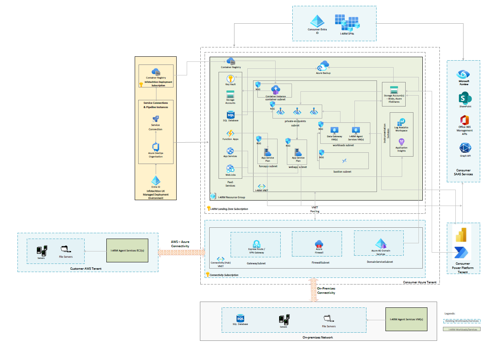

**Key Architectural Components**

1.  **Identity and Access Management**
    *   i-ARM utilizes **Microsoft Entra ID (Azure AD)** for authentication and authorization, ensuring secure access to application services.
    *   Role-based access control (RBAC) and conditional access policies enforce security at the user and system levels.
2.  **Web Application**
    *   The user interface is built using **React with TypeScript**, hosted on **Azure App Service**, and secured with **Microsoft Entra authentication**.
    *   Provides an intuitive interface for users to manage records, configure compliance policies, and generate reports.
3.  **API and Backend Services**
    *   i-ARM exposes RESTful APIs via **Azure Functions (Serverless)** to facilitate integration with Microsoft 365 services like SharePoint, Microsoft Purview, and Power Platform.
    *   Secure communication between services is maintained through **Managed Identity-based authentication**.
4.  **Data Storage and Management**
    *   **Azure SQL Database** serves as the central repository for metadata, compliance rules, and audit logs.
    *   Secure file storage is managed via **Azure Blob Storage** based on compliance policies.
5.  **Compliance and Policy Enforcement**
    *   **Microsoft Purview Compliance Portal** is integrated to manage records retention, disposal, and sensitivity labeling.
    *   Policies are applied dynamically based on metadata, and regulatory requirements.
6.  **On-Premises and Hybrid Integration**
    *   i-ARM supports hybrid environments by integrating with **on-premises scanner services** to classify and index records.
    *   Secure communication between cloud and on-premises resources is enabled via **Azure Virtual Network (VNet) and Private Endpoints**.
7.  **Automation and Workflow Management**
    *   **Power Automate** is leveraged to trigger workflows for approval, notifications.
8.  **Monitoring, Security, and Logging**
    *   **Azure Monitor and Application Insights** track system performance, usage patterns, and potential issues.
    *   **Azure Key Vault** securely manages secrets, connection strings, and encryption keys.

**Scalability and Performance Considerations**

*   **Autoscaling**: Azure App Service and Azure Functions scale dynamically based on workload demands.
*   **Database Performance Optimization**: Query indexing, partitioning, and caching strategies are implemented to ensure optimal performance.

The architecture ensures that i-ARM remains **scalable, secure, and compliant**, aligning with industry best practices and enterprise governance requirements.

# Data Architecture

This section describes the data aspects of the i-ARM product that employs a central relational database for its operations and offerings.

The database used is the PaaS offering from Azure i.e. Azure SQL database that provides numerous advantages e.g. freedom to scale when required, ability to cope up with increasing load and hassle-free management and maintenance reducing the overhead of operations and IT teams.

The table below shows the different architectural criteria considered before finalizing the SQL Azure database as a backend for i-ARM.

| Criteria | Justification |
| --- | --- |
| Reliability | - Built-in high availability with automatic failover configurations ensures minimal downtime.- Active geo-replication configuration possibilities enable creating readable secondary databases in different regions for disaster recovery.- Automatic backups with point-in-time restore ensure data can be restored from any point within the retention period. |
| Scalability | - Easily scale the database up or down to accommodate varying loads without application downtime.- Read replicas configuration possibilities allow scaling read workloads without affecting primary database performance. |
| Maintainability | - Regular maintenance and updates are automatically applied by the Azure platform, reducing manual effort.- Integrated tools like Azure Monitor and SQL Analytics provide insights into performance and health, aiding in proactive maintenance.- Intelligent features like automatic tuning and recommendations help optimize performance automatically. |

The following table outlines various personas and actors engaging with the i-ARM database through the i-ARM portal, along with a brief description of the nature of their interactions.

| Capability | Description |
| --- | --- |
| i-ARM Authenticated User Personas | Application users interacting with the i-ARM services with their roles e.g. Administrators, records administrators etc. |
| i-ARM application process and backend workers | Service to service connectors to perform data read and write actions to the i-ARM tables in the database. |

## Data Access and Utilization

i-ARM leverages Azure SQL Database as its central data repository. The table provided above identifies the various actors interacting with the database, while the data flow diagram illustrates the nature of these interactions and the movement of data into and out of the database.

Please refer to the logical data model below for a general understanding of i-ARM's backend, which highlights the primary components of the data store and their significance.

Additionally, the table provides an overview of how different personas and services securely access and utilize the Azure SQL Database by leveraging Azure AD authentication, role-based access control, and network security features.

| Persona/Service | Access Type | Description of Data Access | Security Measures |
| --- | --- | --- | --- |
| i-ARM Web Application | Read/Write | Accesses the database to perform CRUD (Create, Read, Update, Delete) operations for the application logic. | - Azure AD authentication for service principal credentials- SQL Firewall rules to restrict access by IP- Managed identities for authentication |
| Database Admin | Read/Write | Responsible for database setup, maintenance, and monitoring, with access to all data and schema modifications. | - Azure AD authentication with MFA (on approval)- Role-based access control (RBAC)- Activity logging and auditing |
| I-ARM Reporting Layer | Read | Queries the database for reporting and analytics purposes, without modifying data. | - Azure AD authentication with MFA- Read-only database roles |
| i-ARM Backend Services | Read/Write | Accesses the database to perform CRUD (Create, Read, Update, Delete) operations for the backend logic. | - Managed identities for authentication- IP firewall rules for allowed services- Role-based access control (RBAC) |

## Logical Data Model

The section below shows the generalised data model of i-ARM system that primarily makes use of the SQL Azure database for storing its configurations and operational data.

*   The i-ARM solution leverages the best practices in the industry for database design and management while utilizing Azure SQL Database as its central data repository.
*   The Azure SQL Database ensures that the solution can scale effortlessly to meet varying loads and provide optimal performance.
*   Integrated tools such as Azure Monitor and SQL Analytics provide insights into performance and health, aiding in proactive maintenance to address potential issues before they arise.
*   While the general data architecture and management principles are described, the detailed schema and database design pertaining to each module remain confidential and are managed by Infotechtion to protect intellectual property and ensure data security.

The design below shows the high-level schema of underlying key tables used by i-ARM and their relationship with different tables in the system. The database is normalized with third normal form standard to achieve data integrity, efficient storage, flexibility as well as the query performance for the reporting.

**Data security and compliance:**

*   Due to the use of Azure SQL database offering as the backend of i-ARM, the Data at rest is encrypted using Transparent Data Encryption (TDE).
*   Role-based access control (RBAC) ensures that users have access only to the data they need.

i-ARM data model uses indexes to ensure queries are executed in efficient manner.

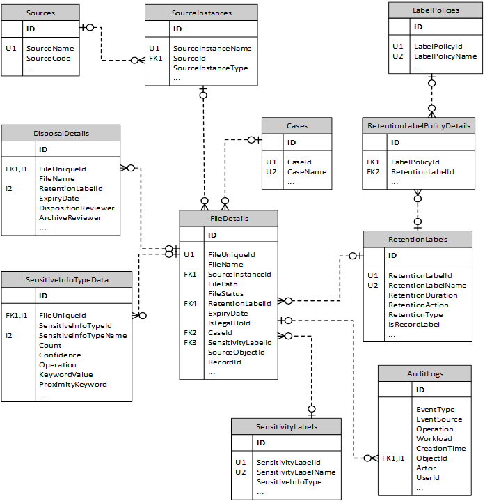

## Data Flow

The data flow diagram shows how data moves through the i-ARM system across different modules.

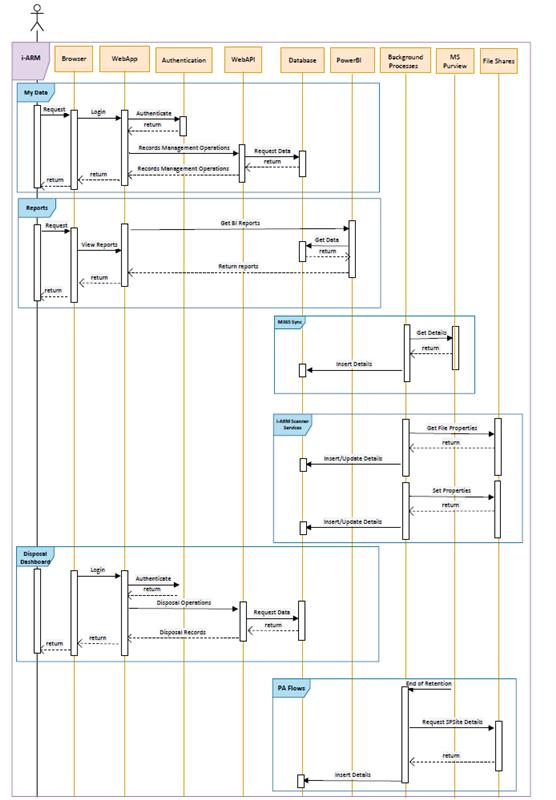

The section below explains the general flow of the data within i-ARM

1.  User requests for login
    *   Action: The user opens the i-ARM portal in their browser and inputs their login credentials issued by Microsoft 365 Tenant.
    *   System Response: The credentials are sent to the WebApp, which forwards them to the Authentication service for verification.
2.  User Successfully Authenticates and Logs into i-ARM Portal
    *   Action: The Authentication service (Azure AD) verifies the user's credentials.
    *   System Response: If the credentials are valid, the user is granted access to the i-ARM portal, and the WebApp redirects the user to the home page.
3.  My Data Page Requests Web API to Get Source Instances
    *   Action: The user navigates to the My Data page within the i-ARM portal.
    *   System Response: The WebApp sends a request to the Web API to retrieve a list of source instances items from the Database for the logged in user.
4.  User Performs Various Operations on Listed Items in My Data
    *   Action: The user interacts with the My Data screen to perform various operations. The available operations include:
    *   Assign metadata and label: The user selects one or more items and assigns a label and/or metadata.
    *   System Response: Each operation sends a request to the Web API, which interacts with the Database to update the status of the items based on the user's actions.
5.  Disposal Dashboard Page Requests Web API to Get Disposable Items
    *   Action: The user navigates to the Disposal Dashboard page within the i-ARM portal.
    *   System Response: The WebApp sends a request to the Web API to retrieve a list of disposable items from the Database.
6.  Disposable Items are Visible in Grid View
    *   Action: The Web API retrieves the list of disposable items from the Database.
    *   System Response: The Web API returns the data to the WebApp, which displays the items in a grid view on the Disposal Dashboard page.
7.  User Performs Various Disposal Operations on Listed Items
    *   Action: The user interacts with the grid to perform various disposal operations. The available operations include:
    *   Dispose Items: The user selects one or more items and marks them for disposal.
        *   Extend Retention Period: The user selects items and changes their retention period to a later date.
        *   Re-Label/Change Retention Label: The user changes the retention label of selected items.
        *   Archive Items: The user archives selected items for long-term storage.
    *   System Response: Each operation sends a request to the Web API, which interacts with the Database to update the status of the items based on the user's actions.
8.  User Requests Reports
    *   Action: The user selects the Reports option in the i-ARM portal and specifies the type of report they need.
    *   System Response: The WebApp sends a request to Power BI to generate the required report. Power BI retrieves the necessary data from the Database and processes it to generate the report, which is then returned to the WebApp and displayed to the user.
9.  PA Flow: The section below describes the Power Automate Flows deployed as a part of the i-ARM system deployment within BoE Power Automate Environment.
    *   Disposal Actions Flow: This flow gets triggered daily, it picks items disposed or relabelled from i-ARM portal. Fetched item(s) details are sent to MS Purview for disposition/ re-labelling and Database is updated with proper status to keep track.
    *   Business Reviewers Disposition: This is triggered when an item reaches the end of its retention period. It retrieves to be disposed item details by making request to respective SharePoint site. Retrieved data or items details are inserted into database. Once it is inserted in database its available for disposition from i-ARM portal.
    *   Business and Archive Reviewers: Flow is same as Business Reviewers Disposition, with the only difference being that an item requires an Archive Reviewer User for disposing an item.
    *   Compliance Sync: This is Power Automate flow which will synchronise Retention Labels from MS Purview and insert details of retention label into database.

The data flow diagram shows how data moves through the PRM, SharePoint and i-ARM

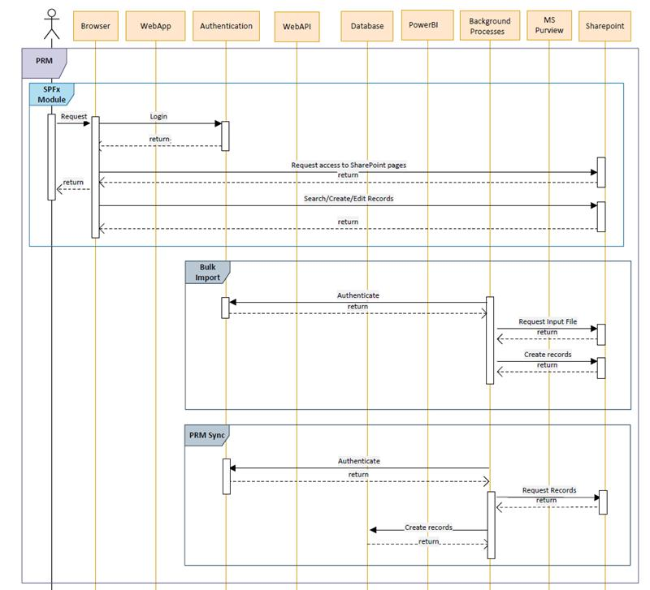

The section below explains the general flow of the data within PRM, SharePoint and i-ARM

1.  Physical Records Management:

*   **SPFx Module:** This module is a SharePoint solution which handles creation and management of Physical Records.
    *   User requests login.
        *   *   Action: User opens the browser and inputs their login credentials issued by Microsoft 365 Tenant.
            *   System Response: The credentials are authenticated by M365’s authentication mechanism and the user are logged in.
    *   Login request to SharePoint authentication mechanism.
        *   *   Action: User credentials are passed on to M365 Tenant’s own authentication mechanism.
            *   System Response: User is authenticated from Microsoft’s end.
    *   After successful login user will request access to SharePoint
        *   *   Action: After successful log in users will need to request for SharePoint site/pages where our solution is deployed if they do not have the access already.
            *   System Response: Users will then be able to view all the search pages and pages where custom forms are implemented.
    *   User interacts with SharePoint via custom search pages and forms which are designed.
        *   *   Action: User may try to perform any of operations which are search, create, edit, view physical records using our solution.
            *   System Response: Solution will respond accordingly based on the operations performed.
                *   Search operation will return search results.
                *   Create operation will return display form with created entry.
                *   Edit operation will return display form with edited entries.
                *   View operation will return display form with relevant details.
*   **Bulk Import:** This module is a background process which creates physical records based on the records added in csv format.
    *   Timer trigger function runs after every interval to pick input file for processing.
        *   *   Action: Request to authenticate using AAD certificate.
            *   System Response: On successful response, access token is returned to the background process.
    *   Requests for input file to process.
        *   *   Action: After getting access token, process checks SharePoint list for input file.
            *   Response: Returns files whose status is “New.”
    *   Start processing the input file.
        *   *   Action: Once the input file is received, system starts processing the data and creates records in SharePoint list.
            *   Response: Returns the response message of success/fail while creating records.
    *   The i-ARM solution leverages capabilities of the PnP framework i.e. specifically the PnP search web part to provide search functionality within the physical records management feature.
*   **PRM Sync:** This module is a background process which sync the physical and archive box records into i-ARM.
    *   Timer trigger function runs after every interval to pick items eligible items to be synced to i-ARM.
        *   *   Action: Request to authenticate using Entra ID.
            *   System Response: On successful response, access token is returned to the background process.
    *   Requests for eligible items to process.
        *   *   Action: After getting access token, process checks SharePoint list for eligible items.
            *   Response: Returns items (New/Modified)
    *   Start Syncing the items.
        *   *   Action: Once the eligible items are received, system starts processing the data and creates/updates records in i-ARM Data Store.
            *   Response: Returns the response message of success/fail while creating records.

# System Design

## Disaster Recovery and Resilience

### Resilience

i-ARM application is built on native Azure features which are designed to be resilient in terms of failure tolerance, hardware workloads and network workloads utilizing the underlying infrastructure HA. The table below provides the overview of the scalability and resilience features of each container, along with the rationale for technology selection.

| i-ARM Container | Scalability | Resilience | Technology Choice |
| --- | --- | --- | --- |
| Identity Applications | Automatically scales to handle more users.Supports multi-tenant environments. | High availability with SLA guarantees.Built-in redundancy. | Microsoft Entra IDReason: Preferred for its seamless integration with other Microsoft services and enterprise-level identity management capabilities. |
| Web Application | Scales out automatically using Azure App Service.Can handle increased traffic with minimal configuration. | SLA-backed high availability.Automatic backups and disaster recovery options. | Azure Web AppReason: Chosen for its simplicity and powerful features for web app hosting, offering better ease of use and deployment flexibility. |
| Networking | VNet scales to accommodate growing services and endpoints.Flexible configuration to optimize traffic flow. | High availability and redundancy within Azure regions.Supports VPN and ExpressRoute for secure, resilient connections. | Azure Virtual NetworkReason: Offers superior integration with Azure services and enhanced security features. |
| API Applications | Automatically scales with demand using Azure Functions.Handles spikes in traffic efficiently. | Built-in fault tolerance and redundancy.Durable Functions for stateful workflows ensure resilience. | Azure FunctionsReason: Chosen for its serverless architecture, reducing overhead and cost compared to Azure App Services, which are better for full-fledged applications rather than lightweight, event-driven tasks. |
| Background Applications | Serverless scaling with Azure Functions.Scales according to the workload with no pre-provisioning needed. | Durable Functions ensure reliability of long-running processes.High availability and disaster recovery options. | Azure Functions, Power AutomateReason: These serverless offerings provide a more flexible and scalable solution for background tasks. |
| Dashboards & Reports | Can handle large datasets and concurrent report access. | SLA-backed service reliability. | Power BI Report FilesReason: Power BI offers advanced analytics and visualization capabilities that integrate seamlessly with Azure services, providing more robust features. |
| Database | Azure SQL Database can accommodate larger datasets and higher query volumes. | High availability with geo-replication can be configured.Automated backups and point-in-time restore. | Azure SQL DatabaseReason: Selected for its fully managed service with strong integration options and built-in intelligence, offering better overall performance and manageability. |
| Data Gateway | Can be configured to manage increasing data loads between on-premises data sources and cloud services.Optimized for large data transfers. | Infrastructure services managed by Azure for reliability. | Azure VM (IaaS)Reason: Using Azure VM provides more control and customization for data transfer processes. |

### Disaster Recovery

Table below outlines the high-level overview of the DR scenario and steps involved from i-ARM Azure solution component’s standpoint.

| Step | Action | Description |
| --- | --- | --- |
| Initiate Disaster Recovery Plan | - Assess the Situation- Notify Stakeholders | - Quickly determine the extent and impact of the disaster.- Inform relevant stakeholders and teams about the disaster and the activation of the recovery plan. |
| Deploy Infrastructure in Secondary Region | - Execute Infrastructure as Code (IaC) Templates | - Deploy Terraform scripts to provision necessary Azure resources (Storage Accounts, VNet, Web App, Function Apps, and SQL Database) in the secondary region. |
| Restore Data | - Restore Data | - Azure SQL Database Geo-Restore Utilize geo-replicated backups to restore the SQL Database in the secondary region.- Azure Storage Account Failover Confirm that Microsoft has initiated the failover process for GZRS-configured storage accounts, making the replicated data available in the secondary region. |
| Deploy Solution Components | - Trigger CI/CD Pipelines- Configuration and Testing | - Deploy application code and configurations to the newly provisioned infrastructure using CI/CD pipelines.- Ensure that application components are correctly configured and perform necessary testing to confirm functionality. |
| User Acceptance Testing (UAT) | - End-to-End Testing- User Acceptance Testing (UAT) | - Conduct comprehensive tests to ensure that all components of the solution are operational.- Perform UAT to verify that the solution meets business requirements and functions as expected. |
| Monitor and optimize | - Continuous Monitoring- Communication Status | - Monitor the solution for any issues and optimize performance as needed.- Update stakeholders on the status of the recovery process and any follow-up actions required. |
| Post-Recovery Review | - Documentation and Reporting- Stakeholder Communication | - Document the recovery process, capturing lessons learned and identifying areas for improvement.- Provide a detailed report to stakeholders, summarizing the recovery efforts and the next steps. |

By following these high-level steps, the i-ARM solution can be effectively brought back to service in a disaster scenario, ensuring minimal downtime and data loss.

### Backup Policy

*   The i-ARM employs backup policies to ensure data integrity and compliance with regulatory standards using Azure native features.
*   Both Azure SQL Database and Azure Storage Accounts within i-ARM are subject to these backup policies.
*   Azure SQL Databases are configured with built-in high availability and automated backups using Point-in-Time Restore (PITR) and Long-Term Retention (LTR) capabilities, ensuring that the data can be restored from any point within the retention period configured.
*   All critical data stored in Azure Storage Accounts, archived files, and other relevant information, are backed up regularly using Azure Backup. This ensures that in the event of accidental deletion or corruption, data can be quickly restored to its state at a previous point in time.
*   These backup policies are configurable, allowing APA Corp to configure the retention period according to their specific compliance requirements.

## Performance Optimization & Bandwidth Considerations

*   API rate limiting & caching: Cache is implemented to optimize API response times and reduce database load.
*   Optimized network bandwidth usage: Compression, and adaptive streaming reduce data transfer latency.
*   Query optimization: Indexing and partitioning strategies are applied to Azure SQL for fast data retrieval.
*   Real-time monitoring: Azure Application Insights tracks latency, response times, and error rates, allowing proactive optimization.

# Security & Identity Management

Security is a critical component of the i-ARM solution, ensuring data integrity, compliance, and protection against unauthorized access. The solution adheres to industry best practices and enterprise security standards to safeguard sensitive information.

## Authentication & Authorization

*   i-ARM leverages **Microsoft Entra ID (Azure AD)** for authentication and role-based access control (RBAC).
*   **Single Sign-On (SSO)** and **Multi-Factor Authentication (MFA)** are enforced to enhance security.
*   **Managed Identity** is used for secure authentication between services, reducing the need for explicit credentials.
*   Fine-grained access control is implemented through **custom roles and Azure RBAC policies**, ensuring users have only the necessary permissions.

## Secure Access & Connectivity

*   All i-ARM services are deployed within a **secure Azure Virtual Network (VNet)**, ensuring restricted access.
*   **Private Endpoints** are used for Azure SQL, Azure Storage, and other cloud resources, preventing exposure to the public internet.
*   **Conditional Access Policies** enforce security rules based on device compliance, geographic location, and risk-based authentication signals.
*   **Firewall rules and Network Security Groups (NSGs)** limit inbound and outbound traffic to only authorized applications and users.

## Data Protection & Encryption

*   **Encryption at rest:** Data stored in Azure SQL Database; Azure Blob Storage is encrypted using **Microsoft-managed keys**.
*   **Encryption in transit:** All data exchanged between services and users is encrypted using **TLS 1.2+** to prevent interception.
*   **Sensitive information masking:** Dynamic data masking and **Transparent Data Encryption (TDE)** are used to limit exposure to sensitive records.
*   **Secure data retention policies:** Microsoft Purview ensures that records follow strict **data lifecycle management** policies to prevent unauthorized access or premature deletion.

## Security Logging, Monitoring, & Alerting

*   **Azure Monitor & Log Analytics** track authentication attempts, access logs, and system performance.
*   **I-ARM** can be integrated with the customer SIEM solution for advanced security analytics and automated response to incidents.
*   Alerts and notifications are configured for **anomalous activities, unauthorized access attempts, and compliance violations**, ensuring quick response to potential threats.

# Service Operations & Maintenance

## Deployment

### Deployment Strategy

The i-ARM deployment strategy follows a structured, automated, and secure approach using Azure DevOps pipelines and Infrastructure as Code (IaC) to ensure consistency, scalability, and minimal downtime. The deployment is aligned with Microsoft’s recommendations ensuring security, operational efficiency, and compliance.

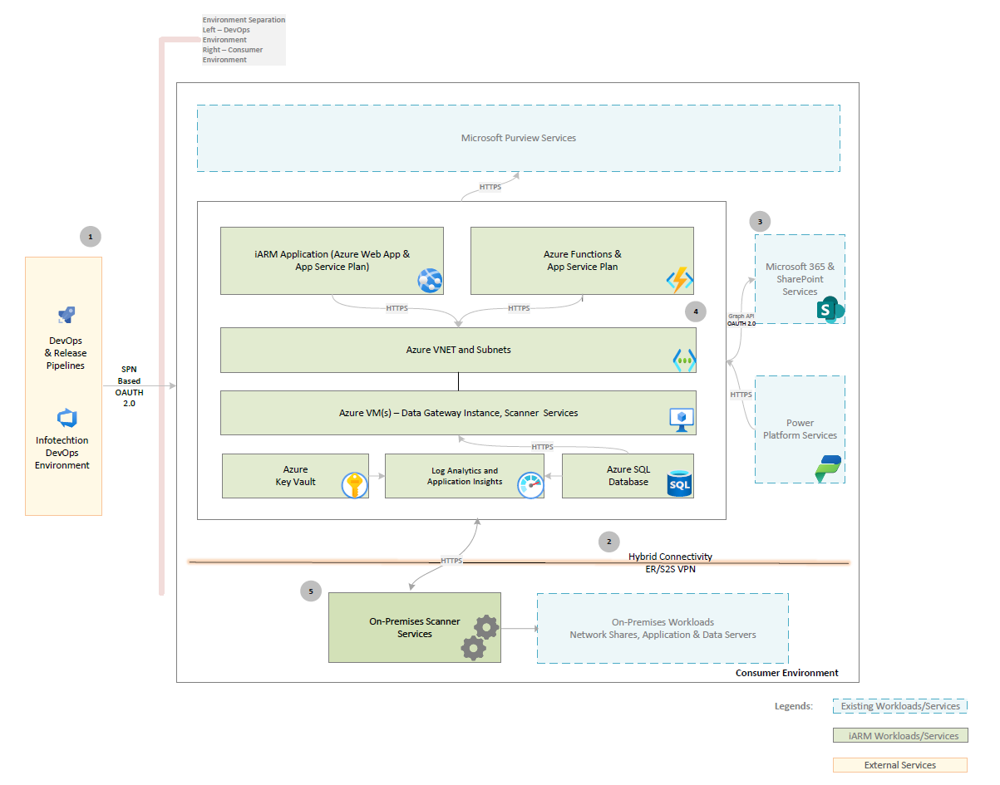

### Deployment Methodology

The deployment of i-ARM follows a **CI/CD pipeline-driven** approach to maintain consistency and automation across environments:

1.  **Continuous Integration (CI)**:
    *   Developers push code changes to **Azure DevOps Git repositories**.
    *   Code undergoes **automated testing**, including unit tests and security scans.
    *   Builds are validated against **quality and compliance gates** before moving to the next stage.
2.  **Continuous Deployment (CD)**:
    *   **Infrastructure provisioning** using **Bicep templates** ensures consistent environment setup.
    *   Application components, including **Azure Functions, Web Apps, APIs, and Database**, **VMs** are deployed automatically.
    *   Configurations are **environment-specific** and handled using **Azure Key Vault and DevOps variable groups**.

## Service Monitoring & Logging

## Change & Versioning Strategy

## Patching & Updating Policies

# References

*   i-ARM Configuration Design Document: [i-ARM Configuration Design | i-ARM Docs](https://docs.infotechtion.com/docs/tech-docs/ConfigurationDesign)
*   i-ARM Target Operating Model: [Target Operating Model | i-ARM Docs](https://docs.infotechtion.com/docs/tech-docs/Targetoperatingsystem)
*   i-ARM Deployment Guide: [DeploymentGuide | i-ARM Docs](https://docs.infotechtion.com/docs/tech-docs/DeploymentGuide)
