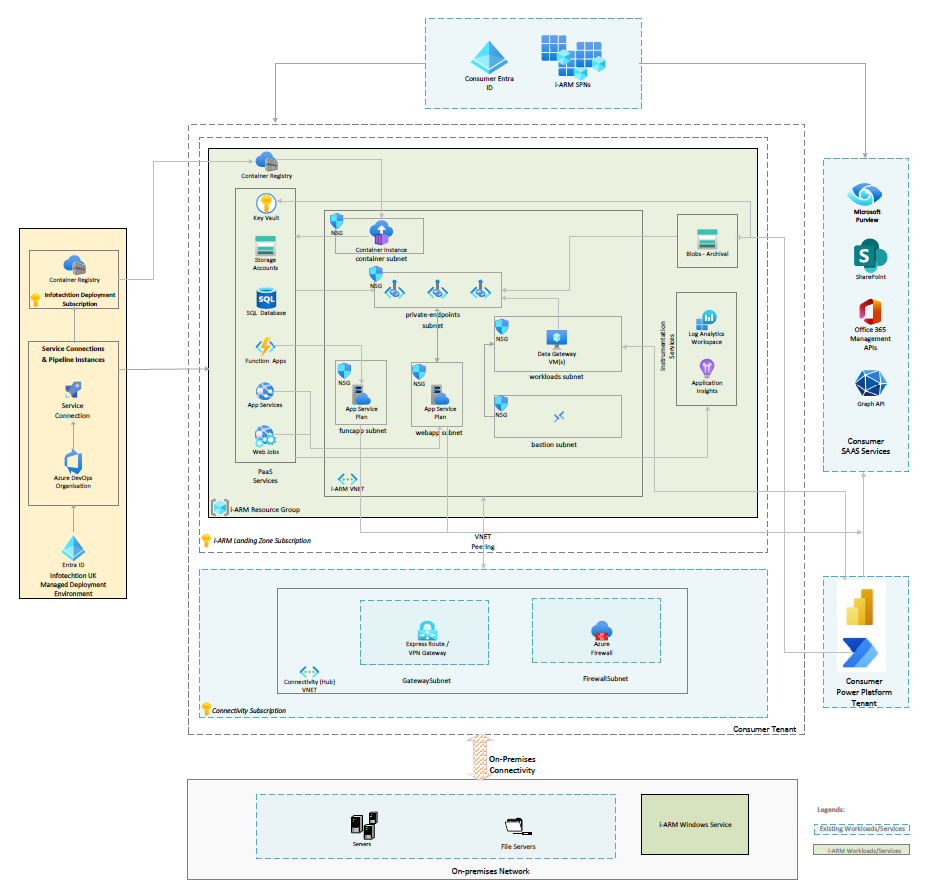

# i-ARM Configuration Design

Last Updated: 2024-12

Prepared By: i-ARM Devops Team;Vivek.B@infotechtion.com

Prepared For: Consumer Architects

# STANDARDS

## Naming Standards

The naming standards and guidelines for Azure resources followed by the i-ARM are described in this section. Following recommended naming conventions makes managing resources in the Azure environment easier, increases clarity, and makes resource grouping and recognizing them simpler.

Note: In Azure, there are several types of resources that must have globally unique names. These resources are typically part of services that need to be accessible worldwide, so the names are unique across all tenants in Azure.

Below is the list of I-ARM resources which should have unique name

* Azure Key Vault
* Azure Container Registry
* Azure SQL Database Server
* Azure App Service (Web Apps & Function Apps)
* Azure Storage Account

| **Azure Component** | **Standard** |
| --- | --- |
| Application Registration | spn-\<azureserviceabbr\>-iarm-\<purpose\>-\<env\> |
| Resource Group Name | rg-iarm-\<purpose\>-\<regionabbr\>-\<env\> |
| Azure Services (Without Storage Accounts) | \<azureserviceabbr\>-iarm-\<iarmmodule\>-\<regionabbr\>-\<env\> |
| Azure Storage Account | \<azureserviceabbr\>iarm\<iarmmodule\>\<regionabbr\>\<env\> **(This should always be less than 24 characters)** |
| Security Groups | sg-\<azureserviceabbr\>-iarm-\<purpose\>-\<env\> |
| Virtual Machine | \<azureserviceabbr\>\<iarm\>\<purpose\>\<regionabbr\>\<env\> **(This should always be less than 15 characters)** |
| General Names | Must include iarm to clearly identify a dedicated use of iarm. |

## Acronyms

| **Acronym** | **Description** |
| --- | --- |
| MS | Microsoft |
| SPN | Service Principal |
| WAPP | Web application |
| IARM | Infotechtion-ARM |
| UIDIRECTORYACCESS | User interface directory access |
| PRD | Production |
| FUNC | Function |
| APIAUTH | Application Programming Interface Authentication |
| GRAPHAPI | Graph API |
| DEVOPSCONN | Azure Devops Connection |
| MYDISPPA | My Disposal Power Automate |
| SPOACCESS | SharePoint Online Access |
| SQL | Structured Query Language |
| SG | Service Group |
| SVC | Service |
| VNET | Virtual Network |
| RG | Resource Group |
| WEBAPP | Web Application |
| FUNCAPP | Function Application |
| PE | Private Endpoint |
| KV | Key Vault |
| ASP | Active Server Pages |
| MYDISP | My Disposal (feature of iARM) |
| UI | User interface |
| VM | Virtual Machine |
| IAC | Infrastructure as a code |
| PRM | Physical Records Management |
| SPFx | SharePoint Framework |
| PnP | Patterns and Practices |
| PBI | Power BI |
| DG | Data Gateway |
| RDP | Remote Desktop |
| WJ | Web Job |
| ACI | Azure Container Instance |
| ACR | Azure Container Registry |
| AFS | Azure File Share |
| NFS | Network File Share |
| MPIP | Microsoft Purview Information Protection |

# Overview

## Design Architecture

| **Ref** | **Source Name** | **Target Name** | **Protocols** | **Data Gateway** | **VNet** | **Target’s Inbound Port** | **Firewall** | **Authentication method** |
| --- | --- | --- | --- | --- | --- | --- | --- | --- |
| 1 | MS Purview – i-ARM Power Automate | i-ARM SQL Data store | TCP / HTTPS: \<confirmed during implementation\> | Y | Source: N  Target: N | 1433 | Y –native | SQL Authentication |
| 2 | i-ARM Function Apps | MS Purview | HTTPS: \<confirmed during implementation\> | N | Source: Y  Target: N | 443 | N | Dedicated Service Principal  (OAUTH) |
| 3 | i-ARM Function Apps | i-ARM SQL Data store | TCP / HTTPS: \<confirmed during implementation\> | N | Source: Y  Target: N | 1433 | Y –native | Entra Managed Identity  (OAUTH) |
| 4 | i-ARM Function Apps | Application Insights/Log Analytics | HTTPS: \<confirmed during implementation\> | N | Source: Y  Target: N | 443 | N | Instrumentation Key |
| 5 | i-ARM Function apps | SharePoint Online | HTTPS: \<confirmed during implementation\> | N | Source: Y  Target: N | 443 | N | Dedicated Service Principal  (OAUTH) |
| 6 | i-ARM Power Automate | Key Vault | HTTPS: \<confirmed during implementation\> | N | Source: N  Target: N | 443 | Y –native | Entra Cloud Service Account |
| 7 | i-ARM Power Automate | Storage Account | HTTPS: \<confirmed during implementation\> | N | Source: N  Target: N | 443 | Y –native | Entra Cloud Service Account |
| 8 | i-ARM Power Automate | SharePoint Online | HTTPS: \<confirmed during implementation\> | N | Source: N  Target: N | 443 | N | Dedicated Service Principal  (OAUTH) |
| 9 | i-ARM Function Apps | Key Vault | HTTPS: \<confirmed during implementation\> | N | Source: Y  Target: N | 443 | Y –native | Entra Managed Identity  (OAUTH) |
| 10 | i-ARM WebApp (App Service) | i-ARM Function apps | HTTPS: \<confirmed during implementation\> | N | Source: Y  Target: Y | 443 | N | Entra Managed Identity  (OAUTH) |
| 11 | i-ARM WebApp (App Service) | Graph APIs  graph.microsoft.com/\* | HTTPS: \<confirmed during implementation\> | N | Source: Y  Target: N | 443 | N | Dedicated Service Principal  (OAUTH) |
| 12 | i-ARM Function Apps | Graph APIs  graph.microsoft.com/\* | HTTPS: \<confirmed during implementation\> | N | Source: Y  Target: N | 443 | N | Dedicated Service Principal  (OAUTH) |
| 13 | i-ARM Web Job (App Service) | Graph APIs  graph.microsoft.com/\* | HTTPS: \<confirmed during implementation\> | N | Source: Y  Target: N | 443 | N | Dedicated Service Principal  (OAUTH) |
| 14 | i-ARM Web Job (App Service) | i-ARM SQL Data store | TCP / HTTPS: \<confirmed during implementation\> | N | Source: Y  Target: N | 1433 | Y –native | Entra Managed Identity  (OAUTH) |
| 15 | i-ARM Web Job (App Service) | Key Vault | HTTPS: \<confirmed during implementation\> | N | Source: Y  Target: N | 443 | Y –native | Entra Managed Identity  (OAUTH) |
| 16 | i-ARM Web Job (App Service) | Office Management API  manage.office.com/api/\* | HTTPS: \<confirmed during implementation\> | N | Source: Y  Target: N | 443 | N | Dedicated Service Principal  (OAUTH) |
| 17 | i-ARM Function Apps | Office Management API  manage.office.com/api/\* | HTTPS: \<confirmed during implementation\> | N | Source: Y  Target: N | 443 | N | Dedicated Service Principal  (OAUTH) |
| 18 | Infotechtion i-ARM DevOps | Resource Group | HTTPS: \<confirmed during implementation\> | N | Source: N  Target: N | 443 | N | Dedicated Service Principal  (OAUTH) |
| 19 | Power BI | i-ARM SQL Data store | TCP / HTTPS: \<confirmed during implementation\> | Y | Source: N  Target: N | 1433 | Y –native | SQL Authentication |
| 20 | Landing Zone i-ARM Container Registry | Infotechtion Container registry | TCP / HTTPS: \<confirmed during implementation\> | N | Source: N Target: N | 443 | Y - native | Dedicated Service Principal  (OAUTH) |
| 21 | i-ARM Container Instance | Landing Zone i-ARM Container Registry | TCP / HTTPS: \<confirmed during implementation\> | N | Source: Y Target: N | 443 | Y - native | Entra Managed Identity  (OAUTH) |
| 22 | i-ARM Agent Services | Key Vault | HTTPS: \<confirmed during implementation\> | N | Source: N  Target: N | 443 | Y –native | Entra Cloud Service Account |
| 23 | i-ARM Agent Services | i-ARM SQL Data store | TCP / HTTPS: \<confirmed during implementation\> | N | Source: N  Target: N | 443 | Y –native | Dedicated Service Principal  (OAUTH) |
| 24 | i-ARM Agent Services | Storage Account | HTTPS: \<confirmed during implementation\> | N | Source: N  Target: N | 443 | Y –native | Entra Cloud Service Account |
| 25 | i-ARM Agent Services | Azure File Share and Network File Share | SMB | N | Source: N  Target: N | 445 | Y –native (Storage Account) | Entra Cloud Service Account |

# Azure Governance

## Management Group

This section describes the deployment strategy for the i-ARM solution within the Azure environment, specifically focusing on the use of Management Groups. By utilizing a structured approach to Management Groups, the solution can be efficiently organized and governed within the landing zone, ensuring compliance, security, and streamlined management of resources across multiple subscriptions.

| **Parent** | Landing Zone |
| --- | --- |
| **Management Group** | \<Consumer Landing Zone\> |
| **Azure Monitor** | \<Consumer log analytics workspace for app events\> |

## Subscription

This section outlines the deployment of i-ARM solution within an existing or dedicated Azure subscription in the specified tenancy. All solution components are consolidated within a single Azure resource group, facilitating streamlined management and organization of resources.

| **Tenant** | \<Consumer tenant name\> (\<Consumer tenant id\>) |
| --- | --- |
| **Subscription** | \<Consumer subscription name\> |

## Subscription Resource Providers

This section outlines the configuration of the required Azure subscription resource providers for deploying the i-ARM solution within the Azure subscription identified for i-ARM in the specified tenancy. All necessary resource providers are enabled at the subscription level, ensuring that all i-ARM solution components can be consolidated within a single Azure resource group. This setup facilitates streamlined management and organization of resources, allowing for consistent provisioning, monitoring, and scaling of the solution's components.

Before deploying the i-ARM solution, ensure that the following Azure resource providers are registered within the subscription by the subscription owner:

| **Ref** | **Resource Provider** | **Description** |
| --- | --- | --- |
| **1** | **Microsoft.DomainRegistration** | Manages domain registrations for custom domains in Azure. |
| **2** | **Microsoft.Network** | Provides networking capabilities, including Virtual Networks, Load Balancers, and Network Security. |
| **3** | **Microsoft.Advisor** | Delivers best practice recommendations for cost, security, reliability, and operational excellence. |
| **4** | **Microsoft.CloudShell** | Supports the Azure Cloud Shell service, a browser-accessible shell environment for managing resources. |
| **5** | **Microsoft.Sql** | Enables provisioning of Azure SQL databases and associated resources. |
| **6** | **Microsoft.MarketplaceNotifications** | Handles notifications related to Azure Marketplace subscriptions and services. |
| **7** | **Microsoft.ServiceLinker** | Facilitates connections between Azure services for resource linking and integrations. |
| **8** | **Microsoft.ManagedIdentity** | Provides Managed Identity for secure service connections without credentials. |
| **9** | **Microsoft.AlertsManagement** | Manages and monitors alerts for various Azure services. |
| **10** | **Microsoft.RecoveryServices** | Manages backup and recovery solutions using Azure Backup and Site Recovery. |
| **11** | **Microsoft.Security** | Manages security solutions and configurations within Azure Security Center. |
| **12** | **Microsoft.Web** | Enables hosting and management of web applications, including Azure App Services and Functions. |
| **13** | **Microsoft.Storage** | Manages Azure Storage accounts including Blob, File Shares, and more. |
| **14** | **Microsoft.Compute** | Provides virtual machines, scale sets, and compute-related resources. |
| **15** | **Microsoft.EventGrid** | Enables event-driven architectures with support for events from Azure resources. |
| **16** | **Microsoft.OperationalInsights** | Provides monitoring and management solutions like Log Analytics and Azure Monitor. |
| **17** | **microsoft.insights** | Enables Azure Monitor features for diagnostics, metrics, and alerts. |
| **18** | **Microsoft.KeyVault** | Manages secure storage and access for secrets, keys, and certificates. |
| **19** | **Microsoft.ResourceHealth** | Provides real-time monitoring of resource health and availability in Azure. |
| **20** | **Microsoft.GuestConfiguration** | Manages guest OS configuration policies and auditing in Azure Virtual Machines. |
| **21** | **Microsoft.PolicyInsights** | Manages policy compliance status and enforcement in Azure resources. |
| **22** | **Microsoft.Logic** | Facilitates workflows using Azure Logic Apps for integration and automation. |
| **23** | **Microsoft.Automation** | Provides automation capabilities for resource management through runbooks and scripts. |
| **24** | **Microsoft.ContainerInstance** | Manages Azure Container Instances (ACI), which allow you to run containers in a fully managed environment without the need for VM provisioning or container orchestration. |
| **25** | **Microsoft.PowerPlatform** | Manages resources related to Microsoft Power Platform, which includes Power Apps, Power Automate, Power BI, and Power Virtual Agents. This provider allows you to create, manage, and integrate Power Platform environments within Azure, enabling the development and deployment of low-code/no-code applications and automation workflows. It's essential for managing Power Platform environments, connections, and integrations with Azure resources. |
| **26** | **Microsoft.ContainerRegistry** | Manages Azure Container Registry (ACR), a managed Docker container registry service provided by Microsoft Azure. It allows you to store and manage Docker container images and artifacts. |

## Azure Policy

This section highlights the importance of Azure Policies in governing the i-ARM solution and ensuring compliance with organizational standards. This section is usually completed with the consumer architecture team, and refers to consumer specific policies as-built in consumer environment.

# Entra

## Application Registration

This section details the process and significance of Microsoft Entra / Azure Active Directory (AD) application registration for the i-ARM solution. Application registration is essential for enabling secure access and authentication for several components of the solution. By registering the application in Entra ID / Azure AD, you can manage permissions, control access to APIs, and ensure secure integration with other Azure services.

**Note:**

* All SPN permissions must have global admin consent to function properly.
* All Service Principal Names (SPNs) utilizing a client secret or certificate should have an expiration date set to a minimum of one year from the date of creation, unless explicitly specified otherwise.

| **Name** | spn-wapp-iarm-uidirectoryaccess-prd | |
| --- | --- | --- |
| **Description** | The service principal used by the i-ARM webapp for hosting the Single-page portal to display the i-ARM user interface and authenticate users against MS Entra ID. | |
| **Single-page app** | https://web-iarm-ui-regionabbr-prd.azurewebsites.net | |
| **Token configuration** | Token type: ID  Optional Claim: login\_hint | |
| **API** | **Permission** | **Type** |
| | Microsoft Graph: User.Read | Delegate |
| | Microsoft Graph: Groupmember.Read.All | Delegate |

| **Name** | spn-func-iarm-apiauth-prd | |
| --- | --- | --- |
| **Description** | The service principal used for operations which relate to Azure function applications required for the functioning of the ‘My Data & My Disposal’ user interface people picker feature. | |
| **Web Redirect** | https://func-iarm-mydata-regionabbr-prd.azurewebsites.net/.auth/login/aad/callback  https://func-iarm-mydisp-regionabbr-prd.azurewebsites.net/.auth/login/aad/callback  \*Pointing to the function apps created | |
| **Expose an API** | **Scope** | **Authorized Client Applications** |
| | Application ID Uri: api://\{ Client ID (spn-func-iarm-apiauth-prd) \}/user\_impersonation  Scope Name: user\_impersonation  Who can consent? Admins and Users  Admin consent display name: user\_impersonation  Admin consent description: Access iarm apis  State: Enabled | \{ Client ID (spn-wapp-iarm-uidirectoryaccess-prd) \} |

| **Name** | spn-func-iarm-urclabelsync-prd | |
| --- | --- | --- |
| **Description** | The service principal is used by the i-ARM URC function app to sync the retention labels from Microsoft Purview to i-ARM Data Store. | |
| **API** | **Permission** | **Type** |
| | Microsoft Graph: User.Read | Delegate |
| | Microsoft Graph: RecordsManagement.ReadWrite.All | Application |
| **Credentials** | **Key Vault** | **Secret Name** |
| | kv-iarm-svc-regionabbr-prd | \{spn name\}-clientid |
| | kv-iarm-svc-regionabbr-prd | \{spn name\}-clientsecret |
| **Certificates & Secrets** | **Client Secret:**  Create a client secret and capture the information in a secure place. This information will be stored in the key vault. | |

| **Name** | spn-func-iarm-graphapi-prd | |
| --- | --- | --- |
| **Description** | The service principal necessary for executing Microsoft Graph API calls from other APIs. | |
| **API** | **Permission** | **Type** |
| | Microsoft Graph: User.Read | Delegate |
| | Microsoft Graph: User.Read.All | Application |
| **Credentials** | **Key Vault** | **Secret Name** |
| | kv-iarm-svc-regionabbr-prd | \{spn name\}-clientid |
| | kv-iarm-svc-regionabbr-prd | \{spn name\}-clientcert |
| **Certificates & Secrets** | **Certificates:**  Upload a certificate (public key) with one of the following file types: .cer, .pem | |

| **Name** | spn-devopsconn-iarm-deploy-prd | |
| --- | --- | --- |
| **Description** | The service principal used for establishing the service connection from target environment to Infotechtion DevOps. | |
| **API** | **Permission** | **Type** |
| | Microsoft Graph: User.Read | Delegate |
| **RBAC** | **Scope** | **Role** |
| | rg-iarm-svc-regionabbr-prd | Contributor |
| **Credentials** | **Key Vault** | **Secret Name** |
| | kv-iarm-svc-regionabbr-prd | \{spn name\}-clientid |
| | kv-iarm-svc-regionabbr-prd | \{spn name\}-clientsecret |
| **Certificates & Secrets** | **Client Secret:**  Create a client secret and capture the information in a secure place. This information will be stored in the key vault. | |

| **Name** | spn-func-iarm-notifications-prd | |
| --- | --- | --- |
| **Description** | The service principal required to send any i-ARM notifications to stakeholders. | |
| **API** | **Permission** | **Type** |
| | Microsoft Graph: User.Read | Delegate |
| | Microsoft Graph: Mail.Send | Application |
| | Microsoft Graph: User.ReadBasic.All | Application |
| **Credentials** | **Key Vault** | **Secret Name** |
| | kv-iarm-svc-regionabbr-prd | \{spn name\}-clientid |
| | kv-iarm-svc-regionabbr-prd | \{spn name\}-clientcert |
| **Certificates & Secrets** | **Certificates:**  Upload a certificate (public key) with one of the following file types: .cer, .pem | |

| **Name** | spn-mydisppa-iarm-spoaccess-prd | |
| --- | --- | --- |
| **Description** | The service principal used for operations which relate to the Power Automate Flows required for the “My Disposal” Module of i-ARM. | |
| **API** | **Permission** | **Type** |
| | Microsoft Graph: User.Read | Delegate |
| | Microsoft Graph: Sites.ReadWrite.All | Application |
| | SharePoint: Sites.Read.All | Application |
| | SharePoint: Sites.FullControl.All | Application |
| **Credentials** | **Key Vault** | **Secret Name** |
| | kv-iarm-svc-regionabbr-prd | \{spn name\}-clientid |
| | kv-iarm-svc-regionabbr-prd | \{spn name\}-clientcert |
| **Certificates & Secrets** | **Certificates:**  Upload a certificate (public key) with one of the following file types: .cer, .pem | |

| **Name** | spn-func-iarm-mydispconnspoaccess-prd | |
| --- | --- | --- |
| **Description** | The service principal used for operations which relate to the M365 Audit Disposal Connector required for the “My Disposal” Module of i-ARM. | |
| **API** | **Permission** | **Type** |
| | Microsoft Graph: User.Read | Delegate |
| | Microsoft Graph: Sites.Read.All | Application |
| | Microsoft Graph: Files.Read.All | Delegate |
| | Microsoft Graph: Files.Read.All | Application |
| | SharePoint: Sites.Read.All | Application |
| **Credentials** | **Key Vault** | **Secret Name** |
| | kv-iarm-svc-regionabbr-prd | \{spn name\}-clientid |
| | kv-iarm-svc-regionabbr-prd | \{spn name\}-clientcert |
| **Certificates & Secrets** | **Certificates:**  Upload a certificate (public key) with one of the following file types: .cer, .pem | |

| **Name** | spn-sql-iarm-sqlaccess-prd | |
| --- | --- | --- |
| **Description** | The service principal used by i-ARM internal services to authenticate with i-ARM SQL leveraging SPN based Entra authentication. This can be changed to use a service account to align with consumer architecture standards. | |
| **API** | **Permission** | **Type** |
| | Microsoft Graph: User.Read | Delegate |
| **External Provider** | CREATE USER [spn-sql-iarm-sqlaccess-prd] FROM EXTERNAL PROVIDER  ALTER ROLE db\_datareader ADD MEMBER [spn-sql-iarm-sqlaccess-prd]  ALTER ROLE db\_datawriter ADD MEMBER [spn-sql-iarm-sqlaccess-prd]  GRANT EXEC TO [spn-sql-iarm-sqlaccess-prd]  Note: A DB admin is required to login to SQL and run the above scripts | |
| **Credentials** | **Key Vault** | **Secret Name** |
| | kv-iarm-svc-regionabbr-prd | \{spn name\}-clientid |
| | kv-iarm-svc-regionabbr-prd | \{spn name\}-clientsecret |
| **Certificates & Secrets** | **Client Secret:**  Create a client secret and capture the information in a secure place. This information will be stored in the key vault. | |

| **Name** | spn-func-iarm-prmprovisioning-prd | |
| --- | --- | --- |
| **Description** | This service principal is used to provide access to specific SharePoint sites to the Sites.Selected permission for the “spn-func-iarm-prmbulkimport-prd” | |
| **API** | **Permission** | **Type** |
| | Microsoft Graph: User.Read | Delegate |
| | Microsoft Graph: Sites.FullControl.All | Application |
| | SharePoint: Sites.FullControl.All | Application |
| **Credentials** | **Key Vault** | **Secret Name** |
| | kv-iarm-svc-regionabbr-prd | \{spn name\}-clientcert |
| **Certificates & Secrets** | **Certificates:**  Upload a certificate (public key) with one of the following file types: .cer, .pem | |

| **Name** | spn-func-iarm-prmbulkimport-prd | |
| --- | --- | --- |
| **Description** | This service principal is required to authenticate and communicate with SharePoint APIs for PRM Bulk Import functionality | |
| **API** | **Permission** | **Type** |
| | Microsoft Graph: User.Read | Delegate |
| | Microsoft Graph: TermStore.Read.All | Application |
| | SharePoint: Sites.Selected | Application |
| **Credentials** | **Key Vault** | **Secret Name** |
| | kv-iarm-svc-regionabbr-prd | \{spn name\}-clientid |
| | kv-iarm-svc-regionabbr-prd | \{spn name\}-clientcert |
| **Certificates & Secrets** | **Certificates:**  Upload a certificate (public key) with one of the following file types: .cer, .pem | |

| **Name** | spn-func-iarm-prmsync-prd | |
| --- | --- | --- |
| **Description** | This service principal is required to authenticate and communicate with SharePoint APIs for PRM Sync functionality to i-ARM | |
| **API** | **Permission** | **Type** |
| | Microsoft Graph: User.Read | Delegate |
| | SharePoint: TermStore.Read.All | Application |
| | SharePoint: TermStore.ReadWrite.All | Application |
| | SharePoint: Sites.Read.All | Application |
| | SharePoint: Sites.ReadWrite.All | Application |
| **Credentials** | **Key Vault** | **Secret Name** |
| | kv-iarm-svc-regionabbr-prd | \{spn name\}-clientid |
| | kv-iarm-svc-regionabbr-prd | \{spn name\}-clientcert |
| **Certificates & Secrets** | **Certificates:**  Upload a certificate (public key) with one of the following file types: .cer, .pem | |

| **Name** | spn-wj-iarm-m365auditsync-prd | |
| --- | --- | --- |
| **Description** | This service principal is required for syncing M365 Audit Logs data to i-ARM Data Store | |
| **API** | **Permission** | **Type** |
| | Microsoft Graph: User.Read | Delegate |
| | Microsoft Graph: AuditLog.Read.All | Application |
| | Microsoft Graph: AuditLogsQuery-SharePoint.Read.All | Application |
| | Microsoft Graph: AuditLogsQuery.Read.All | Application |
| | Office 365 Management APIs: ActivityFeed.Read | Application |
| | Office 365 Management APIs: ActivityFeed.ReadDlp | Application |
| **Credentials** | **Key Vault** | **Secret Name** |
| | kv-iarm-svc-regionabbr-prd | \{spn name\}-clientid |
| | kv-iarm-svc-regionabbr-prd | \{spn name\}-clientsecret |
| **Certificates & Secrets** | **Client Secret:**  Create a client secret and capture the information in a secure place. This information will be stored in the key vault. | |

| **Name** | spn-agent-iarm-downloadarchiveblobs-prd | |
| --- | --- | --- |
| **Description** | The service principal used by the i-ARM agent for reading and downloading blobs stored in the archival storage account. | |
| **API** | **Permission** | **Type** |
| | Microsoft Graph: User.Read | Delegate |
| **RBAC** | **Scope** | **Role** |
| | kv-iarm-svc-regionabbr-prd | Key Vault Secrets User |
| | kv-iarm-svc-regionabbr-prd | Key Vault Certificate User |
| | saiarmarchiveregionabbrprd | Storage Blob Data Reader |
| **Credentials** | **Key Vault** | **Secret Name** |
| | kv-iarm-svc-regionabbr-prd | \{spn name\}-clientid |
| | kv-iarm-svc-regionabbr-prd | \{spn name\}-clientsecret |
| **Certificates & Secrets** | **Client Secret:**  Create a client secret and capture the information in a secure place. This information will be stored in the key vault. | |

| **Name** | spn-agent-iarm-scannerservice-prd | |
| --- | --- | --- |
| **Description** | The service principal used by the i-ARM Scanner agent to authenticate against KeyVault using the certificate installed on the VM. | |
| **API** | **Permission** | **Type** |
| | Microsoft Graph: User.Read | Delegate |
| **RBAC** | **Scope** | **Role** |
| | kv-iarm-svc-regionabbr-prd | Key Vault Secrets User |
| | kv-iarm-svc-regionabbr-prd | Key Vault Certificate User |
| **Certificates & Secrets** | **Certificates:**  Upload a certificate (public key) with one of the following file types: .cer, .pem | |

| **Name** | spn-agent-iarm-mpipscannerservice-prd | |
| --- | --- | --- |
| **Description** | The service principal used by the MPIP Scanner agent to capture sensitive information on files based on the sensitive information types in Microsoft purview portal. | |
| **API** | **Permission** | **Type** |
| | Microsoft Graph: User.Read | Delegate |
| | Microsoft Information Protection Sync Service:  UnifiedPolicy.Tenant.Read | Application |
| | Azure Rights Management Services:  Content.DelegatedReader | Application |
| | Azure Rights Management Services:  Content.DelegatedWriter | Application |
| **Certificates & Secrets** | **Client Secret:**  Create a client secret and capture the information in a secure place. This will be required while configuring the MPIP Scanner service on the Virtual Machine | |

## Group

This part highlights the importance of Entra ID / Azure Active Directory security groups in controlling access and permissions within the i-ARM solution.

| **Name** | sg-sub-iarm-reader-prd | |
| --- | --- | --- |
| **Description** | Read access to the azure subscription where i-ARM would be deployed. | |
| **RBAC** | **Scope** | **Role** |
| | Subscription | Reader |
| **Members** | \<To be confirmed at the time of configuration\> | |

| **Name** | sg-svc-iarm-webappadministrators-prd | |
| --- | --- | --- |
| **Description** | i-ARM persona performing administrative actions within i-ARM. | |
| **RBAC** | **Scope** | **Role** |
| | **NA** |  |
| **Members** | \<To be confirmed at the time of configuration\> | |

| **Name** | sg-svc-iarm-sqlentraadministrators-prd | |
| --- | --- | --- |
| **Description** | Entra ID administrators accessing i-ARM Data Store | |
| **RBAC** | **Scope** | **Role** |
| | **NA** |  |
| **Members** | \<To be confirmed at the time of configuration\> | |

| **Name** | sg-svc-iarm-recordsadministrators-prd | |
| --- | --- | --- |
| **Description** | i-ARM Entra ID group required for the Records Administrator persona | |
| **RBAC** | **Scope** | **Role** |
| | **NA** |  |
| **Members** | \<To be confirmed at the time of configuration\> | |

| **Name** | sg-svc-iarm-ediscoveryadministrators-prd | |
| --- | --- | --- |
| **Description** | i-ARM Entra ID group required for eDiscovery Administrator persona | |
| **RBAC** | **Scope** | **Role** |
| | **NA** |  |
| **Members** | \<To be confirmed at the time of configuration\> | |

## Service/User Accounts

This part highlights the importance of Entra ID / Azure Active Directory service/user accounts in setting up and configuration of the i-ARM solution.

| **Name** | To be Confirmed during engagement | |
| --- | --- | --- |
| **Description** | Account required for importing and configuring the power automate flows. This account should also be added as a Connection Creator in the data gateway  **Note:** If the labels in the Microsoft Purview Compliance portal were created with an account different from the one importing the flow, the flows must be shared with the account that created the labels. Additionally, that account should have an E5 license along with the Power Automate Premium Per User Plan.  If the Power Automate flows are imported into an environment other than the default Power Platform environment, the labels should only be created and managed using PowerShell. [Learn more](https://learn.microsoft.com/en-us/purview/retention-label-flow#limitations-for-this-scenario)| |
| **License** | E5 license with Power Automate Premium Per User Plan (Any plan that supports premium connectors) | |
| **Permissions** | **Scope** | **Role** |
| | Power Automate Environment | Environment Maker Role |
|  | On-Premises Data Gateway (Power Platform Admin Center) | Connection Creator |

| **Name** | To be Confirmed during engagement | |
| --- | --- | --- |
| **Description** | Account identified as a Gateway Admin for the data gateway that is installed and configured | |
| **License** | E5 license | |
| **Permissions** | **Scope** | **Role** |
| | Power Automate Environment | Environment Maker Role |
|  | On-Premises Data Gateway (Power Platform Admin Center) | Gateway Admin |

| **Name** | To be Confirmed during engagement | |
| --- | --- | --- |
| **Description** | Account required to sync the label policies and labels from purview compliance portal. This account would be added to the custom role group created in purview compliance center | |
| **License** | E5 license | |
| **Permissions** | **Scope** | **Role** |
| | Microsoft Purview Compliance Portal | Create a custom role group with the below roles in Microsoft Purview Compliance Center  View-Only Retention Management  View-Only Record Management |

| **Name** | To be Confirmed during engagement | |
| --- | --- | --- |
| **Description** | Account identified for publishing Power BI reports | |
| **License** | E5 license | |
| **Permissions** | **Scope** | **Role** |
| | Power BI Workspace | Owner |
| | Azure SQL Database | db\_datareader |

| **Name** | To be Confirmed during engagement | |
| --- | --- | --- |
| **Description** | Account from which the notification emails would be sent | |
| **License** | E3/E5 | |
| **RBAC** | **Scope** | **Role** |
| | **NA** | **NA** |

| **Name** | To be Confirmed during engagement | |
| --- | --- | --- |
| **Description** | Account used by the windows service for reading and downloading blobs | |
| **License** | E5 license | |
| **Permissions** | **Scope** | **Role** |
| | Azure Storage Account  (saiarmarchiveregionabbrprd) | Storage Blob Data Reader |
| | Azure Key Vault  (kv-iarm-svc-regionabbr-prd) | * Key Vault Secrets User * Key Vault Certificate User |

| **Name** | To be Confirmed during engagement | |
| --- | --- | --- |
| **Description** | Account used by the windows service for scanning the Network File Shares or Azure File Shares | |
| **License** | E5 license | |
| **Permissions** | **Scope** | **Role** |
| | Azure Storage Account  (mounting must be done using the Storage Account access Key) | NA |
| | Network File Share | Read Write access on the file share for scanning  (Write is only necessary if Immutability Feature is enabled) |
| | Azure Key Vault  (kv-iarm-svc-regionabbr-prd) | * Key Vault Secrets User * Key Vault Certificate User |

| **Name** | To be Confirmed during engagement | |
| --- | --- | --- |
| **Description** | Account used by the MPIP Scanner service for installing and scanning the Network File Shares or Azure File Shares | |
| **License** | E5 license | |
| **Other considerations** | There should be at least one sensitivity label policy published to this service account for the MPIP Scanner to start capturing Sensitive information types. The sensitivity label should also have send to audit attribute set to true for the data to be captured in M365 audit logs. Reference: [Enable Audit](https://learn.microsoft.com/en-us/powershell/exchange/client-advanced-settings?view=exchange-ps#enableaudit) | |
| **Permissions** | **Scope** | **Role** |
| | sql-iarmmpip-svc-regionabbr-prd | Sysadmin  [Reference](https://learn.microsoft.com/en-us/purview/deploy-scanner-prereqs#sql-server-requirements) |
| | sql-iarmmpip-svc-regionabbr-prd | db\_owner |
| | Network/ Azure File Share (Mounted on Scanner VM) | Read Write access on the file share for scanning  (Write is only necessary if protection is being applied) |
| | Azure Key Vault  (kv-iarm-svc-regionabbr-prd) | * Key Vault Secrets User * Key Vault Certificate User |

## RBAC Roles

RBAC (Role-Based Access Control) on Azure is a system for managing access to Azure resources by assigning roles to different actors (users, groups, or managed identities)

**Note:** An authorized user from the consumer cloud team with an Owner role on the subscription is required to assign the necessary RBAC roles defined below for the following Azure services.

| **Service** | **Actor** | **Role** | **Actor Type** | **Azure Entra ID Group or Assignment Type** |
| --- | --- | --- | --- | --- |
| **M365 and Azure** | [Global Admin Account] | Global Admin | User | Direct |
| **SharePoint Admin Portal** | [SharePoint Administrator Account] | SharePoint Administrator | User | Direct |
| **Microsoft Purview Portal** | [Records Management Account] | Records Management (Purview Role group) | User | Direct |
| **Azure Subscription Reader** | sg-sub-iarm-reader-prd | Reader | Group | Entra ID Security Group |
| **Azure Resource Group** | spn-devopsconn-iarm-deploy-prd | Contributor | Service Principal | Direct |
| **Azure Key Vault** | sg-sub-iarm-reader-prd | Key Vault Secrets User | Group | Entra ID Security Group |
| | | Key Vault Certificate User | Group | Entra ID Security Group |
| | spn-agent-iarm-downloadarchiveblobs-prd | Key Vault Secrets User | Service Principal | Direct |
| | | Key Vault Certificate User | Service Principal | Direct |
| | spn-agent-iarm-scannerservice-prd | Key Vault Secrets User | Service Principal | Direct |
| | | Key Vault Certificate User | Service Principal | Direct |
| | | spn-devopsconn-iarm-deploy-prd | Key Vault Administrator | Service Principal | Direct |
| | * func-iarm-urc-regionabbr-prd * func-iarm-mydisp-regionabbr-prd * func-iarm-mydata-regionabbr-prd * func-iarm-prmbulk-regionabbr-prd * func-iarm-prmsync-regionabbr-prd * wj-iarm-m365auditsync-regionabbr-prd * func-iarm-m365auditconnector-regionabbr-prd * func-iarm-m365dispconnector-regionabbr-prd | Key Vault Certificate User | Managed Identity | Direct |
| | * func-iarm-urc-regionabbr-prd * func-iarm-mydisp-regionabbr-prd * func-iarm-mydata-regionabbr-prd * func-iarm-prmbulk-regionabbr-prd * func-iarm-prmsync-regionabbr-prd * wj-iarm-m365auditsync-regionabbr-prd * func-iarm-m365auditconnector-regionabbr-prd * func-iarm-m365dispconnector-regionabbr-prd | Key Vault Secrets User | Managed Identity | Direct |
| | [Service Account Importing the PowerAutomate Flows] | Key Vault Certificate User | User | Direct |
| | | Key Vault Secrets User | User | Direct |
| | [Service Account reading and downloading blobs] | Key Vault Certificate User | User | Direct |
| | | Key Vault Secrets User | User | Direct |
| | Dataverse (Common Data Service) | Key Vault Secrets User | Enterprise Application | Direct |
| **Azure SQL Database**  [sql-iarm-svc-regionabbr-prd] | * func-iarm-urc-regionabbr-prd * func-iarm-mydisp-regionabbr-prd * func-iarm-mydata-regionabbr-prd * func-iarm-prmbulk-regionabbr-prd * func-iarm-prmsync-regionabbr-prd * wj-iarm-m365auditsync-regionabbr-prd * func-iarm-m365auditconnector-regionabbr-prd * func-iarm-m365dispconnector-regionabbr-prd | db\_datareader  db\_datawriter | Managed Identity | Direct |
| | spn-sql-iarm-sqlaccess-prd | db\_datareader  db\_datawriter | Service Principal | Direct |
| **Azure SQL Database**  [sql-iarmmpip-svc-regionabbr-prd] | [Service Account identified for MPIP Scanner installation and configuration] | Sysadmin  sb\_owner | User | Direct |
| **Azure Storage Account**  [saiarmprmbulkregionabbrprd] | func-iarm-prmbulk-regionabbr-prd | * Storage Blob Data Contributor * Storage Queue Data Contributor * Storage Table Data Contributor | Managed Identity | Direct |
| **Azure Storage Account**  [saiarmmydispregionabbrprd] | func-iarm-mydisp-regionabbr-prd | Storage Blob Data Contributor | Managed Identity | Direct |
| **Azure Storage Account**  [saiarmmydataregionabbrprd] | func-iarm-mydata-regionabbr-prd | Storage Blob Data Contributor | Managed Identity | Direct |
| **Azure Storage Account**  [saiarmurcregionabbrprd] | func-iarm-urc-regionabbr-prd | Storage Blob Data Contributor | Managed Identity | Direct |
| **Azure Storage Account**  [saiarmprmsyncregionabbrprd] | func-iarm-prmsync-regionabbr-prd | Storage Blob Data Contributor | Managed Identity | Direct |
| **Azure Storage Account**  [saiarm365syncregionabbrprd] | wj-iarm-m365auditsync-regionabbr-prd | * Storage Blob Data Contributor * Storage Queue Data Contributor | Managed Identity | Direct |
| **Azure Storage Account**  [saiarm365connregionabbrprd] | func-iarm-m365auditconnector-regionabbr-prd | Storage Blob Data Contributor | Managed Identity | Direct |
| **Azure Storage Account**  [saiarmdispconregionabbrprd] | func-iarm-m365dispconnector-regionabbr-prd | * Storage Blob Data Contributor * Storage Queue Data Contributor * Storage Table Data Contributor | Managed Identity | Direct |
| **Azure Storage Account**  [saiarmarchiveregionabbrprd] | [Service Account importing the Power Automate Flows] | Storage Blob Data Contributor | User | Direct |
| | [Service Account reading and downloading blobs] | Storage Blob Data Reader | User | Direct |
| | [spn-agent-iarm-downloadarchiveblobs-prd] | Storage Blob Data Reader | Service Principal | Direct |
| **Azure Storage Account**  [saiarmdiappregionabbrprd] | func-iarm-mydata-regionabbr-prd | Storage Blob Data Contributor | Managed Identity | Direct |
| **Azure VM** | sg-sub-iarm-reader-prd | Reader | Group | Entra ID Security Group |
| **Azure Bastion** | sg-sub-iarm-reader-prd | Reader | Group | Entra ID Security Group |
| **Power Platform** | [Service Account Importing the Power Automate Flows] | Environment Maker Role | User | Direct |
| | [Service Account Importing the Power Automate Flows] | Connection Creator | User | Direct |
| | [Service Account for Gateway Admin] | Gateway Admin | User | Direct |
| **Power BI** | [Service Account for Publishing Power BI Reports] | Power BI Workspace Owner | User | Direct |
| **M365 Purview Compliance Portal** | [Service Account for syncing label and label policies from Microsoft Purview Compliance Portal] | View-Only Retention Management  View-Only Record Management | User | Direct |
| **Azure Container Instance** | User managed Identity (ADD Name) | ACR Role | User Managed Identity | Direct |

# Networking

## Virtual Network

This section highlights that the relevant PaaS services for the i-ARM solution are deployed within the Azure Virtual Network. This deployment ensures secure communication and isolation among resources while leveraging the benefits of Azure networking capabilities.

| **Name** | **Resource Group** | **Region** | **Address Space** | **Description** |
| --- | --- | --- | --- | --- |
| vnet-iarm-svc-regionabbr-prd | rg-iarm-svc-regionabbr-prd | \<Consumer Azure region\> | x.x.x.x/22 | A Virtual Network that is essential for securing communication among PaaS services, managing traffic, and ensuring compliance. |

## User Defined Route Tables

The i-arm solution currently operates using the default routing rules associated with the various provisioned subnets, without the implementation of custom routing. However, it is designed to be flexible and can be customized to utilize specific route tables as needed. This customization is particularly useful in scenarios involving a central firewall or when traffic needs to be directed towards a Network Virtual Appliance (NVA).

| **Name** | **Route Name** | **Address prefix** | **Next hope type** | **Next hope IP address** | **Attached Subnet** |
| --- | --- | --- | --- | --- | --- |
| rt-iarm-webapp-regionabbr-prd | To-Internet | 0.0.0.0/0 | Virtual appliance | \< Connectivity Subscription Firewall Private IP Address\> | nsg-iarm-webapp-regionabbr-prd |

| **Name** | **Route Name** | **Address prefix** | **Next hope type** | **Next hope IP address** | **Attached Subnet** |
| --- | --- | --- | --- | --- | --- |
| rt-iarm-funcapp -regionabbr-prd | To-Internet | 0.0.0.0/0 | Virtual appliance | \<Connectivity Subscription Firewall Private IP Address\> | nsg-iarm-funcapp-regionabbr-prd |

| **Name** | **Route Name** | **Address prefix** | **Next hope type** | **Next hope IP address** | **Attached Subnet** |
| --- | --- | --- | --- | --- | --- |
| rt-iarm-pe -regionabbr-prd | To-Internet | 0.0.0.0/0 | Virtual appliance | \< Connectivity Subscription Firewall Private IP Address\> | nsg-iarm-pe-regionabbr-prd |

| **Name** | **Route Name** | **Address prefix** | **Next hope type** | **Next hope IP address** | **Attached Subnet** |
| --- | --- | --- | --- | --- | --- |
| rt-iarm-workloads-regionabbr-prd | To-Internet | 0.0.0.0/0 | Virtual appliance | \< Connectivity Subscription Firewall Private IP Address\> | nsg-iarm-workloads -regionabbr-prd |

## Network Security Groups

The section below outlines the Network Security Groups (NSGs) applied within the Azure Virtual Network for the i-ARM solution. These NSGs play a key role in enhancing security by managing inbound and outbound traffic at the subnet and VM level, minimizing unauthorized access risks. They contribute to optimized performance by filtering unnecessary traffic, enable tailored security rules for different resources, and promote a clear network structure by logically organizing security boundaries. For detailed NSG configurations, please refer to the section below.

| **Name** | **Inbound/**  **Outbound** | **Rule Name** | **Port/**  **Protocol** | **Priority** | **Source** | **Destination** | **Action** | **Description** |
| --- | --- | --- | --- | --- | --- | --- | --- | --- |
| nsg-iarm-webapp-regionabbr-prd | Inbound | AllowVnetInBound | Any | 65000 | VirtualNetwork | VirtualNetwork | Allow | Allows traffic between resources within the same virtual network. |
| | Inbound | AllowAzureLoadBalancerInBound | Any | 65001 | AzureLoadBalancer | Any | Allow | Allows traffic from the Azure load balancer to the resources. |
| | Inbound | DenyAllInBound | Any | 65500 | Any | Any | Deny | Denies all inbound traffic by default. |
| | Outbound | AllowVnetOutBound | Any | 65000 | VirtualNetwork | VirtualNetwork | Allow | Allows outbound traffic between resources within the same virtual network. |
| | Outbound | AllowInternetOutBound | Any | 65001 | Any | Internet | Allow | Allows outbound traffic to the internet. |
| | Outbound | DenyAllOutBound | Any | 65500 | Any | Any | Deny | Denies all outbound traffic by default. |

| **Name** | **Inbound/**  **Outbound** | **Rule Name** | **Port/**  **Protocol** | **Priority** | **Source** | **Destination** | **Action** | **Description** |
| --- | --- | --- | --- | --- | --- | --- | --- | --- |
| nsg-iarm-funcapp-regionabbr-prd | Inbound | AllowVnetInBound | Any | 65000 | VirtualNetwork | VirtualNetwork | Allow | Allows traffic between resources within the same virtual network. |
| | Inbound | AllowAzureLoadBalancerInBound | Any | 65001 | AzureLoadBalancer | Any | Allow | Allows traffic from the Azure load balancer to the resources. |
| | Inbound | DenyAllInBound | Any | 65500 | Any | Any | Deny | Denies all inbound traffic by default. |
| | Outbound | AllowVnetOutBound | Any | 65000 | VirtualNetwork | VirtualNetwork | Allow | Allows outbound traffic between resources within the same virtual network. |
| | Outbound | AllowInternetOutBound | Any | 65001 | Any | Internet | Allow | Allows outbound traffic to the internet. |
| | Outbound | DenyAllOutBound | Any | 65500 | Any | Any | Deny | Denies all outbound traffic by default. |

| **Name** | **Inbound/**  **Outbound** | **Rule Name** | **Port/**  **Protocol** | **Priority** | **Source** | **Destination** | **Action** | **Description** |
| --- | --- | --- | --- | --- | --- | --- | --- | --- |
| nsg-iarm-pe-regionabbr-prd | Inbound | AllowVnetInBound | Any | 65000 | VirtualNetwork | VirtualNetwork | Allow | Allows traffic between resources within the same virtual network. |
| | Inbound | AllowAzureLoadBalancerInBound | Any | 65001 | AzureLoadBalancer | Any | Allow | Allows traffic from the Azure load balancer to the resources. |
| | Inbound | DenyAllInBound | Any | 65500 | Any | Any | Deny | Denies all inbound traffic by default. |
| | Outbound | AllowVnetOutBound | Any | 65000 | VirtualNetwork | VirtualNetwork | Allow | Allows outbound traffic between resources within the same virtual network. |
| | Outbound | AllowInternetOutBound | Any | 65001 | Any | Internet | Allow | Allows outbound traffic to the internet. |
| | Outbound | DenyAllOutBound | Any | 65500 | Any | Any | Deny | Denies all outbound traffic by default. |

| **Name** | **Inbound/**  **Outbound** | **Rule Name** | **Port/**  **Protocol** | **Priority** | **Source** | **Destination** | **Action** | **Description** |
| --- | --- | --- | --- | --- | --- | --- | --- | --- |
| nsg-iarm-workloads-regionabbr-prd | Inbound | AllowVnetInBound | Any | 65000 | VirtualNetwork | VirtualNetwork | Allow | Allows traffic between resources within the same virtual network. |
| | Inbound | AllowAzureLoadBalancerInBound | Any | 65001 | AzureLoadBalancer | Any | Allow | Allows traffic from the Azure load balancer to the resources. |
| | Inbound | DenyAllInBound | Any | 65500 | Any | Any | Deny | Denies all inbound traffic by default. |
| | Outbound | AllowVnetOutBound | Any | 65000 | VirtualNetwork | VirtualNetwork | Allow | Allows outbound traffic between resources within the same virtual network. |
| | Outbound | AllowInternetOutBound | Any | 65001 | Any | Internet | Allow | Allows outbound traffic to the internet. |
| | Outbound | DenyAllOutBound | Any | 65500 | Any | Any | Deny | Denies all outbound traffic by default. |

| **Name** | **Inbound/**  **Outbound** | **Rule Name** | **Port/**  **Protocol** | **Priority** | **Source** | **Destination** | **Action** | **Description** |
| --- | --- | --- | --- | --- | --- | --- | --- | --- |
| nsg-iarm-bastion-regionabbr-prd | Inbound | AllowHttpsInbound | 443 | 120 | Internet | Any | Allow | Allows inbound HTTPS traffic from the internet to any destination. |
| | Inbound | AllowGatewayManagerInbound | 443 | 130 | GatewayManager | Any | Allow | Allows inbound traffic from the Gateway Manager on port 443 to any destination. |
| | Inbound | AllowAzureLoadBalancerInbound | 443 | 140 | AzureLoadBalancer | Any | Allow | Allows inbound traffic from the Azure Load Balancer on port 443 to any destination. |
| | Inbound | AllowBastionHostCommunication8080 | 8080 | 150 | VirtualNetwork | VirtualNetwork | Allow | Allows communication between resources within the virtual network on port 8080. |
| | Inbound | AllowBastionHostCommunication5701 | 8080 | 151 | VirtualNetwork | VirtualNetwork | Allow | Allows communication between resources within the virtual network on port 8080. |
| | Inbound | AllowVnetInBound | Any | 65000 | VirtualNetwork | VirtualNetwork | Allow | Allows traffic between resources within the same virtual network. |
| | Inbound | AllowAzureLoadBalancerInBound | Any | 65001 | AzureLoadBalancer | Any | Allow | Allows traffic from the Azure load balancer to the resources. |
| | Inbound | DenyAllInBound | Any | 65500 | Any | Any | Deny | Denies all inbound traffic by default. |
| | Outbound | AllowSshOutbound | 22 | 100 | Any | VirtualNetwork | Allow | Allows outbound SSH traffic on port 22 to the virtual network. |
| | Outbound | AllowRdpOutbound | 3389 | 101 | Any | VirtualNetwork | Allow | Allows outbound RDP traffic on port 3389 to the virtual network. |
| | Outbound | AllowAzureCloudOutbound | 443 | 110 | Any | AzureCloud | Allow | Allows outbound HTTPS traffic on port 443 to Azure Cloud services. |
| | Outbound | AllowBastionCommunication8080 | 8080 | 120 | VirtualNetwork | VirtualNetwork | Allow | Allows outbound communication on port 8080 within the virtual network. |
| | Outbound | AllowBastionCommunication5701 | 5701 | 121 | VirtualNetwork | VirtualNetwork | Allow | Allows outbound communication on port 5701 within the virtual network. |
| | Outbound | AllowHttpOutbound | 80 | 130 | Any | Internet | Allow | Allows outbound HTTP traffic on port 80 to the internet. |
| | Outbound | AllowVnetOutBound | Any | 65000 | VirtualNetwork | VirtualNetwork | Allow | Allows outbound traffic between resources within the same virtual network. |
| | Outbound | AllowInternetOutBound | Any | 65001 | Any | Internet | Allow | Allows outbound traffic to the internet. |
| | Outbound | DenyAllOutBound | Any | 65500 | Any | Any | Deny | Denies all outbound traffic by default. |

| **Name** | **Inbound/**  **Outbound** | **Rule Name** | **Port/**  **Protocol** | **Priority** | **Source** | **Destination** | **Action** | **Description** |
| --- | --- | --- | --- | --- | --- | --- | --- | --- |
| nsg-iarm-container-regionabbr-prd | Inbound | AllowVnetInBound | Any | 65000 | VirtualNetwork | VirtualNetwork | Allow | Allows traffic between resources within the same virtual network. |
| | Inbound | AllowAzureLoadBalancerInBound | Any | 65001 | AzureLoadBalancer | Any | Allow | Allows traffic from the Azure load balancer to the resources. |
| | Inbound | DenyAllInBound | Any | 65500 | Any | Any | Deny | Denies all inbound traffic by default. |
| | Outbound | AllowVnetOutBound | Any | 65000 | VirtualNetwork | VirtualNetwork | Allow | Allows outbound traffic between resources within the same virtual network. |
| | Outbound | AllowInternetOutBound | Any | 65001 | Any | Internet | Allow | Allows outbound traffic to the internet. |
| | Outbound | DenyAllOutBound | Any | 65500 | Any | Any | Deny | Denies all outbound traffic by default. |

## Subnets

The section below details the subnets within the Azure Virtual Network for the i-ARM solution. This isolation is critical for improving security by containing network traffic and reducing unauthorized access risks, optimizing performance through effective bandwidth management, allowing for personalized application of network security group rules, and improving clarity by logically segmenting resources. For specific subnet configurations, please refer to the section below.

| **Name** | **vNet** | **Address Space** | **Route Table** | **NSG** | **Description** |
| --- | --- | --- | --- | --- | --- |
| subnet-iarm-webapp-regionabbr-prd | vnet-iarm-svc-regionabbr-prd | x.x.x.x/25 | Default | nsg-iarm-webapp-regionabbr-prd | This subnet provides a secure and scalable environment for hosting web applications. |
| subnet-iarm-funcapp-regionabbr-prd | vnet-iarm-svc-regionabbr-prd | x.x.x.x /25 | Default | nsg-iarm-funcapp-regionabbr-prd | This subnet ensures that serverless functions operate within a secure and isolated environment. |
| subnet-iarm-pe-regionabbr-prd | vnet-iarm-svc-regionabbr-prd | x.x.x.x /25 | Default | nsg-iarm-pe-regionabbr-prd | This subnet secures private access to Azure services, ensuring that sensitive data is exchanged without being exposed to the public internet. |
| subnet-iarm-workloads-regionabbr-prd | vnet-iarm-svc-regionabbr-prd | x.x.x.x /25 | Default | nsg-iarm-workloads-regionabbr-prd | This subnet isolates and secures virtual machines, enabling controlled access to VMs. |
| AzureBastionSubnet | vnet-iarm-svc-regionabbr-prd | x.x.x.x /25 | Default | nsg-iarm-bastion-regionabbr-prd | The Bastion subnet enables secure remote access to Azure Virtual Machines (VMs) without exposing them to the public internet. [Learn more](https://learn.microsoft.com/en-us/azure/bastion/configuration-settings) |
| subnet-iarm-container-regionabbr-prd | vnet-iarm-svc-regionabbr-prd | x.x.x.x /25 | Default | nsg-iarm-container-regionabbr-prd | This subnet enhances the network capabilities and security of container instances in Azure. |

# Key Vault

## Vault

Azure Key Vault is a critical component for the i-ARM solution, safeguarding secrets used by services within the i-ARM framework. It provides secure storage for sensitive data such as API keys, passwords, ensuring that they are protected with strong encryption and access policies. Integrated with Entra ID / Azure Active Directory, it enforces strict access controls, allowing only authorized users and applications to retrieve sensitive information.

* Only one key vault is required. All secrets and certificates will be stored in this key vault.

**Note:** The key vault should have the IP addresses of the Power platform to be whitelisted. These IP addresses vary depending on the region where the power platform is hosted.

**Reference:** [Power Platform Outbound IP Addresses](https://learn.microsoft.com/en-us/connectors/common/outbound-ip-addresses#power-platform)

| **Name** | kv-iarm-svc-regionabbr-prd | |
| --- | --- | --- |
| **Description** | Required to securely store and access secrets, certificates, API keys. Access is tightly controlled. | |
| **Resource Group** | rg-iarm-svc-regionabbr-prd | |
| **Region** | UK-SOUTH | |
| **Tier** | Standard | |
| **Access Configuration (Permission Model)** | Azure role-based access control (RBAC) | |
| **Resource Access** | Not required | |
| **Network Access** | Enabled from selected virtual networks and IP addresses\* | |
| **Private Endpoint** | **Name** | kv-iarm-svc-regionabbr-prd-pe |
| | **Subnet** | subnet-iarm-pe-regionabbr-prd |
| | **Private DNS Zone** | privatelink.vaultcore.azure.net |
| **Diagnostics** | Diagnostics logs are sent to the central log analytics workspace of the solution | |

\* An [azure policy exemption](https://learn.microsoft.com/en-us/azure/governance/policy/concepts/exemption-structure) rule needs to be created in the consumer azure portal to exempt the “kv-iarm-svc-regionabbr-prd” key vault from the “[Deny-PublicPaaSEndpoints](https://www.azadvertizer.net/azpolicyinitiativesadvertizer/Deny-PublicPaaSEndpoints.html)” policy to allow configuring the Key Vault firewall with “**Enabled from selected virtual networks and IP addresses**”. This is necessary for Power Automate to read secrets from the “kv-iarm-svc-regionabbr-prd” Key Vault. Since Power Automate is a cloud service, it initiates requests from the public internet and does not operate within the same private network as the key vault.

# Web

## App Service Plan

This section outlines the configurations for the App Service Plan associated with the i-ARM web app and the different Azure Function Apps, all of which are VNET integrated.

The App Service Plan for the i-ARM web app ensures a scalable and high-availability hosting environment with integrated security features and monitoring tools, while the Azure Function Apps are designed to efficiently handle serverless workloads with custom scaling options.

| **Name** | asp-iarm-ui-regionabbr-prd |
| --- | --- |
| **Description** | This app service is used to create and manage the compute resources required by the i-ARM web app supporting the user experience. |
| **Resource Group** | rg-iarm-svc-regionabbr-prd |
| **Region** | \<Consumer Azure region\> |
| **Operating System** | Windows |
| **Pricing Plan** | Standard S2 |
| **Subnet** | subnet-iarm-webapp-regionabbr-prd |

| **Name** | asp-iarm-urc-regionabbr-prd |
| --- | --- |
| **Description** | This app service hosts the compute resources required to synchronize retention labels from Microsoft Purview to i-ARM database. |
| **Resource Group** | rg-iarm-svc-regionabbr-prd |
| **Region** | \<Consumer Azure region\> |
| **Operating System** | Windows |
| **Pricing Plan** | Standard S2 |
| **Subnet** | subnet-iarm-funcapp-regionabbr-prd |

| **Name** | asp-iarm-mydisp-regionabbr-prd |
| --- | --- |
| **Description** | This app service hosts the compute resources required for the business layer of the disposal dashboard and related workflows supporting the i-ARM webapp. This app service provides integration between the i-ARM web app and the i-ARM database. |
| **Resource Group** | rg-iarm-svc-regionabbr-prd |
| **Region** | \<Consumer Azure region\> |
| **Operating System** | Windows |
| **Pricing Plan** | Standard S2 |
| **Subnet** | subnet-iarm-funcapp-regionabbr-prd |

| **Name** | asp-iarm-mydata-regionabbr-prd |
| --- | --- |
| **Description** | This app service hosts the compute resources required for the business layer of the mydata supporting navigation and administration modules in the i-ARM webapp. This app service provides integration between the i-ARM web app and the i-ARM database. |
| **Resource Group** | rg-iarm-svc-regionabbr-prd |
| **Region** | \<Consumer Azure region\> |
| **Operating System** | Windows |
| **Pricing Plan** | Standard S2 |
| **Subnet** | subnet-iarm-funcapp-regionabbr-prd |

| **Name** | asp-iarm-prmbulk-regionabbr-prd |
| --- | --- |
| **Description** | This app service hosts the compute resources required for the bulk import functionality supporting the PRM module. |
| **Resource Group** | rg-iarm-svc-regionabbr-prd |
| **Region** | \<Consumer Azure region\> |
| **Operating System** | Windows |
| **Pricing Plan** | Standard S2 |
| **Subnet** | subnet-iarm-funcapp-regionabbr-prd |

| **Name** | asp-iarm-prmsync-regionabbr-prd |
| --- | --- |
| **Description** | This app service hosts the compute resources required for the sync functionality supporting the PRM module. |
| **Resource Group** | rg-iarm-svc-regionabbr-prd |
| **Region** | \<Consumer Azure region\> |
| **Operating System** | Windows |
| **Pricing Plan** | Standard S2 |
| **Subnet** | subnet-iarm-funcapp-regionabbr-prd |

| **Name** | asp-iarm-m365auditsync-regionabbr-prd |
| --- | --- |
| **Description** | This app service hosts the compute resources required for the M365 audit logs sync functionality to i-ARM Data Store. |
| **Resource Group** | rg-iarm-svc-regionabbr-prd |
| **Region** | \<Consumer Azure region\> |
| **Operating System** | Windows |
| **Pricing Plan** | Standard S2 |
| **Subnet** | subnet-iarm-webapp-regionabbr-prd |

| **Name** | asp-iarm-m365auditconnector-regionabbr-prd |
| --- | --- |
| **Description** | This app service hosts the compute resources required for the M365 audit logs connector sync functionality to i-ARM Data Store. |
| **Resource Group** | rg-iarm-svc-regionabbr-prd |
| **Region** | \<Consumer Azure region\> |
| **Operating System** | Windows |
| **Pricing Plan** | Standard S2 |
| **Subnet** | subnet-iarm-funcapp-regionabbr-prd |

| **Name** | asp-iarm-m365dispconnector-regionabbr-prd |
| --- | --- |
| **Description** | This app service hosts the compute resources required for the M365 disposal connector sync functionality to i-ARM Data Store. |
| **Resource Group** | rg-iarm-svc-regionabbr-prd |
| **Region** | \<Consumer Azure region\> |
| **Operating System** | Windows |
| **Pricing Plan** | Standard S2 |
| **Subnet** | subnet-iarm-funcapp-regionabbr-prd |

## Function App

This section details the configurations for the Azure Function Apps, which are integrated with private endpoints and deployed within a designated private subnet (Private Endpoint - PE subnet). The use of private endpoints ensures secure, private access to the Function Apps, enhancing data protection and compliance by preventing exposure to the public internet.

| **Name** | func-iarm-urc-regionabbr-prd | |
| --- | --- | --- |
| **Description** | This function app is associated with the app service “asp-iarm-urc-regionabbr-prd”. The purpose of this function app is to provide the logic for synchronizing the retention labels from MS Purview to i-ARM database. | |
| **Resource Group** | rg-iarm-svc-regionabbr-prd | |
| **Region** | \<Consumer Azure region\> | |
| **Deploy Type** | Code;.NET; 8.0 Isolated | |
| **Operating System** | Windows | |
| **Hosting** | App Service Plan (asp-iarm-urc-regionabbr-prd) | |
| **Managed Identity** | Enabled (System Assigned) | |
| **Network access** | Disable Public Access | |
| **Network Injection** | Enabled; vnet-iarm-regionabbr-prd (app) | |
| **Application Insights** | appi-iarm-urc-regionabbr-prd | |
| **Private Endpoint** | **Name** | \{function app name\}-pe |
| | **Subnet** | subnet-iarm-pe-regionabbr-prd |
| | **Private DNS Zone** | privatelink.azurewebsites.net |
| **Continuous deployment** | Disabled | |
| **Diagnostics** | Diagnostics logs are sent to the central log analytics workspace of the solution | |

| **Name** | func-iarm-mydisp-regionabbr-prd | |
| --- | --- | --- |
| **Description** | This function app is associated with the app service “asp-iarm-mydisp-regionabbr-prd”. This function app provides the logic for the workflows associated with the disposition process. | |
| **Resource Group** | rg-iarm-svc-regionabbr-prd | |
| **Region** | \<Consumer Azure region\> | |
| **Deploy Type** | Code;.NET; 8.0 Isolated | |
| **Operating System** | Windows | |
| **Hosting** | App Service Plan (asp-iarm-mydisp-regionabbr-prd) | |
| **Managed Identity** | Enabled (System Assigned) | |
| **Network access** | Disable Public Access | |
| **Network Injection** | Enabled; vnet-iarm-regionabbr-prd (app) | |
| **Application Insight** | appi-iarm-mydisp-regionabbr-prd | |
| **Private Endpoint** | **Name** | \{function app name\}-pe |
| | **Subnet** | subnet-iarm-pe-regionabbr-prd |
| | **Private DNS Zone** | privatelink.azurewebsites.net |
| **Continuous deployment** | Disabled | |
| **Diagnostics** | Diagnostics logs are sent to the central log analytics workspace of the solution | |

| **Name** | func-iarm-mydata-regionabbr-prd | |
| --- | --- | --- |
| **Description** | This function app is associated with the app service “asp-iarm-mydata-regionabbr-prd”. This function app provides the logic for the navigation and administration module process. | |
| **Resource Group** | rg-iarm-svc-regionabbr-prd | |
| **Region** | \<Consumer Azure region\> | |
| **Deploy Type** | Code;.NET; 8.0 Isolated | |
| **Operating System** | Windows | |
| **Hosting** | App Service Plan ( asp-iarm-mydata-regionabbr-prd) | |
| **Managed Identity** | Enabled (System Assigned) | |
| **Network access** | Disable Public Access | |
| **Network Injection** | Enabled; vnet-iarm-regionabbr-prd (app) | |
| **Application Insight** | appi-iarm-mydata-regionabbr-prd | |
| **Private Endpoint** | **Name** | \{function app name\}-pe |
| | **Subnet** | subnet-iarm-pe-regionabbr-prd |
| | **Private DNS Zone** | privatelink.azurewebsites.net |
| **Continuous deployment** | Disabled | |
| **Diagnostics** | Diagnostics logs are sent to the central log analytics workspace of the solution | |

| **Name** | func-iarm-prmbulk-regionabbr-prd | |
| --- | --- | --- |
| **Description** | This function app is associated with the app service “asp-iarm-prmbulk-regionabbr-prd ”. This durable function app provides the logic for the bulk import functionality associated with the PRM bulk import process. | |
| **Resource Group** | rg-iarm-svc-regionabbr-prd | |
| **Region** | \<Consumer Azure region\> | |
| **Deploy Type** | Code;.NET; 8.0 Isolated | |
| **Operating System** | Windows | |
| **Hosting** | App Service Plan ( asp-iarm-prmbulk-regionabbr-prd) | |
| **Managed Identity** | Enabled (System Assigned) | |
| **Network access** | Disable Public Access | |
| **Network Injection** | Enabled; vnet-iarm-regionabbr-prd (app) | |
| **Application Insight** | appi-iarm-prmbulk-regionabbr-prd | |
| **Private Endpoint** | **Name** | \{function app name\}-pe |
| | **Subnet** | subnet-iarm-pe-regionabbr-prd |
| | **Private DNS Zone** | privatelink.azurewebsites.net |
| **Continuous deployment** | Disabled | |
| **Diagnostics** | Diagnostics logs are sent to the central log analytics workspace of the solution | |

| **Name** | func-iarm-prmsync-regionabbr-prd | |
| --- | --- | --- |
| **Description** | This function app is associated with the app service “asp-iarm-prmsync-regionabbr-prd ”. This function app provides the logic for the sync functionality associated with the PRM sync process. | |
| **Resource Group** | rg-iarm-svc-regionabbr-prd | |
| **Region** | \<Consumer Azure region\> | |
| **Deploy Type** | Code;.NET; 8.0 Isolated | |
| **Operating System** | Windows | |
| **Hosting** | App Service Plan ( asp-iarm-prmsync-regionabbr-prd) | |
| **Managed Identity** | Enabled (System Assigned) | |
| **Network access** | Disable Public Access | |
| **Network Injection** | Enabled; vnet-iarm-regionabbr-prd (app) | |
| **Application Insight** | appi-iarm-prmsync-regionabbr-prd | |
| **Private Endpoint** | **Name** | \{function app name\}-pe |
| | **Subnet** | subnet-iarm-pe-regionabbr-prd |
| | **Private DNS Zone** | privatelink.azurewebsites.net |
| **Continuous deployment** | Disabled | |
| **Diagnostics** | Diagnostics logs are sent to the central log analytics workspace of the solution | |

| **Name** | func-iarm-m365auditconnector-regionabbr-prd | |
| --- | --- | --- |
| **Description** | This function app is associated with the app service “asp-iarm-m365auditconnector-regionabbr-prd”. This function app provides the logic for the fetching and performing data transformation of the m365 audit sync data captured. | |
| **Resource Group** | rg-iarm-svc-regionabbr-prd | |
| **Region** | \<Consumer Azure region\> | |
| **Deploy Type** | Code;.NET; 8.0 Isolated | |
| **Operating System** | Windows | |
| **Hosting** | App Service Plan (asp-iarm-m365auditconnector-regionabbr-prd ) | |
| **Managed Identity** | Enabled (System Assigned) | |
| **Network access** | Disable Public Access | |
| **Network Injection** | Enabled; vnet-iarm-regionabbr-prd (app) | |
| **Application Insight** | appi-iarm-m365auditconnector-regionabbr-prd | |
| **Private Endpoint** | **Name** | \{function app name\}-pe |
| | **Subnet** | subnet-iarm-pe-regionabbr-prd |
| | **Private DNS Zone** | privatelink.azurewebsites.net |
| **Continuous deployment** | Disabled | |
| **Diagnostics** | Diagnostics logs are sent to the central log analytics workspace of the solution | |

| **Name** | func-iarm-m365dispconnector-regionabbr-prd | |
| --- | --- | --- |
| **Description** | This function app is associated with the app service “ asp-iarm-m365dispconnector-regionabbr-prd”. This function app provides the logic for the fetching and performing data transformation of the m365 audit sync data captured. | |
| **Resource Group** | rg-iarm-svc-regionabbr-prd | |
| **Region** | \<Consumer Azure region\> | |
| **Deploy Type** | Code;.NET; 8.0 Isolated | |
| **Operating System** | Windows | |
| **Hosting** | App Service Plan (asp-iarm-m365auditconnector-regionabbr-prd ) | |
| **Managed Identity** | Enabled (System Assigned) | |
| **Network access** | Disable Public Access | |
| **Network Injection** | Enabled; vnet-iarm-regionabbr-prd (app) | |
| **Application Insight** | appi-iarm-m365dispconnector-regionabbr-prd | |
| **Private Endpoint** | **Name** | \{function app name\}-pe |
| | **Subnet** | subnet-iarm-pe-regionabbr-prd |
| | **Private DNS Zone** | privatelink.azurewebsites.net |
| **Continuous deployment** | Disabled | |
| **Diagnostics** | Diagnostics logs are sent to the central log analytics workspace of the solution | |

## Storage Accounts

This section outlines the configurations for the Azure Storage Accounts associated with the Function Apps. Storage accounts are integrated with private endpoints and are deployed within the same private subnet (Private Endpoint - PE subnet). By utilizing private endpoints, the storage accounts benefit from secure and private connectivity, ensuring that data is transmitted only within the private network and remains isolated from the public internet. This setup enhances security and compliance by safeguarding the storage accounts from unauthorized access while supporting the seamless operation of the Function Apps.

| **Name** | saiarmmydataregionabbrprd | |
| --- | --- | --- |
| **Description** | This storage account is associated with the ‘func-iarm-mydata-regionabbr-prd‘ function app. | |
| **Resource Group** | rg-iarm-svc-regionabbr-prd | |
| **Region** | \<Consumer Azure region\> | |
| **Performance** | Standard (General Purpose V2) | |
| **Redundancy** | ZRS | |
| **Network access** | Disable Public Access | |
| **Private Endpoint** | **Name** | \{storage account name\}-blob-pe |
| | **Subnet** | subnet-iarm-pe-regionabbr-prd |
| | **Private DNS Zone** | privatelink.blob.core.windows.net |
| **Diagnostics** | Diagnostics logs are sent to the central log analytics workspace of the solution | |

| **Name** | saiarmmydispregionabbrprd | |
| --- | --- | --- |
| **Description** | This storage account is associated with the ‘func-iarm-mydisp-regionabbr-prd‘ function app. | |
| **Resource Group** | rg-iarm-svc-regionabbr-prd | |
| **Region** | \<Consumer Azure region\> | |
| **Performance** | Standard (General Purpose V2) | |
| **Redundancy** | ZRS | |
| **Network access** | Disable Public Access | |
| **Private Endpoint** | **Name** | \{storage account name\}-blob-pe |
| | **Subnet** | subnet-iarm-pe-regionabbr-prd |
| | **Private DNS Zone** | privatelink.blob.core.windows.net |
| **Diagnostics** | Diagnostics logs are sent to the central log analytics workspace of the solution | |

| **Name** | saiarmurcregionabbrprd | |
| --- | --- | --- |
| **Description** | This storage account is associated with the ‘func-iarm-urc-regionabbr-prd‘ function app. | |
| **Resource Group** | rg-iarm-svc-regionabbr-prd | |
| **Region** | \<Consumer Azure region\> | |
| **Performance** | Standard (General Purpose V2) | |
| **Redundancy** | ZRS | |
| **Network access** | Disable Public Access | |
| **Private Endpoint** | **Name** | \{storage account name\}-blob-pe |
| | **Subnet** | subnet-iarm-pe-regionabbr-prd |
| | **Private DNS Zone** | privatelink.blob.core.windows.net |
| **Diagnostics** | Diagnostics logs are sent to the central log analytics workspace of the solution | |

| **Name** | saiarmprmbulkregionabbrprd | |
| --- | --- | --- |
| **Description** | This storage account is associated with the ‘func-iarm-prmbulk-regionabbr-prd‘ function app. | |
| **Resource Group** | rg-iarm-svc-regionabbr-prd | |
| **Region** | \<Consumer Azure region\> | |
| **Performance** | Standard (General Purpose V2) | |
| **Redundancy** | ZRS | |
| **Network access** | Disable Public Access | |
| **Private Endpoint** | **Name** | \{storage account name\}-blob-pe  \{storage account name\}-queue-pe  \{storage account name\}-table-pe |
| | **Subnet** | subnet-iarm-pe-regionabbr-prd |
| | **Private DNS Zone** | privatelink.blob.core.windows.net  privatelink.queue.core.windows.net  privatelink.table.core.windows.net |
| **Diagnostics** | Diagnostics logs are sent to the central log analytics workspace of the solution | |

| **Name** | saiarmprmsyncregionabbrprd | |
| --- | --- | --- |
| **Description** | This storage account is associated with the ‘func-iarm-prmsync-regionabbr-prd‘ function app. | |
| **Resource Group** | rg-iarm-svc-regionabbr-prd | |
| **Region** | \<Consumer Azure region\> | |
| **Performance** | Standard (General Purpose V2) | |
| **Redundancy** | ZRS | |
| **Network access** | Disable Public Access | |
| **Private Endpoint** | **Name** | \{storage account name\}-blob-pe |
| | **Subnet** | subnet-iarm-pe-regionabbr-prd |
| | **Private DNS Zone** | privatelink.blob.core.windows.net |
| **Diagnostics** | Diagnostics logs are sent to the central log analytics workspace of the solution | |

| **Name** | saiarm365syncregionabbrprd | |
| --- | --- | --- |
| **Description** | This storage account is associated with the app service ‘wj-iarm-m365auditsync-regionabbr-prd‘ function app. | |
| **Resource Group** | rg-iarm-svc-regionabbr-prd | |
| **Region** | \<Consumer Azure region\> | |
| **Performance** | Standard (General Purpose V2) | |
| **Redundancy** | ZRS | |
| **Network access** | Disable Public Access | |
| **Data Storage**[ Queue] | queue-iarm-m365auditfullscantrigger-regionabbr-prd | |
| **Private Endpoint** | **Name** | \{storage account name\}-blob-pe |
| | **Subnet** | subnet-iarm-pe-regionabbr-prd |
| | **Private DNS Zone** | privatelink.blob.core.windows.net  privatelink.queue.core.windows.net  privatelink.table.core.windows.net |
| **Diagnostics** | Diagnostics logs are sent to the central log analytics workspace of the solution | |

| **Name** | saiarm365connregionabbrprd | |
| --- | --- | --- |
| **Description** | This storage account is associated with the ‘func-iarm-m365auditconnector-regionabbr-prd‘ function app. | |
| **Resource Group** | rg-iarm-svc-regionabbr-prd | |
| **Region** | \<Consumer Azure region\> | |
| **Performance** | Standard (General Purpose V2) | |
| **Redundancy** | ZRS | |
| **Network access** | Disable Public Access | |
| **Private Endpoint** | **Name** | \{storage account name\}-blob-pe |
| | **Subnet** | subnet-iarm-pe-regionabbr-prd |
| | **Private DNS Zone** | privatelink.blob.core.windows.net  privatelink.queue.core.windows.net  privatelink.table.core.windows.net |
| **Diagnostics** | Diagnostics logs are sent to the central log analytics workspace of the solution | |

| **Name** | saiarmdispconregionabbrprd | |
| --- | --- | --- |
| **Description** | This storage account is associated with the ‘func-iarm-m365dispconnector-regionabbr-prd‘ function app. | |
| **Resource Group** | rg-iarm-svc-regionabbr-prd | |
| **Region** | \<Consumer Azure region\> | |
| **Performance** | Standard (General Purpose V2) | |
| **Redundancy** | ZRS | |
| **Network access** | Disable Public Access | |
| **Private Endpoint** | **Name** | \{storage account name\}-blob-pe |
| | **Subnet** | subnet-iarm-pe-regionabbr-prd |
| | **Private DNS Zone** | privatelink.blob.core.windows.net  privatelink.queue.core.windows.net  privatelink.table.core.windows.net |
| **Diagnostics** | Diagnostics logs are sent to the central log analytics workspace of the solution | |

| **Name** | saiarmarchiveregionabbrprd | |
| --- | --- | --- |
| **Description** | This storage account is used for storing the SharePoint content that is approved for archival from my disposal dashboard review screen | |
| **Resource Group** | rg-iarm-svc-regionabbr-prd | |
| **Region** | \<Consumer Azure region\> | |
| **Performance** | Standard (General Purpose V2) | |
| **Redundancy** | RA-GZRS | |
| **Network access** | Enabled from selected virtual networks and IP addresses\* | |
| **Data Storage**[ Container] | container-iarm-archived-files-regionabbr-prd | |
| **Private Endpoint** | **Name** | \{storage account name\}-blob-pe |
| | **Subnet** | subnet-iarm-pe-regionabbr-prd |
| | **Private DNS Zone** | privatelink.blob.core.windows.net |
| **Diagnostics** | Diagnostics logs are sent to the central log analytics workspace of the solution | |

| **Name** | saiarmdiappuksothprd | |
| --- | --- | --- |
| **Description** | This storage account is used for downloading source instance registration templates & storing source instance registration files. | |
| **Resource Group** | rg-iarm-svc-regionabbr-prd | |
| **Region** | \<Consumer Azure region\> | |
| **Performance** | Standard (General Purpose V2) | |
| **Redundancy** | ZRS | |
| **Network access** | Disable Public Access | |
| **Data Storage**[ Container] | container-iarm-manifest-files-regionabbr-prd  container-iarm-manifest-templates-regionabbr-prd | |
| **Private Endpoint** | **Name** | \{storage account name\}-blob-pe |
| | **Subnet** | subnet-iarm-pe-regionabbr-prd |
| | **Private DNS Zone** | privatelink.blob.core.windows.net |
| **Diagnostics** | Diagnostics logs are sent to the central log analytics workspace of the solution | |

\* An [azure policy exemption](https://learn.microsoft.com/en-us/azure/governance/policy/concepts/exemption-structure) rule needs to be created in the consumer azure portal to exempt the “saiarmarchiveregionabbrprd” storage account from the “[Deny-PublicPaaSEndpoints](https://www.azadvertizer.net/azpolicyinitiativesadvertizer/Deny-PublicPaaSEndpoints.html)” policy to allow configuring the Storage account firewall with “**Enabled from selected virtual networks and IP addresses**”. This is necessary for Power Automate to create blobs within the “saiarmarchiveregionabbrprd” storage account. Since Power Automate is a cloud service, it initiates requests from the public internet and does not operate within the same private network as the storage account.

## App Service

This section outlines the App Service configuration for the i-ARM web app, which includes a private endpoint integrated within a designated private subnet (PE subnet). The private endpoint ensures secure, private access to the web app, significantly enhancing data security by restricting exposure to the public internet.

| **Name** | web-iarm-ui-regionabbr-prd (User Interface) | |
| --- | --- | --- |
| **Description** | This app service is associated with the App service plan “asp-iarm-ui-regionabbr-prd”. The purpose of this is to provide logic for the User interface related to all of the i-ARM portal features. | |
| **Resource Group** | rg-iarm-svc-regionabbr-prd | |
| **Region** | \<Consumer Azure region\> | |
| **Publish** | Code; Node 18 LTS; Windows | |
| **Hosting** | App Service Plan ( asp-iarm-ui-regionabbr-prd) | |
| **Managed Identity** | Enabled (System Assigned) | |
| **Network access** | Disable Public Access | |
| **Network Injection** | Enabled; vnet-iarm-regionabbr-prd (app) | |
| **Application Insight** | appi-iarm-ui-regionabbr-prd | |
| **Private Endpoint** | **Name** | \{web app name\}-pe |
| | **Subnet** | subnet-iarm-pe-regionabbr-prd |
| | **Private DNS Zone** | privatelink.azurewebsites.net |
| **Continuous deployment** | Disabled | |
| **Diagnostics** | Diagnostics logs are sent to the central log analytics workspace of the solution | |

| **Name** | wj-iarm-m365auditsync-regionabbr-prd | |
| --- | --- | --- |
| **Description** | This app service is associated with the App service plan “asp-iarm-m365auditsync-regionabbr-prd”. The purpose of this is to provide logic for syncing M365 audit log records to i-ARM Datastore. | |
| **Resource Group** | rg-iarm-svc-regionabbr-prd | |
| **Region** | \<Consumer Azure region\> | |
| **Publish** | Code:.NET; 8.0 Isolated | |
| **Hosting** | App Service Plan (asp-iarm-m365auditsync-regionabbr-prd) | |
| **Managed Identity** | Enabled (System Assigned) | |
| **Network access** | Disable Public Access | |
| **Network Injection** | Enabled; vnet-iarm-regionabbr-prd (app) | |
| **Application Insight** | appi-iarm-m365auditsync-regionabbr-prd | |
| **Private Endpoint** | **Name** | \{web app name\}-pe |
| | **Subnet** | subnet-iarm-pe-regionabbr-prd |
| | **Private DNS Zone** | privatelink.azurewebsites.net |
| **Continuous deployment** | Disabled | |
| **Diagnostics** | Diagnostics logs are sent to the central log analytics workspace of the solution | |

# Database

## Azure SQL Database

This section details the configuration of the Azure SQL Database, which serves as the backend data store for i-ARM services. The database is equipped with a private endpoint, ensuring secure, private access within a designated VNET and preventing exposure to the public internet.

Using the General-Purpose tier, it offers balanced performance and cost-efficiency for standard workloads. Native data encryption is enabled, providing an additional layer of security for sensitive information, while Azure's built-in firewall ensures that only authorized access is permitted.

This setup delivers a strong and secure data storage solution, integral to the reliable operation of i-ARM services.

| **Name** | sql-iarm-svc-regionabbr-prd | |
| --- | --- | --- |
| **Description** | This is the database which holds all the data managed by i-ARM across all its functionalities. | |
| **Resource Group** | rg-iarm-svc-regionabbr-prd | |
| **Region** | \<Consumer Azure region\> | |
| **Service + Compute Tier** | General Purpose, Provisioned, 2 vCores. (The number of cores can be scaled up based on the workload demand) | |
| **Workload Environment** | Production | |
| **Database Zone Redundant** | Yes | |
| **Backup Redundancy** | GZRS | |
| **Auth Method** | Microsoft Entra authentication, SQL authentication | |
| **Admin** | sg-svc-iarm-sqlentraadministrators-prd | |
| **Managed Identity** | Enabled (System Assigned) | |
| **Public Endpoint** | Disabled | |
| **Private Endpoint** | **Name** | \{sql server name\}-pe |
| | **Subnet** | subnet-iarm-pe-regionabbr-prd |
| | **Private DNS Zone** | privatelink.database.windows.net |
| **Diagnostics** | Diagnostics logs are sent to the central log analytics workspace of the solution | |

| **Name** | sql-iarmmpip-svc-regionabbr-prd | |
| --- | --- | --- |
| **Description** | This is the database which holds all the configuration data related to MPIP Scanner | |
| **Resource Group** | rg-iarm-svc-regionabbr-prd | |
| **Region** | \<Consumer Azure region\> | |
| **Service + Compute Tier** | General Purpose, Provisioned, 2 vCores. (The number of cores can be scaled up based on the workload demand) | |
| **Workload Environment** | Production | |
| **Database Zone Redundant** | Yes | |
| **Backup Redundancy** | GZRS | |
| **Auth Method** | Microsoft Entra authentication, SQL authentication | |
| **Admin** | sg-svc-iarm-sqlentraadministrators-prd | |
| **Managed Identity** | Enabled (System Assigned) | |
| **Public Endpoint** | Disabled | |
| **Private Endpoint** | **Name** | \{sql server name\}-pe |
| | **Subnet** | subnet-iarm-pe-regionabbr-prd |
| | **Private DNS Zone** | privatelink.database.windows.net |
| **Diagnostics** | Diagnostics logs are sent to the central log analytics workspace of the solution | |

# Azure Monitoring

## Log Analytics Workspace

This section provides an overview of the Log Analytics Workspace configuration, which acts as a central repository for aggregating and analyzing log data from various resources of i-ARM. The workspace is crucial for enhancing operational visibility and security by enabling the collection, querying, and monitoring of log data, while supporting advanced integrations with services like Azure Monitor and Azure Sentinel for comprehensive data analysis and threat detection, if required.

| **Name** | log-iarm-svc-regionabbr-prd |
| --- | --- |
| **Description** | This workspace acts as a central repository for all the diagnostics logs |
| **Resource Group** | rg-iarm-svc-regionabbr-prd |
| **Region** | \<Consumer Azure region\> |

# Virtual Machine

## On-Premises Data Gateway

The application gateway serves as an intermediary, facilitating secure connections between external SaaS offerings, such as Power Platform and Power BI, and the SQL database that is safeguarded by a firewall or positioned behind the native platform firewall of SQL azure database.

**Note:**

* If IP Whitelisting can be configured on the Azure SQL server, then there is no need for the data gateway.
* The VM requires an interactive logon, this can be done using a local account for a one-off configuration of data gateway on the VM.
* Based on the workload, additional VMs may need to be configured to function as data gateways
* SQL connection using Data Gateway works only with either **SQL Authentication** or **Windows Authentication**
* Internet should be enabled on the Data gateway VM
* Data gateway is a manual installation by downloading MSI package from Microsoft website. Detailed steps for installation can be found here - [Install an on-premises data gateway | Microsoft Learn](https://learn.microsoft.com/en-us/data-integration/gateway/service-gateway-install)
* The Data Gateway VM should not have any Azure policy such as Auto Shutdown Schedule configured for automatic shutdown that would cause it to shut down on its own. Reference: [Deploy Virtual Machine Auto Shutdown Schedule - Deploy-Vm-autoShutdown](https://www.azadvertizer.net/azpolicyadvertizer/Deploy-Vm-autoShutdown.html)

| **VM Name** | vmiarmdgukprd |
| --- | --- |
| **Description** | The gateway provides connectivity between MS Purview Power automate flows, Power BI and i-ARM database. The gateway supports the registration of records eligible for disposal between MS Purview and i-ARM. |
| **Resource Group** | rg-iarm-svc-regionabbr-prd |
| **Location** | \<Consumer Azure region\> |
| **VM Size** | General Purpose D4ds\_v4 |
| **Operating System** | Windows Server 2022 |
| **Subnet** | subnet-iarm-workloads-regionabbr-prd |
| **Public IP** | Yes (if required for external access) |
| **Installation Requirements** | On-premises Data Gateway, .NET Framework 4.7 or later |

## i-ARM Scanner Services

The virtual machine is where the i-ARM Scanner Services will be installed. The scanner service captures the file properties and other information related to the source being scanned into the i-ARM Data Store. Infotechtion recommends a minimum of 2 Virtual Machines to host the i-ARM and MPIP Scanner Agents respectively.

| **VM Name** | vmiarmscannerservice01prd, vmiarmscannerservice02prd |
| --- | --- |
| **Description** | The scanner service will scan the mounted & configured Network File Shares or Azure File Shares. |
| **Resource Group** | rg-iarm-svc-regionabbr-prd |
| **Location** | \<Consumer Azure region\> |
| **VM Size** | Standard\_D8as\_v4 (8 vcpus, 32 GiB memory) |
| **Operating System** | Windows Server 2022 |
| **Subnet** | subnet-iarm-workloads-regionabbr-prd |
| **Public IP** | Yes (if required for external access) |
| **Installation Requirements** | .NET Framework 4.7 or later, .Net Core 8.0, Information Protection Scanner |

**Note:**

* IP Whitelisting needs to be configured on the Azure KeyVault.
* The VM needs to be part of the domain and will require login from a Service Account.
* The VM should be able to communicate with the File Shares to scan an i-ARM Data Store to capture the metadata information for part of the same network as the Network File Share and
* the scanner Service Account needs Read/Write access to the Network File Share (Write only in case the Immutability feature is required)
* Incase Scanner Service is configured to scan Azure File Share, then mounting of Azure File Share has to be using Shared Access Key.
* The VM needs will require a Certificate to be installed to access the Key Vault. A certificate can either be procured from your Certificate Authority or a Self-Signed generated Certificate will also work.
* Based on the workload, additional VMs may need to be configured to scan larger number of data sources
* Internet should be enabled on the i-ARM Scanner Service VM
* If the Windows Defender service is configured to scan the NFS Agent Service folder, it should be exempted to avoid performance issues.
* Additionally, we recommend stopping the NFS Agent Service, as it has been observed to consume high CPU resources. This consumption can eventually increase runtime and decrease overall performance.
* To support scans on NFS shares, services for NFS must be deployed on the scanner machine.

On your machine, navigate to the **Windows Features (Turn Windows features on or off)** settings dialog, and select the following items: **Services for NFS** > **Administrative Tools** and **Client for NFS**.

* When the scanner is installed on a Windows server machine, you must also install the Microsoft Office iFilter in order to scan .zip files for sensitive information types.
* The i-ARM Scanner Service VM should not have any Azure policy such as Auto Shutdown Schedule configured for automatic shutdown that would cause it to shut down on its own. Reference: [Deploy Virtual Machine Auto Shutdown Schedule - Deploy-Vm-autoShutdown](https://www.azadvertizer.net/azpolicyadvertizer/Deploy-Vm-autoShutdown.html)
* MPIP Scanner Reference: [Get started with the information protection scanner | Microsoft Learn](https://learn.microsoft.com/en-us/purview/deploy-scanner-prereqs)

# Security

## Consumer Firewall Access

The policy document shared earlier outlines (Azure policies) various security policies established as part of the Enterprise Scale Landing Zone. These policies are designed to enhance the overall security posture of the subscription, ensuring robust protection against potential threats. As a critical component of our architecture, the i-ARM services are required to comply with these security policies, reinforcing our commitment to safeguarding data and maintaining regulatory compliance.

**Note:** additional firewall policies should be updated by the consumer cloud support team for review by the Infotechtion engagement team dedicated to the consumer.

**The table below outlines the rules to be added in the connectivity subscription’s azure firewall**

| **#** | **Rule Name**  **Justification** | **Source** | **Destination** | **Ports** | **Protocol** | **Action** |
| --- | --- | --- | --- | --- | --- | --- |
| 1 | ALLOW\_PE\_TRAFFIC  *Used for allowing traffic from the connectivity subscription to the private endpoints of the i-ARM subscription within the PE subnet* | HUB\_VNET\_ADDRESS\_SPACESubscription: Connectivity Subscription | I-ARM\_PE\_SUBNET (subnet-iarm-pe-regionabbr-prd)Subscription: i-ARM Subscription | 443 | TCP | ALLOW |
| 2 | ALLOW\_IARM\_WEBAPP\_OUTBOUND  *Used by i-ARM Web App to make Graph API calls for user authentication, establish connections with storage accounts, log into Application Insights, and integrate with SharePoint* | I-ARM\_WEBAPP\_SUBNET (subnet-iarm-webapp-regionabbr-prd)Subscription: i-ARM Subscription | dc.applicationinsights.azure.comdc.applicationinsights.microsoft.comdc.services.visualstudio.com\*.in.applicationinsights.azure.comlive.applicationinsights.azure.comrt.applicationinsights.microsoft.comrt.services.visualstudio.com\*.ods.opinsights.azure.com\*.oms.opinsights.azure.com\*.blob.core.windows.netgraph.microsoft.com/\*\*.sharepoint.com manage.office.com/api/\*\*.database.windows.net\*.queue.core.windows.net \*.blob.core.windows.net\*.table.core.windows.net \*.vault.azure.net | 443 | TCP | ALLOW |
| 3 | ALLOW\_IARM\_FUNCAPP\_OUTBOUND  *Used by i-ARM Function Apps to make Graph API calls, establish connections with storage accounts, log into Application Insights, and integrate with SharePoint* | I-ARM\_FUNCTIONAPP\_SUBNET (subnet-iarm-funcapp-regionabbr-prd)Subscription: i-ARM Subscription | dc.applicationinsights.azure.comdc.applicationinsights.microsoft.comdc.services.visualstudio.com\*.in.applicationinsights.azure.comlive.applicationinsights.azure.comrt.applicationinsights.microsoft.comrt.services.visualstudio.com\*.ods.opinsights.azure.com\*.oms.opinsights.azure.com\*.blob.core.windows.netgraph.microsoft.com/\*\*.sharepoint.com manage.office.com/api/\*\*.database.windows.net\*.queue.core.windows.net \*.blob.core.windows.net\*.table.core.windows.net \*.vault.azure.net | 443 | TCP | ALLOW |
| 4 | ALLOW\_IARM\_WEBAPP\_OUTBOUND\_SQL  *Used to facilitate communication between i-ARM Web App and i-ARM datastore* | I-ARM\_WEBAPP\_SUBNET (subnet-iarm-webapp-regionabbr-prd)Subscription: i-ARM Subscription | \*.database.windows.net | 1433 | TCP | ALLOW |
| 5 | ALLOW\_IARM\_FUNCAPP\_OUTBOUND\_SQL  *Used to facilitate communication between i-ARM Function Apps and i-ARM datastore* | I-ARM\_FUNCTIONAPP\_SUBNET (subnet-iarm-funcapp-regionabbr-prd)Subscription: i-ARM Subscription | \*.database.windows.net | 1433 | TCP | ALLOW |
| 6 | ALLOW\_IARM\_WORKLOAD\_OUTBOUND  *Used for Advanced Message Queuing Protocol (AMQP)* | I-ARM\_WORKLOAD\_SUBNET (subnet-iarm-workloads-regionabbr-prd)Subscription: i-ARM Subscription | \*.servicebus.window.net | 5671-5672 | TCP | ALLOW |
| 7 | ALLOW\_IARM\_WORKLOAD\_OUTBOUND  *Used to download the installer. The gateway app also uses this domain to check the version and gateway region* | I-ARM\_WORKLOAD\_SUBNET (subnet-iarm-workloads-regionabbr-prd) | \*.download.microsoft.com\*.msftncsi.com | 80 | TCP | ALLOW |
| 8 | ALLOW\_IARM\_WORKLOAD\_OUTBOUND  *Used to authenticate the gateway app for Microsoft Entra ID and OAuth2. Note that additional URLs could be required as part of the Microsoft Entra ID sign in process that can be unique to a tenant* | I-ARM\_WORKLOAD\_SUBNET (subnet-iarm-workloads-regionabbr-prd)Subscription: i-ARM Subscription | \*.powerbi.com,\*.analysis.windows.net\*.login.windows.net, login.live.com, aadcdn.msauth.net, \*.servicebus.windows.net,\*.dc.services.visualstudio.com,\*.frontend.clouddatahub.net,login.microsoft.com,login.windows.net,login.microsoftonline.com,\*.microsoftonline-p.comgraph.microsoft.com/\* \*.sharepoint.com | 443 | TCP | ALLOW |
| 9 | ALLOW\_IARM\_WORKLOAD\_OUTBOUND  *Listens on Azure Relay over TCP* | I-ARM\_WORKLOAD\_SUBNET (subnet-iarm-workloads-regionabbr-prd)Subscription: i-ARM Subscription | \*.servicebus.windows.net | 9350-9354 | TCP | ALLOW |
| 10 | ALLOW\_IARM\_WORKLOAD\_OUTBOUND  *Used to allow Internet access inside the Virtual machine* | I-ARM\_WORKLOAD\_SUBNET (subnet-iarm-workloads-regionabbr-prd)Subscription: i-ARM Subscription | \* | 80, 443 | TCP | ALLOW |
|  | ALLOW\_IARM\_WORKLOAD\_OUTBOUND  *Used for MPIP Scanner Services* | I-ARM\_WORKLOAD\_SUBNET (subnet-iarm-workloads-regionabbr-prd)Subscription: i-ARM Subscription | \*.aadrm.com\*.azurerms.com\*.informationprotection.azure.cominformationprotection.hosting.portal.azure.net\*.aria.microsoft.com\*.protection.outlook.com | 443 | TCP | ALLOW |
|  | ALLOW\_IARM\_WORKLOAD\_OUTBOUND  *Allows traffic for the agent installed on Azure VM to interact with the NFS and AFS* | I-ARM\_WORKLOAD\_SUBNET (subnet-iarm-workloads-regionabbr-prd)Subscription: i-ARM Subscription | NFS/ AFS | 445 | TCP | ALLOW |
| 11 | ALLOW\_IARMPBI\_TRAFFIC  *Used by Power BI to read data from i-ARM datastore* | PowerBI (Azure Service Tag\*) | I-ARM\_WORKLOAD\_SUBNET (subnet-iarm-workloads-regionabbr-prd) I-ARM\_PE\_SUBNET (subnet-iarm-pe-regionabbr-prd)Subscription: i-ARM Subscription | 1433, 3342 | TCP | ALLOW |
| 12 | ALLOW\_IARMPA\_TRAFFIC  *Used to facilitate communication between Power Automate and i-ARM datastore* | AzureConnectors.UKSouth (Azure Service Tag\*)AzureConnectors.UKSouth2 (Azure Service Tag\*) | I-ARM\_WORKLOAD\_SUBNET (subnet-iarm-workloads-regionabbr-prd) I-ARM\_PE\_SUBNET (subnet-iarm-pe-regionabbr-prd)Subscription: i-ARM Subscription | 1433, 443 | TCP | ALLOW |
| 13 | ALLOW\_RDP\_OUTBOUND\_BASTION  *Used to establish a remote session with the Data Gateway Virtual machine via bastion* | I-ARM\_BASTION\_SUBNET (AzureBastionSubnet)Subscription: i-ARM Subscription | I-ARM\_WORKLOAD\_SUBNET (subnet-iarm-workloads-regionabbr-prd)Subscription: i-ARM Subscription | 3389,22 | TCP | ALLOW |
| 14 | ALLOW\_IARMDEVOPS\_TRAFFIC  *Used for provisioning and configuring i-ARM components and binaries deployment within i-ARM subscriptions resource group* | AzureDevOps (Azure Service Tag) | I-ARM\_VNET (vnet-iarm-svc-regionabbr-prd)Subscription: i-ARM Subscription | 443 | TCP | ALLOW |
| 15 | ALLOW\_IARMACR\_TRAFFIC  *Used for fetching windows images from Azure Container Registry hosted in Infotechtion Managed Subscription* | MicrosoftContainerRegistry (Azure Service Tag)  AzureFrontDoor.FirstParty (Azure Service Tag) | I-ARM\_VNET (vnet-iarm-svc-regionabbr-prd)  Subscription: i-ARM Subscription | 443 | TCP | ALLOW |

\*A service tag represents a group of IP address prefixes from a given Azure service. Microsoft manages the address prefixes encompassed by the service tag and automatically updates the service tag as addresses change, minimizing the complexity of frequent updates to network security rules. This service tag needs to be updated based on the consumer azure region.

[Available Service Tags](https://learn.microsoft.com/en-us/azure/virtual-network/service-tags-overview#available-service-tags)

# Powerplatform

## Power BI

This section provides an overview of the Power BI configuration, which acts as a central hub for aggregating and visualizing data from various resources of i-ARM. Power BI is crucial for enhancing operational insights and decision-making by enabling the creation of interactive reports and dashboards, while supporting advanced integrations for comprehensive data analysis and real-time performance monitoring, if required.

| **Workspace Name** | iarm-pbi-workspace-prd |
| --- | --- |
| **Description** | The Power BI workspace where i-arm datasets, reports, and dashboards are stored. |
| **Licensing** | Pro/Premium\* |

**Note:**

\* If the Power BI workspace is created with Premium Capacity, then users who only need to consume content (e.g., view reports and dashboards) do not require a Pro license. However, users who create, modify, or publish content in the workspace still need a Pro license

## Power automate

This section provides an overview of the Power Automate configuration, which acts as the backbone for automating and orchestrating workflows supporting the disposal dashboard scenarios in i-ARM. Power Automate is crucial for streamlining operational processes by enabling automated flows that integrate various systems, trigger actions based on predefined conditions and ensure data consistency across platforms.

| **Power platform Environment** | Default |
| --- | --- |
| **Description** | Environment hosts, manages, and segregates resources, applications, data, flows, and connections related to Power Automate |
| **Type** | Production |
| **Dataverse** | Yes |
| **Premium Connectors used** | Microsoft 365 Compliance, Azure Key Vault, Microsoft Dataverse, SQL Server, HTTP |

**Note:**

When the power automate flows are imported in an environment other than the default power platform environment, then the labels should be created and managed using PowerShell only.

[Learn more](https://learn.microsoft.com/en-us/purview/retention-label-flow#limitations-for-this-scenario)

# SharePoint Webpart

## PRM SPFx

The Physical Records Management Module within i-ARM is built on the SharePoint Framework (SPFx), that allow authorized users to register, categorize, and store information about physical records in a structured and secure manner. The modular design enables seamless integration with SharePoint’s core functionalities, ensuring that users can easily interact with their data while benefiting from features like version control, metadata tagging, and user permissions.

| **Display Name** | Infotechtion PRM |
| --- | --- |
| **Description** | This webpart provides modern, user-friendly interface for registering and managing physical records. |
| **Version** | 1 |

## PnP Search SPFx

PnP (Patterns and Practices) Search in SPFx to enable a wide range of reporting scenarios. This allows users to dynamically search, filter, and generate customized reports on physical records based on various criteria, offering a flexible and powerful solution for managing records data.

| **Display Name** | PnP Modern Search - Search Web Parts - v4 |
| --- | --- |
| **Description** | This webpart provides enhanced search and filtering capabilities |
| **Version** | 1.0.0.15 |

## Modern Script Editor SPFx

The Physical Records Management Module within i-ARM leverages the modern Script Editor web part to support custom styling for an enhanced user experience.

| **Name** | Modern Script Editor |
| --- | --- |
| **Description** | This webpart provides the capability to hide the OOTB page fields for better user interface. |
| **Version** | 4.4.1.0 |

## SharePoint Configuration

**Note:** A separate step by step document will be shared by the product team to perform the below configurations.

## Content Type

Content Types are essential for defining the structure and metadata associated with physical records. A content type allows us to standardize the data fields used for specific categories of physical records within the system.

## Term Store

The Term Store allows us to manage and maintain a consistent set of terms and metadata ensuring uniformity in categorization of physical records.

## Search configuration

Managed properties are used to optimize the search for physical records by mapping relevant metadata fields so that these fields can be easily queried and retrieved via the search functionality. The PnP Search Webpart leverages these fields to allow authorized users to view reports based on the search and filter criteria.

# Azure DevOps

## Repository

The Infotechtion Azure DevOps code repository utilizes Git for version control, enabling collaboration through branching, pull requests, and code reviews. Integrated with Azure Pipelines for CI/CD, it automates builds and deployments while enforcing role-based access controls to ensure security and accountability in the i-ARM services development process.

| **Organization** | Infotechtion |
| --- | --- |
| **Project Name** | i-ARM Infrastructure DevOps |
| **Repo Name** | iac-iarm |

**Note:**

During CI/CD pipeline deployments, the IPs of the Microsoft-hosted agents running the deployment jobs must be whitelisted to ensure successful deployments. It is essential that the consumer tenant allows for this IP whitelisting.

All deployments in the consumer tenant for provisioning i-ARM resources will be managed exclusively through Bicep templates from Infotechtion's Azure DevOps. Additionally, Azure CLI commands will be utilized for configuring Container Registry and Container Instance activities. Deployments for the Azure Web App, Function App, and Web Job will also be managed from the same DevOps environment.

## Azure Container Registry

This section outlines the configuration for Azure Container Registry associated with the deployment for i-ARM resources.

Azure Container Registry is a service from Microsoft Azure that helps you store and manage your container images. It makes it easy to build and deploy these images securely and at scale.

| **Name** | acriarmregionabbrprd |
| --- | --- |
| **Description** | Azure Container Registry is used for storing and managing container images that can be deployed with other Azure services. |
| **Resource Group** | rg-iarm-svc-regionabbr-prd |
| **Region** | \<Consumer Azure region\> |
| **Pricing Plan** | Premium |

## Azure container instance

Azure Container Instances (ACI) allows you to run containers in the cloud without managing infrastructure, which can be used to deploy i-ARM applications.

| **Name** | aci-iarm-regionabbr-prd |
| --- | --- |
| **Description** | Azure Container Instances (ACI) is a fully managed service that allows you to run containers directly on the Microsoft Azure cloud without needing to manage the underlying infrastructure |
| **Resource Group** | rg-iarm-svc-regionabbr-prd |
| **Region** | \<Consumer Azure region\> |
| **SKU** | Standard |
| **Image Source** | Azure Container Registry |
| **Registry** | acriarmregionabbrprd |
| **Image** | acriarmregionabbrprd.azurecr.io/azp-agent:windows |
| **Image Tag** | azp-agent:windows |
| **OS Type** | Windows |
| **Size** | 2 core CPU, 6GB Memory |
| **Subnet** | subnet-iarm-container-regionabbr-prd |

**List of allowed IP addresses and domain URLs:**

[Azure DevOps IP and URL Allow List](https://learn.microsoft.com/en-us/azure/devops/organizations/security/allow-list-ip-url?view=azure-devops&tabs=IP-V4)

For more information on configuring client firewall rules for Azure Container Registry, refer to the official documentation: [Configure client firewall rules for MCR](https://learn.microsoft.com/en-us/azure/container-registry/container-registry-firewall-access-rules#configure-client-firewall-rules-for-mcr)

For more information on configuring client firewall rules for Azure Container Registry, refer to the official documentation: [Configure client firewall rules for MCR](https://learn.microsoft.com/en-us/azure/container-registry/container-registry-firewall-access-rules#configure-client-firewall-rules-for-mcr)

For a list of allowed IP addresses and domain URLs, refer to the official documentation: [Azure DevOps IP and URL Allow List](https://learn.microsoft.com/en-us/azure/devops/organizations/security/allow-list-ip-url?view=azure-devops&tabs=IP-V4#inbound-connections)

## Binary validation

Binary validation helps ensure that only high-quality, secure, and correctly versioned binaries are built and released to customer environments. Binaries refer to files such as executables, libraries, or other compiled files, such as .dll and .js files

To ensure the integrity and security of our delivered packages, we perform checksum (SHA-256) validation on all binary files produced. During the build process in Infotechtion DevOps, a SHA-256 checksum is generated for each binary file and documented for reference. This check sum will be included in the release notes with a listing of each binary included in the package shared with the customer IT team to allow for independent validation.

Package Properties Includes:

| **Property** | **Description** |
| --- | --- |
| File Name | The name of the binary file. |
| File Extension | The type of the file, indicating its format (e.g., .exe, .dll, .js). |
| File Creation Date | The date and time when the binary file was created |
| SHA256 | The SHA-256 checksum generated during the build process, used for validation. |

**Validation Process for Customer IT Teams:**

Once the package is deployed, the customer IT team can validate the binaries using a script provided by Infotechtion. This script generates a SHA-256 inventory of each binary deployed via the package.

To validate the binaries from the Azure resource side, follow the following steps:

**Download the Deployment package**

* Navigate to customer managed Azure portal.
* Go to i-ARM resource Group “rg-iarm-svc-regionabbr-prd”
* Navigate to each i-ARM resources listed below and download it to the local system. (Note: In the **Landing Zone**, please note that additional steps may be required for downloading. Ensure you have the necessary permissions to the resources)
  + [Function Apps](#_Function_App)
  + [Web Apps](#_App_Service)

**Extract the Package**

* The package would be compressed (e.g., in a .zip format), extracting the contents to a designated folder on the local system.

**Run the SHA-256 Validation Script**

* Open a terminal or command prompt on the local machine.
* Navigate to the directory where the extracted binaries are located.
* Execute the SHA-256 validation script provided by Infotechtion. This script will generate SHA-256 checksums for all binary files in the directory and compare them against the checksums listed in the release notes.

**Validation**

* Ensure that all checksums match the release notes shared.

* To be confirmed during configuration based on alignment with the consumer cloud support.
