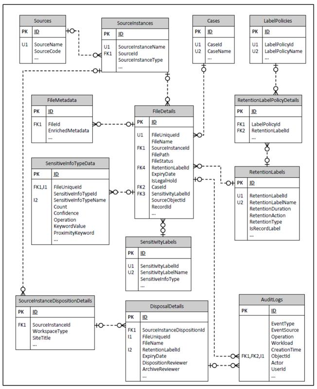

**Overview of i-ARM Database Schema** 

The i-ARM solution uses a structured and scalable relational data model implemented on Azure SQL Database to support its records management and compliance automation features. The schema is designed to store and interrelate information about files, metadata, labels, sensitive content, user actions, and source systems.

**Logical Data Model:** 

The section below shows the generalised data model of i-ARM system that primarily makes use of the SQL Azure database for storing its configurations and operational data. 

The design shows the schema of underlying key tables used by i-ARM and their relationship with different tables in the system. The database is normalized with third normal form standard to achieve data integrity, efficient storage, flexibility as well as the query performance for the reporting. 

The design shows the schema of underlying key tables used by i-ARM and their relationship with different tables in the system. The database is normalized with third normal form standard to achieve data integrity, efficient storage, flexibility as well as the query performance for the reporting. 

**Data security and compliance:** 

- Due to the use of Azure SQL database offering as the backend of i-ARM, the Data at rest is encrypted using Transparent Data Encryption (TDE). 
- Role-based access control (RBAC) ensures that users have access only to the data they need. 

**Core Entities** 

1. **FileDetails** 

   Central to the schema, this table captures metadata for each file ingested into the system. It links to source instances, sensitivity and retention labels, and includes flags for legal hold, file status, and disposition tracking.

2. **DisposalDetails** 

   Tracks the lifecycle events of files, such as disposition and archival reviews. It ensures compliance with retention schedules by linking to labels and reviewers.

3. **SensitiveInfoTypeData** 

   Stores insights from data scans, capturing the presence of sensitive information types (e.g., PII) within files, along with confidence levels, matching keywords, and operations detected. 

4. **RetentionLabels & LabelPolicies** 

   These tables define retention rules and associate them with policies. Each label includes attributes such as retention duration, action, and type (e.g., delete, retain, review). 

5. **SensitivityLabels** 

   This defines classification labels applied to content based on its sensitivity. It includes mappings to sensitive information types.

6. **Sources & SourceInstances** 

   Define the origin of content (e.g., SharePoint, File Share) and the specific instances or containers within those sources, enabling source-level filtering and policy application. 

7. **AuditLogs** 

   Captures user and system activity related to files and labels, facilitating traceability and compliance audits. 

8. **FileMetadata** 

   Provides a structure to store enriched metadata for files to enhance search, classification, and review. 

9. **SourceInstanceDispositionDetails**

   Describes the characteristics of the content source at a site or workspace level, including type and title, to support context-aware retention decisions.

**Data Relationships and Integrity** 

The i-ARM database schema is designed with a strong emphasis on referential integrity, relational traceability, and query performance, ensuring that all data elements are interconnected and consistently validated throughout the lifecycle of records.

1. **Referential Integrity Through Foreign Keys** 

Most major tables include foreign key (FK) constraints to ensure that records reference only valid and existing entities: 

- **FileDetails** uses foreign keys to link to SourceInstances, RetentionLabels, SensitivityLabels, and Cases, ensuring that each file’s classification, origin, and compliance context is properly referenced.
- **DisposalDetails** connects to both FileDetails and SourceInstanceDispositionDetails to maintain a clear and traceable record of what was reviewed or disposed of, by whom, and under what policy. 
- **SensitiveInfoTypeData** uses a composite key with FileUniqueId and SensitiveInfoTypeId, ensuring tight binding between sensitive content scans and the specific files they relate to. 
2. **Indexing for Efficient Lookups** 

The schema strategically uses **unique constraints and indexed identifiers** like FileUniqueId, RetentionLabelId, SensitivityLabelId to: 

- Enable fast filtering and lookups during file reviews, audits, and data retention processing. 
- Support scalable and performant operations across millions of files, especially when performing compliance checks or auto-labeling tasks. 
3. **Normalization for Maintainability** 

The schema follows principles of **database normalization** to minimize redundancy: 

- Labels, policies, and sensitivity definitions are centralized and linked to multiple files or sources, making it easier to update global settings without data duplication.
- Metadata is separated into dedicated tables (FileMetadata, AuditLogs, SensitiveInfoTypeData), supporting flexible enrichment and asynchronous processing.
4. **Auditability and Traceability** 

The AuditLogs table plays a crucial role in enabling transparency and governance:

- Tracks who performed what action (e.g., labeling, review, access), when, and from where. 
- Supports compliance and forensic reviews by linking actions to specific files and users.
5. **Hierarchical Source Structuring** 

The combination of Sources and SourceInstances introduces a **two-level abstraction** for file origins: 

- Sources define the broad category (e.g., SharePoint, OneDrive, Network Drive).
- SourceInstances specify the granular location (e.g., a specific site or particular file share), enabling policy scoping, data segregation, and source-based filtering. 
