## Acronyms

| **Acronym** | **Description** |
| --- | --- |
| MS | Microsoft |
| SPN | Service Principal |
| WAPP | Web application |
| IARM | Infotechtion-ARM |
| UIDIRECTORYACCESS | User interface directory access |
| PRD | Production |
| FUNC | Function |
| APIAUTH | Application Programming Interface Authentication |
| GRAPHAPI | Graph API |
| DEVOPSCONN | Azure Devops Connection |
| MYDISPPA | My Disposal Power Automate |
| SPOACCESS | SharePoint Online Access |
| SQL | Structured Query Language |
| SG | Service Group |
| SVC | Service |
| VNET | Virtual Network |
| RG | Resource Group |
| WEBAPP | Web Application |
| FUNCAPP | Function Application |
| PE | Private Endpoint |
| KV | Key Vault |
| ASP | Active Server Pages |
| MYDISP | My Disposal (feature of iARM) |
| UI | User interface |
| VM | Virtual Machine |
| IAC | Infrastructure as a code |
| PRM | Physical Records Management |
| SPFx | SharePoint Framework |
| PnP | Patterns and Practices |
| PBI | Power BI |
| DG | Data Gateway |
| RDP | Remote Desktop |
| WJ | Web Job |
| ACI | Azure Container Instance |
| ACR | Azure Container Registry |
| RLS | Row Level Security |

## I-ARM Deployment Guide

The Deployment of the end-to-end I-ARM product will occur in several phases, as outlined below:

1. Pre-Infrastructure Deployment
2. Infrastructure Deployment
3. Module Configuration
4. Solution Deployment
5. Manual Configurations

## Pre-Infrastructure Deployment

The pre-infrastructure guide is essential as it outlines the necessary steps to create a Microsoft Entra ID Security Group, configure the service account, register the application, assign permissions, generate secrets or create certificates, and expose APIs. These actions are crucial for ensuring a secure and properly configured environment for the deployment and operation of your services.

### I-ARM Deployment Runbook

Download the i-ARM deployment runbook from this link [i-ARM\_Runbook.xlsx](https://infotechtiongroup.sharepoint.com/%3Ax%3A/r/sites/AdvancedGovernanceSolutions/Shared%20Documents/General/I-ARM/Deployment/i-ARM_Runbook.xlsx?d=w18f2baa87458470e887f924f75de7a39&csf=1&web=1&e=mo6tY7) for an easy tracking of your deployment activities.

### Register Resource Providers

Azure Resource Providers are services in Azure that allow you to create and manage resources in your Azure subscription. Each resource provider offers a set of resource types that can be deployed and managed.

The below resource providers need to be registered in your Azure subscription before we can create i-ARM resources associated with them.

**Note**: To register resource providers in Azure, the user needs to have the **Owner** or **Contributor** role on the subscription.

Steps to Register a Resource Provider:

1. **Log into Azure Portal**: Go to https://portal.azure.com and log in.
2. **Go to Subscriptions**: In the Azure portal, search for Subscriptions in the search bar or go directly to Subscriptions under All Services.
3. **In the subscription blade**: Look for the "Resource providers" option in the settings menu.
4. **In the Resource providers pane**: You will see a list of available providers and their registration status.

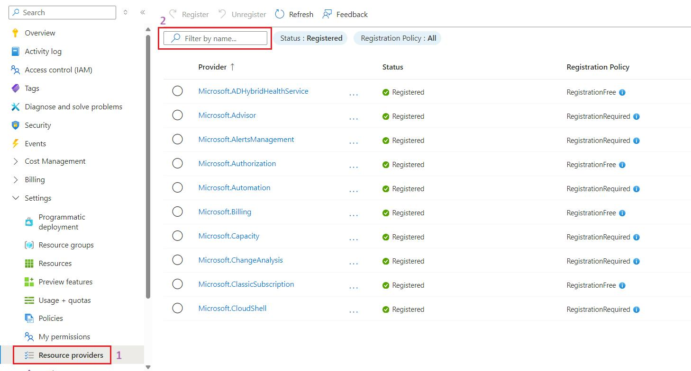

1. **Use the search box**: Locate the specific resource provider you need to register (e.g., Microsoft.DomainRegistration) that are not yet registered.

Below is a table containing all the required resource providers to register:

| # | Register Resource Providers | Registered (Yes / No) |
| --- | --- | --- |
| 1 | Microsoft.DomainRegistration |  |
| 2 | Microsoft.Network |  |
| 3 | Microsoft.Advisor |  |
| 4 | Microsoft.CloudShell |  |
| 5 | Microsoft.Sql |  |
| 6 | Microsoft.MarketplaceNotifications |  |
| 7 | Microsoft.ServiceLinker |  |
| 8 | Microsoft.ManagedIdentity |  |
| 9 | Microsoft.AlertsManagement |  |
| 10 | Microsoft.RecoveryServices |  |
| 11 | Microsoft.Security |  |
| 12 | Microsoft.Web |  |
| 13 | Microsoft.Storage |  |
| 14 | Microsoft.Compute |  |
| 15 | Microsoft.EventGrid |  |
| 16 | Microsoft.OperationalInsights |  |
| 17 | microsoft.insights |  |
| 18 | Microsoft.KeyVault |  |
| 19 | Microsoft.ResourceHealth |  |
| 20 | Microsoft.GuestConfiguration |  |
| 21 | Microsoft.PolicyInsights |  |
| 22 | Microsoft.Logic |  |
| 23 | Microsoft.Automation |  |
| 24 | Microsoft.PowerPlatform |  |
| 25 | Microsoft.ContainerInstance |  |
| 26 | Microsoft.ContainerRegistry |  |

1. **Click on the resource provider**: Then click the Register button. Wait for the registration process to complete.
2. **Once registration is complete**: You can start using the resource provider’s services in your subscription.

### Entra ID Group Creation

This section guides you through creating necessary security groups in Microsoft Entra ID, which are essential for managing access and permissions within the i-ARM deployment.

Steps to Create Entra ID Security Group:

1. **Sign in to the Azure portal**: Go to https://portal.azure.com and log in with at least a User Administrator role.
2. **Navigate to Azure Active Directory**: In the left-hand menu, select "Microsoft Entra ID".
3. **Go to Groups**: Under the "Manage" section, click on "Groups".
4. **Create a New Group**: Click on "New group".
5. **Fill in Group Details**: Complete the options in the Group page:
   * **Group type**: Select "Security".
   * **Group name**: Enter the name for the group (e.g., sg-sub-iarm-reader-prd).
   * **Group description** (Optional)**:** Enter a description for the group.
   * **Membership type**: Select "Assigned".
6. **Create the Group**: Click "Create".

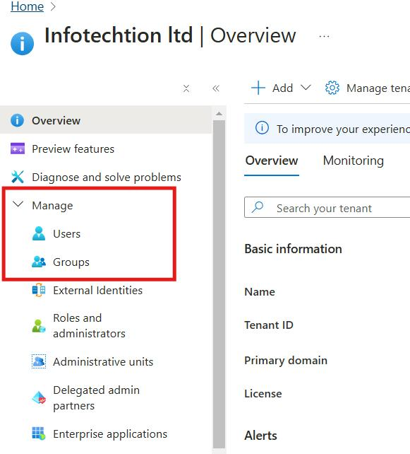
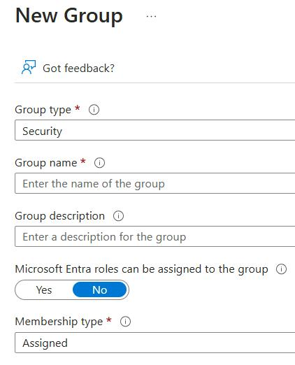

Repeat these steps for each of the following security groups:

| Item # | Security Group Name | Purpose | i-ARM Module |
| --- | --- | --- | --- |
| 1 | sg-sub-iarm-reader-prd | Read access to the azure subscription where i-ARM would be deployed. | All |
| 2 | sg-svc-iarm-webappadministrators-prd | i-ARM persona performing administrative actions within i-ARM. | All |
| 3 | sg-svc-iarm-portal-recordsadministrators-prd | Group required for the Records Administrator persona | My Data |
| 4 | sg-svc-iarm-portal-ediscoverymanagers-prd | Group required for the eDiscovery Persona in i-ARM | My Data |
| 5 | sg-svc-iarm-sqlentraadministrators-prd | Entra ID administrators accessing i-ARM Data Store | All |
| 6 | Provisioning Hub Approvers Group | Group for approvers used in Power apps to implement RLS for approver's and setting screen | Workspace Governance |

Steps to Create creating custom role group in the Microsoft Purview Compliance Center:

**Sign in to the Microsoft Purview compliance portal**: Log in with an admin account.

1. **Navigate to Permissions**: Go to Permissions in the left-hand menu.
2. **Create a New Role Group**: Click on "Create role group".
3. **Fill in Role Group Details**: Provide a name and description for the role group.
4. **Add Roles**: Select the roles to include in the group:
   * View-Only Retention Management
   * View-Only Record Management
5. **Assign Members**: Choose the users to assign to this role group.
6. **Create the Role Group**: Click "Create" to finalize the role group.

| **Item #** | **Compliance Group Name** | **Purpose** | **i-ARM Module** |
| --- | --- | --- | --- |
| 1 | Custom Role Group in Microsoft Purview Compliance Center | Required for i-ARM to sync M365 Purview Labels and Label policies. | All |

By completing all these steps, you will have successfully created the Entra ID Security Group & custom role group in Microsoft Purview Compliance Center.

### Service Account Creation

Service accounts would be used for various automated processes within the i-ARM deployment.

Steps to create Service Account:

1. **Sign in to the Microsoft 365 admin center**: Go to https://admin.microsoft.com and log in with a Global Administrator account.
2. **Navigate to Users**: In the left-hand menu, click on "Users" and then select "Active users".
3. **Add a User**: Click on "Add a user".
4. **Fill in User Details**:
   * **Display name**: Enter the display name for the service account.
     **Note**: Service Account Name should be identified with customer prior to creating them.
   * **Username**: Enter the username for the service account.
5. **Set Password**: Choose the "Let me create the password" option and provide a password of your choice. Make sure to note down the password for future reference.
6. **Assign License**: Assign the appropriate license to the service account.
7. **Finish Setup**: Click "Next" and complete the setup process.

Repeat these steps for each of the following service accounts:

| **Item #** | **Description** | **License** | **Scope** | **Role** |
| --- | --- | --- | --- | --- |
| 1 | Account required for importing and configuring the Power Automate flows. This account should also be added as a Connection Creator in the data gateway. | * E5 license * Power Automate Premium Per User Plan | Power Automate Environment | Environment Maker Role |
| | | | On-Premises Data Gateway  (Power Platform Admin Center) | Connection Creator |
| 2 | Account identified as a Gateway Admin for the data gateway that is installed and configured. | * E5 license | Power Automate Environment | Environment Maker Role |
| | | | On-Premises Data Gateway (Power Platform Admin Center) | Gateway Admin |
| 3 | Account required to sync the label policies and labels from Purview Compliance Portal. This account would be added to the custom role group created in Purview Compliance Center. | * E5 license | Microsoft Purview Compliance Portal | Create a custom role group with the below roles in Microsoft Purview Compliance Center:- View-Only Retention Management- View-Only Record Management |
| 4 | Account identified for publishing Power BI reports. | * E5 license | Power BI Workspace | Owner |
| | | | Azure SQL Database | db\_datareader |
| 5 | Account from which the notification emails would be sent. | * E3/E5 | NA | NA |
| 6 | Account used by the Windows service for reading and downloading blobs. | * E5 license | Azure Storage Account (saiarmarchiveregionabbrprd) | Storage Blob Data Reader |
| | | |Azure Key Vault (kv-iarm-svc-regionabbr-prd) | - Key Vault Secrets User- Key Vault Certificate User |
| 7 | Account used by the Windows service for scanning the Network File Shares or Azure File Shares. | * E5 license | Azure Storage Account (mounting must be done using the Storage Account access Key) | NA |
| | | | Network File Share | Read Write access on the file share for scanning (Write is only necessary if Immutability Feature is enabled) |
| | | | Azure Key Vault (kv-iarm-svc-regionabbr-prd) | - Key Vault Secrets User- Key Vault Certificate User |
| 8 | Account used by the MPIP Scanner service for installing and scanning the Network File Shares or Azure File Shares. | * E5 license | sql-iarmmpip-svc-regionabbr-prd | Sysadmin(1) |
| | | | sql-iarmmpip-svc-regionabbr-prd | db\_owner |
| | | | Network/ Azure File Share (Mounted on Scanner VM) | Read Write access on the file share for scanning (Write is only necessary if protection is being applied) |
| | | | Azure Key Vault (kv-iarm-svc-regionabbr-prd) | - Key Vault Secrets User- Key Vault Certificate User |

Ref: <https://learn.microsoft.com/en-us/purview/deploy-scanner-prereqs#sql-server-requirements>

### App Registration Creation

Steps to create and configure app registrations in Azure, which are necessary for authenticating and authorizing the i-ARM application components.

**Note**: Pay close attention to details such as redirect URIs and API permissions, as these configurations are crucial for the security and functionality of the application.

Step to create App Registrations:

1. **Sign in to the Azure Portal**: Navigate to https://portal.azure.com and log in with your credentials.
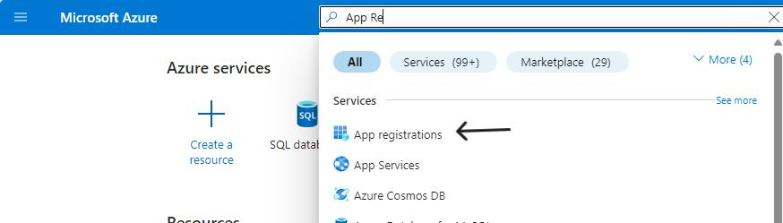
2. **Search for App Registrations**: Use the search bar to find "App Registrations" and click on it.
3. **Create a New Registration**: Click on "+ New registration" at the top of the page.

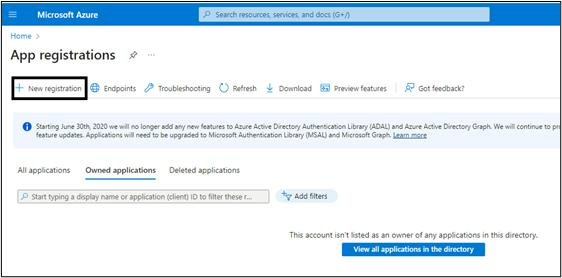

4. **Fill in Application Details**:
   * **Name**: Enter a name for your application. Choose a descriptive name for the table below.
   * **Supported Account Types**: Select “Accounts in this organizational directory only (Single tenant)”.
   * **Redirect URI**: Leave it blank to be configured later.

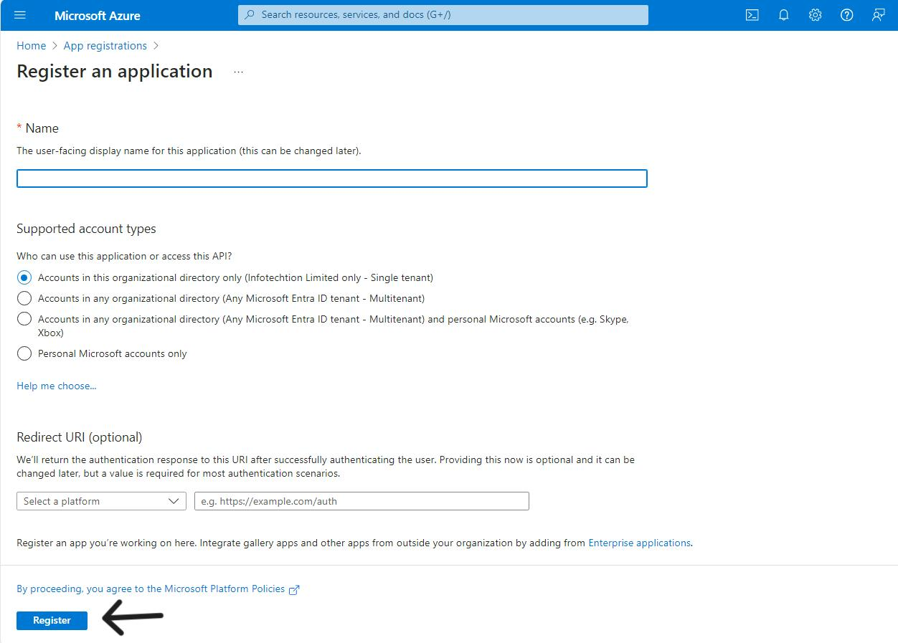

5. **Register the Application**: Click on "Register" to create the app registration.

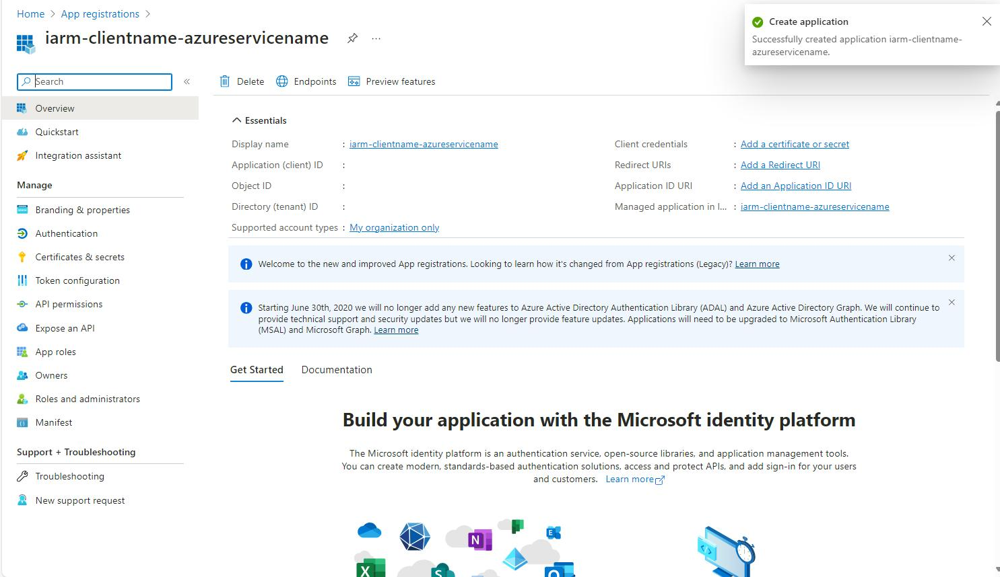

**Create the following App Registrations using the instructions shared above:**

| Item # | App Registration Name | API Permission | Certificate & Secret |
| --- | --- | --- | --- |
|  | spn-wapp-iarm-uidirectoryaccess-prd | **Delegated:**  Microsoft Graph:  User.Read  User.ReadBasic.All | Cert- 0  Secret - 0 |
|  | spn-func-iarm-apiauth-prd | NA | Cert- 0  Secret – 2\* |
|  | spn-func-iarm-graphapi-prd | **Delegated:**  Microsoft Graph:  User.Read  **Application:**  Microsoft Graph:  User.Read.All | Cert- 1  Secret - 0 |
|  | spn-wj-iarm-di-spn-prd | **Delegated**:  Microsoft Graph:  User.Read  **Application:**  SharePoint:  Sites.Read.All | Cert- 1  Secret - 0 |
|  | spn-devopsconn-iarm-deploy-prd | **Delegated:**  Microsoft Graph:  User.Read | Cert- 0  Secret - 1 |
|  | spn-di-iarm-dropzone-prd |  | Cert- 1  Secret - 0 |
|  | spn-func-iarm-notifications-prd | **Delegated:**  **Microsoft Graph:**  User.Read**Application:**  Microsoft Graph:  Mail.Send  User.ReadBasic.All | Cert- 1  Secret - 0 |
|  | spn-func-iarm-mydispconnspoaccess-prd | **Delegated:**  Microsoft Graph:  User.Read  **Application:**Microsoft Graph:  Sites.Read.All  SharePoint:  Sites.FullControl.All | Cert- 1  Secret - 0 |
|  | spn-sql-iarm-sqlaccess-prd | **Delegated:**  Microsoft Graph:  User.Read | Cert- 0  Secret - 1 |
|  | spn-func-iarm-urclabelsync-prd | **Delegated:**  Microsoft Graph:  User.Read  **Application:**  Microsoft Graph  RecordsManagement.ReadWrite.All | Cert- 0  Secret - 1 |
|  | spn-agents-iarm-wsgov-prd | **Delegated:**  Microsoft Graph:  User.Read  **Application:**  Microsoft Graph:  TeamMember.ReadWrite.All  GroupMember.ReadWrite.All  Channel.Create  Channel.ReadBasic.All  TeamsTab.ReadWrite.All  TeamTemplates.Read.All  TeamsAppInstallation.ReadForTeam.All  TeamSettings.ReadWrite.All Team.Create  Sharepoint:  Sites.FullControl.All | Cert- 0  Secret - 1 |
|  | spn-scanner-iarm-mpip-prd | **Delegated:**  Microsoft Graph:  User.Read  **Application:**  Microsoft Information Protection Sync Service:  UnifiedPolicy.Tenant.Read  Azure Rights Management Services:  Content.DelegatedReader  Content.DelegatedWriter | Cert- 0  Secret - 1 |
|  | spn-func-iarm-prmsync-prd | **Delegated:**  Microsoft Graph:  User.Read  **Application:**SharePoint:  TermStore.Read.All  TermStore.ReadWrite.All  Sites.Read.All  Sites.ReadWrite.All | Cert- 1  Secret - 0 |
|  | spn-func-iarm-prmprovisioning-prd | **Delegated:**  Microsoft Graph:  User.Read  **Application:**  Microsoft Graph:  Sites.FullControl.All  SharePoint:  Sites.FullControl.All | Cert- 1  Secret - 0 |
|  | spn-func-iarm-prmbulkimport-prd | **Delegate**  Microsoft Graph: User.Read  **Application**  Microsoft Graph: TermStore.Read.All  SharePoint: Sites.Selected | Cert- 1  Secret - 0 |
|  | spn-wj-iarm-m365auditsync-prd | **Application:**Microsoft Graph:  AuditLog.Read.All  AuditLogsQuery-SharePoint.Read.All  AuditLogsQuery.Read.All  Office 365 Management APIs  ActivityFeed.Read  ActivityFeed.ReadDlp | Cert- 0  Secret - 1 |
|  | spn-func-iarm-mydispconnspoaccess-prd | **Application:**Microsoft.Graph:Sites.Read.AllFiles.Read.All  **Delegated:**Microsoft.Graph:Files.Read.All | Cert- 0  Secret - 0 |
|  | spn-agent-iarm- downloadarchiveblobs-prd | **Delegated:**Microsoft Graph:User.Read | Cert- 0  Secret - 0 |
|  | spn-agents-iarm-nfsagent-prd | **Delegated:**Microsoft Graph:User.Read | Cert- 0  Secret - 0 |

**Note: Global admin is required to grant admin consent for all the App Registration API permissions.**

#### Adding Permission to App Registrations

API permissions is crucial for enabling secure and authorized access to various services and resources. This ensures that the i-ARM application components can interact seamlessly with Azure services.

Steps to Add API Permissions to an App Registration:

1. **Sign in to the Azure Portal**: Navigate to https://portal.azure.com and log in with your credentials.
2. **Navigate to App Registrations**: Use the search bar to find "App Registrations" and click on it.
3. **Select Your App Registration**: Click on the app registration you want to configure.
4. **Go to API Permissions**: In the left-hand menu, click on "API permissions".
5. **Add a Permission**: Click on the "Add a permission" button.
6. **Request API Permissions**: You will see the "Request API permissions" page. Select the Microsoft APIs (e.g., Microsoft Graph, SharePoint) as listed in the App Registrations table.

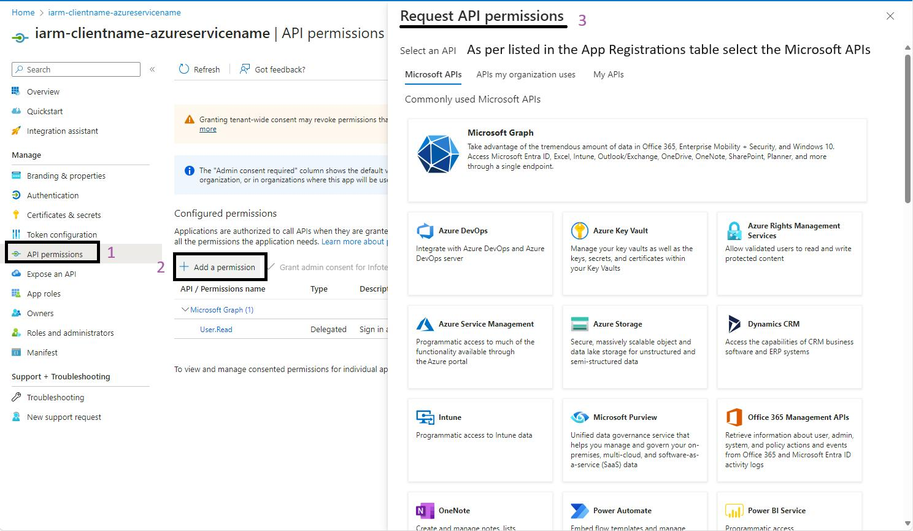

7. **Select Permissions**: Choose the appropriate permissions for your application:
   1. **Application or Delegated Permissions**: Select the type of permission (Application or Delegated) and then select the specific permissions required for the app registration. Use the search bar to quickly find the permissions you need.
8. **Add Permission**: After selecting the permissions, click on the "Add permissions" button.

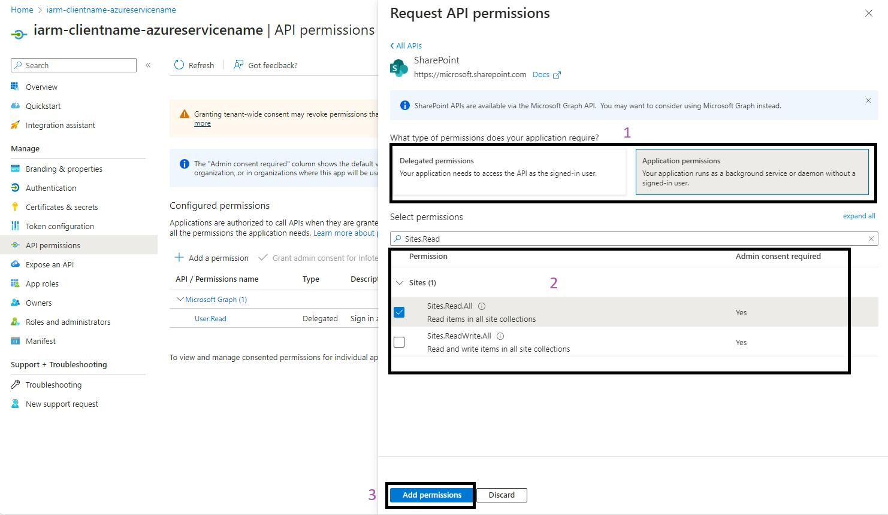

9. **Grant Admin Consent**: Once the permissions are added, you will see them listed on the API permissions page. Click on "Grant admin consent for [your organization]" to grant the selected permissions.

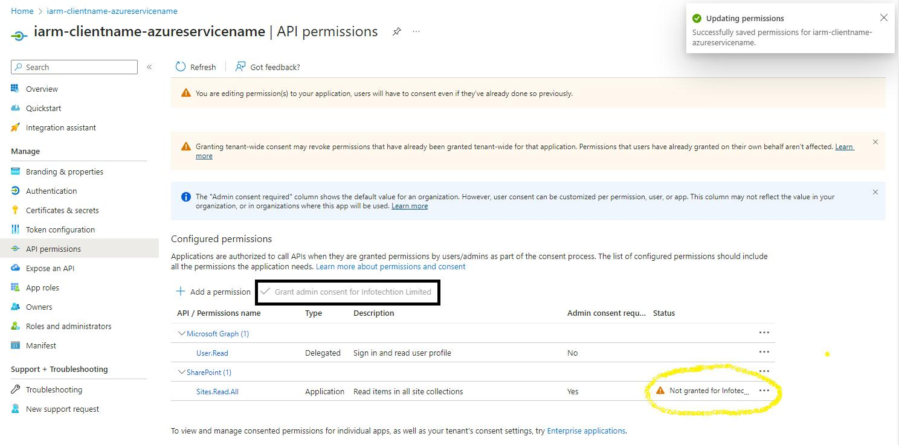

* By completing all these steps, you will have successfully added permissions to the App Registration.

#### Expose an API

Exposing an API is essential for enabling secure and authorized access to your application's resources. This ensures that client applications can interact seamlessly with your API.

**SPN**: “**spn-func-iarm-apiauth-prd”**

Steps to Expose API to an App Registration:

1. **Sign in to the Azure Portal**: Navigate to https://portal.azure.com and log in with your credentials.
2. **Navigate to App Registrations**: Use the search bar to find "App Registrations" and click on it.
3. **Select Your App Registration**: Click on the **spn-func-iarm-apiauth-prd** app registration.
4. **Go to Expose an API**: In the left-hand menu, click on "Expose an API".
5. **Set the Application ID URI:** Click on the "Add" button. The Application ID URI will be automatically populated. Click on "Save".

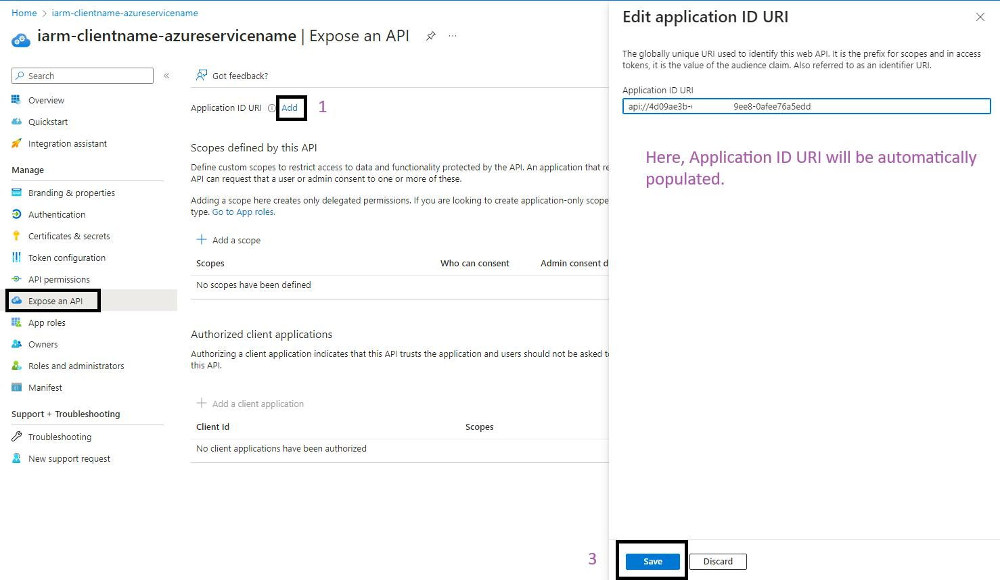

6. **Add a Scope**:
   * Click on "Add a scope".
   * **Scope name**: Enter ”user\_impersonation”.
   * **Who can consent?**: Select "Admins and users".
   * **Admin consent display name**: Enter "Access i-ARM API"
   * **Admin consent description**: Enter "Allows the app to access i-ARM API on behalf of the signed-in user"
   * **User consent display name**: Enter "Access i-ARM API").
   * **User consent description**: Enter "Allows the app to access i-ARM API on your behalf"
   * **State**: Ensure it is set to "Enabled".
   * Click "Add scope" to create the scope. .

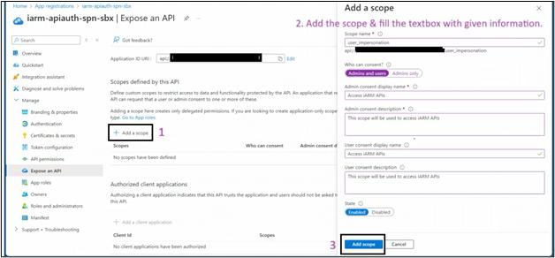

7. **Add Authorized Client Applications**:
   * Click on "+ Add a client application".
   * Enter the Client ID of  **spn-wapp-iarm-uidirectoryaccess-prd** App Registration, this SPN will be authorized to access this API.
   * Check the authorized scopes.
   * Click "Add application" to save the process.

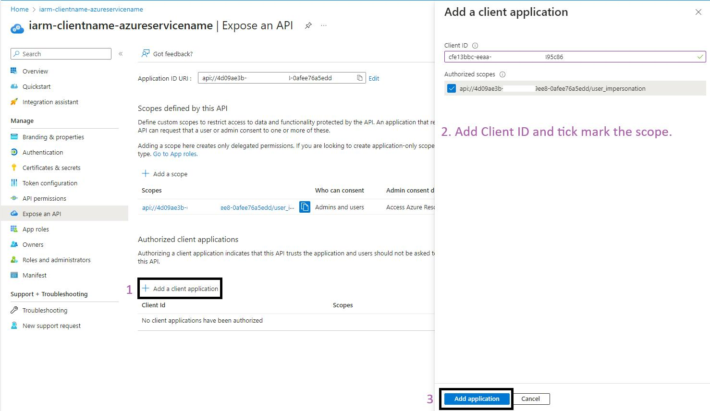

* + Once the Client Application has been successfully authorized and added, the page will appear as shown below.

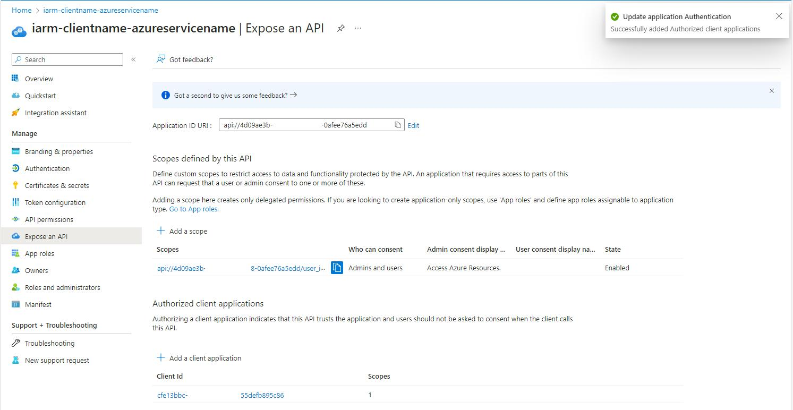

#### Token Configuration

**SPN**: “**spn-wapp-iarm-uidirectoryaccess-prd**”

Steps to Add Token:

1. **Sign in to the Azure Portal**: Navigate to https://portal.azure.com and log in with your credentials.
2. **Navigate to App Registrations**: Use the search bar to find "App Registrations" and click on it.
3. **Select your application**: Find and select **spn-wapp-iarm-uidirectoryaccess-prd** from the list of registered applications.
4. **Go to Token configuration**: Under the **Manage** section, select **Token configuration**.
5. **Add optional claim**: Click on **Add optional claim**.
6. **Select the token type**: Choose **ID** as the token type.
7. **Select the optional claim**: In the list of optional claims, find and select **login\_hint**.
8. **Add the claim**: Click **Add** to include the login\_hint claim in the ID token.
9. **Save your changes**: Ensure you save the configuration to apply the changes.

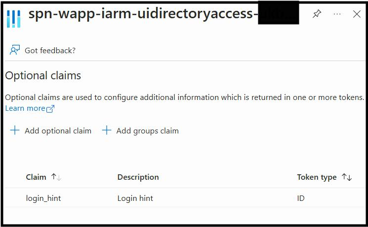

#### Generating a Secret

Generating a secret is a key step in securing your application's access credentials. This process involves creating a client secret that your application can use to authenticate itself when accessing resources.

Steps to Generating a Secret:

1. **Sign in to the Azure Portal**: Navigate to https://portal.azure.com and log in with your credentials.
2. **Navigate to App Registrations**: Use the search bar to find "App Registrations" and click on it.
3. **Select Your App Registration**: Click on the app registration you want to configure.
4. **Navigate to Certificates & Secrets**:
   * Go to the **Certificates & Secrets** section of your app registration.
   * Click on **+ Add client secret**.
5. **Add the Secret**:
   * Fill in the required fields on the **Add a client secret** page.
   * Click **Add**.

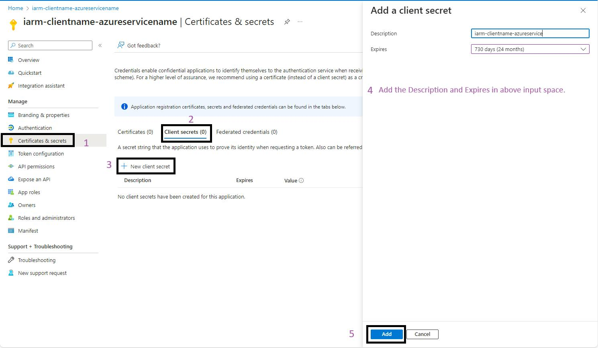

6. **Copy the Secret Value**:
   * After the secret is created, the value will be displayed.
   * Click the copy button next to the value to copy the secret.
   * Store the secret value is a secure place.

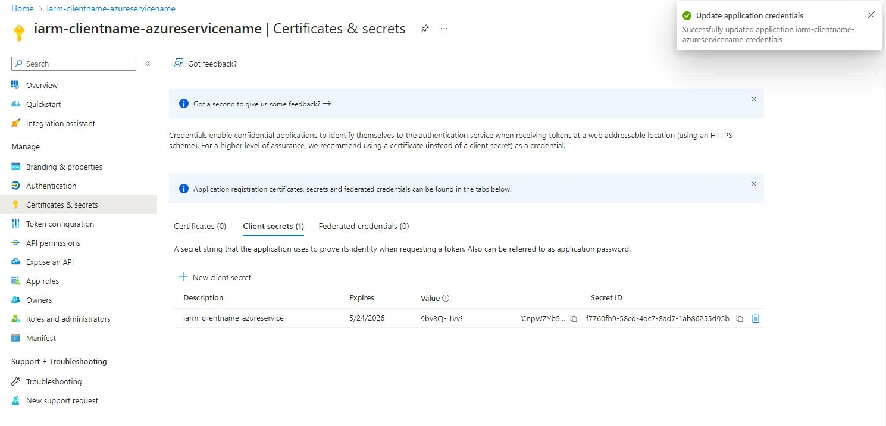

Note: Ensure you copy and paste the secret value immediately. If you navigate away from the page or refresh it, the secret value will be masked, and you won't be able to retrieve it again.

### Assign contributor permission to DevOps SPN on Resource Group

Contributor role grants the SPN the necessary permissions to create, manage, and deploy resources within the subscription.

Steps to Assign Contributor Permission to DevOps SPN:

1. **Sign in to the Azure portal**:
   * Use an account with owner or user access administrator permissions on the subscription.
2. **Select the Resource Group**:
   * Search for and select **Resource groups**.
   * Choose the specific Resource Group you want to assign the role to.
3. **Access Control (IAM)**:
   * In the Resource Group's menu, select **Access control (IAM)**.
   * Go to the **Role assignments** tab.
4. **Add Role Assignment**:
   * Click **Add** and then select **Add role assignment** from the drop-down menu.
5. **Configure Role Assignment**:
   * On the **Add role assignment** page:
     + Select **Contributor** from the list of roles.
     + In the **Members** tab:
       - Choose **User, group, or service principal** and click **+ Select members**.
       - On the **Select members** panel, enter the name or ID of the service principal (e.g., spn-devopsconn-iarm-deploy-prd), Click **Select**.
     + Back on the **Members** tab, click **Next**.
6. **Review and Assign**:
   * On the **Review + assign** page, review the settings.
   * Click **Review + assign** to complete the process.

**Once created, please provide the following information to set up secure connectivity to the client's Azure environment:**

| **Sr. NO** | **Name** | **Value** |
| --- | --- | --- |
| 1 | Subscription Id |  |
| 2 | Subscription Name |  |
| 3 | Service Principal Id (spn-devopsconn-iarm-deploy-prd Client ID) |  |
| 4 | Service principal key (spn-devopsconn-iarm-deploy-prd Client Secret) |  |
| 5 | Tenant ID |  |

## Infrastructure Deployment

### Deployment Checklist

The deployment would be performed using Azure Devops CI/CD pipeline using Infrastructure as Code (IaC) templates. But prior to the deployment please confirm the below

1. **Service Principal Permissions**: Verify that the Azure DevOps Service Principal (SPN) has been granted Contributor permissions for the resource group.
2. **Naming Conventions**: For some of the resources we have restriction with them having globally unique names. So request to please confirm that the naming conventions outlined in the IARM Detailed Design Document can be utilized.
3. **Resource Configuration (SKUs / Pricing tier)**: Validate the resource configuration outlined in the IARM Detailed Design Document.
4. **Policy Restrictions & Network Configuration:** Please share any specific network configurations or policy restrictions you have in place.

Make sure all these criteria are met prior to initiating the deployment.

### Post-Infrastructure Deployment

Validate the below activities.

1. Confirm that all resources have been created and are listed in the Azure portal/Resource group.
2. Validate that the configurations of resources match the specifications in the IARM Detailed Design Document.
3. Check the access permissions for each resource to ensure proper security measures are in place.
4. Review the VNet and IP address ranges to ensure they are set up correctly

## Module Configuration

The configuration below should be performed by an authorized user from the consumer cloud team with an **Owner** role on the subscription.

### Configure App Registrations

i-ARM solution requires additional configuration for the App registrations. Please ensure the following resources have been created:

1. Function Apps
2. Web App

#### Adding a Redirect URI to Service Principal

Adding a redirect URI to an Azure Service Principal is essential for securely completing the OAuth 2.0 authentication flow, as it directs users back to the application after successful authentication. It also enhances security by preventing unauthorized redirections and ensuring that only approved applications can receive tokens from Azure AD.

1. Adding Redirect URL for the Web App (For UI App Registrations)
2. Adding Redirect URL for the Function App (For API App Registrations)

Add a redirect URL to the App Registration as specified in the table below by following these steps:

| **App Registration Name** | **Addition Configuration** |
| --- | --- |
| spn-wapp-iarm-uidirectoryaccess-prd | **Platform:**  Single Page Application  URI: https://web-iarm-ui-regionabbr-prd.azurewebsites.net  ***\*Pointing to the UI Web App ( iARM portal) created*** |
| spn-func-iarm-apiauth-prd | **Platform:**  Web Redirect URIs:  https://func-iarm-mydata-regionabbr-prd.azurewebsites.net/.auth/login/aad/callback  https://func-iarm-mydisp-regionabbr-prd.azurewebsites.net/.auth/login/aad/callback  ***\*Pointing to the My Data & My Disposal function apps created*** |

##### Adding Redirect URL for the Web App (For UI App Registrations)

Steps to Add redirect URL for Web App:

1. **Sign in to the Azure Portal**: Navigate to https://portal.azure.com and log in with your credentials.
2. **Navigate to App Registrations**: Use the search bar to find “App Registrations” and click on it.
3. **Select Your App Registration**: Click on the **spn-wapp-iarm-uidirectoryaccess-prd** app registration.
4. **Go to Authentication**: In the left-hand menu, click on **Authentication**.
5. **Add a Platform:** Click on **+ Add a platform.**
6. **Select the Platform Type**:For a web app, select **Single-page application**.

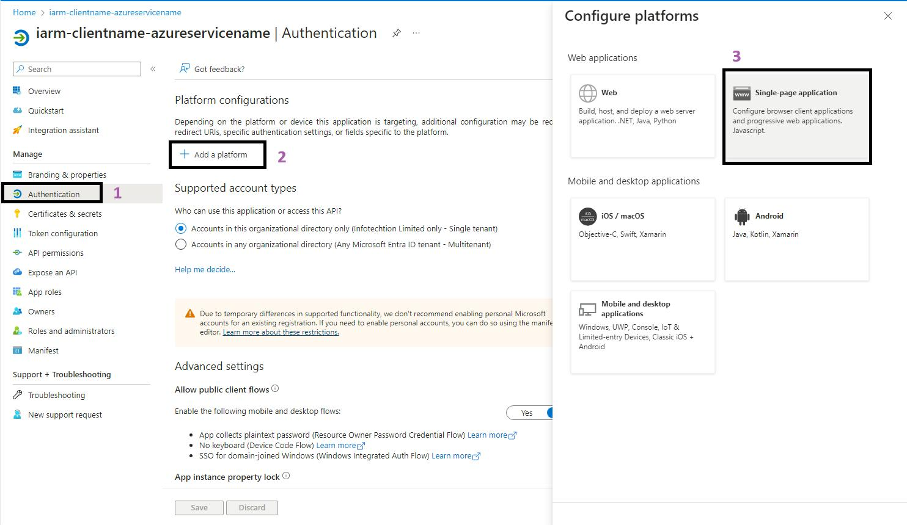

1. **Add the Redirect URI**: Enter the redirect URI as *https://web-iarm-ui-regionabbr-prd.azurewebsites.net*
   * **Note:** Replace regionabbr with the appropriate region abbreviation for your deployment**.**

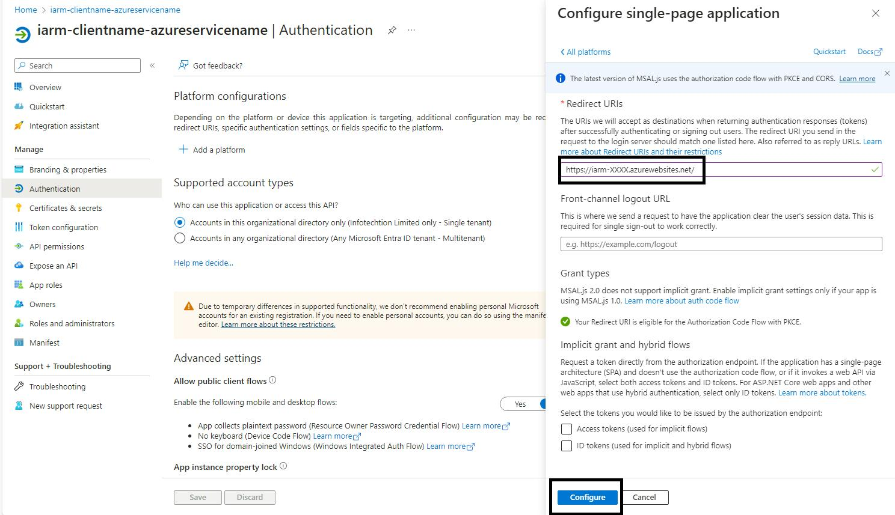

1. **Configure and Save**: Click on **Configure** to save your progress.
   * Once configured, you will see a confirmation page.

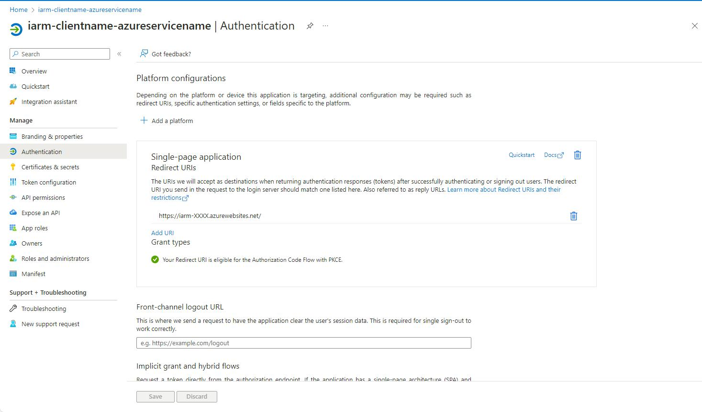

##### Adding Redirect URL for the Function App (For API App Registrations)

Steps to Add redirect URL for Function App:

1. **Sign in to the Azure Portal**: Navigate to https://portal.azure.com and log in with your credentials.
2. **Navigate to App Registrations**: Use the search bar to find “App Registrations” and click on it.
3. **Select Your App Registration**: Click on the **spn-func-iarm-apiauth-prd** app registration.
4. **Go to Authentication**: In the left-hand menu, click on **Authentication**.
5. **Add a Platform:** Click on **+ Add a platform.**
6. **Select the Platform Type**:For a function app, select **Web**.

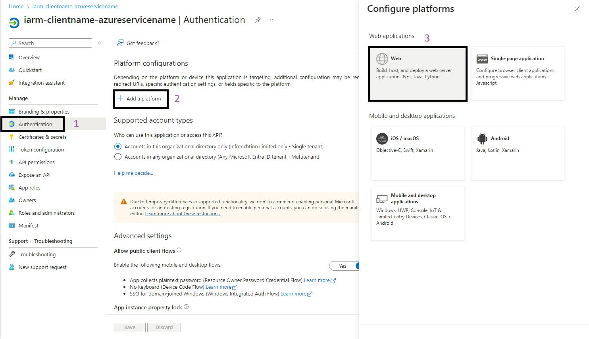

7. **Add the Redirect URI**: Enter the below redirect URI as https://web-iarm-ui-regionabbr-prd.azurewebsites.net  

* **Note:** Replace regionabbr with the appropriate region abbreviation or Function app name as per your standards for your deployment.

8. **Configure and Save:** Click on **Configure** to save your progress.

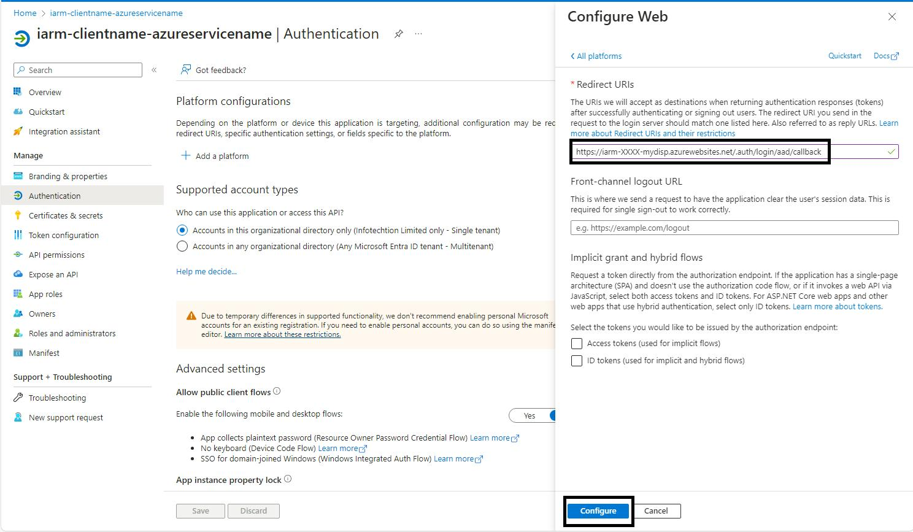

* + Once configured, you will see a confirmation page.

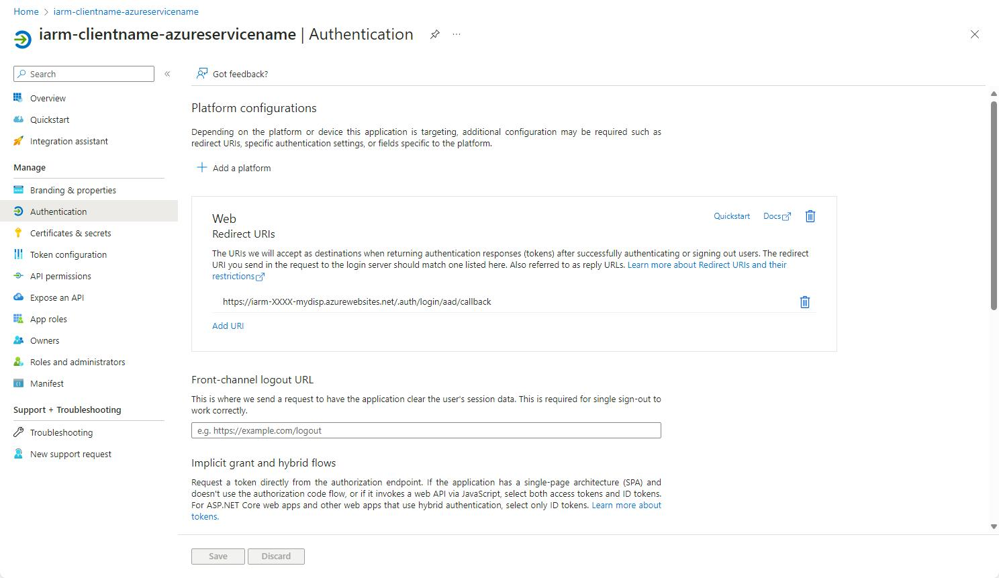

9. **Add Additional Redirect URI:** Under the Web platform, click on**Add URI**.
   * Add URI for My Disposal Function App: *https://func-iarm-mydisp-regionabbr-prd.azurewebsites.net/.auth/login/aad/callback*
   * **Note:** Replace regionabbr with the appropriate region abbreviation or Function app name as per your standards for your deployment.
   * Click on **Save** to save the additional redirect URI.

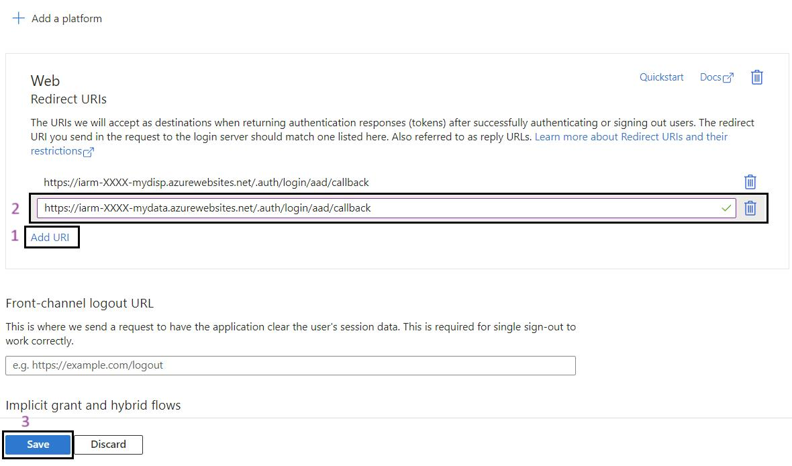

### Key Vault Configuration

Before proceeding with the Key Vault Configuration, it is crucial to gather all necessary information and credentials. This ensures a smooth and secure setup process. Please verify that you have the following details at hand:

1. Client ID for Service Principals
2. Client Secret for Service Principals
3. Tenant ID
4. Tenant Name
5. SQL Connection String details
6. Resource Group Name for the Data Ingestion Storage Account
7. Subscription ID

**Prerequisites:** To configure the Key Vault, the user must have at least **Contributor** access to the Azure Resource or Resource Group, as well as the **Key Vault Secrets Officer** & **Key Vault Certificates Officer** roles.

#### Adding Secret to Key Vault

The iARM Product utilizes Key Vault for securely storing secrets essential to the product's functionality. This ensures that all critical and sensitive information is stored in a secure manner and accessed safely.

Steps to Add Secret to Key Vault:

1. **Sign in to the Azure Portal**: Navigate to https://portal.azure.com and log in with your credentials.
2. **Navigate to Key Vault**: At the top of the portal, you'll see a search bar. Start typing the name of the Key Vault (kv-iarm-svc-regionabbr-prd) and select it from the results.

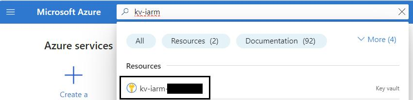

3. **Select Secrets**: In the left pane, click on **Secrets**.
4. **Add a New Secret**: Click on the **+ Generate/Import** button.

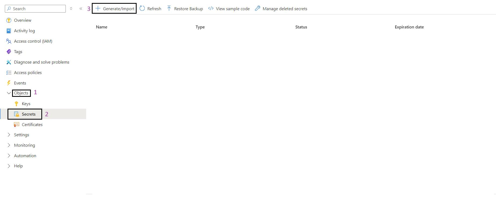

5. **Fill in Secret Details**: Provide a name for the secret and its value.
6. **Create**: Click **Create** to add the secret.

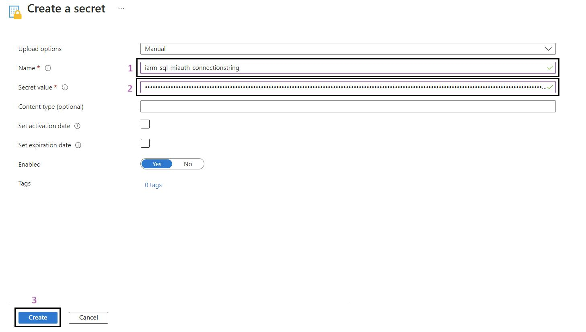

7. **Generate All Secrets**: Generate all the secrets listed in the table below.

| **#** | **Key Vault Secret** | **Description/ Source** | **Associated Application** |
| --- | --- | --- | --- |
| 1 | iarm-sql-miauth-connectionstring | SQL MI Auth Connection String | All |
| 2 | spn-wj-iarm-di-spn-prd-clientid | Data Ingestion App Registration Client ID | My Data, Data Ingestion |
| 3 | spn-func-iarm-graphapi-prd-clientid | Graph API App Registration Client ID | My Data, Data Ingestion |
| 4 | iarm-tenantid | ID for Azure tenant | Data Ingestion |
| 5 | spn-func-iarm-notifications-prd-clientid | Notifications App Registration Client ID | Data Ingestion, My Disposal |
| 6 | ClientIDKey | Client ID for urclabelsync App Registration | Universal Retention Connector |
| 7 | ClientSecretKey | Client Secret for urclabelsync App Registration | Universal Retention Connector |
| 8 | iarm-urc-impcapi-schedule-id | Schedule ID for Iron Mountain API | Universal Retention Connector |
| 9 | iarm-urc-impcapi-tenanatid | Tenant ID for Iron Mountain API | Universal Retention Connector |
| 10 | iarm-urc-virgo-password | Password for Virgo account | Universal Retention Connector |
| 11 | iarm-urc-virgo-account | Username for Virgo account | Universal Retention Connector |
| 12 | iarm-urc-virgoapi-clientid | Client ID for Virgo API | Universal Retention Connector |
| 13 | iarm-urc-virgoapi-secret | Client Secret for Virgo API | Universal Retention Connector |
| 14 | iarm-di-resourcegroupname | Secret name for Azure resource group name where Data Ingestion App Storage Account is provisioned | Data Ingestion |
| 15 | iarm-di-subscriptionid | Secret name for Azure subscription ID where Data Ingestion App Storage Account is provisioned | Data Ingestion |
| 16 | spn-func-iarm-prmsync-prd-clientid | PRM Sync App Registration Client ID | PRM Sync |
| 17 | spn-func-iarm-prmbulkimport-prd-clientid | PRM Bulk App Registration Secret | PRM Bulk |
| 18 | spn-wj-iarm-m365auditsync-prd-clientid | M365 Audit Sync App Registration Client ID | M365 Audit Sync |
| 19 | spn-wj-iarm-m365auditsync-prd-clientsecret | M365 Audit Sync App Registration Secret | M365 Audit Sync |
| 20 | iarm-tenantdomain | Name for Azure tenant | M365 Audit Sync |

#### Adding Certificate to Key Vault

**Note**: IARM recommends using a certificate from a Certified Authority (e.g., DigiCert, GlobalSign). The steps below outline creating a self-signed certificate, which can be used in your staging or development environment.

Steps to Add Certificate to Key Vault:

1. **Sign in to the Azure Portal**: Navigate to https://portal.azure.com and log in with your credentials.
2. **Navigate to Key Vault**: At the top of the portal, you'll see a search bar. Start typing the name of the Key Vault (kv-iarm-svc-regionabbr-prd) and select it from the results.

3. **Select Certificates**: In the left pane, click on **Certificates**.
4. **Add a New Certificate**: Click on the **+ Generate/Import** button.

5. **Fill in Certificate Details**:
   * Provide a name for the certificate and select **Self-Signed** as the method.
   * Configure the certificate settings, such as subject name, validity period, and key size.
6. **Create**: Click **Create** to generate the self-signed certificate.
7. **Verify Certificate**: Once the certificate is created, verify its details in the **Certificates** section of the Key Vault.
8. **Downloading Certificate: Download Certificate .crt format**
   * Ensure the certificate is saved to a local directory. The Certificate will be used to be added into the App registration.

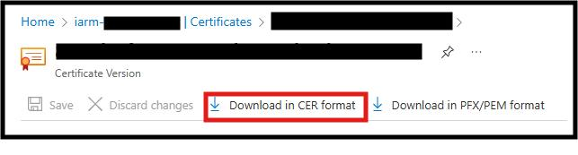

9. **Create all Certificate:** Generate the certificates listed for the Service principals listed in the table below.

| **#** | **Key Vault Certificate** | **CN/Subject** | **Associated Application** |
| --- | --- | --- | --- |
| 1 | spn-wj-iarm-di-spn-prd-clientcert | iarm-di-spn-prd.<"client" domain>.com | All |
| 2 | spn-func-iarm-graphapi-prd-clientcert | iarm-graphapi-prd.<"client" domain>.com | My Data, Data Ingestion |
| 3 | spn-func-iarm-notifications-prd-clientcert | iarm-notifications-prd.<"client" domain>.com | My Data, Data Ingestion |
| 4 | spn-func-iarm-prmsync-prd-clientcert | iarm-prmsync-prd.<"client" domain>.com | PRM-Sync |
| 5 | spn-func-iarm-prmbulkimport-prd-clientcert | iarm-prmbulkimport-prd.<"client" domain>.com | PRM-Bulk |
| 6 | spn-mydisppa-iarm-spoaccess-prd-clientcert | iarm-spoaccess-prd.<"client" domain>.com | My Disposal |
| 7 | spn-func-iarm-mydispconnspoaccess-prd-clientcert | iarm-mydispconnspoaccess-prd.<"client" domain>.com | My Disposal |
| 8 | spn-func-iarm-prmprovisioning-prd-clientcert | iarm-prmprovisioning-prd.<"client" domain>.com | PRM-SFx |
| 9 | spn-di-iarm-dropzone-prd-clientcert | iarm-dropzone-prd.<"client" domain>.com | Data Ingestion |

#### Adding Certificate to the App Registration

Adding Certificate

* For adding Certificate, you need to navigate to the “Certificates & Secret”, click on the “Certificates” and click on “Upload certificate”, and select the “**Add**”.
* Ensure the Certificate is in **.cer** format.
  
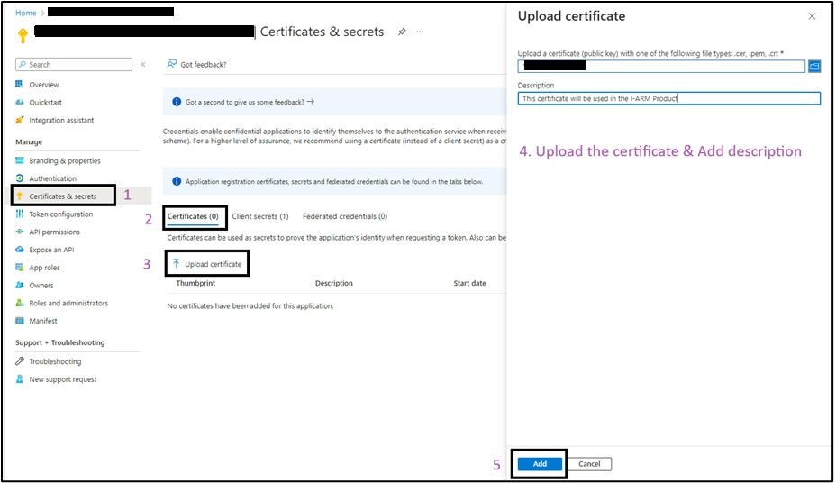

* Once you click "Add" and the process is complete, you'll see a page like the one below, where you can view the thumbprint of the certificate you uploaded.
  
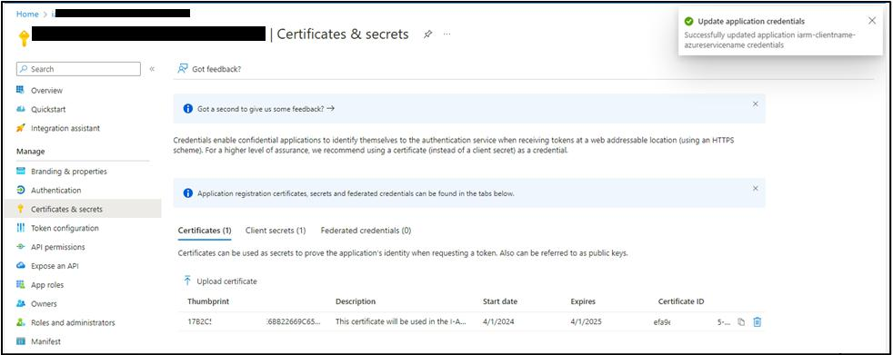

* The table below contains information about the certificates that need to be uploaded for the respective App Registrations.

| **#** | **Associated App Registration** | **Key Vault Certificate** | **Description** |
| --- | --- | --- | --- |
| 1 | spn-wj-iarm-di-spn-prd | spn-wj-iarm-di-spn-prd-clientcert | Authenticates API calls from Data Ingestion Module. |
| 2 | spn-func-iarm-graphapi-prd | spn-func-iarm-graphapi-prd-clientcert | Authenticates Graph API calls. |
| 3 | spn-func-iarm-notifications-prd | spn-func-iarm-notifications-prd-clientcert | Authenticates Graph API calls for sending email notifications. |
| 4 | spn-func-iarm-prmsync-prd | spn-func-iarm-prmsync-prd-clientcert | Authenticates API calls for PRM-Sync Module. |
| 5 | spn-func-iarm-prmbulkimport-prd | spn-func-iarm-prmbulkimport-prd-clientcert | Authenticates Power Automate Flows against KeyVault. |
| 6 | spn-mydisppa-iarm-spoaccess-prd | spn-mydisppa-iarm-spoaccess-prd-clientcert | Authenticates API calls for PRM Module. |
| 7 | spn-func-iarm-mydispconnspoaccess-prd | spn-func-iarm-mydispconnspoaccess-prd-clientcert | Authenticates API calls for M365 Audit Disposal Connector Module. |
| 8 | spn-func-iarm-prmprovisioning-prd | spn-func-iarm-prmprovisioning-prd-clientcert | Authenticates API calls for PRM Module. |
| 9 | spn-agent-iarm-scannerservice-prd | spn-agent-iarm-scannerservice-prd-clientcert | Authenticates i-ARM Scanner agent against KeyVault. |
| 10 | spn-di-iarm-dropzone-prd | spn-di-iarm-dropzone-prd-clientcert | Authenticates API calls from Data Ingestion Module. |

### Configuration of SQL Database

To execute the script and access the database, it is necessary to add the **sg-svc-iarm-sqlentraadministrators-prd** Entra ID security group to the SQL Server. This will ensure that members of the Entra ID group have the required access to the database.

#### Assign Set Admin to the SQL Server

1. **Sign in to the Azure Portal**: Navigate to https://portal.azure.com and log in with your credentials.
2. **Search SQL Server Instance**: Use the search bar to find **sql-iarm-svc-regionabbr-prd** Azure SQL Server instance (which is provisioned for iARM Application) and select it.
3. **Go to Settings**: In the left navigation pane, click on the **Settings** section.
4. **Select Microsoft Entra ID**: Click on **Microsoft Entra ID** in the Settings blade.

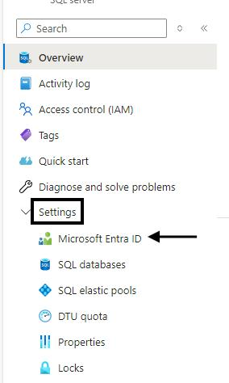

5. **Set Admin**: Click **Set admin** and provide the **sg-svc-iarm-sqlentraadministrators-prd** Entra ID Group.
6. **Save Changes**: Click **Save** to set the admin.

#### Running Database Scripts

1. **Download and Install SQL Server Management Studio (SSMS)**: If not already installed, download it from here: [Microsoft SQL Server Management Studio](https://learn.microsoft.com/en-us/sql/ssms/download-sql-server-management-studio-ssms?view=sql-server-ver16#download-ssms)
2. **Log in to the SQL Database**: Use SSMS to log in to the SQL Database via **Microsoft Entra MFA Authentication** Method.
3. **Execute SQL Scripts**: Run the SQL scripts in the i-ARM SQL database in the following order:
   **Note: the scripts will be shared by Infotechtion team**
   1. iarm-create-tables-script.sql
   2. iarm-types-script.sql
   3. iarm-function-script.sql
   4. iarm-views-script.sql
      * **Note** Run iarm-views-script.sql only if iarm-create-tables-script.sql, iarm-types-script.sql and iarm-function-script.sql have been executed successfully.
   5. iarm-triggers-script.sql
      * **Note** Run iarm-triggers-script.sql only if iarm-views-script.sql has been executed successfully.
   6. iarm-sp-script.sql
      * **Note** Run iarm-sp-script.sql only if iarm-triggers-script.sql has been executed successfully.
   7. iarm-insert-master-data.sql
      * **Note** Run iarm-insert-master-data.sql only if iarm-sp-script.sql has been executed successfully.

#### Run Script for sql-service-principle-access

1. **Add SQL-Auth Service Principal**: The SQL-Auth service principal should be added to the SQL DB as an external provider. Run the script below by logging in as an Entra ID user to SQL.
2. **Update App Registration Name**: Replace <spn-name> with the actual SQL-Auth App Registration Name in your Tenant. For example, use **sg-svc-iarm-sqlentraadministrators-prd**.

| CREATE USER [<spn-name>] FROM EXTERNAL PROVIDER  ALTER ROLE db\_datareader ADD MEMBER [<spn-name>]  ALTER ROLE db\_datawriter ADD MEMBER [<spn-name>]  GRANT EXEC TO [<spn-name>] |
| --- |

#### Run Script for managed-identity-access

1. **Add Managed Identity**: For providing SQL DB access to the Managed Identity as an external provider, run the script below by logging in as an Entra ID user to SQL.
2. **Update Identity Name**: Replace <identity-name> with the Function App and Web Job name. We have multiple Function Apps, repeat the script for each identity of Funcation App.

**Example**: For My Data, replace <identity-name> with func-iarm-mydata-regionabbr-prd.

| CREATE USER [<identity-name>] FROM EXTERNAL PROVIDER;  ALTER ROLE db\_datareader ADD MEMBER [<identity-name>];  ALTER ROLE db\_datawriter ADD MEMBER [<identity-name>];  GRANT EXEC TO [<identity-name>];  GO |
| --- |

### Configure My Data Module

#### Validate System Assigned Identity for Function App

Steps for to Validate System Assigned Identity for Function App:

1. **Sign in to the Azure Portal**: Navigate to https://portal.azure.com and log in with your credentials.
2. **Navigate to Your Function App**: Use the search bar to find My Data Function App (func-iarm-mydata-regionabbr-prd) and select it.
3. **Go to Identity**: In the left-hand menu, click on **Identity** under the **Settings** section.
4. **Enable System Assigned Identity**: Ensure that the **System assigned** option is set to **On**.

#### Assign roles to managed identity

Prerequisites: For performing role assignment to the managed identity user at least have the **User Access Administrator** or **owner** access on Resource.

Steps for to Assign roles to managed identity:

1. **Sign in to the Azure Portal**: Navigate to https://portal.azure.com and log in with your credentials.
2. **Navigate to Your Function App**: Use the search bar to find My Data Function App (func-iarm-mydata-regionabbr-prd) and select it.
3. **Go to Identity**: In the left-hand menu, click on **Identity** under the **Settings** section.
4. **Click on the Azure Role Assignments Button**: Click on the **Azure role assignments** button.

5. **Add Role Assignment**: Click on the **Add role assignment** button at the top of the page.
6. **Select Scope and Resource**:
   * In the **Add role assignment** pane, select the scope of the resource as **Key Vault**.
   * Select the resource as the Key Vault used by the iARM Application (e.g., kv-iarm-svc-regionabbr-prd) which is provisioned for storing Certificates & Secrets.
7. **Select Role**: Choose the role as **Key Vault Secrets User**.
8. **Save Changes**: Click **Save** to assign the role to the managed identity of your app service.

1. **Repeat for Additional Scopes, Resources, and Roles**: Repeat the process for the following scopes, resources, and roles:

| Sr. No | Scope | Resource | Role |
| --- | --- | --- | --- |
| 1 | Key Vault | kv-iarm-svc-regionabbr-prd | Key Vault Secrets User |
| 2 | Key Vault | kv-iarm-svc-regionabbr-prd | Key Vault Certificate User |
| 3 | Storage | saiarmdiappregionabbrprd | Storage Blob Data Contributor |
| 4 | Storage | saiarmdidroperegionabbrprd | Storage Blob Data Contributor |
| 5 | Storage | saiarmdiregregionabbrprd | Storage Blob Data Contributor |
| 6 | Storage | saiarmdinonregregionabbrprd | Storage Blob Data Contributor |
| 7 | Storage | saiarmdiappregionabbrprd | Storage Queue Data Contributor |

#### Configure Function Application Authentication

Prerequisites: To configure Function Application authentication, the user must have at least **Contributor** access to the Azure Resource or Resource Group, as well as the **Cloud Application Administrator** role, since the secret will be created automatically using this method.

Steps for to Configure Function Application Authentication:

1. **Sign in to the Azure Portal**: Navigate to https://portal.azure.com and log in with your credentials.
2. **Navigate to Your Function App**: Use the search bar to find My Data Function App (func-iarm-mydata-regionabbr-prd) and select it.
3. **Go to Authentication**: In the left-hand menu, click on **Authentication** under the **Settings** section.
4. **Add Identity Provider**: Click on **Add identity provider**.

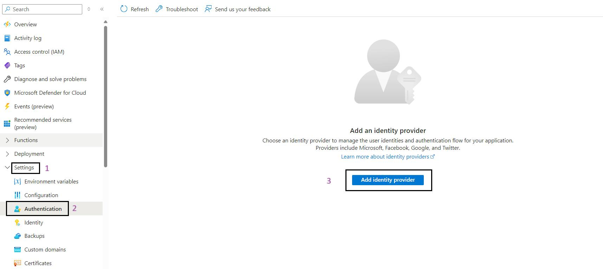

5. **Select Microsoft as the Identity Provider**:
   * In the **Add an identity provider** pane, select **Microsoft**.
   * For **App Registrations Type**, select **Pick an existing app registration in this directory**.
   * In the **Name or app ID** dropdown, select spn-func-iarm-apiauth-prd.
6. **Client Secret Expiration**:
   * Select the **Client secret expiration** period as **730 days (24 months)**.

7. **Configure Client Requirements**:
   * In **Client requirement**, select **Allow requests from specific client applications**.
   * In the **Allowed client applications** field, add the spn-func-iarm-apiauth-prd ClientID.
   * After adding spn-func-iarm-apiauth-prd ClientID, click on **Ok**, then **Add**.

* The below configuration should be visible on your screen.

8. **Configure Token Audiences**:
   * Click on  and add the **Allowed token audiences** starting with api:// and paste the Application (client) ID after api://.

* Here, the **MICROSOFT\_PROVIDER\_AUTHENTICATION\_SECRET** secret value of “Client secret setting name” will be automatically created and configured in the function app environment variables.

#### Validate Environment Variables in Function App

Prerequisites: To validate app settings, the user must have at least **Contributor** access to the Azure Resource or Resource Group, as well as the **App Configuration Data Reader** role to view the environmental variables and their values.

Steps for to Validate Environment Variables in Function App:

1. **Sign in to the Azure Portal**: Navigate to https://portal.azure.com and log in with your credentials.
2. **Navigate to Your Function App**: Use the search bar to find My Data Function App (func-iarm-mydata-regionabbr-prd) and select it.
3. **Go to Environmental Variables**: In the left-hand menu, under the **Settings** section, click on **Environmental variables**.
4. **Show Values**: If required, click on **Show values** to display the current values of the environmental variables for validation.

1. **Validate the App Settings**: Review and validate the app settings listed below.

| **#** | **App Setting Name** | **Description / Use** | **Source of Value** |
| --- | --- | --- | --- |
| 1 | APPLICATIONINSIGHTS\_CONNECTION\_STRING | Connection string for Azure Application Insights | Application configuration |
| 2 | ApplicationInsightsAgent\_EXTENSION\_VERSION | Version specification for Application Insights Agent | Application configuration |
| 3 | AzureWebJobsStorage:accountName | Storage account name for Azure Functions | Application configuration |
| 4 | AzureWebJobsStorage:credential | Credential for Azure Functions storage | Application configuration |
| 5 | DataIngestionClientCertSecretName | Secret name for the client certificate used in Data Ingestion | Azure Key Vault |
| 6 | DataIngestionClientIdSecretName | Secret name for the client ID used in Data Ingestion | Azure Key Vault |
| 7 | DropzoneStorageAccountName | Name of the dropzone storage account | Application configuration |
| 8 | FUNCTIONS\_EXTENSION\_VERSION | Version of the Azure Functions runtime | Application configuration |
| 9 | FUNCTIONS\_WORKER\_RUNTIME | Runtime environment for Azure Functions | Application configuration |
| 10 | GraphApiClientCertSecretName | Mydata App Registration Certificate | Azure Key Vault |
| 11 | GraphApiClientIdSecretName | Client ID of MyData App Registration | Azure Key Vault |
| 12 | KeyVaultName | Name of the Azure Key Vault | Application configuration |
| 13 | ManifestFilesContainerName | Name of the container for manifest files | Application configuration |
| 14 | ManifestStorageAccountName | Name of the storage account for the Data Ingestion application | Application configuration |
| 15 | ManifestTemplatesContainerName | Name of the container for manifest templates | Application configuration |
| 16 | MaxNonRegulatedRetentionDuration | Maximum retention duration for non-regulated data | Application configuration |
| 17 | MaxRegulatedRetentionDuration | Maximum retention duration for regulated data | Application configuration |
| 18 | MaxRetentionDurationForPilot | Maximum retention duration for pilot data | Application configuration |
| 19 | MICROSOFT\_PROVIDER\_AUTHENTICATION\_SECRET | Secret for Microsoft provider authentication | Application configuration |
| 20 | NonRegulatedDataStorageAccountName | Name of the storage account for non-regulated data | Application configuration |
| 21 | RegulatedDataStorageAccountName | Name of the storage account for regulated data | Application configuration |
| 22 | SqlConnectionSecretName | Secret of SQL connection string | Azure Key Vault |
| 23 | TenantIdSecretName | Name for Azure tenant | Azure Key Vault |
| 24 | WEBSITE\_AUTH\_AAD\_ALLOWED\_TENANTS | Allowed Azure AD tenants for website authentication | Application configuration |
| 25 | WEBSITE\_CONTENTOVERVNET | Flag for website content over Virtual Network (VNET) | Application configuration |
| 26 | WEBSITE\_ENABLE\_SYNC\_UPDATE\_SITE | Flag to enable sync updates for the website | Application configuration |
| 27 | WEBSITE\_PULL\_IMAGE\_OVER\_VNET | Flag to enable pulling images over Virtual Network (VNET) | Application configuration |
| 28 | WEBSITE\_RUN\_FROM\_PACKAGE | Flag to run the website from a packaged deployment | Application configuration |
| 29 | WEBSITE\_USE\_PLACEHOLDER\_DOTNETISOLATED | Flag to use .NET isolated environment placeholders | Application configuration |
| 30 | WEBSITE\_VNET\_ROUTE\_ALL | Flag to route all traffic over Virtual Network (VNET) | Application configuration |

Yellow Highlighted app setting key & value will be automatically\* added after the Function App authentication is completed.

The client secrets will be automatically created when the function app authentication is configured via “**Use an Existing App Registration**.”

\*If the function app authentication is configured using “**Configure an Existing App Registration**,” the user needs to create the secret manually in the App Registration. Create an app configuration with the name “***MICROSOFT\_PROVIDER\_AUTHENTICATION\_SECRET***” in the Azure Function App and map it to the “Client secret setting name” in the function app authentication.

#### Upload Source Manifest Templates

Prerequisites: To upload Source Manifest Templates, you need to have **Storage Blob Data Contributor** access over the targeted storage account.

1. **Sign in to the Azure Portal**: Navigate to https://portal.azure.com and log in with your Azure account credentials.
2. **Navigate to Storage Accounts**: In the search box, type **Storage accounts** and select it from the results.
3. **Select the Blob Container**: From the list of storage accounts, select the blob container that we have provisioned for Data Ingestion app storage (saiarmdiappregionabbrprd).
4. **Go to Container**: On the storage account page, in the left menu under **Data Explorer**, select **Container**.
5. **Select Blob Container**: On the blobs page, select the **container-iarm-manifest-templates-regionabbr-prd** blob container there we have to upload files.
6. **Upload Files**:
   * On the blob container page, click on the **Upload** button at the top.
   * On the upload blob page, click on the **Folder** icon to browse and select the folder iarm-manifest-templates. Alternatively, you can drag and drop all the files of the folder to the upload blob page.
7. **Start Upload**: After selecting the folder, click on the **Upload** button at the bottom.
8. **Monitor Upload Progress**: Wait for the upload process to be completed. You can monitor the progress and status of the upload on the upload blob page.
9. **Verify Upload**: Once the upload is done, you can see the uploaded files on the blob container page.

### Configure My Disposal Dashboard Module

#### Validate System Assigned Identity for Function App

Steps for to Validate System Assigned Identity for Function App:

1. **Sign in to the Azure Portal**: Navigate to https://portal.azure.com and log in with your credentials.
2. **Navigate to Your Function App**: Use the search bar to find My Disposal Function App (func-iarm-mydisp-regionabbr-prd) and select it.
3. **Go to Identity**: In the left-hand menu, click on **Identity** under the **Settings** section.
4. **Enable System Assigned Identity**: Ensure that the **System assigned** option is set to **On**.

#### Assign roles to managed identity.

Prerequisites: For performing role assignment to the managed identity user at least have the **User Access Administrator** or **owner** access on Resource.

Steps for to Assign roles to managed identity:

1. **Sign in to the Azure Portal**: Navigate to https://portal.azure.com and log in with your credentials.
2. **Navigate to Your Function App**: Use the search bar to find My Disposal Function App (func-iarm-mydisp-regionabbr-prd) and select it.
3. **Go to Identity**: In the left-hand menu, click on **Identity** under the **Settings** section.
4. **Click on the Azure Role Assignments Button**: Click on the **Azure role assignments** button.

5. **Add Role Assignment**: Click on the **Add role assignment** button at the top of the page.
6. **Select Scope and Resource**:
   * In the **Add role assignment** pane, select the scope of the resource as **Key Vault**.
   * Select the resource as the Key Vault used by the iARM Application (e.g., kv-iarm-svc-regionabbr-prd) which is provisioned for storing Certificates & Secrets.
7. **Select Role**: Choose the role as **Key Vault Secrets User**.
8. **Save Changes**: Click **Save** to assign the role to the managed identity of your app service.

9. **Repeat for Additional Scopes, Resources, and Roles**: Repeat the process for the following scopes, resources, and roles:

| Sr. No | Scope | Resource | Role |
| --- | --- | --- | --- |
| 1 | Key Vault | kv-iarm-svc-regionabbr-prd | Key Vault Secrets User |
| 2 | Key Vault | kv-iarm-svc-regionabbr-prd | Key Vault Certificate User |
| 3 | Storage | saiarmmydispregionabbrprd | Storage Blob Data Contributor |

#### Configure Function Application Authentication

Prerequisites: To configure Function Application authentication, the user must have at least **Contributor** access to the Azure Resource or Resource Group, as well as the **Cloud Application Administrator** role, since the secret will be created automatically using this method.

Steps for to Configure Function Application Authentication:

1. **Sign in to the Azure Portal**: Navigate to https://portal.azure.com and log in with your credentials.
2. **Navigate to Your Function App**: Use the search bar to find My Disposal Function App (func-iarm-mydisp-regionabbr-prd) and select it.
3. **Go to Authentication**: In the left-hand menu, click on **Authentication** under the **Settings** section.
4. **Add Identity Provider**: Click on **Add identity provider**.

5. **Select Microsoft as the Identity Provider**:
   * In the **Add an identity provider** pane, select **Microsoft**.
   * For **App Registrations Type**, select **Pick an existing app registration in this directory**.
   * In the **Name or app ID** dropdown, select spn-func-iarm-apiauth-prd.
6. **Client Secret Expiration**:
   * Select the **Client secret expiration** period as **730 days (24 months)**.

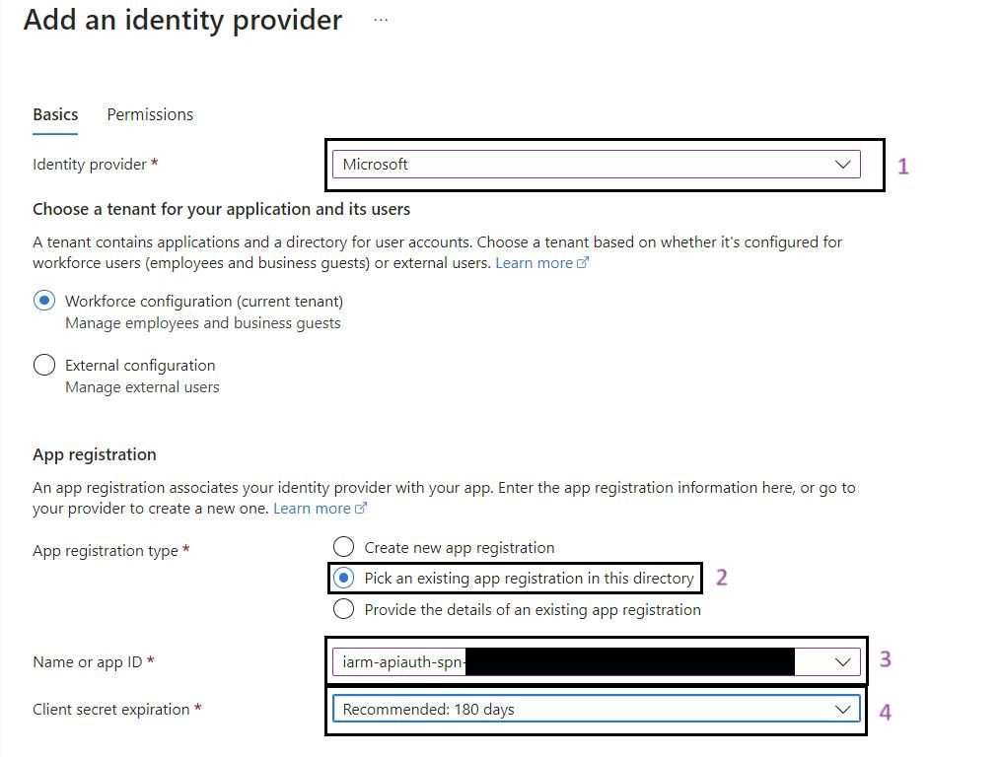

7. **Configure Client Requirements**:
   * In **Client requirement**, select **Allow requests from specific client applications**.
   * In the **Allowed client applications** field, add the spn-func-iarm-apiauth-prd ClientID.
   * After adding spn-func-iarm-apiauth-prd ClientID, click on **Ok**, then **Add**.

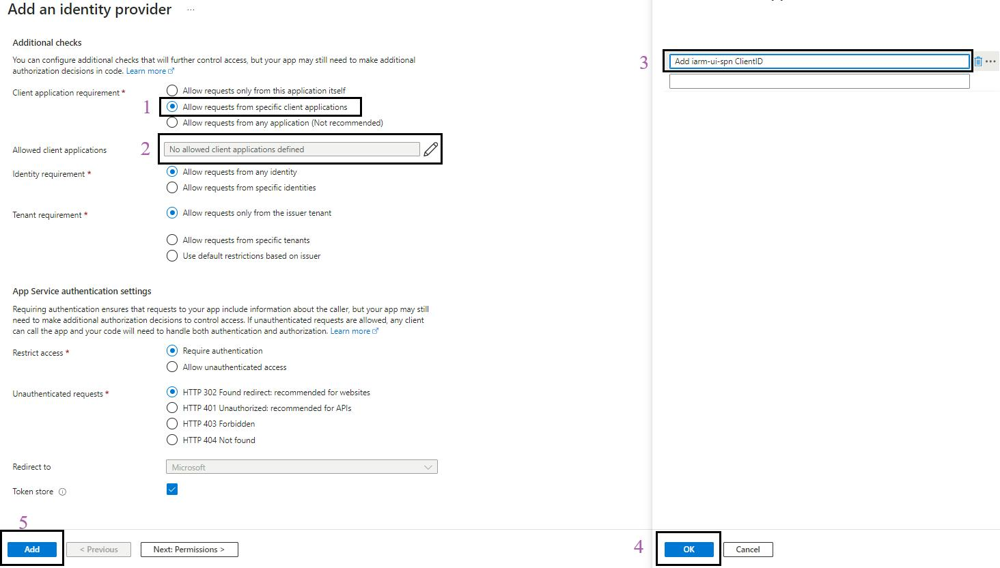

* The below configuration should be visible on your screen.

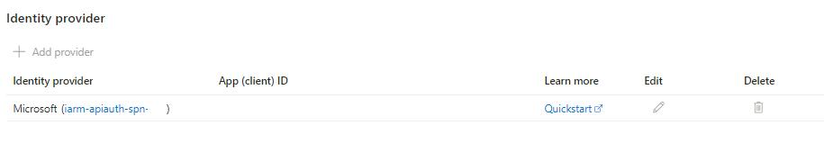

10. **Configure Token Audiences**:
   * Click on  and add the **Allowed token audiences** starting with api:// and paste the Application (client) ID after api://.

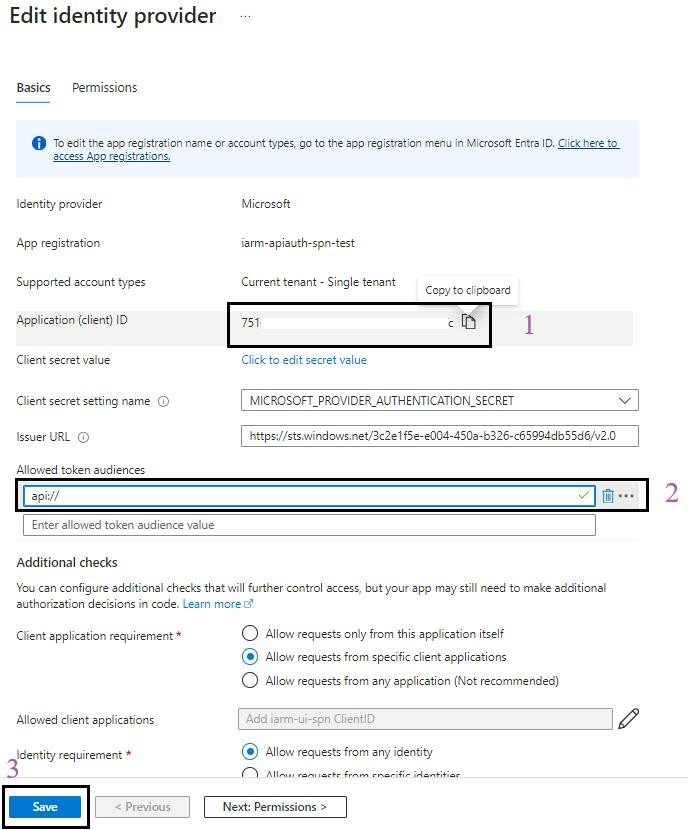

* Here, the **MICROSOFT\_PROVIDER\_AUTHENTICATION\_SECRET** secret value of “Client secret setting name” will be automatically created and configured in the function app environment variables.

#### Validate Environment Variables in Function App

Prerequisites: To validate app settings, the user must have at least **Contributor** access to the Azure Resource or Resource Group, as well as the **App Configuration Data Reader** role to view the environmental variables and their values.

Steps for to Validate Environment Variables in Function App:

1. **Sign in to the Azure Portal**: Navigate to https://portal.azure.com and log in with your credentials.
2. **Navigate to Your Function App**: Use the search bar to find find My Disposal Function App (func-iarm-mydisp-regionabbr-prd) and select it.
3. **Go to Environmental Variables**: In the left-hand menu, under the **Settings** section, click on **Environmental variables**.
4. **Show Values**: If required, click on **Show values** to display the current values of the environmental variables for validation.

1. **Validate the App Settings**: Review and validate the app settings listed below.

| **#** | **App Setting Name** | **Description / Use** | **Source of Value** |
| --- | --- | --- | --- |
| 1 | AdaptiveCardLogo | URL or path to the logo in adaptive cards in Base64 Formate | Application configuration |
| 2 | AdaptiveCardWarningIcon | URL or path to the warning icon in adaptive cards in Base64 Formate | Application configuration |
| 3 | ApiUrl | Base URL for the API | Application configuration |
| 4 | APPLICATIONINSIGHTS\_CONNECTION\_STRING | Connection string for Azure Application Insights | Application configuration |
| 5 | ApplicationInsightsAgent\_EXTENSION\_VERSION | Version specification for Application Insights Agent | Application configuration |
| 6 | AzureWebJobsStorage:accountName | Storage account name for Azure Functions | Application configuration |
| 7 | AzureWebJobsStorage:credential | Credential for Azure Functions storage | Application configuration |
| 8 | ConfirmAllDisposalUrl | URL to confirm all disposal actions | Application configuration |
| 9 | DebugReviewerEmail | Email for debugging reviewer-related issues ( Infotechtion Team ID) | Application configuration |
| 10 | DispositionNotificationAdminEmail | Admin email for disposition notifications | Application configuration |
| 11 | DispositionNotificationAdminName | Admin name for disposition notifications | Application configuration |
| 12 | DispositionNotificationDebugMode | Enable/disable debug mode for disposition notifications | Application configuration |
| 13 | DispositionNotificationUpdateReviewerNotificationDate | Date for updating reviewer notifications | Application configuration |
| 14 | EnableEmailNotification | Flag to enable/disable email notifications | Application configuration |
| 15 | FUNCTIONS\_EXTENSION\_VERSION | Version of the Azure Functions runtime | Application configuration |
| 16 | FUNCTIONS\_WORKER\_RUNTIME | Runtime environment for Azure Functions | Application configuration |
| 17 | GraphApiClientCertSecretName | Mydata App Registration Certificate Thumbprint | Azure Key Vault |
| 18 | GraphApiClientIdSecretName | Client ID of MyData App Registration | Azure Key Vault |
| 19 | KeyVaultName | Name of the Azure Key Vault | Application configuration |
| 20 | MICROSOFT\_PROVIDER\_AUTHENTICATION\_SECRET | Secret for Microsoft provider authentication | Application configuration |
| 21 | NotificationsClientCertKey | Client certificate key for notifications service | Azure Key Vault |
| 22 | NotificationsClientIdKey | Client ID for notifications service | Azure Key Vault |
| 23 | OriginatorId | Identifier for the originator of the action | Application configuration |
| 24 | ReviewDisposalRelativeUrl | Relative URL for review disposal | Application configuration |
| 25 | SendDispositionActionSchedule | Schedule for sending disposition actions or notifications | Application configuration |
| 26 | SiteUrl | Base URL of the website or application | Application configuration |
| 27 | SqlConnectionSecretName | Secret of SQL connection string | Azure Key Vault |
| 28 | TenantIdSecretName | Name for Azure tenant | Azure Key Vault |
| 29 | UseHtmlBody | Flag to use HTML for email bodies or notifications | Application configuration |
| 30 | WEBSITE\_AUTH\_AAD\_ALLOWED\_TENANTS | Allowed Azure AD tenants for website authentication | Application configuration |
| 31 | WEBSITE\_CONTENTOVERVNET | Flag for website content over Virtual Network (VNET) | Application configuration |
| 32 | WEBSITE\_ENABLE\_SYNC\_UPDATE\_SITE | Flag to enable sync updates for the website | Application configuration |
| 33 | WEBSITE\_PULL\_IMAGE\_OVER\_VNET | Flag to enable pulling images over Virtual Network (VNET) | Application configuration |
| 34 | WEBSITE\_RUN\_FROM\_PACKAGE | Flag to run the website from a packaged deployment | Application configuration |
| 35 | WEBSITE\_USE\_PLACEHOLDER\_DOTNETISOLATED | Flag to use .NET isolated environment placeholders | Application configuration |
| 36 | WEBSITE\_VNET\_ROUTE\_ALL | Flag to route all traffic over Virtual Network (VNET) | Application configuration |

Yellow Highlighted app setting key & value will be automatically\* added after the Function App authentication is completed.

The client secrets will be automatically created when the function app authentication is configured via “**Use an Existing App Registration**.”

\*If the function app authentication is configured using “**Configure an Existing App Registration**,” the user needs to create the secret manually in the App Registration. Create an app configuration with the name “***MICROSOFT\_PROVIDER\_AUTHENTICATION\_SECRET***” in the Azure Function App and map it to the “Client secret setting name” in the function app authentication.

### Configure Data Ingestion Module

#### Validate System Assigned Identity for Web App

Steps for to Validate System Assigned Identity for Web App:

1. **Sign in to the Azure Portal**: Navigate to https://portal.azure.com and log in with your credentials.
2. **Navigate to Your Web App**: Use the search bar to find Data Ingestion Web Job (wj-iarm-di-regionabbr-prd) and select it.
3. **Go to Identity**: In the left-hand menu, click on **Identity** under the **Settings** section.
4. **Enable System Assigned Identity**: Ensure that the **System assigned** option is set to **On**.

#### Assign roles to managed identity

Prerequisites: For performing role assignment to the managed identity user at least have the **User Access Administrator** or **owner** access on Resource.

Steps for to Assign roles to managed identity:

1. **Sign in to the Azure Portal**: Navigate to https://portal.azure.com and log in with your credentials.
2. **Navigate to Your Web App**: Use the search bar to find Data Ingestion Web Job (wj-iarm-di-regionabbr-prd) and select it.
3. **Go to Identity**: In the left-hand menu, click on **Identity** under the **Settings** section.
4. **Click on the Azure Role Assignments Button**: Click on the **Azure role assignments** button.

5. **Add Role Assignment**: Click on the **Add role assignment** button at the top of the page.
6. **Select Scope and Resource**:
   * In the **Add role assignment** pane, select the scope of the resource as **Key Vault**.
   * Select the resource as the Key Vault used by the iARM Application (e.g., kv-iarm-svc-regionabbr-prd) which is provisioned for storing Certificates & Secrets.
7. **Select Role**: Choose the role as **Key Vault Secrets User**.
8. **Save Changes**: Click **Save** to assign the role to the managed identity of your app service.

1. **Repeat for Additional Scopes, Resources, and Roles**: Repeat the process for the following scopes, resources, and roles:

| Sr. No | Scope | Resource | Role |
| --- | --- | --- | --- |
| 1 | Key Vault | kv-iarm-svc-regionabbr-prd | Key Vault Secrets User |
| 2 | Key Vault | kv-iarm-svc-regionabbr-prd | Key Vault Certificate User |
| 3 | Storage | saiarmdiappregionabbrprd | Storage Blob Data Contributor |
| 4 | Storage | saiarmdidroperegionabbrprd | Storage Blob Data Contributor |
| 5 | Storage | saiarmdiregregionabbrprd | Storage Blob Data Contributor |
| 6 | Storage | saiarmdinonregregionabbrprd | Storage Blob Data Contributor |
| 7 | Storage | saiarmdiappregionabbrprd | Storage Queue Data Contributor |

#### Validate Environment Variables in Web App

Prerequisites: To validate app settings, the user must have at least **Contributor** access to the Azure Resource or Resource Group, as well as the **App Configuration Data Reader** role to view the environmental variables and their values.

Steps for to Validate Environment Variables in Function App:

1. **Sign in to the Azure Portal**: Navigate to https://portal.azure.com and log in with your credentials.
2. **Navigate to Your Web App**: Use the search bar to find Data Ingestion Web Job (wj-iarm-di-regionabbr-prd) and select it.
3. **Go to Environmental Variables**: In the left-hand menu, under the **Settings** section, click on **Environmental variables**.
4. **Show Values**: If required, click on **Show values** to display the current values of the environmental variables for validation.

5. **Validate the App Settings**: Review and validate the app settings listed below.

| **#** | **App Setting Name** | **Description / Use** | **Source of Value** |
| --- | --- | --- | --- |
| 1 | APPLICATIONINSIGHTS\_CONNECTION\_STRING | Connection string for Azure Application Insights | Application configuration |
| 2 | ApplicationInsightsAgent\_EXTENSION\_VERSION | Version specification for Application Insights Agent | Application configuration |
| 3 | ApplyLockOnPolicyForRegulatedRecords | Flag or setting related to policy enforcement | Application configuration |
| 4 | AppStorageAccountName | Name of the storage account for the Data Ingestion application | Application configuration |
| 5 | AzureWebJobsStorage:accountName | Storage account name for Azure App Service | Application configuration |
| 6 | AzureWebJobsStorage:credential | Credential for Azure App Service storage | Application configuration |
| 7 | ConnectedSourceQueueName | Name of the queue for connected sources | Application configuration |
| 8 | DataIngestionClientCertSecretName | Data Ingestion App Registration Certificate Thumbprint | Azure Key Vault |
| 9 | DataIngestionClientIdSecretName | Client ID of Data Ingestion App Registration | Azure Key Vault |
| 10 | DataIngestionUserEmail | Email address of data ingestion user | Application configuration |
| 11 | DataIngestionUserName | Username for data ingestion | Application configuration |
| 12 | DefaultIncrementalScanDuration | Duration setting for incremental data scans | Application configuration |
| 13 | DropzoneStorageAccountName | Name of the dropzone storage account | Application configuration |
| 14 | KeyVaultName | Name of the Azure Key Vault | Application configuration |
| 15 | ManagedSourceQueueName | Name of the queue for managed sources | Application configuration |
| 16 | NonRegulatedDataStorageAccountName | Name of the storage account for non-regulated data | Application configuration |
| 17 | NotificationsClientCertSecretName | Notifications Client App Registration Certificate Thumbprint | Azure Key Vault |
| 18 | NotificationsClientIdSecretName | Client ID of Data Ingestion App Registration | Azure Key Vault |
| 19 | NotificationsQueueName | Name of the queue for notifications | Application configuration |
| 20 | RegulatedDataStorageAccountName | Name of the storage account for regulated data | Application configuration |
| 21 | ResourceGroupNameSecretName | Secret name for Azure resource group name | Azure Key Vault |
| 22 | SqlConnectionSecretName | Secret of SQL connection string | Azure Key Vault |
| 23 | SubscriptionIdSecretName | Secret name for Azure subscription ID | Azure Key Vault |
| 24 | TenantIdSecretName | Name for Azure tenant | Azure Key Vault |
| 25 | WEBSITE\_CONTENTOVERVNET | Flag or setting related to website content over VNET | Application configuration |
| 26 | WEBSITE\_ENABLE\_SYNC\_UPDATE\_SITE | Flag to enable sync updates for the website | Application configuration |
| 27 | WEBSITE\_PULL\_IMAGE\_OVER\_VNET | Flag or setting related to pulling images over VNET | Application configuration |
| 28 | WEBSITE\_RUN\_FROM\_PACKAGE | Flag or setting related to running from a package | Application configuration |
| 29 | WEBSITE\_USE\_PLACEHOLDER\_DOTNETISOLATED | Flag to use .NET isolated environment placeholders | Application configuration |
| 30 | WEBSITE\_VNET\_ROUTE\_ALL | Flag or setting related to routing all traffic over VNET | Application configuration |

#### Assign roles to App Registrations

##### Assign select Storage Account Contributor to App Registrations

We need to grant the **Storage Account Contributor** role to spn-wj-iarm-di-spn-prd service principal (SPN) for regulated and non-regulated repository storage accounts.

1. **Log in to the Azure Portal**: Navigate to https://portal.azure.com and log in with your credentials.
2. **Navigate to Your Storage Account**: Use the search bar to find regulated storage account (saiarmdiregregionabbrprd) and select it.
3. **Go to Access Control (IAM)**: In the left-hand menu under the **Settings** section, click on **Access control (IAM)**.
4. **Add Role Assignment**: Click on the **+ Add** button and select **Add role assignment**.
5. **Select Role**: In the **Role** dropdown, select **Storage Account Contributor**.
6. **Assign Access**: In the **Assign access to** dropdown, select **Azure AD user, group, or service principal**.
7. **Select SPN**: Click on the **Select** button and search for the name of the SPN spn-wj-iarm-di-spn-prd.
8. **Save Changes**: Click on the **Save** button to assign the role to the SPN.
9. **Repeat for Non-Regulated Storage Account**: Repeat steps 1 to 8 for the Non-regulated storage account (saiarmdinonregregionabbrprd) .

##### Assign select Storage Blob Data Contributor to App Registrations

We need to grant the **Storage Blob Data Contributor** role to the spn-di-iarm-dropzone-prd SPN for the Dropzone repository storage account.

1. **Log in to the Azure Portal**: Navigate to https://portal.azure.com and log in with your credentials.
2. **Navigate to Your Storage Account**: Use the search bar to find Dropzone storage account (saiarmdidroperegionabbrprd) and select it.
3. **Go to Access Control (IAM)**: In the left-hand menu under the **Settings** section, click on **Access control (IAM)**.
4. **Add Role Assignment**: Click on the **+ Add** button and select **Add role assignment**.
5. **Select Role**: In the **Role** dropdown, select **Storage Blob Data Contributor**.
6. **Assign Access**: In the **Assign access to** dropdown, select **Azure AD user, group, or service principal**.
7. **Select SPN**:Click on the **Select** button and search for the name of the SPN spn-di-iarm-dropzone-prd.
8. **Save Changes**: Click on the **Save** button to assign the role to the SPN.

#### Upload Source Manifest Templates

**The Source Manifest template should be uploaded in the My data section. Please proceed to this step only if the Source manifest Template is not available in the Storage Account**

Prerequisites: To upload Source Manifest Templates, you need to have **Storage Blob Data Contributor** access over the targeted storage account.

1. **Sign in to the Azure Portal**: Navigate to https://portal.azure.com and log in with your Azure account credentials.
2. **Navigate to Storage Accounts**: In the search box, type **Storage accounts** and select it from the results.
3. **Select the Blob Container**: From the list of storage accounts, select the blob container that we have provisioned for Data Ingestion app storage (saiarmdiappregionabbrprd).
4. **Go to Container**: On the storage account page, in the left menu under **Data Explorer**, select **Container**.
5. **Select Blob Container**: On the blobs page, select the **container-iarm-manifest-templates-regionabbr-prd** blob container there we have to upload files.
6. **Upload Files**:
   * On the blob container page, click on the **Upload** button at the top.
   * On the upload blob page, click on the **Folder** icon to browse and select the folder iarm-manifest-templates. Alternatively, you can drag and drop all the files of the folder to the upload blob page.
7. **Start Upload**: After selecting the folder, click on the **Upload** button at the bottom.
8. **Monitor Upload Progress**: Wait for the upload process to be completed. You can monitor the progress and status of the upload on the upload blob page.
9. **Verify Upload**: Once the upload is done, you can see the uploaded files on the blob container page.

### Configure URC Module

#### Validate System Assigned Identity for Function App

Steps for to Validate System Assigned Identity for Function App:

1. **Sign in to the Azure Portal**: Navigate to https://portal.azure.com and log in with your credentials.
2. **Navigate to Your Function App**: Use the search bar to find URC Function App (func-iarm-urc-regionabbr-prd) and select it.
3. **Go to Identity**: In the left-hand menu, click on **Identity** under the **Settings** section.
4. **Enable System Assigned Identity**: Ensure that the **System assigned** option is set to **On**.

#### Assign roles to managed identity.

Prerequisites: For performing role assignment to the managed identity user at least have the **User Access Administrator** or **owner** access on Resource.

Steps for to Assign roles to managed identity:

1. **Sign in to the Azure Portal**: Navigate to https://portal.azure.com and log in with your credentials.
2. **Navigate to Your Function App**: Use the search bar to find URC Function App (func-iarm-urc-regionabbr-prd) and select it.
3. **Go to Identity**: In the left-hand menu, click on **Identity** under the **Settings** section.
4. **Click on the Azure Role Assignments Button**: Click on the **Azure role assignments** button.

5. **Add Role Assignment**: Click on the **Add role assignment** button at the top of the page.
6. **Select Scope and Resource**:
   * In the **Add role assignment** pane, select the scope of the resource as **Key Vault**.
   * Select the resource as the Key Vault used by the iARM Application (e.g., kv-iarm-svc-regionabbr-prd) which is provisioned for storing Certificates & Secrets.
7. **Select Role**: Choose the role as **Key Vault Secrets User**.
8. **Save Changes**: Click **Save** to assign the role to the managed identity of your app service.

1. **Repeat for Additional Scopes, Resources, and Roles**: Repeat the process for the following scopes, resources, and roles:

| Sr. No | Scope | Resource | Role |
| --- | --- | --- | --- |
| 1 | Key Vault | kv-iarm-svc-regionabbr-prd | Key Vault Secrets User |
| 2 | Key Vault | kv-iarm-svc-regionabbr-prd | Key Vault Certificate User |
| 3 | Storage | saiarmurcregionabbrprd | Storage Blob Data Contributor |

#### Validate Environment Variables in Function App

Prerequisites: To validate app settings, the user must have at least **Contributor** access to the Azure Resource or Resource Group, as well as the **App Configuration Data Reader** role to view the environmental variables and their values.

Steps for to Validate Environment Variables in Function App:

1. **Sign in to the Azure Portal**: Navigate to https://portal.azure.com and log in with your credentials.
2. **Navigate to Your Function App**: Use the search bar to find find URC Function App (func-iarm-urc-regionabbr-prd) and select it.
3. **Go to Environmental Variables**: In the left-hand menu, under the **Settings** section, click on **Environmental variables**.
4. **Show Values**: If required, click on **Show values** to display the current values of the environmental variables for validation.

5. **Validate the App Settings**: Review and validate the app settings listed below.

| **#** | **App Setting Name** | **Description / Use** | **Source of Value** |
| --- | --- | --- | --- |
| 1 | APPLICATIONINSIGHTS\_CONNECTION\_STRING | Connection string for Azure Application Insights | Application configuration |
| 2 | ApplicationInsightsAgent\_EXTENSION\_VERSION | Version specification for Application Insights Agent | Application configuration |
| 3 | AzureWebJobsStorage:accountName | Storage account name for Azure Functions | Application configuration |
| 4 | AzureWebJobsStorage:credential | Credential for Azure Functions storage | Application configuration |
| 5 | baseUri | Base URI for Virgo API | Azure Key Vault |
| 6 | baseUriIM | Base URI for Iron Mountain API | Azure Key Vault |
| 7 | CertificateName ( Optional) | Name of the certificate stored in the Azure Key Vault | Azure Key Vault |
| 8 | ClientIDKey | Client ID for Microsoft 365 credentials | Azure Key Vault |
| 9 | ClientSecretKey | Client Secret for Microsoft 365 credentials | Azure Key Vault |
| 10 | CompliantToPurviewSchedule | Cron schedule for the CompliantToPurview function | Application configuration |
| 11 | CreateRetentionLabelSchedule | Cron schedule for the CreateRetentionLabel function | Application configuration |
| 12 | DispositionAction | Disposition actions for retention labels | Application configuration |
| 13 | EnableCreateRetentionLabel |  | Application configuration |
| 14 | EnableSyncEventTypes |  | Application configuration |
| 15 | EnableSyncFromThirdPartySource |  | Application configuration |
| 16 | EnableSyncRetentionLabel |  | Application configuration |
| 17 | EnableUpdateRetentionLabel |  | Application configuration |
| 15 | FUNCTIONS\_EXTENSION\_VERSION | Version of the Azure Functions runtime | Application configuration |
| 18 | FUNCTIONS\_WORKER\_RUNTIME | Specifies the runtime for Azure Functions (e.g., dotnet-isolated) | Application configuration |
| 19 | GetSourceRetentionLabelsSchedule | Cron schedule for the GetSourceRetentionLabels function | Application configuration |
| 20 | IMClientID | Client ID for Iron Mountain API | Azure Key Vault |
| 21 | IMClientSec | Client Secret for Iron Mountain API | Azure Key Vault |
| 22 | IMpurview\_retentionTrigger | Retention triggers for Iron Mountain to Purview mappings | Application configuration |
| 23 | IMPurviewMappings | Mappings for Iron Mountain to Purview | Application configuration |
| 24 | IMScheduleID | Schedule ID for Iron Mountain API | Azure Key Vault |
| 25 | IMTenantID | Tenant ID for Iron Mountain API | Azure Key Vault |
| 26 | KeyVaultName | Name of the Azure Key Vault | Application configuration |
| 27 | RetentionLabelCodeList | List of retention label codes | Application configuration |
| 28 | ReviewerEmailAddress | Email address of the reviewer, creating the labels with reviweres details | Application configuration |
| 29 | rules | JSON object containing additional rules | Application configuration |
| 30 | SqlConnectionStringKey | Connection string for the SQL database | Azure Key Vault |
| 31 | SyncEventTypes |  | Application configuration |
| 32 | SyncRetentionLabel |  | Application configuration |
| 33 | TenantID | Tenant ID for Microsoft 365 credentials | Azure Key Vault |
| 34 | thirdPartySource | Specifies the third-party source to connect to (IronMountain or Virgo) | Application configuration |
| 35 | UpdateRetentionLabelSchedule | Cron schedule for the UpdateRetentionLabel function | Application configuration |
| 36 | VirgoAccountPassword | Password for Virgo account | Azure Key Vault |
| 37 | VirgoAccountUsername | Username for Virgo account | Azure Key Vault |
| 38 | VirgoclientID | Client ID for Virgo API | Azure Key Vault |
| 39 | VirgoClientsecret | Client Secret for Virgo API | Azure Key Vault |
| 40 | Virgopurview\_retentionTrigger | Retention triggers for Virgo to Purview mappings | Application configuration |
| 41 | WEBSITE\_CONTENTOVERVNET | Flag for website content over Virtual Network (VNET) | Application configuration |
| 42 | WEBSITE\_ENABLE\_SYNC\_UPDATE\_SITE | Flag to enable sync updates for the website | Application configuration |
| 43 | WEBSITE\_ENABLE\_SYNC\_UPDATE\_SITE | Flag to enable pulling images over Virtual Network (VNET) | Application configuration |
| 44 | WEBSITE\_RUN\_FROM\_PACKAGE | Flag to run the website from a packaged deployment | Application configuration |
| 45 | WEBSITE\_USE\_PLACEHOLDER\_DOTNETISOLATED | Flag to use .NET isolated environment placeholders | Application configuration |
| 46 | WEBSITE\_VNET\_ROUTE\_ALL | Flag to route all traffic over Virtual Network (VNET) | Application configuration |

### Configure PRM Bulk Module

#### Validate System Assigned Identity for Function App

Steps for to Validate System Assigned Identity for Function App:

1. **Sign in to the Azure Portal**: Navigate to https://portal.azure.com and log in with your credentials.
2. **Navigate to Your Function App**: Use the search bar to find PRM Bulk Function App (func-iarm-prmbulk-regionabbr-prd) and select it.
3. **Go to Identity**: In the left-hand menu, click on **Identity** under the **Settings** section.
4. **Enable System Assigned Identity**: Ensure that the **System assigned** option is set to **On**.

#### Assign roles to managed identity

Prerequisites: For performing role assignment to the managed identity user at least have the **User Access Administrator** or **owner** access on Resource.

Steps for to Assign roles to managed identity:

1. **Sign in to the Azure Portal**: Navigate to https://portal.azure.com and log in with your credentials.
2. **Navigate to Your Function App**: Use the search bar to find PRM Bulk Function App (func-iarm-prmbulk-regionabbr-prd) and select it.
3. **Go to Identity**: In the left-hand menu, click on **Identity** under the **Settings** section.
4. **Click on the Azure Role Assignments Button**: Click on the **Azure role assignments** button.

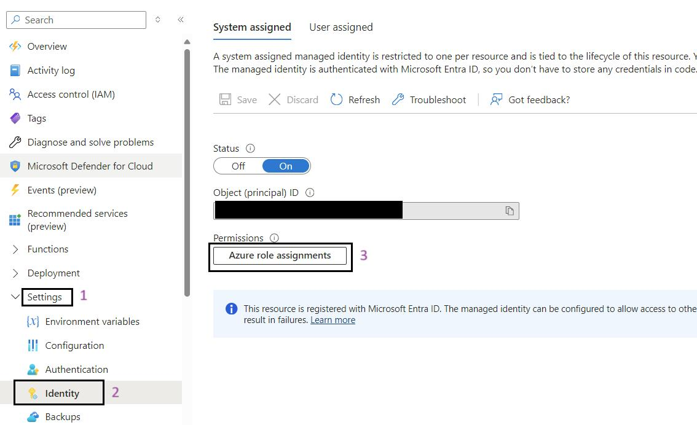

5. **Add Role Assignment**: Click on the **Add role assignment** button at the top of the page.
6. **Select Scope and Resource**:
   * In the **Add role assignment** pane, select the scope of the resource as **Key Vault**.
   * Select the resource as the Key Vault used by the iARM Application (e.g., kv-iarm-svc-regionabbr-prd) which is provisioned for storing Certificates & Secrets.
7. **Select Role**: Choose the role as **Key Vault Secrets User**.
8. **Save Changes**: Click **Save** to assign the role to the managed identity of your app service.

1. **Repeat for Additional Scopes, Resources, and Roles**: Repeat the process for the following scopes, resources, and roles:

| Sr. No | Scope | Resource | Role |
| --- | --- | --- | --- |
| 1 | Key Vault | kv-iarm-svc-regionabbr-prd | Key Vault Secrets User |
| 2 | Key Vault | kv-iarm-svc-regionabbr-prd | Key Vault Certificate User |
| 3 | Storage | saiarmprmbulkregionabbrprd | Storage Blob Data Contributor |
| 4 | Storage | saiarmprmbulkregionabbrprd | Storge Table Data Contributor |
| 5 | Storage | saiarmprmbulkregionabbrprd | Storge Queue Data Contributor |

#### Validate Environment Variables in Function App

Prerequisites: To validate app settings, the user must have at least **Contributor** access to the Azure Resource or Resource Group, as well as the **App Configuration Data Reader** role to view the environmental variables and their values.

Steps for to Validate Environment Variables in Function App:

1. **Sign in to the Azure Portal**: Navigate to https://portal.azure.com and log in with your credentials.
2. **Navigate to Your Function App**: Use the search bar to find find PRM Bulk Function App (func-iarm-prmbulk-regionabbr-prd) and select it.
3. **Go to Environmental Variables**: In the left-hand menu, under the **Settings** section, click on **Environmental variables**.
4. **Show Values**: If required, click on **Show values** to display the current values of the environmental variables for validation.

5. **Validate the App Settings**: Review and validate the app settings listed below.

| **#** | **App Setting Name** | **Description / Use** | **Source of Value** |
| --- | --- | --- | --- |
| 1 | APPLICATIONINSIGHTS\_CONNECTION\_STRING | Connection string for Azure Application Insights | Application configuration |
| 2 | ApplicationInsightsAgent\_EXTENSION\_VERSION | Version specification for Application Insights Agent | Application configuration |
| 3 | ArchiveBoxListName | Name of the archive box list | Application configuration |
| 4 | AzureWebJobsStorage:accountName | Storage account name for Azure App Service | Application configuration |
| 5 | AzureWebJobsStorage:credential | Credential for Azure App Service storage | Application configuration |
| 6 | BulkPhysicalRecordListPrefix | Prefix for bulk physical records | Application configuration |
| 7 | CountryTermSetId | ID for the country term set | Application configuration |
| 8 | ExcelInputRequiredFields | Required fields for Excel input | Application configuration |
| 9 | FunctionHostURL | URL of the deployed Azure App Service or website | Application configuration |
| 10 | FUNCTIONS\_EXTENSION\_VERSION | Version of the Azure Functions runtime | Application configuration |
| 11 | FUNCTIONS\_WORKER\_RUNTIME | Runtime environment for Azure Functions. | Application configuration |
| 12 | HomeLocationTermSetId | ID for the home location term set | Application configuration |
| 13 | iarm-prm-spn-dev-ClientCertName | Name of the client certificate for the service principal | Azure Key Vault |
| 14 | iarm-prm-spn-dev-ClientIDSecretName | Name of the client ID secret for the service principal | Azure Key Vault |
| 15 | ImportBatchCount | Number of records to import in a batch | Application configuration |
| 16 | IndexColumnNames | Names of the index columns | Application configuration |
| 17 | KeyvaultName | Name of the Azure Key Vault | Application configuration |
| 18 | LanguageTermSetId | ID for the language term set | Application configuration |
| 19 | LegalTermSetId | ID for the legal term set | Application configuration |
| 20 | ListItemThresholdValue | Threshold value for list items | Application configuration |
| 21 | MediaTermSetId | ID for the media term set | Application configuration |
| 22 | PhysicalRecordContentTypeId | ID for the physical record content type | Application configuration |
| 23 | PhysicalRecordContentTypeName | Name of the physical record content type | Application configuration |
| 24 | PhysicalRecordListName | Name of the physical record list | Application configuration |
| 25 | PRMBulkImportAdminSiteURL | URL of the SharePoint site where PRM SPFx is deployed | Application configuration |
| 26 | PRMBulkImportLogsListName | Name of the bulk import logs list | Application configuration |
| 27 | PRMBulkImportQueueListName | Name of the bulk import queue list | Application configuration |
| 28 | PRMBulkPhysicalRecordListName | Name of the bulk physical record list | Application configuration |
| 29 | SecurityTermSetId | ID for the security term set | Application configuration |
| 30 | SiteURL | URL of the SharePoint site | Application configuration |
| 31 | TenantIdSecretName | Name of the secret for the tenant ID in Key Vault | Azure Key Vault |
| 32 | ValidationBatchCount | Number of records to validate in a batch | Application configuration |
| 33 | WEBSITE\_CONTENTOVERVNET | Flag for website content over Virtual Network (VNET) | Application configuration |
| 34 | WEBSITE\_ENABLE\_SYNC\_UPDATE\_SITE | Flag to enable sync updates for the website | Application configuration |
| 35 | WEBSITE\_PULL\_IMAGE\_OVER\_VNET | Flag to enable pulling images over Virtual Network (VNET) | Application configuration |
| 36 | WEBSITE\_RUN\_FROM\_PACKAGE | Flag to run the website from a packaged deployment | Application configuration |
| 37 | WEBSITE\_USE\_PLACEHOLDER\_DOTNETISOLATED | Flag to use .NET isolated environment placeholders | Application configuration |
| 38 | WEBSITE\_VNET\_ROUTE\_ALL | Flag to route all traffic over Virtual Network (VNET) | Application configuration |

### Configure PRM Sync Module

#### Validate System Assigned Identity for Function App

Steps for to Validate System Assigned Identity for Function App:

1. **Sign in to the Azure Portal**: Navigate to https://portal.azure.com and log in with your credentials.
2. **Navigate to Your Function App**: Use the search bar to find PRM Sync Function App (func-iarm-prmsync-regionabbr-prd) and select it.
3. **Go to Identity**: In the left-hand menu, click on **Identity** under the **Settings** section.
4. **Enable System Assigned Identity**: Ensure that the **System assigned** option is set to **On**.

#### Assign roles to managed identity

Prerequisites: For performing role assignment to the managed identity user at least have the **User Access Administrator** or **owner** access on Resource.

Steps for to Assign roles to managed identity:

1. **Sign in to the Azure Portal**: Navigate to https://portal.azure.com and log in with your credentials.
2. **Navigate to Your Function App**: Use the search bar to find find PRM Sync Function App (func-iarm-prmsync-regionabbr-prd) and select it.
3. **Go to Identity**: In the left-hand menu, click on **Identity** under the **Settings** section.
4. **Click on the Azure Role Assignments Button**: Click on the **Azure role assignments** button.

5. **Add Role Assignment**: Click on the **Add role assignment** button at the top of the page.
6. **Select Scope and Resource**:
   * In the **Add role assignment** pane, select the scope of the resource as **Key Vault**.
   * Select the resource as the Key Vault used by the iARM Application (e.g., kv-iarm-svc-regionabbr-prd) which is provisioned for storing Certificates & Secrets.
7. **Select Role**: Choose the role as **Key Vault Secrets User**.
8. **Save Changes**: Click **Save** to assign the role to the managed identity of your app service.

9. **Repeat for Additional Scopes, Resources, and Roles**: Repeat the process for the following scopes, resources, and roles:

| Sr. No | Scope | Resource | Role |
| --- | --- | --- | --- |
| 1 | Key Vault | kv-iarm-svc-regionabbr-prd | Key Vault Secrets User |
| 2 | Key Vault | kv-iarm-svc-regionabbr-prd | Key Vault Certificate User |
| 3 | Storage | saiarmprmsyncregionabbrprd | Storage Blob Data Contributor |

#### Validate Environment Variables in Function App

Prerequisites: To validate app settings, the user must have at least **Contributor** access to the Azure Resource or Resource Group, as well as the **App Configuration Data Reader** role to view the environmental variables and their values.

Steps for to Validate Environment Variables in Function App:

1. **Sign in to the Azure Portal**: Navigate to https://portal.azure.com and log in with your credentials.
2. **Navigate to Your Function App**: Use the search bar to find PRM Sync Function App (func-iarm-prmsync-regionabbr-prd) and select it.
3. **Go to Environmental Variables**: In the left-hand menu, under the **Settings** section, click on **Environmental variables**.
4. **Show Values**: If required, click on **Show values** to display the current values of the environmental variables for validation.

5. **Validate the App Settings**: Review and validate the app settings listed below.

| **#** | **App Setting Name** | **Description / Use** | **Source of Value** |
| --- | --- | --- | --- |
| 1 | APPLICATIONINSIGHTS\_CONNECTION\_STRING | Connection string for Application Insights to send telemetry data. | Application configuration |
| 2 | ApplicationInsightsAgent\_EXTENSION\_VERSION | Specifies the version of the Application Insights Agent to use. | Application configuration |
| 3 | AzureWebJobsStorage:accountName | The name of the storage account used by Azure WebJobs. | Application configuration |
| 4 | AzureWebJobsStorage:credential | Credential type for Azure WebJobs storage (e.g., managed identity). | Application configuration |
| 5 | BarcodeItemKeys | Keys used to identify barcode items. | Application configuration |
| 6 | CheckForListContentTypeKey | Key to check for specific list content types. | Application configuration |
| 7 | DisposalDetailsMapping | Mapping details for disposal processes. | Application configuration |
| 8 | FetchPartialRecordsFromSite | Fetches partial records from a specified site. | Application configuration |
| 9 | FetchPhysicalRecordsFromSite | Fetches physical records from a specified site. | Application configuration |
| 10 | FetchPrmFromSpAppNameKey | Fetches parameters from a SharePoint application by name. | Application configuration |
| 11 | FUNCTIONS\_EXTENSION\_VERSION | Version of the Azure Functions runtime | Application configuration |
| 12 | FUNCTIONS\_WORKER\_RUNTIME | Specifies the runtime for Azure Functions. | Application configuration |
| 13 | KeyVaultName | The name of the Azure Key Vault. | Application configuration |
| 14 | ListContentTypesToScanKey | Key for listing content types to scan. | Application configuration |
| 15 | ListsToSkipFromScan | Lists that should be skipped during a scan. | Application configuration |
| 16 | PhysicalSitePageName | The name of the physical site page. | Application configuration |
| 17 | PrmClientCertSecretName | The name of the secret for the client certificate in Key Vault. | Azure Key Vault |
| 18 | PrmClientIdSecretName | The name of the secret for the client ID in Key Vault. | Azure Key Vault |
| 19 | SharePointBaseUrl | The base URL for the SharePoint site. | Application configuration |
| 20 | SharePointPageSizeKey | Key for the page size setting in SharePoint. | Application configuration |
| 21 | SharePointRecordType | The type of records in SharePoint. | Application configuration |
| 22 | SharepointSites | List of SharePoint sites. | Application configuration |
| 23 | SharePointSyncStatus | Status of the synchronization with SharePoint. | Application configuration |
| 24 | SqlConnectionSecretName | The name of the secret for the SQL connection string in Key Vault. | Azure Key Vault |
| 25 | StatusesToSyncKey | Specifies the statuses to sync | Application configuration |
| 26 | SyncingReadyForDisposalRecordsToSharePoint | Cron schedule for syncing ready-for-disposal records to SharePoint | Application configuration |
| 27 | SyncingStageDetailsToDisposalDetails | Syncs stage details to disposal details. | Application configuration |
| 28 | SyncReadyForDisposalPageSizeKey | Page size for syncing ready-for-disposal records | Application configuration |
| 29 | TenantIdSecretName | The name of the secret for the tenant ID in Key Vault. | Azure Key Vault |
| 30 | UnsyncedStageRecordsPageSize | Page size for unsynced stage records. | Application configuration |
| 31 | WEBSITE\_CONTENTOVERVNET | Enables content over VNET for the website. | Application configuration |
| 32 | WEBSITE\_ENABLE\_SYNC\_UPDATE\_SITE | Enables sync update for the website. | Application configuration |
| 33 | WEBSITE\_PULL\_IMAGE\_OVER\_VNET | Pulls the website image over VNET. | Application configuration |
| 34 | WEBSITE\_RUN\_FROM\_PACKAGE | Runs the website from a package. | Application configuration |
| 35 | WEBSITE\_USE\_PLACEHOLDER\_DOTNETISOLATED | Uses placeholder for .NET isolated process. | Application configuration |
| 36 | WEBSITE\_VNET\_ROUTE\_ALL | Routes all traffic through VNET for the website | Application configuration |

### Configure M365Audit Sync Module

#### Validate System Assigned Identity for for Web App

Steps for to Validate System Assigned Identity for Function App:

1. **Sign in to the Azure Portal**: Navigate to https://portal.azure.com and log in with your credentials.
2. **Navigate to Your Web App**: Use the search bar to find M365Adit Sync Web Job (wj-iarm-m365auditsync-regionabbr-prd) and select it.
3. **Go to Identity**: In the left-hand menu, click on **Identity** under the **Settings** section.
4. **Enable System Assigned Identity**: Ensure that the **System assigned** option is set to **On**.

#### Assign roles to managed identity

Prerequisites: For performing role assignment to the managed identity user at least have the **User Access Administrator** or **owner** access on Resource.

Steps for to Assign roles to managed identity:

1. **Sign in to the Azure Portal**: Navigate to https://portal.azure.com and log in with your credentials.
2. **Navigate to Your Web App**: Use the search bar to find M365Adit Sync Web Job (wj-iarm-m365auditsync-regionabbr-prd) and select it.
3. **Go to Identity**: In the left-hand menu, click on **Identity** under the **Settings** section.
4. **Click on the Azure Role Assignments Button**: Click on the **Azure role assignments** button.

5. **Add Role Assignment**: Click on the **Add role assignment** button at the top of the page.
6. **Select Scope and Resource**:
   * In the **Add role assignment** pane, select the scope of the resource as **Key Vault**.
   * Select the resource as the Key Vault used by the iARM Application (e.g., kv-iarm-svc-regionabbr-prd) which is provisioned for storing Certificates & Secrets.
7. **Select Role**: Choose the role as **Key Vault Secrets User**.
8. **Save Changes**: Click **Save** to assign the role to the managed identity of your app service.

1. **Repeat for Additional Scopes, Resources, and Roles**: Repeat the process for the following scopes, resources, and roles:

| Sr. No | Scope | Resource | Role |
| --- | --- | --- | --- |
| 1 | Key Vault | kv-iarm-svc-regionabbr-prd | Key Vault Secrets User |
| 2 | Key Vault | kv-iarm-svc-regionabbr-prd | Key Vault Certificate User |
| 3 | Storage | saiarm365syncregionabbrprd | Storage Blob Data Contributor |

#### Validate Environment Variables in Web App

Prerequisites: To validate app settings, the user must have at least **Contributor** access to the Azure Resource or Resource Group, as well as the **App Configuration Data Reader** role to view the environmental variables and their values.

Steps for to Validate Environment Variables in Function App:

1. **Sign in to the Azure Portal**: Navigate to https://portal.azure.com and log in with your credentials.
2. **Navigate to Your Web App**: Use the search bar to find M365Adit Sync Web Job (wj-iarm-m365auditsync-regionabbr-prd) and select it.
3. **Go to Environmental Variables**: In the left-hand menu, under the **Settings** section, click on **Environmental variables**.
4. **Show Values**: If required, click on **Show values** to display the current values of the environmental variables for validation.

5. **Validate the App Settings**: Review and validate the app settings listed below.

### Configure M365Audit Connector Module

#### Validate System Assigned Identity for Function App

Steps for to Validate System Assigned Identity for Function App:

1. **Sign in to the Azure Portal**: Navigate to https://portal.azure.com and log in with your credentials.
2. **Navigate to Your Function App**: Use the search bar to find M365Adit Connector Function App (func-iarm-m365auditconnector-regionabbr-prd) and select it.
3. **Go to Identity**: In the left-hand menu, click on **Identity** under the **Settings** section.
4. **Enable System Assigned Identity**: Ensure that the **System assigned** option is set to **On**.

#### Assign roles to managed identity

Prerequisites: For performing role assignment to the managed identity user at least have the **User Access Administrator** or **owner** access on Resource.

Steps for to Assign roles to managed identity:

1. **Sign in to the Azure Portal**: Navigate to https://portal.azure.com and log in with your credentials.
2. **Navigate to Your Function App**: Use the search bar to find M365Adit Connector Function App (func-iarm-m365auditconnector-regionabbr-prd) and select it.
3. **Go to Identity**: In the left-hand menu, click on **Identity** under the **Settings** section.
4. **Click on the Azure Role Assignments Button**: Click on the **Azure role assignments** button.

5. **Add Role Assignment**: Click on the **Add role assignment** button at the top of the page.
6. **Select Scope and Resource**:
   * In the **Add role assignment** pane, select the scope of the resource as **Key Vault**.
   * Select the resource as the Key Vault used by the iARM Application (e.g., kv-iarm-svc-regionabbr-prd) which is provisioned for storing Certificates & Secrets.
7. **Select Role**: Choose the role as **Key Vault Secrets User**.
8. **Save Changes**: Click **Save** to assign the role to the managed identity of your app service.

1. **Repeat for Additional Scopes, Resources, and Roles**: Repeat the process for the following scopes, resources, and roles:

| Sr. No | Scope | Resource | Role |
| --- | --- | --- | --- |
| 1 | Key Vault | kv-iarm-svc-regionabbr-prd | Key Vault Secrets User |
| 2 | Key Vault | kv-iarm-svc-regionabbr-prd | Key Vault Certificate User |
| 3 | Storage | saiarm365connregionabbrprd | Storage Blob Data Contributor |

#### Validate Environment Variables in Function App

Prerequisites: To validate app settings, the user must have at least **Contributor** access to the Azure Resource or Resource Group, as well as the **App Configuration Data Reader** role to view the environmental variables and their values.

Steps for to Validate Environment Variables in Function App:

1. **Sign in to the Azure Portal**: Navigate to https://portal.azure.com and log in with your credentials.
2. **Navigate to Your Function App**: Use the search bar to find PRM Sync Function App (func-iarm-prmsync-regionabbr-prd) and select it.
3. **Go to Environmental Variables**: In the left-hand menu, under the **Settings** section, click on **Environmental variables**.
4. **Show Values**: If required, click on **Show values** to display the current values of the environmental variables for validation.

5. **Validate the App Settings**: Review and validate the app settings listed below.

| **#** | **App Setting Name** | **Description / Use** | **Source of Value** |
| --- | --- | --- | --- |
| 1 | APPLICATIONINSIGHTS\_CONNECTION\_STRING | Connection string for Azure Application Insights | Application configuration |
| 2 | ApplicationInsightsAgent\_EXTENSION\_VERSION | Version specification for Application Insights Agent | Application configuration |
| 3 | AzureWebJobsStorage:accountName | Storage account name for Azure App Service | Application configuration |
| 4 | AzureWebJobsStorage:credential | Credential for Azure App Service storage | Application configuration |
| 5 | DefaultCreatedBy | Default creator name | Application configuration |
| 6 | DefaultCreatedByEmail | Default creator email | Application configuration |
| 7 | FUNCTIONS\_EXTENSION\_VERSION | Version of the Azure Functions runtime | Application configuration |
| 8 | FUNCTIONS\_WORKER\_RUNTIME | Runtime environment for Azure Functions | Application configuration |
| 9 | KeyVaultName | Name of the Azure Key Vault | Application configuration |
| 10 | SensitiveInfoTypeDataPageSize | Page size for sensitive information type data | Application configuration |
| 11 | SkipBlankSensitiveInfo | Flag to skip blank sensitive information | Application configuration |
| 12 | SqlConnectionSecretName | Secret of SQL connection string | Azure Key Vault |
| 13 | SyncSensitiveInfoTypeDataTimer | Timer for syncing sensitive information type data | Application configuration |
| 14 | WEBSITE\_CONTENTOVERVNET | Flag for website content over Virtual Network (VNET) | Application configuration |
| 15 | WEBSITE\_ENABLE\_SYNC\_UPDATE\_SITE | Flag to enable sync updates for the website | Application configuration |
| 16 | WEBSITE\_PULL\_IMAGE\_OVER\_VNET | Flag to enable pulling images over Virtual Network (VNET) | Application configuration |
| 17 | WEBSITE\_RUN\_FROM\_PACKAGE | Flag to run the website from a packaged deployment | Application configuration |
| 18 | WEBSITE\_USE\_PLACEHOLDER\_DOTNETISOLATED | Flag to use .NET isolated environment placeholders | Application configuration |
| 19 | WEBSITE\_VNET\_ROUTE\_ALL | Flag to route all traffic over Virtual Network (VNET) | Application configuration |

### Configure Workspace Provisioning Module

#### Validate System Assigned Identity for Function App

Steps for to Validate System Assigned Identity for Function App:

1. **Sign in to the Azure Portal**: Navigate to https://portal.azure.com and log in with your credentials.
2. **Navigate to Your Function App**: Use the search bar to find WPH Function App (func-iarm-wph-regionabbr-prd)and select it.
3. **Go to Identity**: In the left-hand menu, click on **Identity** under the **Settings** section.
4. **Enable System Assigned Identity**: Ensure that the **System assigned** option is set to **On**.

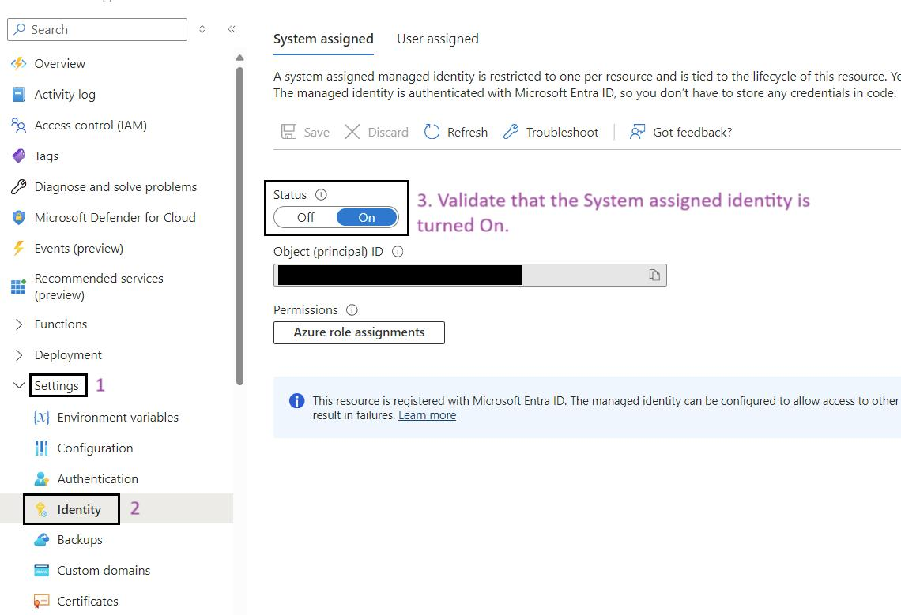

#### Assign roles to managed identity

Prerequisites: For performing role assignment to the managed identity user at least have the **User Access Administrator** or **owner** access on Resource.

Steps for to Assign roles to managed identity:

1. **Sign in to the Azure Portal**: Navigate to https://portal.azure.com and log in with your credentials.
2. **Navigate to Your Function App**: Use the search bar to find WPH Function App (func-iarm-wph-regionabbr-prd) and select it.
3. **Go to Identity**: In the left-hand menu, click on **Identity** under the **Settings** section.
4. **Click on the Azure Role Assignments Button**: Click on the **Azure role assignments** button.

5. **Add Role Assignment**: Click on the **Add role assignment** button at the top of the page.
6. **Select Scope and Resource**:
   * In the **Add role assignment** pane, select the scope of the resource as **Key Vault**.
   * Select the resource as the Key Vault used by the iARM Application (e.g., kv-iarm-svc-regionabbr-prd) which is provisioned for storing Certificates & Secrets.
7. **Select Role**: Choose the role as **Key Vault Secrets User**.
8. **Save Changes**: Click **Save** to assign the role to the managed identity of your app service.

1. **Repeat for Additional Scopes, Resources, and Roles**: Repeat the process for the following scopes, resources, and roles:

| Sr. No | Scope | Resource | Role |
| --- | --- | --- | --- |
| 1 | Key Vault | kv-iarm-svc-regionabbr-prd | Key Vault Secrets User |
| 2 | Key Vault | kv-iarm-svc-regionabbr-prd | Key Vault Certificate User |

#### Validate Environment Variables in Function App

Prerequisites: To validate app settings, the user must have at least **Contributor** access to the Azure Resource or Resource Group, as well as the **App Configuration Data Reader** role to view the environmental variables and their values.

Steps for to Validate Environment Variables in Function App:

1. **Sign in to the Azure Portal**: Navigate to https://portal.azure.com and log in with your credentials.
2. **Navigate to Your Function App**: Use the search bar to find PRM Sync Function App (func-iarm-prmsync-regionabbr-prd) and select it.
3. **Go to Environmental Variables**: In the left-hand menu, under the **Settings** section, click on **Environmental variables**.
4. **Show Values**: If required, click on **Show values** to display the current values of the environmental variables for validation.

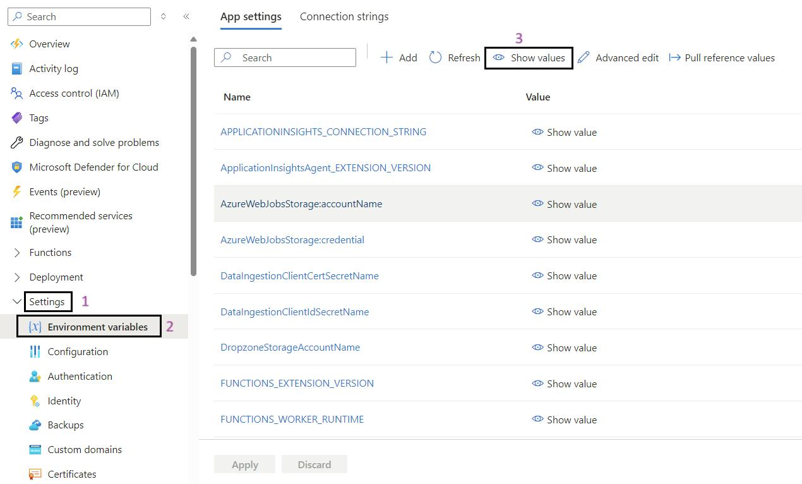

1. **Validate the App Settings**: Review and validate the app settings listed below.

## Solution Deployment

**Note: Below activities are performed by Infotechtion Team**

### Azure DevOps Variable Group

1. Ask client to provide below values that need to be added in the variable group.

| **Name** | **Values** |
| --- | --- |
| VITE\_ADMIN\_GROUP | Object ID of the **sg-svc-iarm-recordsadministrators-prd** Entra ID Group |
| VITE\_API\_SCOPE | API Scope value of the **spn-func-iarm-apiauth-prd** App Registrations |
| VITE\_CLIENT\_ID | Application (client) ID of **spn-wapp-iarm-uidirectoryaccess-prd** App Registrations |
| VITE\_CLIENT\_LOGO | <Add Client Logo URL> |
| VITE\_DATABOT\_HOST | https:// web-iarm-chatbot-regionabbr-prd.azurewebsites.net  ***\*Pointing to the Databot Web App created*** |
| VITE\_DEFAULT\_IDLE\_TIMEOUT\_MINUTES | 15 |
| VITE\_DISPOSITION\_ENDPOINT\_V2 | https://func-iarm-mydisp-regionabbr-prd.azurewebsites.net/api***\*Pointing to the My Disposal function apps created*** |
| VITE\_DISPOSITION\_HOST | https://func-iarm-mydisp-regionabbr-prd.azurewebsites.net***\*Pointing to the My Disposal function apps created*** |
| VITE\_E\_DISCOVERY\_GROUP | Object ID of the **sg-svc-iarm-ediscoveryadministrators-prd** Entra ID Group |
| VITE\_FILESHARE\_ENDPOINT\_V2 | https://func-iarm-mydata-regionabbr-prd.azurewebsites.net/api  ***\*Pointing to the My Data function apps created*** |
| VITE\_FILESHARE\_HOST | https://func-iarm-mydata-regionabbr-prd.azurewebsites.net  ***\*Pointing to the My Data function apps created*** |
| VITE\_GRAPH\_ENDPOINT | https://graph.microsoft.com/v1.0 |
| VITE\_IDLE\_PROMPT\_START\_MINUTES | 1 |
| VITE\_INSTRUMENTATION\_KEY | Application Insight Key for the UI Web App |
| VITE\_LOGOUT\_REDIRECT\_URI | https://web-iarm-ui-regionabbr-prd.azurewebsites.net/logged-out  ***\*Pointing to the UI Web App ( iARM portal) created*** |
| VITE\_REDIRECT\_URI | https://web-iarm-ui-regionabbr-prd.azurewebsites.net***\*Pointing to the UI Web App ( iARM portal) created*** |
| VITE\_TENANT\_ID | Value of Tenant ID. |

1. Setup value of variable group and link it to the IARM-UI release pipeline and create it.
2. ADD / Update the pipeline with resource group, App Service Name, Azure Function App NAME, Storage Account Name respective to all the pipeline in variable tab and create it.
